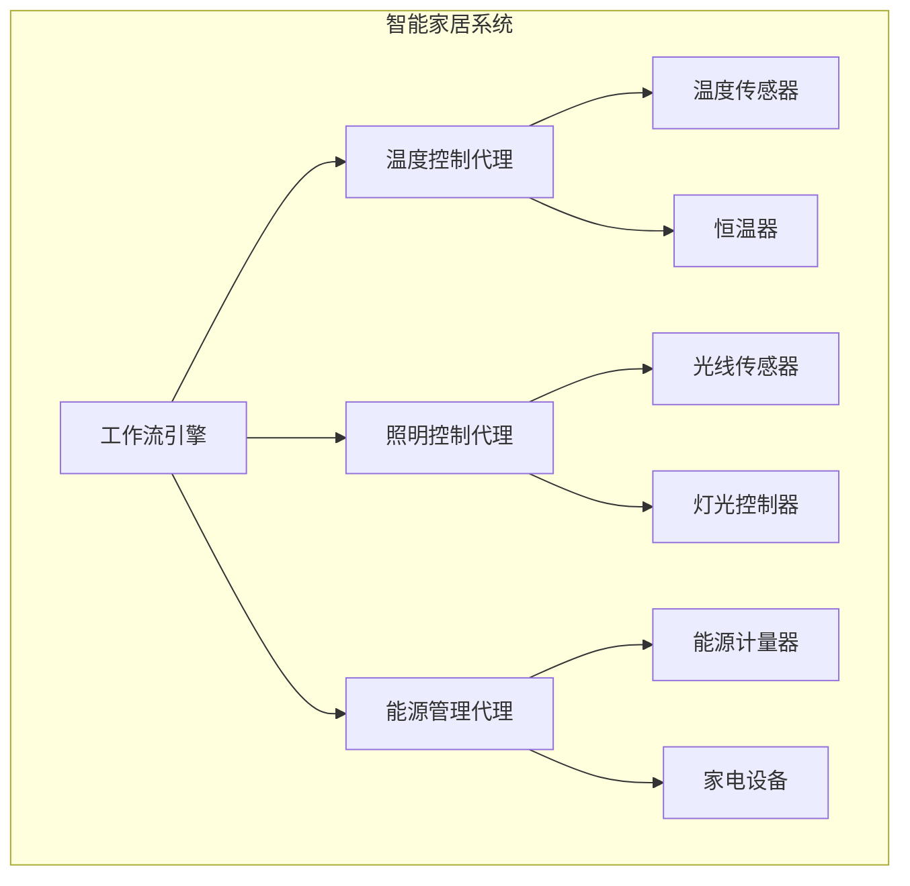

# AI人工智能代理工作流 AI Agent Workflow：在智能家居中的应用

## 1. 背景介绍

### 1.1 智能家居的兴起

随着物联网、人工智能和大数据技术的飞速发展,智能家居已经成为一个备受关注的热门领域。智能家居旨在通过将各种智能设备相互连接,实现对家居环境的自动化控制和优化,从而提高生活质量、节约能源并提高安全性。

### 1.2 智能家居系统的挑战

然而,构建一个高效、可靠和用户友好的智能家居系统并非一蹴而就。它需要处理来自多个异构设备的大量数据,并根据用户偏好和环境条件做出智能决策。此外,系统还需要具备自我学习和自适应的能力,以应对不断变化的需求和环境。

### 1.3 AI代理工作流的作用

在这种情况下,AI代理工作流(AI Agent Workflow)的概念应运而生。它提供了一种结构化和模块化的方法来设计、开发和部署智能代理系统,这些系统可以感知环境、推理和执行行动,从而实现智能家居的自动化管理。

## 2. 核心概念与联系

### 2.1 智能代理

智能代理是一种自主的软件实体,能够感知环境、处理信息、推理并采取行动以实现特定目标。在智能家居系统中,智能代理可以监控各种家居设备的状态,分析用户偏好和行为模式,并根据预定义的规则或机器学习模型做出相应的决策和操作。

### 2.2 工作流

工作流(Workflow)是一系列相互关联的活动,按特定顺序执行以实现特定目标。在智能家居系统中,工作流可以描述智能代理如何协调不同的任务和操作,以实现家居自动化的目标。

### 2.3 AI代理工作流

AI代理工作流将智能代理和工作流的概念结合在一起,提供了一种统一的框架来设计、开发和部署智能家居系统。它定义了智能代理如何感知环境、处理数据、推理和执行行动的过程,以及这些过程如何按照特定的工作流程进行协调和管理。

## 3. 核心算法原理具体操作步骤

AI代理工作流的核心算法原理可以概括为以下几个关键步骤:

### 3.1 感知环境

智能代理需要从各种传感器(如温度计、运动传感器、摄像头等)收集环境数据。这些数据通常是异构的,需要进行预处理和融合,以获得一个统一的环境表示。

### 3.2 状态更新

根据感知到的环境数据,智能代理需要更新其内部状态,以反映当前的家居环境。这可能涉及到机器学习算法,用于从历史数据中学习用户偏好和行为模式。

### 3.3 决策制定

基于当前状态,智能代理需要根据预定义的规则或学习到的策略做出决策。这可能涉及到规划算法、约束优化或强化学习等技术。

### 3.4 行动执行

一旦做出决策,智能代理就需要通过与各种执行器(如灯光控制器、恒温器等)的交互来执行相应的行动。

### 3.5 工作流协调

上述步骤通常不是孤立的,而是需要按照特定的工作流进行协调。工作流引擎负责管理和执行这些步骤,并根据需要进行并行化或序列化。

### 3.6 反馈与学习

在执行行动后,智能代理需要监测环境的变化,并根据反馈调整其决策策略。这可能涉及到在线学习或者知识库的更新。

## 4. 数学模型和公式详细讲解举例说明

在AI代理工作流中,数学模型和公式扮演着重要的角色,尤其是在状态更新、决策制定和学习等步骤中。下面我们将详细介绍一些常用的模型和公式。

### 4.1 马尔可夫决策过程 (MDP)

马尔可夫决策过程(Markov Decision Process, MDP)是一种广泛应用于强化学习和决策制定的数学框架。它可以形式化描述一个智能代理在不确定环境中做出序列决策的问题。

一个MDP可以用一个元组 $\langle S, A, P, R, \gamma \rangle$ 来表示,其中:

- $S$ 是状态集合
- $A$ 是动作集合
- $P(s'|s,a)$ 是状态转移概率,表示在状态 $s$ 下执行动作 $a$ 后转移到状态 $s'$ 的概率
- $R(s,a)$ 是奖励函数,表示在状态 $s$ 下执行动作 $a$ 所获得的即时奖励
- $\gamma \in [0, 1]$ 是折现因子,用于权衡即时奖励和长期奖励的重要性

智能代理的目标是找到一个策略 $\pi: S \rightarrow A$,使得期望的累积折现奖励最大化:

$$
\max_\pi \mathbb{E}\left[ \sum_{t=0}^\infty \gamma^t R(s_t, a_t) \right]
$$

其中 $s_t$ 和 $a_t$ 分别表示在时间步 $t$ 的状态和动作。

### 4.2 Q-Learning

Q-Learning 是一种著名的无模型强化学习算法,用于求解 MDP 问题。它直接学习一个 Q 函数 $Q(s,a)$,表示在状态 $s$ 下执行动作 $a$ 后能获得的期望累积奖励。

Q-Learning 算法的更新规则如下:

$$
Q(s_t, a_t) \leftarrow Q(s_t, a_t) + \alpha \left[ r_t + \gamma \max_{a'} Q(s_{t+1}, a') - Q(s_t, a_t) \right]
$$

其中 $\alpha$ 是学习率,控制着新信息对 Q 函数的影响程度。

通过不断更新 Q 函数,智能代理最终可以学习到一个最优策略 $\pi^*(s) = \arg\max_a Q(s,a)$。

### 4.3 深度 Q-网络 (DQN)

深度 Q-网络 (Deep Q-Network, DQN) 是结合了 Q-Learning 和深度神经网络的强化学习算法,能够处理高维状态输入。它使用一个深度神经网络来近似 Q 函数,即 $Q(s,a; \theta) \approx Q^*(s,a)$,其中 $\theta$ 是网络的权重参数。

在训练过程中,DQN 会从经验回放池中采样过往的转换 $(s_t, a_t, r_t, s_{t+1})$,并最小化以下损失函数:

$$
\mathcal{L}(\theta) = \mathbb{E}_{(s_t, a_t, r_t, s_{t+1})} \left[ \left( r_t + \gamma \max_{a'} Q(s_{t+1}, a'; \theta^-) - Q(s_t, a_t; \theta) \right)^2 \right]
$$

其中 $\theta^-$ 是目标网络的权重,用于估计 $\max_{a'} Q(s_{t+1}, a')$ 以提高训练稳定性。

通过训练,DQN 可以学习到一个近似最优的 Q 函数,并据此执行智能决策。

### 4.4 其他模型

除了上述模型外,AI 代理工作流中还可以使用其他数学模型和算法,例如:

- 隐马尔可夫模型 (HMM) 用于从传感器数据中推断隐藏状态
- 高斯混合模型 (GMM) 用于聚类和概率密度估计
- 支持向量机 (SVM) 用于分类和异常检测
- 决策树和随机森林用于规则推理和决策制定
- 卡尔曼滤波和粒子滤波用于状态估计和跟踪

根据具体的应用场景和需求,可以选择和组合不同的模型以获得最佳的性能。

## 5. 项目实践: 代码实例和详细解释说明

为了更好地理解 AI 代理工作流在智能家居中的应用,我们将通过一个具体的项目实例来演示其实现过程。在这个项目中,我们将构建一个简单的智能家居系统,包括温度控制、照明控制和能源管理三个模块。

### 5.1 系统架构

我们的智能家居系统采用模块化的设计,由多个智能代理组成。每个代理负责管理特定的家居设备,并通过工作流引擎进行协调。系统架构如下所示:



### 5.2 温度控制代理

温度控制代理负责根据用户偏好和环境温度自动调节恒温器,以保持舒适的室内温度。它的实现过程如下:

1. 从温度传感器读取当前室内温度
2. 根据用户设置的目标温度范围,判断是否需要调节温度
3. 如果需要调节,则计算所需的加热或制冷量
4. 通过恒温器执行相应的加热或制冷操作
5. 监测温度变化,直到达到目标范围内

下面是温度控制代理的 Python 代码示例:

```python
import time

class TempAgent:
    def __init__(self, temp_sensors, thermostat, target_temp_range):
        self.temp_sensors = temp_sensors
        self.thermostat = thermostat
        self.target_temp_range = target_temp_range
    
    def run(self):
        while True:
            current_temp = self.temp_sensors.read_temp()
            if current_temp < self.target_temp_range[0]:
                # 需要加热
                heat_amount = self.target_temp_range[0] - current_temp
                self.thermostat.heat(heat_amount)
            elif current_temp > self.target_temp_range[1]:
                # 需要制冷
                cool_amount = current_temp - self.target_temp_range[1]
                self.thermostat.cool(cool_amount)
            else:
                # 温度在目标范围内,无需调节
                pass
            
            time.sleep(60)  # 每隔一分钟检查一次温度
```

在这个示例中,`TempAgent` 类初始化时需要提供温度传感器、恒温器和目标温度范围。`run` 方法是代理的主循环,它每隔一分钟读取一次当前温度,并根据温度与目标范围的差值决定是否需要加热或制冷。如果需要,它会通过恒温器执行相应的操作。

### 5.3 照明控制代理

照明控制代理根据环境光线水平和用户活动自动调节室内照明。它的实现过程如下:

1. 从光线传感器读取当前环境光线水平
2. 根据用户设置的光线偏好,判断是否需要调节照明
3. 如果需要调节,则计算所需的亮度级别
4. 通过灯光控制器打开或关闭相应的灯具
5. 监测光线变化,直到达到目标亮度级别

下面是照明控制代理的 Python 代码示例:

```python
class LightAgent:
    def __init__(self, light_sensors, light_switches, target_lux_range):
        self.light_sensors = light_sensors
        self.light_switches = light_switches
        self.target_lux_range = target_lux_range
    
    def run(self):
        while True:
            current_lux = self.light_sensors.read_lux()
            if current_lux < self.target_lux_range[0]:
                # 需要开灯
                brightness_level = self.calculate_brightness(current_lux, self.target_lux_range[0])
                self.light_switches.turn_on(brightness_level)
            elif current_lux > self.target_lux_range[1]:
                # 需要关灯
                self.light_switches.turn_off()
            else:
                # 光线在目标范围内,无需调节
                pass
            
            time.sleep(60)  # 每隔一分钟检查一次光线
    
    def calculate_brightness(self, current