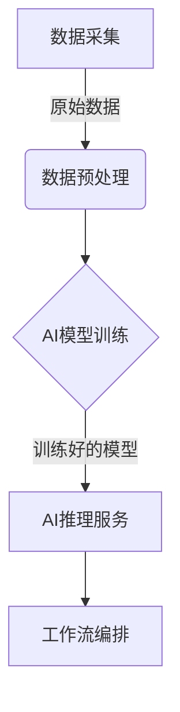

# AI人工智能代理工作流 AI Agent Workflow：在档案管理中的应用

## 1.背景介绍

### 1.1 档案管理的重要性

在当今数字化时代，组织机构和企业面临着海量数据的挑战。无论是政府机构、金融机构还是制造业公司,都需要高效管理大量的文档、记录和信息。有效的档案管理不仅有助于满足合规性要求,还可以提高运营效率、降低风险并支持决策过程。

### 1.2 传统档案管理的局限性

然而,传统的档案管理方式存在诸多局限性:

- 人工分类和检索效率低下
- 元数据标注耗时耗力 
- 信息孤岛难以整合
- 缺乏智能化处理和分析能力

这些挑战导致了信息获取、利用和共享的效率低下,给组织带来了巨大的时间和经济成本。

### 1.3 AI助力档案管理革新

人工智能(AI)技术的兴起为档案管理带来了全新的机遇。AI代理可以自动化分类、检索、标注和提取关键信息,显著提高档案管理的效率和质量。通过机器学习和自然语言处理等技术,AI代理能够深入理解文档内容,为用户提供智能化的服务和见解。

## 2.核心概念与联系

### 2.1 AI代理工作流概述

AI代理工作流是一种将人工智能技术集成到档案管理过程中的方法。它包括以下关键组件:

- **数据采集**:从各种来源收集文档和数据
- **数据预处理**:清理、标准化和富化数据
- **AI模型训练**:使用机器学习算法训练AI模型
- **AI推理服务**:利用训练好的模型提供智能化服务
- **工作流编排**:协调和管理各个环节的工作流程

这些组件相互协作,形成了一个端到端的AI驱动的档案管理解决方案。



### 2.2 关键AI技术

AI代理工作流中涉及多种AI技术,包括但不限于:

- **计算机视觉**:用于图像和视频处理
- **自然语言处理(NLP)**: 用于文本数据处理和理解
- **知识图谱**:构建结构化知识库
- **机器学习**:训练AI模型进行分类、聚类和预测等任务

这些技术相互补充,共同推动档案管理的智能化转型。

## 3.核心算法原理具体操作步骤  

### 3.1 文档分类

文档分类是档案管理中的一项关键任务。AI代理可以利用监督学习和深度学习算法自动对文档进行分类,大大提高了效率。

1. **特征提取**:从文档中提取文本特征(如词袋模型、TF-IDF等)和其他特征(如元数据)
2. **模型训练**:使用训练数据集训练分类模型,如逻辑回归、支持向量机、深度神经网络等
3. **模型评估**:在测试数据集上评估模型性能,通过调整超参数和特征工程优化模型
4. **模型部署**:将训练好的模型部署到AI推理服务中,对新文档进行实时分类

### 3.2 信息提取

信息提取旨在从非结构化文本中提取结构化信息,如实体、事件、关系等。这对于构建知识图谱和智能问答系统至关重要。

1. **命名实体识别(NER)**: 使用序列标注模型(如BiLSTM-CRF)识别文本中的人名、地名、组织机构名等实体
2. **关系提取**:利用深度学习模型(如卷积神经网络、transformer等)提取实体之间的关系
3. **事件提取**:从文本中识别出事件触发词及其论元,构建事件知识库
4. **规则匹配**:使用预定义的模式规则从文本中提取特定信息

### 3.3 文本摘要

文本摘要可以自动生成文档的精简概括,帮助用户快速获取文档要点。主要算法包括:

1. **提取式摘要**:根据句子重要性打分,选取最重要的几个句子作为摘要
2. **生成式摘要**:使用序列到序列模型(如transformer)直接生成新的摘要文本
3. **融合模型**:结合提取和生成两种范式,产生高质量的摘要

### 3.4 智能问答

智能问答系统能够自动回答用户提出的自然语言问题,是档案管理中的重要应用。

1. **问题分类**:将问题分类到预定义类别,确定答案类型
2. **候选答案生成**:从知识库或文档集中检索相关段落,生成候选答案
3. **答案排序**:使用深度学习模型(如BERT)对候选答案进行排序,选择最佳答案
4. **答案生成**:直接生成自然语言回复,无需检索候选答案

## 4.数学模型和公式详细讲解举例说明

在AI代理工作流中,数学模型和公式扮演着重要角色,尤其是在机器学习和自然语言处理领域。让我们探讨一些常用的模型和公式。

### 4.1 词袋模型(Bag of Words)

词袋模型是一种用于文本表示的简单但有效的方法。它将文档表示为词频向量,忽略了词与词之间的顺序和语法结构信息。

给定词汇表 $V = \{w_1, w_2, ..., w_n\}$,文档 $d$ 可以表示为词频向量:

$$\vec{x}_d = (x_1, x_2, ..., x_n)$$

其中 $x_i$ 表示词 $w_i$ 在文档 $d$ 中出现的次数。

虽然简单,但词袋模型在文档分类和聚类等任务中表现良好。它还可以通过加权(如TF-IDF)和降维(如LSA)等技术进行改进。

### 4.2 N-gram语言模型

N-gram语言模型是自然语言处理中常用的概率模型,它根据前 $n-1$ 个词来预测第 $n$ 个词的概率。

对于长度为 $m$ 的句子 $S = w_1, w_2, ..., w_m$,其概率可以表示为:

$$P(S) = \prod_{i=1}^m P(w_i | w_{i-n+1}, ..., w_{i-1})$$

其中 $P(w_i | w_{i-n+1}, ..., w_{i-1})$ 是 $n$ 元语言模型,可以通过最大似然估计或者平滑技术(如加法平滑)从训练语料中学习得到。

N-gram模型广泛应用于机器翻译、语音识别、拼写检查等领域。

### 4.3 Word2Vec 

Word2Vec 是一种高效的词嵌入(word embedding)技术,可以将词映射到低维连续向量空间,保留词与词之间的语义关系。它包含两种模型:

**Skip-gram 模型**:

给定中心词 $w_t$,模型试图最大化上下文词 $w_{t-n}, ..., w_{t-1}, w_{t+1}, ..., w_{t+n}$ 的条件概率:

$$\max_\theta \frac{1}{T} \sum_{t=1}^T \sum_{-n \leq j \leq n, j \neq 0} \log P(w_{t+j} | w_t; \theta)$$

**连续词袋模型(CBOW)**:

给定上下文词 $w_{t-n}, ..., w_{t-1}, w_{t+1}, ..., w_{t+n}$,模型试图预测中心词 $w_t$:

$$\max_\theta \frac{1}{T} \sum_{t=1}^T \log P(w_t | w_{t-n}, ..., w_{t-1}, w_{t+1}, ..., w_{t+n}; \theta)$$

通过优化这些目标函数,Word2Vec 可以学习出词的分布式表示,在许多 NLP 任务中表现出色。

### 4.4 注意力机制(Attention Mechanism)

注意力机制是一种有助于神经网络模型关注输入的重要部分的技术。在机器翻译等序列到序列任务中,注意力机制可以帮助解码器在生成每个目标词时,对源序列的不同位置赋予不同的权重。

给定源序列 $X = (x_1, x_2, ..., x_m)$ 和已生成的目标序列前缀 $(y_1, y_2, ..., y_{j-1})$,我们需要计算生成 $y_j$ 的条件概率:

$$p(y_j | y_1, ..., y_{j-1}, X) = g(s_j, c_j)$$

其中 $s_j$ 是解码器的隐藏状态, $c_j$ 是注意力上下文向量,由注意力权重 $\alpha_{ij}$ 和源序列编码 $h_i$ 计算得到:

$$c_j = \sum_{i=1}^m \alpha_{ij} h_i \\ \alpha_{ij} = \frac{\exp(e_{ij})}{\sum_{k=1}^m \exp(e_{ik})}$$

$e_{ij}$ 是注意力能量,可以通过不同的打分函数计算,如点乘、加性或多头注意力等。

注意力机制赋予了神经网络"理解"输入序列的能力,在 NLP 和计算机视觉领域取得了卓越的成就。

### 4.5 BERT 模型

BERT(Bidirectional Encoder Representations from Transformers) 是一种基于 Transformer 的预训练语言模型,在多项 NLP 任务上取得了state-of-the-art 的表现。

BERT 的核心思想是使用 Masked Language Model(MLM) 和 Next Sentence Prediction(NSP) 两个任务进行预训练,学习双向的上下文表示。在微调(fine-tuning)阶段,BERT 可以针对特定的下游任务(如文本分类、问答等)进行进一步训练。

BERT 的输入由三部分组成:token embeddings、segment embeddings 和 position embeddings。这些嵌入被送入 Transformer 编码器,产生上下文化的表示。对于给定的输入序列 $X = (x_1, x_2, ..., x_n)$,BERT 将生成对应的上下文表示 $H = (h_1, h_2, ..., h_n)$。

通过预训练和微调,BERT 可以捕获丰富的语义和上下文信息,为下游任务提供强大的语义表示能力。

以上是一些在 AI 代理工作流中常用的数学模型和公式。通过合理选择和应用这些模型,我们可以提高档案管理的智能化水平。

## 5. 项目实践:代码实例和详细解释说明

为了帮助读者更好地理解 AI 代理工作流在档案管理中的应用,我们将提供一个实际项目的代码示例和详细解释。该项目旨在构建一个智能文档分类和检索系统,能够自动对文档进行分类并支持基于自然语言的查询。

### 5.1 项目概述

该项目包括以下主要组件:

1. **数据采集**:从各种来源(如网站、数据库、本地文件系统等)收集文档数据。
2. **数据预处理**:对原始文档进行清理、格式化和标准化,提取文本内容和元数据。
3. **文档分类**:使用监督学习算法训练分类模型,对文档进行自动分类。
4. **索引构建**:基于分类结果和文档内容,构建倒排索引以支持高效检索。
5. **查询处理**:接收用户的自然语言查询,并返回相关文档。

### 5.2 数据采集和预处理

我们首先需要从各种来源收集文档数据。以下是一个简单的 Python 脚本,用于从网站上抓取 HTML 文档:

```python
import requests
from bs4 import BeautifulSoup

def fetch_docs(url):
    response = requests.get(url)
    soup = BeautifulSoup(response.text, 'html.parser')
    documents = soup.find_all('div', class_='document')
    
    for doc in documents:
        title = doc.find('h2').text
        content = doc.find('div', class_='content').text
        # 存储或进一步处理文档
        process_document(title, content)
```

接下来,我们需要对原始文档进行预处理,包括去除HTML标签、清理文本、提取元数据等。以下是一个示例函数,用于预