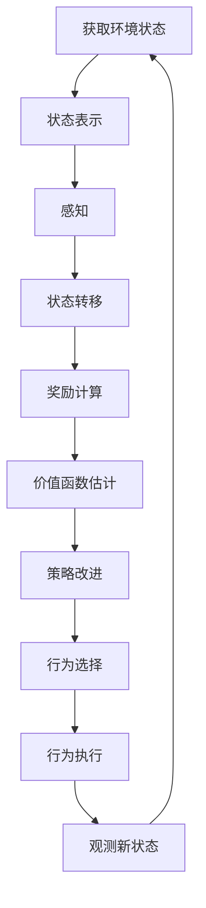

# AI人工智能代理工作流 AI Agent WorkFlow：未来发展趋势

## 1.背景介绍

### 1.1 人工智能代理的兴起

随着人工智能(AI)技术的快速发展,AI代理已经成为各行业的热门话题。AI代理是一种自主软件实体,能够根据预定义的目标和约束条件执行各种任务。它们可以从环境中获取信息、分析数据、做出决策并采取行动,从而帮助人类完成各种复杂的工作。

AI代理的概念源于代理理论,最早应用于计算机科学领域。随着机器学习、自然语言处理和计算机视觉等技术的进步,AI代理的能力不断扩展,应用范围也日益广泛。

### 1.2 AI代理的作用和优势  

AI代理可以执行各种任务,包括数据处理、决策支持、自动化流程、对话交互等。它们具有以下优势:

- 高效性:AI代理可以24/7不间断工作,处理大量数据和任务,提高工作效率。
- 准确性:基于强大的算法和模型,AI代理可以做出更准确的判断和决策。  
- 可扩展性:AI代理系统可以根据需求进行扩展和优化,满足不断变化的业务需求。
- 成本效益:相比人工操作,AI代理可以降低劳动力成本,提高生产效率。

### 1.3 AI代理工作流概述

AI代理工作流描述了代理如何执行任务的过程,通常包括以下几个阶段:

1. 观察环境,获取相关数据和信息
2. 分析和处理获取的数据
3. 根据目标和约束条件,做出决策和规划
4. 执行相应的行动,产生输出或调用其他系统
5. 评估行动结果,持续优化决策模型

该工作流是一个循环过程,AI代理会不断获取新数据、更新模型、优化决策,以完成更加复杂的任务。

## 2.核心概念与联系  

### 2.1 AI代理的构成要素

一个完整的AI代理系统通常包含以下几个核心要素:

- **感知器(Sensors)**: 用于从环境中获取数据和信息,如图像、文本、声音等。
- **执行器(Actuators)**: 根据决策执行相应的动作,如控制机器人运动、发送指令等。  
- **知识库(Knowledge Base)**: 存储代理所需的规则、数据和经验知识。
- **推理引擎(Inference Engine)**: 基于知识库和感知数据,运行算法模型进行决策推理。
- **学习模块(Learning Module)**: 使用机器学习算法从经验中获取新知识,持续优化决策模型。

这些要素有机结合,构成了一个智能化的闭环系统,能够自主地感知、学习、决策和行动。

### 2.2 AI代理的分类

根据不同的特性和能力,AI代理可以分为以下几类:

- **简单反射代理**: 只根据当前感知数据做出反应,没有记忆或环境模型。
- **基于模型的代理**: 构建环境模型,根据模型预测未来状态做出决策。  
- **基于目标的代理**: 具有明确的目标函数,决策旨在优化目标。
- **基于效用的代理**: 根据效用函数评估不同行为的价值,选择效用最大的行为。
- **学习代理**: 能够从经验中学习,持续优化决策模型和知识库。

不同类型的代理在复杂程度和能力上有所差异,应根据具体需求选择合适的代理类型。

### 2.3 AI代理与其他技术的关系

AI代理是一个交叉学科,与多种技术领域密切相关:

- **机器学习**: 提供训练模型、从数据中学习的算法和方法。
- **自然语言处理**: 赋予代理理解和生成自然语言的能力。  
- **计算机视觉**: 使代理能够识别和理解图像、视频等视觉数据。
- **规划与决策**: 为代理制定行动计划和做出最优决策。
- **多智能体系统**: 研究多个代理如何协同工作和互动。
- **人机交互**: 探索代理与人类更自然、高效的交互方式。

AI代理是这些技术的综合应用,需要跨学科的知识和创新。

## 3.核心算法原理具体操作步骤

AI代理的核心是其决策算法,即如何根据当前状态做出最佳行为选择。这通常涉及以下几个步骤:

### 3.1 状态表示

首先需要将环境状态用适当的数据结构表示,如特征向量、图像矩阵等,以便算法处理。状态表示直接影响算法的性能和准确性。

### 3.2 感知

代理通过各种传感器获取环境数据,如图像、声音、文本等,并将其转化为内部状态表示。这个过程称为感知(Perception)。

### 3.3 状态转移

根据当前状态和可选行为,计算每个可能的后继状态及其发生的概率,形成状态转移模型。这是马尔可夫决策过程(MDP)的核心思想。

对于确定性环境,状态转移可表示为:

$$s' = f(s, a)$$

其中 $s'$ 是后继状态, $s$ 是当前状态, $a$ 是采取的行为, $f$ 是状态转移函数。

对于随机环境,需要计算每个后继状态的概率:

$$P(s' | s, a) = Pr(s_{t+1}=s' | s_t=s, a_t=a)$$

### 3.4 奖励计算

为每个状态-行为对指定一个奖励值(Reward),表示其价值或效用。奖励可以是立即的,也可以延迟到未来某个状态。目标是最大化预期的累积奖励。

### 3.5 价值函数估计

价值函数 $V(s)$ 表示从状态 $s$ 开始,按某策略执行所能获得的预期累积奖励。对于任意策略 $\pi$,其价值函数定义为:

$$V^\pi(s) = E_\pi[\sum_{k=0}^{\infty} \gamma^k r_{t+k+1} | s_t = s]$$

其中 $\gamma$ 是折现因子,用于权衡即时奖励和长期奖励。

### 3.6 策略改进

根据价值函数或其他评估指标,不断优化策略,使代理的行为决策越来越好。常用的策略优化算法包括:

- 价值迭代
- 策略迭代 
- 深度强化学习(如DQN、A3C等)
- 进化算法
- ...

这是一个不断迭代的过程,直到代理的策略收敛或满足预期目标。

### 3.7 行为执行

根据优化后的策略,代理选择当前状态下的最佳行为,并通过执行器施加到环境中,产生新的状态。

### 3.8 算法流程图

AI代理决策的核心算法流程可用下面的流程图表示:

该流程循环往复,代理通过不断感知、学习和决策,优化自身策略,完成更加复杂的任务。

## 4.数学模型和公式详细讲解举例说明

AI代理中使用了大量的数学模型和公式,让我们通过具体例子来深入理解其中的原理。

### 4.1 马尔可夫决策过程 (MDP)

马尔可夫决策过程是AI代理决策的基本数学模型,由一个五元组 $(S, A, P, R, \gamma)$ 组成:

- $S$ 是所有可能状态的集合
- $A$ 是所有可选行为的集合  
- $P(s'|s,a)$ 是状态转移概率分布
- $R(s,a)$ 是奖励函数,给定状态和行为的即时奖励
- $\gamma \in [0,1)$ 是折现因子,权衡即时奖励和长期奖励

在MDP中,代理的目标是找到一个策略 $\pi: S \rightarrow A$,使预期的累积折现奖励最大化:

$$\max_\pi E\left[ \sum_{t=0}^\infty \gamma^t R(s_t, a_t) \right]$$

其中 $a_t = \pi(s_t)$ 是在状态 $s_t$ 时代理采取的行为。

**示例**:考虑一个机器人导航的MDP,其中:

- 状态 $S$ 是机器人在网格世界中的位置
- 行为 $A = \{\text{上,下,左,右}\}$ 是机器人可执行的移动方向
- 状态转移 $P(s'|s,a)$ 给出了机器人移动后到达新位置的概率分布
- 奖励 $R(s,a)$ 是根据机器人与目标位置的距离计算得到的负值
- $\gamma=0.9$ 是一个较高的折现因子,鼓励机器人尽快到达目标

通过价值迭代或策略迭代等算法,可以找到一个最优策略 $\pi^*$,指导机器人以最短路径到达目标位置。

### 4.2 Q-Learning 算法

Q-Learning是一种无模型的强化学习算法,可以直接从环境交互中学习最优策略,而无需事先了解MDP的转移概率和奖励函数。

算法的核心是学习Q函数 $Q(s,a)$,表示在状态 $s$ 采取行为 $a$ 后,可获得的预期累积奖励。最优Q函数 $Q^*(s,a)$ 定义为:

$$Q^*(s,a) = \mathbb{E}\left[r_t + \gamma \max_{a'} Q^*(s_{t+1}, a') | s_t=s, a_t=a\right]$$

其中 $r_t$ 是立即奖励, $\gamma$ 是折现因子。

Q-Learning通过不断更新Q函数的近似值,使其收敛到最优解:

$$Q(s_t, a_t) \leftarrow Q(s_t, a_t) + \alpha \left[ r_t + \gamma \max_{a'} Q(s_{t+1}, a') - Q(s_t, a_t) \right]$$

其中 $\alpha$ 是学习率。

最终得到的最优Q函数可用于构建最优策略 $\pi^*(s) = \arg\max_a Q^*(s,a)$。

**示例**:考虑机器人导航的例子,我们可以使用Q-Learning来训练机器人找到最短路径:

1. 初始化Q函数,如 $Q(s,a)=0$ 
2. 对于每个Episode:
    - 重置机器人初始位置
    - 重复以下步骤直到到达目标:
        - 在当前状态 $s_t$ 选取行为 $a_t = \arg\max_a Q(s_t, a)$
        - 执行行为 $a_t$,获得奖励 $r_t$ 和新状态 $s_{t+1}$
        - 更新Q函数: $Q(s_t, a_t) \leftarrow Q(s_t, a_t) + \alpha \left[r_t + \gamma \max_{a'} Q(s_{t+1}, a') - Q(s_t, a_t)\right]$
3. 重复多个Episode,直到Q函数收敛

通过这种方式,机器人可以从环境交互中学习到一个近似最优的Q函数,从而导出最短路径策略。

### 4.3 深度强化学习

传统的Q-Learning使用表格或函数近似来表示Q函数,存在一些局限性。深度强化学习(Deep Reinforcement Learning)则利用深度神经网络来近似Q函数或策略,从而能够处理大规模、高维的状态和行为空间。

常见的深度强化学习算法包括:

- **深度Q网络(DQN)**: 使用卷积神经网络来近似Q函数 $Q(s,a;\theta)$,其中 $\theta$ 是网络参数。
- **策略梯度算法**: 直接使用神经网络来近似策略 $\pi(a|s;\theta)$,通过策略梯度方法优化网络参数。
- **Actor-Critic算法**: 使用两个网络,Actor网络学习策略函数,Critic网络学习价值函数,共同协作以提高性能。

这些算法通过强大的深度学习模型,能够从原始的高维输