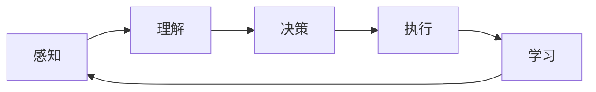

# AI人工智能代理工作流AI Agent WorkFlow：智能代理在智能交通系统中的应用

## 1. 背景介绍
### 1.1 智能交通系统的发展现状
#### 1.1.1 智能交通系统的定义与特点
智能交通系统（Intelligent Transportation System，ITS）是将先进的信息技术、数据通信传输技术、电子控制技术及计算机技术等有效地集成运用于整个地面交通管理系统而建立的一种在大范围内、全方位发挥作用的，实时、准确、高效的综合交通运输管理系统。它的特点包括：
- 全面感知：通过各种传感器和数据采集设备，实时获取交通系统的运行状态数据。
- 互联互通：利用通信网络技术，实现人、车、路之间的信息交互和共享。
- 智能决策：运用大数据分析和人工智能技术，对交通系统进行实时监测、预测和优化控制。
- 协同控制：通过交通信号、诱导屏等设施，对交通流进行主动引导和调控。

#### 1.1.2 智能交通系统的应用现状
目前，智能交通系统已在世界各地得到广泛应用，主要涵盖以下几个方面：
1. 高速公路管理：如电子不停车收费（ETC）、高速公路监控系统等。
2. 城市交通管理：如交通信号控制系统、公交优先与实时乘客信息系统等。
3. 交通信息服务：如交通诱导与信息发布系统、停车诱导系统等。
4. 车辆安全辅助：如车道偏离预警系统、碰撞预警系统等。
5. 公共交通管理：如公交车运营管理系统、轨道交通运营调度系统等。

### 1.2 人工智能在智能交通系统中的应用前景
#### 1.2.1 人工智能技术的发展现状
人工智能（Artificial Intelligence，AI）是研究、开发用于模拟、延伸和扩展人的智能的理论、方法、技术及应用系统的一门新的技术科学。近年来，以深度学习为代表的人工智能技术取得了突破性进展，在计算机视觉、自然语言处理、决策优化等领域表现出色，为智能交通系统的发展带来了新的机遇。

#### 1.2.2 人工智能在智能交通系统中的应用潜力
人工智能可以在智能交通系统的各个环节发挥重要作用，主要体现在：
1. 感知层面：利用计算机视觉技术对道路视频图像进行分析，实现车辆检测与跟踪、车流量统计、事件检测等功能。
2. 决策层面：运用机器学习算法对海量交通数据进行挖掘分析，实现交通流预测、信号配时优化、诱导策略生成等功能。  
3. 控制层面：结合强化学习等技术，实现交通信号灯的实时自适应控制，提高通行效率。
4. 服务层面：应用自然语言处理和知识图谱技术，为出行者提供更加智能、个性化的出行规划、信息查询等服务。

因此，人工智能代理（Agent）作为人工智能的一种重要实现形式，在智能交通系统中具有广阔的应用前景。通过部署多个分布式的智能Agent，并协调其在感知、决策、控制等方面的工作流程，有望进一步提升智能交通系统的智能化水平和管理效能。

## 2. 核心概念与联系
### 2.1 智能Agent的定义与特点
智能Agent是一种能够感知环境并做出自主行为以达成设定目标的计算机系统。其主要特点包括：
- 自主性：能够在无需人工直接干预的情况下持续运行。
- 社会性：能够与环境中的其他Agent进行通信与协作。
- 反应性：能够感知环境的变化并及时做出响应。
- 主动性：能够主动采取行动以达成预设目标。
- 智能性：能够运用先进的人工智能技术进行推理、学习和决策。

### 2.2 智能Agent与智能交通系统的关系
在智能交通系统中引入智能Agent技术，可以从以下几个方面增强系统性能：
1. 提高感知能力：通过在道路交叉口、关键路段等部署视觉Agent，对交通状态进行全面实时的监测。
2. 优化决策机制：运用多Agent协同决策技术，在分布式的Agent之间通过协商与博弈实现全局决策优化。
3. 增强控制效能：针对高速公路、城市道路等不同场景，设计专用的控制Agent，提高交通管控的针对性和实时性。
4. 丰富服务内容：利用对话Agent、推荐Agent等为出行者提供交通咨询、出行规划、信息推送等个性化服务。

### 2.3 智能Agent工作流的一般模型
一个典型的智能Agent工作流包含以下几个关键环节：
1. 感知（Perception）：通过各类传感器获取所在环境的状态信息。
2. 理解（Comprehension）：对感知数据进行分析理解，提取有效的环境特征。
3. 决策（Decision Making）：根据当前环境状态和预设目标，运用规则推理或优化算法等方法做出行为决策。
4. 执行（Execution）：根据决策结果采取相应的控制行为，并观察环境反馈。
5. 学习（Learning）：根据执行效果与环境反馈，调整内部的知识表示、决策机制等，实现持续优化。

下图给出了智能Agent工作流的一般模型示意：

## 3. 核心算法原理具体操作步骤
### 3.1 智能Agent的感知算法
#### 3.1.1 计算机视觉感知
对于视觉感知型Agent，常用的感知算法包括：
1. 目标检测：通过卷积神经网络等方法，在图像中检测出车辆、行人等目标，并给出其位置和类别。主要步骤包括：
   - 图像预处理：对原始图像进行尺寸归一化、减均值等操作。
   - 特征提取：使用预训练的CNN网络提取图像的多尺度特征。
   - 候选区域生成：在特征图上使用选择性搜索、RPN等算法提取可能包含目标的候选区域。
   - 目标分类与回归：对候选区域进行分类判别和位置回归，得到最终的检测结果。
2. 目标跟踪：在视频序列中对检测到的目标进行逐帧跟踪，形成时空轨迹。常用算法包括卡尔曼滤波、粒子滤波等。
3. 语义分割：对图像中的每个像素进行分类，得到像素级别的场景理解结果。常采用FCN、DeepLab等语义分割网络模型。

#### 3.1.2 传感器数据融合感知
实际系统中往往部署多种异构传感器，需要对不同来源的数据进行融合，以获得更加准确和鲁棒的感知结果。常用的传感器数据融合算法包括：
1. 卡尔曼滤波：通过预测和更新两个步骤，对目标状态进行递归估计，适用于线性高斯系统。
2. 粒子滤波：通过粒子集合近似表示概率分布，并通过重采样机制更新粒子权重，适用于非线性非高斯系统。
3. 贝叶斯融合：基于贝叶斯推理，通过计算后验概率实现多传感器观测数据的融合。
4. Dempster-Shafer证据理论：通过定义证据质量、证据支持度等概念，对多源异构数据进行不确定性建模与融合。

### 3.2 智能Agent的决策算法
#### 3.2.1 规则推理
通过预先定义一系列IF-THEN形式的规则，根据当前环境状态进行匹配，得出相应的决策结果。规则推理的一般步骤包括：
1. 知识表示：将领域知识抽象为一系列规则，形成规则库。
2. 规则匹配：根据当前环境状态，与规则库中的规则条件进行匹配。
3. 冲突消解：当存在多个满足条件的规则时，根据优先级、特异性等准则进行冲突消解。
4. 结果输出：将匹配成功的规则结论作为决策结果输出。

#### 3.2.2 优化决策
通过建立数学模型，将决策问题转化为优化问题，运用优化算法求解得到最优决策。常用的优化决策算法包括：
1. 线性规划：目标函数和约束条件均为线性函数，可用单纯形法、内点法等求解。
2. 整数规划：决策变量为整数，常用分支定界法、切平面法等求解。
3. 动态规划：将优化问题分解为多个阶段，基于最优子结构性质递归求解。
4. 启发式搜索：采用启发式函数引导搜索方向，加速搜索收敛。代表算法包括A*搜索、遗传算法等。
5. 强化学习：通过试错与环境交互，学习最优决策策略。常用算法包括Q学习、SARSA、Policy Gradient等。

### 3.3 多Agent协同算法
在智能交通系统中，往往存在多个智能Agent分布式部署，需要设计有效的协同算法，实现Agent间的通信、协商与任务分配。常用的多Agent协同算法包括：
1. Contract Net协议：通过管理者Agent将任务分解并招标，由承包者Agent竞标并完成任务。
2. 多Agent强化学习：每个Agent学习自身的最优策略，同时考虑其他Agent的策略，收敛于纳什均衡。代表算法包括Independent Q-Learning、Joint Action Learning等。
3. 分布式约束优化：将全局任务表示为多个Agent的局部约束网络，通过消息传递实现分布式求解。代表算法包括ADOPT、DPOP等。
4. 博弈论机制设计：通过设计博弈规则，引导多Agent系统收敛到期望的均衡状态。常用机制包括拍卖机制、投票机制等。

## 4. 数学模型和公式详细讲解举例说明
### 4.1 交通流预测模型
交通流预测是智能交通系统中的一项关键任务，常用的数学模型包括：
1. 历史平均模型：假设未来交通流量与历史同期平均值相近，预测公式为：

$$\hat{q}(k+1) = \frac{1}{n}\sum_{i=1}^n q(k-i\cdot T)$$

其中，$\hat{q}(k+1)$为未来第$k+1$时段的交通流量预测值，$q(k-i\cdot T)$为过去第$i$个周期对应时段的实际流量值，$n$为历史数据采样周期数，$T$为单个采样周期长度。

2. 自回归移动平均模型（ARMA）：考虑交通流量的时间序列特性，建立自回归模型：

$$ q(k) = \sum_{i=1}^p \varphi_i q(k-i) + \sum_{j=1}^q \theta_j \varepsilon(k-j) + \varepsilon(k)$$

其中，$p$和$q$分别为自回归项和移动平均项的阶数，$\varphi_i$和$\theta_j$为模型参数，$\varepsilon(k)$为白噪声序列。

3. 卡尔曼滤波模型：将交通流建模为线性高斯系统，使用卡尔曼滤波进行状态估计与预测：

$$\begin{aligned}
\mathbf{x}(k+1) &= \mathbf{A}\mathbf{x}(k) + \mathbf{B}\mathbf{u}(k) + \mathbf{w}(k) \\
\mathbf{z}(k) &= \mathbf{H}\mathbf{x}(k) + \mathbf{v}(k)
\end{aligned}$$

其中，$\mathbf{x}(k)$为系统状态向量，$\mathbf{u}(k)$为控制输入，$\mathbf{z}(k)$为观测值，$\mathbf{w}(k)$和$\mathbf{v}(k)$分别为过程噪声和观测噪声，$\mathbf{A}$、$\mathbf{B}$、$\mathbf{H}$为系统矩阵。