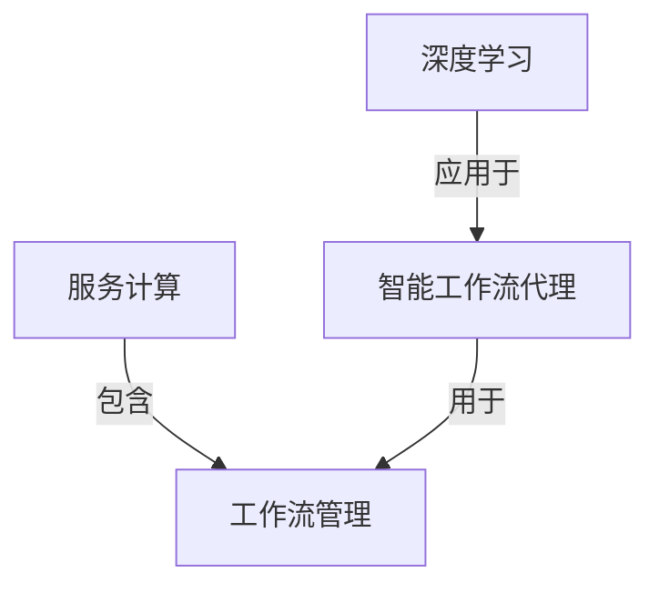

# AI人工智能深度学习算法：面向服务计算中的深度学习代理工作流管理

## 1.背景介绍

### 1.1 服务计算的兴起

随着云计算、物联网和大数据等新兴技术的快速发展,服务计算(Service Computing)作为一种全新的计算范式逐渐兴起。服务计算是一种跨领域的研究领域,旨在设计、开发、部署、运行和维护以服务为中心的系统。在这种范式下,应用程序被构建为可组合的服务,可以通过标准化接口进行访问和集成。

服务计算的核心思想是将应用程序功能封装为独立的、可重用的服务单元,这些服务可以通过标准化协议进行交互和组合,从而实现更加灵活、可扩展和高效的应用程序开发。服务计算为构建复杂的分布式系统提供了一种新的抽象层次,使得系统的设计、开发和维护变得更加简单和高效。

### 1.2 工作流管理在服务计算中的重要性

在服务计算环境中,工作流管理(Workflow Management)扮演着至关重要的角色。工作流是一系列有序的活动,这些活动按照特定的业务逻辑和规则进行组织和执行,以实现特定的业务目标。在服务计算中,工作流管理主要负责协调和管理各个服务之间的交互和执行顺序,确保整个业务流程能够顺利地完成。

传统的工作流管理系统通常采用基于规则或模型的方式来定义和执行工作流,但这种方式往往缺乏灵活性和自适应能力,难以应对复杂的动态环境。因此,在服务计算领域,引入了基于人工智能技术的智能工作流管理方法,旨在提高工作流管理的智能化水平,提升系统的自适应性和灵活性。

### 1.3 深度学习在工作流管理中的应用

深度学习(Deep Learning)是一种基于人工神经网络的机器学习技术,近年来在计算机视觉、自然语言处理、语音识别等领域取得了突破性的进展。深度学习能够从大量数据中自动学习特征表示,并对复杂的非线性映射建模,展现出强大的模式识别和预测能力。

将深度学习技术应用于服务计算中的工作流管理,可以实现智能化的工作流代理(Intelligent Workflow Agent)。智能工作流代理是一种基于深度学习模型的软件代理,能够自主地监控和管理工作流的执行,根据环境变化和用户需求动态调整工作流的执行路径,提高工作流管理的灵活性和自适应能力。

本文将重点探讨如何利用深度学习算法构建智能工作流代理,以实现面向服务计算的高效、智能化的工作流管理。我们将介绍相关的核心概念、算法原理、数学模型,并通过实际案例和代码示例,详细阐述如何在实践中应用这些技术。最后,我们还将讨论该领域的发展趋势和挑战,为读者提供全面的见解和指导。

## 2.核心概念与联系

在深入探讨深度学习在服务计算工作流管理中的应用之前,我们需要先了解一些核心概念及其相互关系。

### 2.1 服务计算(Service Computing)

服务计算是一种以服务为中心的计算范式,旨在设计、开发、部署、运行和维护以服务为中心的系统。在服务计算中,应用程序被构建为可组合的服务单元,这些服务可以通过标准化接口进行访问和集成。服务计算为构建复杂的分布式系统提供了一种新的抽象层次,使得系统的设计、开发和维护变得更加简单和高效。

### 2.2 工作流管理(Workflow Management)

工作流是一系列有序的活动,这些活动按照特定的业务逻辑和规则进行组织和执行,以实现特定的业务目标。工作流管理是指对这些活动的协调和管理,确保整个业务流程能够顺利地完成。在服务计算环境中,工作流管理主要负责协调和管理各个服务之间的交互和执行顺序。

### 2.3 深度学习(Deep Learning)

深度学习是一种基于人工神经网络的机器学习技术,能够从大量数据中自动学习特征表示,并对复杂的非线性映射建模。深度学习展现出强大的模式识别和预测能力,在计算机视觉、自然语言处理、语音识别等领域取得了突破性的进展。

### 2.4 智能工作流代理(Intelligent Workflow Agent)

智能工作流代理是一种基于深度学习模型的软件代理,能够自主地监控和管理工作流的执行。它可以根据环境变化和用户需求动态调整工作流的执行路径,提高工作流管理的灵活性和自适应能力。智能工作流代理将深度学习技术与工作流管理相结合,实现了服务计算中工作流管理的智能化。

上述核心概念之间的关系可以用下图进行总结:

服务计算作为一种新的计算范式,包含了工作流管理这一重要组成部分。深度学习技术被应用于构建智能工作流代理,而智能工作流代理则用于服务计算中的工作流管理,实现智能化的工作流执行和管理。

## 3.核心算法原理具体操作步骤

构建智能工作流代理涉及多种深度学习算法和模型,下面我们将介绍其中的一些核心算法原理和具体操作步骤。

### 3.1 循环神经网络(Recurrent Neural Network, RNN)

#### 3.1.1 算法原理

循环神经网络(RNN)是一种用于处理序列数据的深度学习模型,它能够捕捉输入序列中的时序依赖关系。与传统的前馈神经网络不同,RNN在隐藏层之间引入了循环连接,使得网络能够记住之前的状态,并将其应用于当前的输入。

RNN的核心思想是在每个时间步骤t,将当前输入$x_t$与上一时间步的隐藏状态$h_{t-1}$结合,计算出当前时间步的隐藏状态$h_t$,并基于$h_t$输出当前时间步的预测结果$y_t$。这个过程可以用以下公式表示:

$$
h_t = f(W_{xh}x_t + W_{hh}h_{t-1} + b_h)
$$
$$
y_t = g(W_{hy}h_t + b_y)
$$

其中,$f$和$g$分别是激活函数,如tanh或ReLU;$W_{xh}$、$W_{hh}$和$W_{hy}$是需要学习的权重矩阵;$b_h$和$b_y$是偏置向量。

在处理序列数据时,RNN会逐个时间步骤地更新隐藏状态,并输出相应的预测结果。这种递归的方式使得RNN能够捕捉序列数据中的长期依赖关系,但也容易出现梯度消失或爆炸的问题。

#### 3.1.2 具体操作步骤

1. **准备序列数据**:将输入数据转换为序列形式,例如将文本数据转换为单词或字符序列。

2. **构建RNN模型**:定义RNN模型的层次结构,包括输入层、隐藏层和输出层。根据任务需求选择合适的激活函数和损失函数。

3. **初始化模型参数**:对RNN模型的权重矩阵和偏置向量进行随机初始化。

4. **前向传播**:对于每个时间步骤t,根据公式计算当前隐藏状态$h_t$和输出$y_t$。

5. **计算损失**:将模型输出$y_t$与真实标签进行比较,计算损失函数的值。

6. **反向传播**:通过反向传播算法计算模型参数的梯度。

7. **更新参数**:使用优化算法(如随机梯度下降)根据梯度更新模型参数。

8. **重复训练**:重复执行步骤4-7,直到模型收敛或达到预期性能。

9. **模型评估**:在测试数据集上评估训练好的RNN模型的性能。

10. **模型部署**:将训练好的RNN模型集成到智能工作流代理系统中,用于工作流执行的预测和管理。

循环神经网络适用于处理序列数据,如自然语言处理、时间序列预测等任务。在智能工作流代理中,RNN可以用于预测工作流的执行路径,根据历史执行记录和当前环境信息做出智能决策。

### 3.2 长短期记忆网络(Long Short-Term Memory, LSTM)

#### 3.1.1 算法原理

长短期记忆网络(LSTM)是一种改进的RNN变体,旨在解决传统RNN存在的梯度消失或爆炸问题。LSTM通过引入门控机制(Gate Mechanism)和携带状态(Carrying State),使得网络能够更好地捕捉长期依赖关系。

LSTM的核心思想是在每个时间步骤t,根据当前输入$x_t$、上一时间步的隐藏状态$h_{t-1}$和携带状态$c_{t-1}$,计算出当前时间步的携带状态$c_t$和隐藏状态$h_t$。这个过程由以下公式描述:

$$
f_t = \sigma(W_f \cdot [h_{t-1}, x_t] + b_f) \\ 
i_t = \sigma(W_i \cdot [h_{t-1}, x_t] + b_i) \\
o_t = \sigma(W_o \cdot [h_{t-1}, x_t] + b_o) \\
\tilde{c}_t = \tanh(W_c \cdot [h_{t-1}, x_t] + b_c) \\
c_t = f_t \odot c_{t-1} + i_t \odot \tilde{c}_t \\
h_t = o_t \odot \tanh(c_t)
$$

其中,$\sigma$是sigmoid函数;$f_t$、$i_t$和$o_t$分别是遗忘门(Forget Gate)、输入门(Input Gate)和输出门(Output Gate),控制着信息的流动;$\tilde{c}_t$是候选携带状态(Candidate Carrying State);$c_t$是当前时间步的携带状态,通过门控机制决定保留和丢弃哪些信息;$h_t$是当前时间步的隐藏状态,基于携带状态$c_t$和输出门$o_t$计算得到。

LSTM的门控机制和携带状态使得网络能够有选择地保留和丢弃信息,从而更好地捕捉长期依赖关系,避免梯度消失或爆炸的问题。

#### 3.1.2 具体操作步骤

1. **准备序列数据**:将输入数据转换为序列形式,例如将文本数据转换为单词或字符序列。

2. **构建LSTM模型**:定义LSTM模型的层次结构,包括输入层、LSTM层和输出层。根据任务需求选择合适的激活函数和损失函数。

3. **初始化模型参数**:对LSTM模型的权重矩阵和偏置向量进行随机初始化,包括门控机制和携带状态相关的参数。

4. **前向传播**:对于每个时间步骤t,根据LSTM公式计算当前携带状态$c_t$、隐藏状态$h_t$和输出$y_t$。

5. **计算损失**:将模型输出$y_t$与真实标签进行比较,计算损失函数的值。

6. **反向传播**:通过反向传播算法计算模型参数的梯度,包括门控机制和携带状态相关的参数梯度。

7. **更新参数**:使用优化算法(如随机梯度下降)根据梯度更新模型参数。

8. **重复训练**:重复执行步骤4-7,直到模型收敛或达到预期性能。

9. **模型评估**:在测试数据集上评估训练好的LSTM模型的性能。

10. **模型部署**:将训练好的LSTM模型集成到智能工作流代理系统中,用于工作流执行的预测和管理。

LSTM在处理序列数据时表现出色,特别适用于自然语言处理、时间序列预测等任务