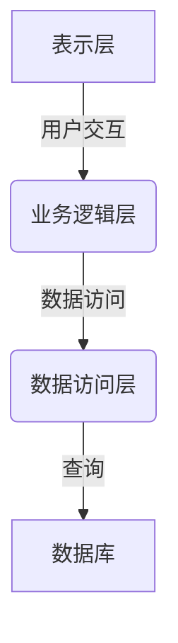
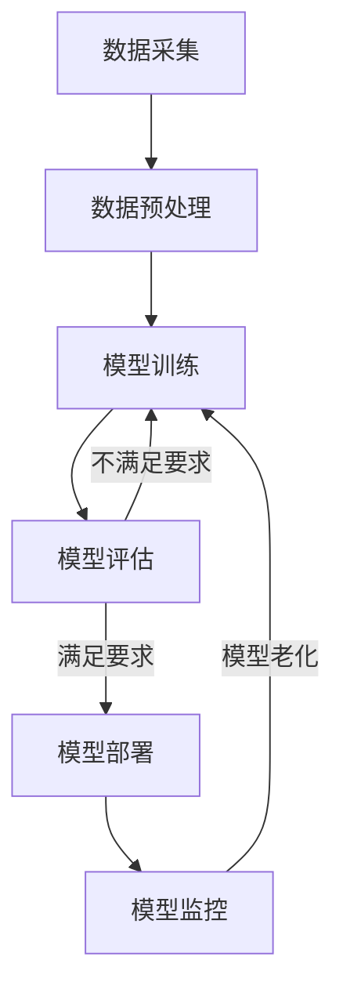

# AI工程最佳实践原理与代码实战案例讲解

## 1.背景介绍

### 1.1 人工智能的兴起与重要性

人工智能(Artificial Intelligence, AI)是当代科技发展的前沿领域,近年来受到了前所未有的关注和重视。随着大数据、云计算、物联网等技术的飞速发展,AI已经渗透到了我们生活和工作的方方面面,为各行各业带来了革命性的变革。无论是智能助手、自动驾驶、医疗诊断,还是金融风控、智能制造,AI都展现出了巨大的应用潜力和价值。

### 1.2 AI工程的重要性

AI工程是将人工智能理论与实践相结合的关键环节,旨在构建高效、可靠、安全的AI系统。良好的AI工程实践可以确保AI系统的性能、可扩展性、鲁棒性和安全性,从而为企业带来竞争优势。反之,糟糕的AI工程实践可能导致系统失效、数据泄露、算法偏差等严重后果。因此,掌握AI工程的最佳实践原理与方法对于AI从业者至关重要。

### 1.3 本文内容概览

本文将全面探讨AI工程的最佳实践原理与代码实战案例,内容包括:核心概念、算法原理、数学模型、项目实践、应用场景、工具资源、发展趋势与挑战等多个方面。我们将深入浅出地解释每个主题,并配以实例代码和案例分析,帮助读者全面掌握AI工程的理论与实操技能。

## 2.核心概念与联系

### 2.1 AI系统架构

#### 2.1.1 传统软件架构

传统软件架构通常采用分层或模块化设计,将系统划分为表示层(UI)、业务逻辑层和数据访问层。这种架构清晰、可维护,但难以满足AI系统的特殊需求。



#### 2.1.2 AI系统架构

AI系统架构需要融合多种技术,如机器学习、深度学习、自然语言处理、计算机视觉等。典型的AI架构包括:数据采集、数据预处理、模型训练、模型评估、模型部署和模型监控等环节。



### 2.2 机器学习核心概念

#### 2.2.1 监督学习

监督学习是机器学习中最常见的范式,它使用标记好的训练数据来学习一个映射函数,从输入映射到期望的输出。监督学习可分为分类(classification)和回归(regression)两种任务。

- 分类: 将输入实例划分到有限的类别中,如垃圾邮件分类、图像识别等。
- 回归: 基于输入预测连续的数值输出,如房价预测、销量预测等。

#### 2.2.2 无监督学习

无监督学习不需要标记数据,它从未标记的原始数据中发现内在模式和结构。常见的无监督学习任务包括聚类(clustering)和降维(dimensionality reduction)。

- 聚类: 根据数据的相似性将其划分为多个簇,如客户细分、基因聚类等。
- 降维: 将高维数据映射到低维空间,以提高可解释性和降低计算复杂度。

#### 2.2.3 强化学习

强化学习是一种基于奖惩机制的学习范式,智能体(agent)通过与环境(environment)交互并获得奖励信号来学习最优策略。强化学习广泛应用于机器人控制、游戏AI、资源调度等领域。

#### 2.2.4 深度学习

深度学习是机器学习的一个子领域,它利用深层神经网络模型从原始数据中自动学习特征表示。深度学习在计算机视觉、自然语言处理、语音识别等领域取得了突破性进展。

### 2.3 AI系统评估指标

评估AI系统的性能和质量是AI工程的重要环节。常用的评估指标包括:

- 准确率(Accuracy): 正确预测的比例
- 精确率(Precision)和召回率(Recall): 用于评估二分类模型
- F1分数: 精确率和召回率的加权平均
- 均方根误差(RMSE): 评估回归模型的预测误差
- 受试者工作特征曲线(ROC)和曲线下面积(AUC): 评估二分类模型的分类性能

除了这些传统指标外,AI系统还需要评估可解释性、公平性、隐私保护、鲁棒性等方面的指标。

## 3.核心算法原理具体操作步骤  

### 3.1 监督学习算法

#### 3.1.1 线性回归

线性回归是最基础的监督学习算法之一,它尝试找到一个最佳拟合的线性方程来描述自变量和因变量之间的关系。线性回归的目标是最小化预测值与实际值之间的均方差。

1. 导入必要的库和数据
2. 将数据集拆分为训练集和测试集
3. 标准化数据(可选)
4. 创建线性回归模型对象
5. 使用训练集训练模型
6. 在测试集上评估模型性能
7. 使用模型进行预测

```python
import numpy as np
from sklearn.linear_model import LinearRegression

# 创建模拟数据
X = np.array([1, 2, 3, 4, 5])
y = np.array([2, 4, 5, 4, 5])

# 创建线性回归模型
model = LinearRegression()

# 训练模型
model.fit(X.reshape(-1, 1), y)

# 预测新数据
new_data = np.array([3, 4])
predictions = model.predict(new_data.reshape(-1, 1))
print(predictions)
```

#### 3.1.2 逻辑回归

逻辑回归是一种广泛应用于分类问题的算法。它使用logistic(对数几率)函数将输入映射到0到1之间的概率值,从而实现二分类或多分类。

1. 导入必要的库和数据
2. 将数据集拆分为训练集和测试集
3. 标准化数据(可选)
4. 创建逻辑回归模型对象
5. 使用训练集训练模型
6. 在测试集上评估模型性能
7. 使用模型进行分类预测

```python
import numpy as np
from sklearn.linear_model import LogisticRegression

# 创建模拟数据
X = np.array([[0.5, 1.5], [1, 1], [1.5, 0.5], [3, 0.5], [2, 2], [1, 2.5]])
y = np.array([0, 0, 0, 1, 1, 1])

# 创建逻辑回归模型
model = LogisticRegression()

# 训练模型
model.fit(X, y)

# 预测新数据
new_data = np.array([[2, 1], [3, 3]])
predictions = model.predict(new_data)
print(predictions)
```

#### 3.1.3 决策树

决策树是一种基于树形结构的监督学习算法,它通过递归地对特征进行分裂来构建决策树模型。决策树可用于分类和回归任务,具有可解释性强、处理非线性数据等优点。

1. 导入必要的库和数据
2. 将数据集拆分为训练集和测试集
3. 创建决策树模型对象
4. 使用训练集训练模型
5. 在测试集上评估模型性能
6. 使用模型进行预测
7. 可视化决策树(可选)

```python
import numpy as np
from sklearn.tree import DecisionTreeClassifier
import matplotlib.pyplot as plt

# 创建模拟数据
X = np.array([[0, 0], [1, 1], [0, 1], [1, 0]])
y = np.array([0, 1, 1, 0])

# 创建决策树模型
model = DecisionTreeClassifier()

# 训练模型
model.fit(X, y)

# 预测新数据
new_data = np.array([[0, 0], [1, 1]])
predictions = model.predict(new_data)
print(predictions)

# 可视化决策树
plt.figure(figsize=(10, 8))
tree.plot_tree(model, filled=True)
plt.show()
```

#### 3.1.4 支持向量机

支持向量机(SVM)是一种基于核技巧的监督学习算法,它通过寻找最大化间隔超平面来实现分类或回归。SVM具有良好的泛化能力,适用于高维数据,并且可以处理非线性问题。

1. 导入必要的库和数据
2. 将数据集拆分为训练集和测试集
3. 标准化数据
4. 创建SVM模型对象
5. 使用训练集训练模型
6. 在测试集上评估模型性能
7. 使用模型进行预测

```python
import numpy as np
from sklearn.svm import SVC
from sklearn.preprocessing import StandardScaler

# 创建模拟数据
X = np.array([[0, 0], [1, 1], [0, 1], [1, 0]])
y = np.array([0, 1, 1, 0])

# 标准化数据
scaler = StandardScaler()
X_scaled = scaler.fit_transform(X)

# 创建SVM模型
model = SVC(kernel='linear')

# 训练模型
model.fit(X_scaled, y)

# 预测新数据
new_data = np.array([[0, 0], [1, 1]])
new_data_scaled = scaler.transform(new_data)
predictions = model.predict(new_data_scaled)
print(predictions)
```

### 3.2 无监督学习算法

#### 3.2.1 K-Means聚类

K-Means是一种简单而流行的聚类算法,它将数据划分为K个聚类,每个数据点被分配到与其最近的聚类中心的簇。

1. 导入必要的库和数据
2. 选择合适的K值(可使用肘部法则)
3. 创建K-Means模型对象
4. 使用数据训练模型
5. 获取聚类标签和聚类中心
6. 可视化聚类结果(可选)

```python
import numpy as np
from sklearn.cluster import KMeans
import matplotlib.pyplot as plt

# 创建模拟数据
X = np.array([[1, 2], [1.5, 1.8], [5, 8], [8, 8], [1, 0.6], [9, 11]])

# 创建K-Means模型
kmeans = KMeans(n_clusters=2)

# 训练模型
kmeans.fit(X)

# 获取聚类标签和聚类中心
labels = kmeans.labels_
centroids = kmeans.cluster_centers_

# 可视化聚类结果
plt.scatter(X[:, 0], X[:, 1], c=labels)
plt.scatter(centroids[:, 0], centroids[:, 1], marker='x', s=200, c='r')
plt.show()
```

#### 3.2.2 主成分分析

主成分分析(PCA)是一种常用的无监督降维技术,它通过线性变换将高维数据投影到低维空间,同时最大化投影后的方差。PCA可用于数据压缩、可视化和去噪。

1. 导入必要的库和数据
2. 标准化数据(可选)
3. 创建PCA模型对象
4. 使用数据训练模型
5. 将数据投影到低维空间
6. 可视化降维结果(可选)

```python
import numpy as np
from sklearn.decomposition import PCA
import matplotlib.pyplot as plt

# 创建模拟数据
X = np.array([[1, 2, 3], [4, 5, 6], [7, 8, 9], [10, 11, 12]])

# 创建PCA模型
pca = PCA(n_components=2)

# 训练模型
X_pca = pca.fit_transform(X)

# 可视化降维结果
plt.scatter(X_pca[:, 0], X_pca[:, 1])
plt.show()
```

### 3.3 深度学习算法

#### 3.3.1 前馈神经网络

前馈神经网络(Feedforward Neural Network, FNN)是深度学习中最基本的网络结构,它由多个全连接层组成,每层的输出作为下一层的输入。FNN可用于分类、回归等任务。

1. 导入必要的库和数据
2. 将数据集拆分为训练集和测试集
3. 标准化数据
4. 定义网络结构
5. 编译模型
6.