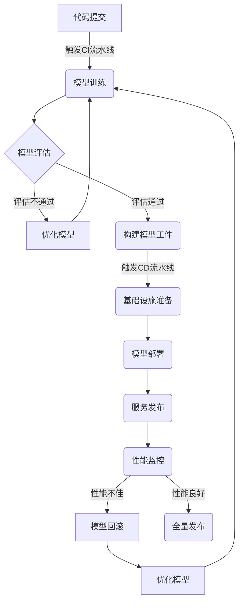

# AI系统DevOps原理与代码实战案例讲解

## 1.背景介绍

### 1.1 什么是DevOps

DevOps是一种文化理念、运动和实践,旨在通过自动化软件交付和基础设施管理过程来缩短软件开发生命周期。它倡导开发人员(Dev)和运维人员(Ops)之间的协作和沟通,打破传统上这两个部门之间的壁垒。DevOps的核心思想是将软件开发、测试、部署和运维全流程无缝集成,实现持续集成、持续交付和持续部署。

### 1.2 为什么需要AI系统DevOps

随着人工智能系统的复杂性不断增加,传统的软件开发和部署方式已经无法满足AI系统的需求。AI系统通常需要大量的计算资源、数据处理能力和模型训练迭代,这对基础设施和运维带来了巨大挑战。同时,AI系统的开发周期也更加频繁和动态,需要快速响应业务需求的变化。

DevOps为AI系统的开发、部署和运维提供了一种高效、可靠和可扩展的解决方案。通过自动化和协作,DevOps可以加速AI系统的交付速度,提高系统的可靠性和稳定性,并优化资源利用率。

## 2.核心概念与联系  

### 2.1 持续集成(Continuous Integration)

持续集成(CI)是DevOps的核心实践之一,它确保代码变更可以被频繁地构建、测试和合并到共享代码库中。对于AI系统来说,持续集成可以自动化模型训练、评估和打包过程,确保每次代码提交都能生成可部署的模型工件。

### 2.2 持续交付(Continuous Delivery)

持续交付(CD)紧随持续集成,它确保可部署的软件工件可以被快速、安全地发布到生产环境中。对于AI系统,持续交付可以自动化模型部署、监控和更新过程,确保最新的模型可以及时投入生产使用。

### 2.3 基础设施即代码(Infrastructure as Code)

基础设施即代码(IaC)是DevOps的另一个核心实践,它将基础设施资源(如虚拟机、网络、存储等)定义为可版本化和可重复的代码。对于AI系统,IaC可以自动化基础设施资源的供给和管理,确保AI系统可以在不同环境中一致地运行。

### 2.4 微服务架构

微服务架构是一种将应用程序拆分为小型、独立的服务的架构模式。对于AI系统,微服务架构可以将不同的AI模型或组件解耦,提高系统的灵活性和可扩展性。同时,微服务架构也更利于DevOps实践的落地,如自动化测试、持续交付和监控等。

### 2.5 监控和日志管理

监控和日志管理是DevOps中不可或缺的一部分,它们为系统的运行状态和性能提供了可见性和可追溯性。对于AI系统,监控和日志管理可以帮助跟踪模型的训练过程、推理性能和资源利用情况,及时发现和解决问题。

### 2.6 DevOps工具链

DevOps工具链包括了支持DevOps实践的各种工具,如版本控制系统(Git)、构建工具(Maven、Gradle)、容器化工具(Docker)、配置管理工具(Ansible、Terraform)、持续集成工具(Jenkins)、监控工具(Prometheus)等。这些工具的集成和自动化是实现AI系统DevOps的关键。

## 3.核心算法原理具体操作步骤

AI系统DevOps的核心算法原理主要体现在以下几个方面:

### 3.1 模型训练和评估

模型训练和评估是AI系统开发的核心环节,它包括以下步骤:

1. **数据准备**: 收集和清洗训练数据,进行必要的预处理和增强。
2. **模型构建**: 选择合适的机器学习算法和框架,构建初始模型。
3. **模型训练**: 使用训练数据对模型进行训练,优化模型参数。
4. **模型评估**: 使用验证数据集评估模型的性能,计算相关指标。
5. **模型调优**: 根据评估结果,调整模型超参数或架构,重复训练和评估。
6. **模型保存**: 将最终模型保存为可部署的工件。

这个过程可以通过自动化流水线来实现,如使用Kubeflow或TensorFlow Extended(TFX)等工具。

### 3.2 模型部署和服务

将训练好的模型部署到生产环境中,并对外提供服务,主要包括以下步骤:

1. **模型打包**: 将模型及其依赖项打包为可部署的工件。
2. **基础设施准备**: 使用IaC工具准备好部署所需的计算资源和环境。
3. **模型部署**: 将模型工件部署到目标环境中,如容器化部署或无服务器部署。
4. **服务发布**: 发布模型服务的API接口,供上游应用调用。
5. **服务监控**: 监控模型服务的性能、资源利用情况和错误日志。
6. **服务扩缩容**: 根据负载情况自动扩缩容模型服务的实例数。

这个过程可以使用Kubernetes、Docker等容器技术,结合Istio等服务网格来实现。

### 3.3 模型更新和回滚

AI系统需要持续优化和更新模型,以适应新的数据和业务需求。模型更新和回滚的步骤如下:

1. **新模型训练**: 使用新的数据集或优化后的算法,重新训练出新的模型版本。
2. **模型测试**: 在测试环境中部署和测试新模型,评估其性能和稳定性。
3. **灰度发布**: 将新模型以灰度发布的方式逐步推送到生产环境中。
4. **性能监控**: 密切监控新模型在生产环境中的表现。
5. **全量发布或回滚**: 根据监控数据,决定是全量发布新模型,还是回滚到旧版本。

这个过程可以使用Istio等服务网格工具来实现流量控制和版本管理。

### 3.4 AI系统DevOps工作流程

将上述步骤整合起来,AI系统DevOps的完整工作流程如下:



上图展示了AI系统DevOps的完整流程,包括模型训练、评估、部署、监控和更新等环节。通过自动化流水线和工具链的支持,DevOps可以显著提高AI系统的交付效率和质量。

## 4.数学模型和公式详细讲解举例说明

在AI系统中,数学模型和公式扮演着至关重要的角色。以下是一些常见的数学模型和公式,以及它们在AI系统中的应用:

### 4.1 线性回归

线性回归是一种常见的监督学习算法,用于预测连续值的目标变量。它的数学模型如下:

$$y = \theta_0 + \theta_1x_1 + \theta_2x_2 + ... + \theta_nx_n$$

其中$y$是目标变量,$x_i$是特征变量,$\theta_i$是模型参数。

训练过程是通过最小化损失函数(如均方误差)来优化模型参数$\theta$:

$$\min_\theta \sum_{i=1}^m (y^{(i)} - \hat{y}^{(i)})^2$$

线性回归在许多领域有应用,如股票价格预测、销售额预测等。

### 4.2 逻辑回归

逻辑回归是一种用于分类问题的算法,它的数学模型如下:

$$\hat{y} = \sigma(\theta^T x) = \frac{1}{1 + e^{-\theta^T x}}$$

其中$\sigma$是sigmoid函数,将线性模型的输出映射到(0,1)范围内,作为预测类别的概率。

训练过程是通过最大化似然函数(或等价地最小化交叉熵损失)来优化模型参数$\theta$:

$$\max_\theta \prod_{i=1}^m p(y^{(i)}|x^{(i)};\theta)$$

逻辑回归广泛应用于二分类问题,如垃圾邮件检测、疾病诊断等。

### 4.3 神经网络

神经网络是一种强大的机器学习模型,可以用于回归、分类、clustering等多种任务。一个典型的全连接神经网络可以表示为:

$$
\begin{aligned}
a^{(0)} &= x \\
z^{(l)} &= W^{(l)}a^{(l-1)} + b^{(l)} \\
a^{(l)} &= g^{(l)}(z^{(l)})
\end{aligned}
$$

其中$a^{(l)}$是第$l$层的激活值,$z^{(l)}$是第$l$层的加权输入,$W^{(l)}$和$b^{(l)}$分别是第$l$层的权重和偏置,$g^{(l)}$是第$l$层的激活函数。

神经网络的训练过程是通过反向传播算法来优化网络参数,最小化损失函数(如交叉熵损失或均方误差)。

神经网络在计算机视觉、自然语言处理、推荐系统等领域有广泛应用。

### 4.4 聚类算法

聚类算法是一种无监督学习方法,用于将数据划分为多个簇。其中,K-Means是一种常见的聚类算法,其目标是最小化簇内样本到簇中心的距离平方和:

$$\min_{\mu_1,...,\mu_K} \sum_{i=1}^m \sum_{k=1}^K r_{ik} \left\|x^{(i)} - \mu_k\right\|^2$$

其中$\mu_k$是第$k$个簇的中心,$r_{ik}$是指示变量,表示样本$x^{(i)}$是否属于第$k$个簇。

K-Means算法通过迭代的方式优化簇中心$\mu_k$,直到收敛。它广泛应用于客户细分、图像分割等场景。

以上只是数学模型和公式在AI系统中应用的一小部分示例,在实际应用中还有许多其他模型和算法,如决策树、支持向量机、贝叶斯模型、深度学习模型等。选择合适的模型和算法对AI系统的性能至关重要。

## 5.项目实践:代码实例和详细解释说明

为了更好地理解AI系统DevOps的实践,我们将通过一个基于TensorFlow的图像分类项目来进行说明。

### 5.1 项目概述

该项目旨在构建一个图像分类模型,可以识别10种不同的物体(如汽车、飞机、狗等)。我们将使用CIFAR-10数据集进行模型训练和评估。

项目的主要步骤包括:

1. 数据准备
2. 模型构建
3. 模型训练
4. 模型评估
5. 模型导出
6. 模型部署
7. 模型服务

### 5.2 代码实现

#### 5.2.1 数据准备

```python
import tensorflow as tf

# 加载CIFAR-10数据集
(x_train, y_train), (x_test, y_test) = tf.keras.datasets.cifar10.load_data()

# 数据预处理
x_train = x_train.astype('float32') / 255.0
x_test = x_test.astype('float32') / 255.0

# 转换标签为one-hot编码
y_train = tf.keras.utils.to_categorical(y_train, 10)
y_test = tf.keras.utils.to_categorical(y_test, 10)
```

上述代码加载CIFAR-10数据集,并对图像数据进行归一化预处理,同时将标签转换为one-hot编码格式。

#### 5.2.2 模型构建

```python
from tensorflow.keras.models import Sequential
from tensorflow.keras.layers import Conv2D, MaxPooling2D, Flatten, Dense, Dropout

# 构建模型
model = Sequential([
    Conv2D(32, (3, 3), activation='relu', input_shape=(32, 32, 3)),
    MaxPooling2D((2, 