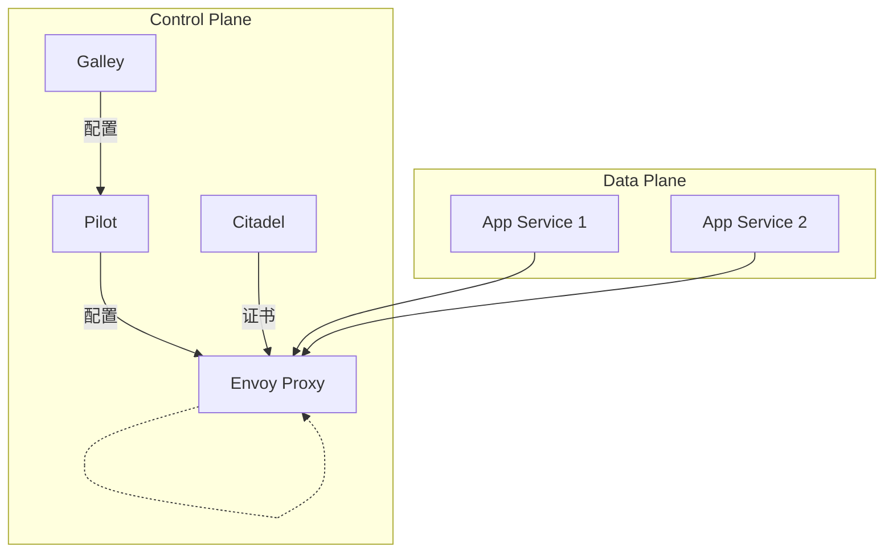

# AI系统Istio原理与代码实战案例讲解

## 1.背景介绍

### 1.1 微服务架构的兴起

随着云计算和容器技术的快速发展,微服务架构逐渐取代传统的单体应用成为构建现代分布式系统的主导架构模式。与单体应用相比,微服务架构将整个系统拆分为多个小型、独立的服务,每个服务专注于完成一个独立的业务功能,服务之间通过轻量级通信机制(如HTTP/gRPC)进行通信和集成。这种架构模式提高了系统的可维护性、可扩展性和敏捷性,但同时也带来了一系列新的挑战,如服务发现、流量管理、安全性、可观测性等。

### 1.2 Service Mesh的概念

为了应对微服务架构带来的复杂性挑战,Service Mesh(服务网格)应运而生。Service Mesh作为一个专用的基础设施层,负责处理服务间通信的各种问题,如服务发现、负载均衡、流量管理、安全性、可观测性等,让开发人员能够专注于业务逻辑的开发,而不必过多关注基础设施的细节。

Service Mesh通常由一组轻量级的网络代理(如Envoy)组成,这些代理作为sidecar部署在同一个基础设施(如Kubernetes Pod)中,拦截并处理服务间的所有网络流量。Service Mesh还包括一个控制平面,负责配置和管理这些代理。

### 1.3 Istio简介

Istio是当前最流行的开源Service Mesh解决方案,由Google、IBM、Lyft等公司共同开发和维护。Istio提供了一个完整的解决方案,涵盖了微服务所需的各种功能,如流量管理、安全性、可观测性等。Istio可以无缝集成到各种环境中,包括Kubernetes、虚拟机、裸机等,并支持各种编程语言和协议。

## 2.核心概念与联系

### 2.1 Istio架构

Istio采用了经典的控制平面和数据平面分离的架构设计,如下图所示:



- **控制平面(Control Plane)**
  - **Pilot**：Pilot是Istio的核心组件,负责生成并分发配置给数据平面的Envoy代理。它监视Istio配置的变化,并将新配置推送到Envoy实例。
  - **Galley**：Galley负责验证和处理Istio配置,并将配置推送给其他控制平面组件。
  - **Citadel**：Citadel负责证书的生成、分发和轮换,为服务间的安全通信提供支持。

- **数据平面(Data Plane)**
  - **Envoy Proxy**：Envoy是一个高性能的代理,作为sidecar部署在每个服务实例中。它拦截并处理服务间的所有网络流量,并根据控制平面的配置执行各种功能,如流量管理、安全性、可观测性等。

### 2.2 核心功能

Istio提供了以下核心功能:

- **流量管理**：通过丰富的流量路由规则,Istio能够轻松实现版本路由、金丝雀发布、故障注入等功能,帮助提高系统的可靠性和可用性。
- **安全性**：Istio通过双向TLS和基于角色的访问控制(RBAC)来保证服务间通信的安全性,防止数据泄露和未经授权的访问。
- **可观测性**：Istio内置了分布式追踪、监控和日志记录功能,让运维人员能够深入了解系统的运行状态和性能。
- **策略执行**：Istio支持基于各种属性(如服务标签、IP地址等)执行策略,如限流、重试、超时等,提供了灵活的流量控制能力。

## 3.核心算法原理具体操作步骤

### 3.1 Envoy代理

Envoy是Istio数据平面的核心,它是一个高性能的代理,采用了C++编写,支持多种协议(HTTP、gRPC、TCP等)。Envoy的主要功能包括:

- **服务发现**：通过服务发现机制(如Kubernetes API、Consul等)发现上游服务实例。
- **负载均衡**：根据配置的负载均衡策略(如轮询、最小请求等)将流量分发到上游服务实例。
- **路由**：根据路由规则(如URI前缀、Header等)将请求路由到合适的上游服务。
- **健康检查**：定期检查上游服务实例的健康状态,剔除不健康的实例。
- **重试**：根据配置的重试策略自动重试失败的请求。
- **超时**：根据配置的超时时间中止长时间未响应的请求。
- **断路器**：根据配置的断路器策略(如连续错误数、错误率等)自动熔断不健康的上游服务。
- **TLS终止**：终止TLS连接,实现安全的服务通信。
- **指标收集**：收集并暴露各种指标(如请求数、延迟等),供监控系统采集。

Envoy的工作流程如下:

1. 客户端发送请求到Envoy。
2. Envoy根据配置的路由规则选择合适的上游服务集群。
3. 根据负载均衡策略选择一个健康的上游服务实例。
4. 将请求转发到上游服务实例。
5. 上游服务实例处理请求并返回响应。
6. Envoy根据配置执行各种策略(如重试、超时、断路器等)。
7. Envoy将响应返回给客户端。

### 3.2 控制平面组件

Istio的控制平面组件负责生成并分发配置给数据平面的Envoy代理。

**Pilot**是控制平面的核心组件,它的主要职责包括:

1. **服务发现**：从服务注册中心(如Kubernetes API)获取服务实例信息。
2. **配置转换**：将高级配置(如虚拟服务、目标规则等)转换为Envoy可识别的低级配置。
3. **配置分发**：将配置分发给数据平面的Envoy实例。
4. **证书分发**：从Citadel获取证书,并分发给Envoy实例,用于建立mTLS连接。

**Galley**负责验证和处理Istio配置,并将配置推送给Pilot。它支持从多个源(如Kubernetes API、文件等)获取配置,并进行合并和转换。

**Citadel**负责证书的生成、分发和轮换。它通过Kubernetes的Secret资源将证书分发给Envoy实例,用于建立mTLS连接。

### 3.3 流量管理

Istio通过以下两种资源对象来实现流量管理:

- **虚拟服务(VirtualService)**：定义路由规则,控制请求如何路由到目标服务。
- **目标规则(DestinationRule)**：定义目标服务的策略,如负载均衡策略、连接池大小等。

下面是一个虚拟服务的示例,它定义了两条路由规则:

- 当请求URI以`/user`开头时,将请求路由到`user`服务的`v1`版本。
- 其他请求则路由到`user`服务的`v2`版本。

```yaml
apiVersion: networking.istio.io/v1alpha3
kind: VirtualService
metadata:
  name: user-routes
spec:
  hosts:
  - user.company.com
  http:
  - route:
    - destination:
        host: user.company.com
        subset: v1
      weight: 100
    match:
    - uri:
        prefix: /user
  - route:
    - destination:
        host: user.company.com
        subset: v2
```

下面是一个目标规则的示例,它为`user`服务的`v1`和`v2`版本定义了不同的负载均衡策略:

```yaml
apiVersion: networking.istio.io/v1alpha3
kind: DestinationRule
metadata:
  name: user-destination
spec:
  host: user.company.com
  subsets:
  - name: v1
    labels:
      version: v1
    trafficPolicy:
      loadBalancer:
        simple: ROUND_ROBIN
  - name: v2
    labels:
      version: v2
    trafficPolicy:
      loadBalancer:
        simple: LEAST_CONN
```

通过组合使用虚拟服务和目标规则,Istio能够实现丰富的流量管理功能,如版本路由、金丝雀发布、故障注入等。

## 4.数学模型和公式详细讲解举例说明

在讨论Istio的流量管理功能时,我们不可避免地需要涉及一些数学模型和公式。下面我们将详细介绍其中的一些重要概念。

### 4.1 负载均衡算法

负载均衡是一种将工作负载均匀分布到多个资源上的技术,以提高系统的性能和可用性。Istio支持多种负载均衡算法,包括:

- **轮询(ROUND_ROBIN)**:将请求按顺序均匀分发到每个实例。
- **最小连接数(LEAST_CONN)**:将请求发送到活跃连接数最少的实例。
- **随机(RANDOM)**:将请求随机分发到实例。
- **加权(WEIGHTED)**:根据预定义的权重将请求分发到实例。

我们以轮询算法为例,介绍其数学模型。假设有$n$个实例$\{I_1, I_2, \dots, I_n\}$,请求序列为$\{R_1, R_2, \dots, R_m\}$,则轮询算法的数学模型可表示为:

$$
f(R_i) = I_{(i \bmod n) + 1}
$$

其中,$f(R_i)$表示将请求$R_i$分发到的实例。这个模型保证了请求会按顺序均匀地分发到每个实例上。

### 4.2 连接池管理

连接池是一种重用已建立的连接的技术,可以减少频繁建立和关闭连接的开销,提高系统性能。Istio中的Envoy代理使用连接池来管理与上游服务的连接。

连接池的大小需要根据实际情况进行调优。过小的连接池会导致连接不足,影响性能;过大的连接池则会浪费系统资源。一般来说,连接池的大小应该根据并发连接数和连接的生命周期进行设置。

假设系统的最大并发连接数为$C$,连接的平均生命周期为$T$,则连接池的大小$P$可以根据下式计算:

$$
P = C \times T
$$

例如,如果系统的最大并发连接数为1000,连接的平均生命周期为10秒,则连接池的大小应该设置为10000。

### 4.3 熔断器模型

熔断器是一种应用程序级的容错机制,用于防止级联故障和保护系统的稳定性。当服务出现故障时,熔断器会自动切断与该服务的连接,防止新的请求被阻塞,从而保护系统的可用性。

Istio中的Envoy代理内置了熔断器功能,可以根据配置的断路规则自动切断与不健康的上游服务的连接。断路规则通常包括以下几个参数:

- **连续错误数**:连续发生多少次错误后触发熔断。
- **错误率**:在一段时间内,错误请求占总请求数的比例超过多少时触发熔断。
- **最小请求数**:在一段时间内,至少需要多少个请求才能计算错误率。

假设在一段时间$T$内,总请求数为$N$,错误请求数为$E$,连续错误数阈值为$C_e$,错误率阈值为$R_e$,最小请求数阈值为$M_r$,则熔断器的数学模型可表示为:

$$
\text{Trigger Breaker} = \begin{cases}
\text{True}, & \text{if } E \geq C_e \text{ or } (N \geq M_r \text{ and } \frac{E}{N} \geq R_e) \\
\text{False}, & \text{otherwise}
\end{cases}
$$

如果满足上述任一条件,熔断器将被触发,切断与上游服务的连接。

通过合理配置这些参数,熔断器可以有效地防止级联故障,提高系统的可用性和稳定性。

## 4.项目实践:代码实例和详细解释说明

为了更好地理解Istio的