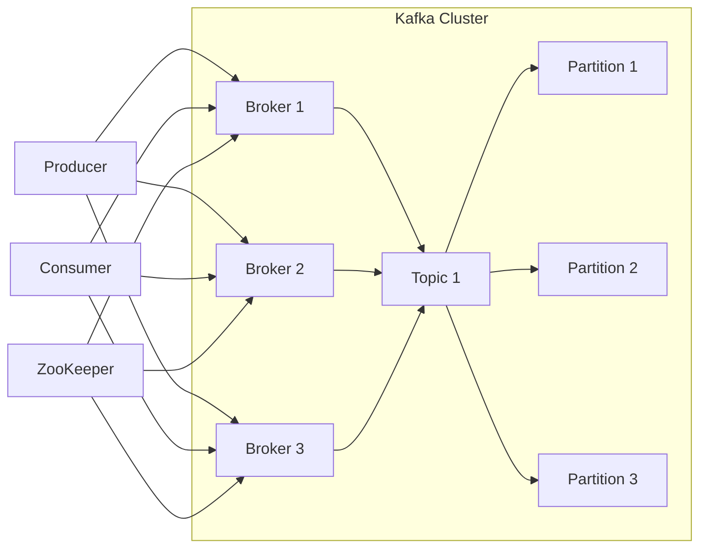

# AI系统Kafka原理与代码实战案例讲解

## 1.背景介绍

### 1.1 什么是Kafka

Apache Kafka是一个分布式流处理平台。它是一个可扩展、高吞吐量、容错的分布式发布-订阅消息系统。Kafka最初是由LinkedIn公司开发,后来被捐赠给Apache软件基金会,成为了一个开源项目。

Kafka被广泛应用于大数据领域,用于构建实时数据管道和流应用程序。它可以实时地从多个数据源获取数据,并将其持久化到磁盘,然后再将数据分发给处理程序或应用程序。

### 1.2 Kafka的应用场景

Kafka可以应用于以下几种场景:

- **消息队列**: Kafka可以用作传统消息队列的替代品,用于异步通信和解耦生产者和消费者。
- **网站活动跟踪**: Kafka可以用于收集和处理网站上的用户活动数据,如页面浏览、搜索查询等。
- **métrica收集**: Kafka可以用于收集和处理大量的运营监控数据。
- **日志收集**: Kafka可以用于收集和处理分布式系统中的日志数据。
- **流处理**: Kafka可以用于构建实时流处理应用程序,如实时监控、实时分析等。
- **事件源(Event Sourcing)**: Kafka可以用于实现事件源模式,将系统的状态变化存储为一系列不可变的事件。

### 1.3 Kafka的优势

Kafka相对于传统消息队列系统具有以下优势:

- **高吞吐量**: Kafka可以支持每秒百万级别的消息传输。
- **可扩展性**: Kafka可以轻松地通过添加更多的机器来扩展系统。
- **持久性**: Kafka将消息持久化到磁盘,因此可以容忍节点故障。
- **容错性**: Kafka支持自动故障转移和数据复制,确保高可用性。
- **高并发性**: Kafka支持并行数据处理,可以有效利用消费者的计算能力。

## 2.核心概念与联系

### 2.1 Kafka架构

Kafka架构由以下几个核心组件组成:

1. **Producer(生产者)**: 发布消息到Kafka集群的客户端进程。
2. **Consumer(消费者)**: 从Kafka集群中拉取消息并进行处理的客户端进程。
3. **Broker(代理)**: Kafka集群中的服务器节点,负责存储和管理消息。
4. **Topic(主题)**: Kafka中的消息类别,每个Topic由一个或多个Partition组成。
5. **Partition(分区)**: Topic的一个逻辑分区,每个Partition只属于一个Broker。
6. **Replica(副本)**: Partition的一个副本,用于实现数据冗余和容错。
7. **Zookeeper**: 用于管理和协调Kafka集群中的Broker。

下面是Kafka架构的示意图:



### 2.2 核心概念详解

1. **Producer(生产者)**:生产者是向Kafka集群发布消息的客户端进程。生产者将消息发送到指定的Topic中,并由Kafka集群负责将消息持久化到磁盘。生产者可以选择将消息发送到Topic的特定Partition中,或者由Kafka自动平衡分配。

2. **Consumer(消费者)**:消费者是从Kafka集群中拉取消息并进行处理的客户端进程。消费者可以订阅一个或多个Topic,并从Topic的Partition中拉取消息。消费者可以组成一个消费者组(Consumer Group),并在组内实现消息的负载均衡。

3. **Broker(代理)**:Broker是Kafka集群中的服务器节点,负责存储和管理消息。每个Broker可以管理多个Topic的Partition。Broker接收来自生产者的消息,并将其持久化到磁盘。同时,Broker也负责将消息分发给消费者。

4. **Topic(主题)**:Topic是Kafka中的消息类别,用于对消息进行分类和组织。每个Topic由一个或多个Partition组成。生产者将消息发布到指定的Topic中,消费者从Topic中拉取消息进行处理。

5. **Partition(分区)**:Partition是Topic的一个逻辑分区,每个Partition只属于一个Broker。Partition用于实现消息的并行处理和负载均衡。消息在Partition内按照顺序存储,每个消息都有一个唯一的偏移量(Offset)。

6. **Replica(副本)**:Replica是Partition的一个副本,用于实现数据冗余和容错。每个Partition可以有多个Replica,其中一个Replica被选举为Leader,其他Replica为Follower。Leader负责处理生产者和消费者的请求,Follower从Leader复制数据。

7. **Zookeeper**:Zookeeper是一个分布式协调服务,用于管理和协调Kafka集群中的Broker。Zookeeper负责存储Broker、Topic、Partition等元数据信息,并监控Broker的状态。当Broker出现故障时,Zookeeper会协调选举新的Leader。

### 2.3 Kafka工作流程

Kafka的工作流程如下:

1. **生产者发送消息**:生产者将消息发送到指定的Topic中。如果指定了Partition,则消息会被发送到该Partition;否则,Kafka会根据分区策略自动选择一个Partition。

2. **Broker接收消息**:Broker接收到生产者发送的消息,并将其持久化到磁盘上对应Partition的日志文件中。

3. **消费者拉取消息**:消费者向Broker请求拉取指定Topic和Partition的消息。Broker将消息发送给消费者。

4. **消费者处理消息**:消费者接收到消息后,进行相应的处理逻辑。

5. **消费者提交偏移量**:消费者处理完消息后,需要向Kafka提交已消费的消息的偏移量,以便下次继续从该位置开始消费。

6. **副本同步**:Leader会将消息同步到所有的Follower副本,以确保数据的冗余和容错。

7. **故障转移**:如果Leader出现故障,Zookeeper会协调选举一个新的Leader,并将所有Follower重新分配给新的Leader。

## 3.核心算法原理具体操作步骤

### 3.1 生产者发送消息

生产者发送消息的核心算法原理如下:

1. **选择分区**:生产者需要确定将消息发送到哪个分区。有以下几种选择分区的策略:
   - 手动指定分区
   - 基于键(Key)的哈希分区
   - 轮询分区

2. **序列化消息**:生产者将消息序列化为字节数组,以便进行网络传输。

3. **选择Leader Broker**:生产者需要确定要将消息发送到哪个Broker。它会从Zookeeper获取Topic的元数据信息,包括每个分区的Leader Broker信息。

4. **发送消息**:生产者将序列化后的消息发送到对应分区的Leader Broker。

5. **等待响应**:生产者等待Broker的响应,确认消息是否已成功写入。

6. **重试或失败**:如果发送失败,生产者可以重试发送或记录错误日志。

下面是生产者发送消息的伪代码:

```python
def send_message(topic, key, value):
    # 1. 选择分区
    partition = choose_partition(topic, key)

    # 2. 序列化消息
    serialized_message = serialize(key, value)

    # 3. 选择Leader Broker
    leader_broker = get_leader_broker(topic, partition)

    # 4. 发送消息
    send_to_broker(leader_broker, topic, partition, serialized_message)

    # 5. 等待响应
    response = wait_for_response()

    # 6. 重试或失败
    if response.success:
        return
    else:
        retry_or_fail()
```

### 3.2 消费者拉取消息

消费者拉取消息的核心算法原理如下:

1. **加入消费者组**:消费者需要加入一个消费者组,以实现消息的负载均衡。

2. **订阅Topic**:消费者订阅感兴趣的Topic。

3. **获取分区分配**:消费者组中的消费者协调器(Coordinator)会为每个消费者分配一部分分区。

4. **发送拉取请求**:消费者向分配给它的分区的Leader Broker发送拉取请求,请求拉取消息。

5. **处理消息**:消费者处理从Broker接收到的消息。

6. **提交偏移量**:消费者处理完消息后,需要向Broker提交已消费的消息的偏移量。

下面是消费者拉取消息的伪代码:

```python
def consume_messages(topic):
    # 1. 加入消费者组
    consumer_group = join_consumer_group()

    # 2. 订阅Topic
    subscribe_to_topic(consumer_group, topic)

    # 3. 获取分区分配
    assigned_partitions = get_assigned_partitions(consumer_group)

    while True:
        # 4. 发送拉取请求
        for partition in assigned_partitions:
            messages = fetch_messages(partition)

            # 5. 处理消息
            for message in messages:
                process_message(message)

            # 6. 提交偏移量
            commit_offsets(partition)
```

### 3.3 Broker存储消息

Broker存储消息的核心算法原理如下:

1. **接收消息**:Broker接收到生产者发送的消息。

2. **写入日志文件**:Broker将消息追加写入到对应分区的日志文件中。

3. **增加偏移量**:Broker为写入的消息分配一个唯一的偏移量。

4. **同步到副本**:Leader Broker将消息同步到所有的Follower副本。

5. **发送响应**:Leader Broker向生产者发送响应,确认消息已成功写入。

6. **日志压缩**:Broker定期对日志文件进行压缩,以节省磁盘空间。

下面是Broker存储消息的伪代码:

```python
def handle_produce_request(topic, partition, message):
    # 1. 接收消息
    received_message = receive_message(message)

    # 2. 写入日志文件
    offset = append_to_log(topic, partition, received_message)

    # 3. 增加偏移量
    increment_offset(topic, partition, offset)

    # 4. 同步到副本
    replicate_to_followers(topic, partition, received_message)

    # 5. 发送响应
    send_response(offset)

    # 6. 日志压缩
    periodically_compress_logs()
```

## 4.数学模型和公式详细讲解举例说明

### 4.1 分区分配算法

Kafka在消费者组内使用一种称为"Range Partitioning"的分区分配算法,以确保分区被均匀分配给消费者。

假设有一个Topic有N个分区,消费者组有C个消费者,则每个消费者平均应该被分配 $N/C$ 个分区。具体分配过程如下:

1. 将所有分区按照分区ID排序,形成一个有序列表。
2. 将消费者按照某种规则(例如消费者ID的哈希值)排序,形成一个有序列表。
3. 将有序的分区列表"环形"成一个圆环。
4. 将有序的消费者列表也"环形"成一个圆环,并均匀分布在分区圆环上。
5. 每个消费者被分配到它所在位置顺时针方向上的一系列连续分区。

下面是一个示例,假设有一个Topic有6个分区,消费者组有3个消费者:

```
           +-------+
           | P5    |
           +-------+
             ^     
             |     
   +-------+ |     
   | C2    |-+     
   +-------+       
     ^              
     |              
     |              
+-------+        +-------+
| P0    |        | P3    |
+-------+        +-------+
     ^              ^
     |              |
   +-------+      +-------+
   | C0    |      | C1    |
   +-------+      +-------+
     |              |
     |              |
+-------+        +-------+
| P1    |        | P4    |
+-------+        +-------+
     |
     v
+-------+
| P2    |
+