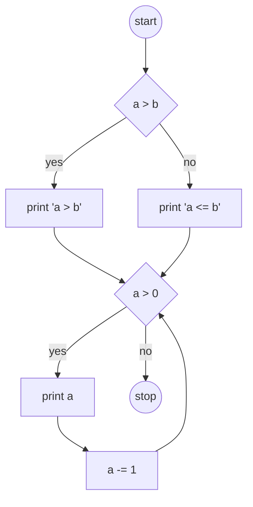

# AI系统可维护性原理与代码实战案例讲解

作者：禅与计算机程序设计艺术

## 1. 背景介绍

### 1.1 AI系统可维护性的重要性

随着人工智能技术的快速发展,AI系统日益复杂化,其可维护性问题日益突出。一个优秀的AI系统不仅要有良好的性能,更要易于维护和扩展。可维护性差的AI系统会导致后续开发和维护成本急剧增加,甚至完全无法维护。因此,AI系统的可维护性已经成为衡量其质量的关键指标之一。

### 1.2 AI系统可维护性面临的挑战

AI系统可维护性面临诸多挑战:

- 算法复杂度高,可解释性差
- 系统模块耦合度高,职责划分不清晰 
- 缺乏统一的架构设计和编码规范
- 数据依赖关系复杂,数据质量参差不齐
- 缺乏完善的文档和注释

这些问题导致AI系统难以理解、难以修改、难以测试,严重影响了可维护性。本文将从概念原理到实战案例,系统阐述如何提升AI系统的可维护性。

## 2. 核心概念与联系

### 2.1 可维护性的定义

软件可维护性指软件产品在修改时保持其物理特性和功能特性的能力,修改可能包括更正错误、改进性能或其他属性、或适应变化了的环境。可维护性是ISO/IEC 25010软件质量模型的8大特性之一。

### 2.2 影响可维护性的因素

影响软件可维护性的因素主要有:

- 模块化:将系统划分为高内聚低耦合的模块
- 可读性:代码风格统一,命名规范,注释完备 
- 可理解性:架构清晰,职责分明,逻辑简单
- 可测试性:代码可单元测试,容易写测试用例
- 文档:架构、接口、部署文档齐全

### 2.3 可维护性与其他特性的关系

可维护性与软件其他质量特性密切相关:

- 可维护性和可读性相辅相成,代码可读性越好,越容易理解和维护
- 可维护性有赖于可扩展性,架构可扩展,新功能开发才能不破坏原有逻辑
- 可维护性源于可测试性,代码可测试,出问题才能快速定位和修复
- 可维护性促进可靠性,频繁发布可靠的修复补丁,系统才能可用

## 3. 核心算法原理具体操作步骤

### 3.1 代码静态分析

通过静态代码扫描工具分析代码的可维护性,主要检查项包括:

1. 圈复杂度:圈复杂度越高,代码逻辑越复杂,可维护性越差
2. 类/函数行数:单个类或函数代码行数越多,职责越不单一,越难维护
3. 重复代码:重复代码越多,冗余越高,维护成本越大
4. 代码风格:统一的代码风格如缩进、括号位置等,有利于提高可读性

### 3.2 代码动态分析

通过单元测试等动态分析手段评估代码的可测试性:

1. 测试覆盖率:语句覆盖率、分支覆盖率等指标量化代码的可测试性
2. 单元测试:为关键类和函数编写单元测试用例,确保其逻辑正确
3. 集成测试:编写针对模块交互的集成测试,检验模块间接口的正确性
4. 系统测试:对整个AI系统进行端到端的测试,验证是否满足需求

通过收集代码运行时的测试覆盖率等动态信息,不断优化代码的可测试性。

### 3.3 代码重构

对可维护性差的代码持续重构,提高其模块化、可读性和可测试性:

1. 提取函数:将长函数中的代码块提取为独立的函数,每个函数职责单一
2. 合并重复代码:对于重复的代码逻辑,提取到公共函数中,减少冗余
3. 拆分巨大类:将大类拆分为多个小类,每个类只承担单一职责
4. 规范命名:对变量、函数和类等命名进行规范化,增强可读性
5. 补充注释:对关键算法和接口补充注释,明确输入输出和前置条件

通过持续重构,对系统的可维护性进行优化,降低维护成本。

## 4. 数学模型和公式详细讲解举例说明

### 4.1 圈复杂度计算公式

圈复杂度(Cyclomatic Complexity)是一种代码复杂度的定量度量,反映了代码逻辑的复杂程度。一个程序的圈复杂度 $V(G)$ 定义为:

$$V(G) = e - n + 2p$$

其中:

- $e$ 表示控制流图中边的数量
- $n$ 表示控制流图中节点的数量 
- $p$ 表示控制流图中连通分量的数量

一般认为,圈复杂度超过10的代码就较难理解和维护,需要考虑重构。

### 4.2 圈复杂度计算举例

以如下一段简单的代码为例:

```python
def complexity_demo(a, b):
    if a > b:
        print("a > b")
    else:
        print("a <= b")
    
    while a > 0:
        print(a)
        a -= 1
```

其控制流图如下:



该程序共有:

- 边 $e = 9$
- 节点 $n = 8$
- 连通分量 $p = 1$

因此其圈复杂度为:

$$V(G) = 9 - 8 + 2 × 1 = 3$$

该函数的逻辑还比较简单,可维护性尚可。但随着if-else分支和循环的嵌套增加,圈复杂度会急剧升高。

## 5. 项目实践：代码实例和详细解释说明

下面我们用一个具体的AI项目代码实例,演示如何提高其可维护性。该项目使用TensorFlow实现一个简单的CNN图像分类模型,并在CIFAR-10数据集上进行训练和测试。

### 5.1 原始代码

原始的项目代码 `cnn_cifar10.py` 如下:

```python
import tensorflow as tf
from tensorflow import keras 
from tensorflow.keras import layers
import numpy as np

# 加载CIFAR10数据集
(x_train, y_train), (x_test, y_test) = keras.datasets.cifar10.load_data()

# 数据预处理 
x_train = x_train.astype("float32") / 255.0
x_test = x_test.astype("float32") / 255.0
y_train = keras.utils.to_categorical(y_train, 10)
y_test = keras.utils.to_categorical(y_test, 10)

# 定义CNN模型
def create_model():
    model = keras.Sequential()
    model.add(layers.Conv2D(32, (3, 3), activation='relu', padding='same', 
                            input_shape=(32, 32, 3)))
    model.add(layers.Conv2D(32, (3, 3), activation='relu'))
    model.add(layers.MaxPooling2D(pool_size=(2, 2)))
    model.add(layers.Dropout(0.25))

    model.add(layers.Conv2D(64, (3, 3), activation='relu', padding='same'))
    model.add(layers.Conv2D(64, (3, 3), activation='relu'))
    model.add(layers.MaxPooling2D(pool_size=(2, 2)))
    model.add(layers.Dropout(0.25))

    model.add(layers.Flatten())
    model.add(layers.Dense(512, activation='relu'))
    model.add(layers.Dropout(0.5))
    model.add(layers.Dense(10))
    return model

model = create_model()
batch_size = 128
epochs = 20

model.compile(optimizer='adam',
              loss=keras.losses.CategoricalCrossentropy(from_logits=True),
              metrics=['accuracy'])

# 训练模型
model.fit(x_train, y_train, batch_size=batch_size, epochs=epochs, 
          validation_data=(x_test, y_test))

# 评估模型
score = model.evaluate(x_test, y_test, verbose=0)
print("Test loss:", score[0])
print("Test accuracy:", score[1])
```

这段代码虽然能够运行,但是可维护性不高,主要问题在于:

1. 代码缺乏模块化,数据处理、模型定义、训练评估等逻辑耦合在一个文件中
2. 函数 `create_model` 内部的CNN模型定义逻辑复杂,难以理解
3. 超参数如`batch_size`等硬编码在代码中,不方便调整
4. 没有注释说明关键步骤的输入输出

### 5.2 重构后代码

下面我们对原始代码进行重构,提高其可维护性。重构后的代码文件组织如下:

```
.
├── data.py
├── main.py
├── model.py
└── train.py
```

其中:

- `data.py` 负责数据加载和预处理
- `model.py` 负责CNN模型的定义
- `train.py` 负责模型的训练和评估
- `main.py` 是程序的入口,组装各个模块

每个模块的代码如下:

`data.py`:

```python
from tensorflow import keras

def load_data():
    """加载CIFAR-10数据集"""
    (x_train, y_train), (x_test, y_test) = keras.datasets.cifar10.load_data()
    return (x_train, y_train), (x_test, y_test)

def preprocess_data(x_train, y_train, x_test, y_test):
    """数据预处理"""
    x_train = x_train.astype("float32") / 255.0
    x_test = x_test.astype("float32") / 255.0
    y_train = keras.utils.to_categorical(y_train, 10)
    y_test = keras.utils.to_categorical(y_test, 10)
    return x_train, y_train, x_test, y_test
```

`model.py`:

```python
from tensorflow import keras
from tensorflow.keras import layers

def create_model():
    """定义CNN模型"""
    model = keras.Sequential([
        layers.Conv2D(32, (3, 3), activation='relu', padding='same', input_shape=(32, 32, 3)),
        layers.Conv2D(32, (3, 3), activation='relu'),
        layers.MaxPooling2D(pool_size=(2, 2)),
        layers.Dropout(0.25),

        layers.Conv2D(64, (3, 3), activation='relu', padding='same'),
        layers.Conv2D(64, (3, 3), activation='relu'),
        layers.MaxPooling2D(pool_size=(2, 2)),
        layers.Dropout(0.25),

        layers.Flatten(),
        layers.Dense(512, activation='relu'),
        layers.Dropout(0.5),
        layers.Dense(10),
    ])
    return model
```

`train.py`:

```python
import tensorflow as tf

def train(model, x_train, y_train, x_test, y_test, batch_size, epochs):
    """训练模型"""
    model.compile(
        optimizer='adam',
        loss=tf.keras.losses.CategoricalCrossentropy(from_logits=True),
        metrics=['accuracy']
    )
    model.fit(
        x_train, y_train, 
        batch_size=batch_size,
        epochs=epochs, 
        validation_data=(x_test, y_test)
    )
    return model

def evaluate(model, x_test, y_test):
    """评估模型"""
    score = model.evaluate(x_test, y_test, verbose=0)
    print("Test loss:", score[0])
    print("Test accuracy:", score[1])
```

`main.py`:

```python
from data import load_data, preprocess_data
from model import create_model
from train import train, evaluate

def main():
    # 加载数据
    (x_train, y_train), (x_test, y_test) = load_data()
    x_train, y_train, x_test, y_test = preprocess_data(x_train, y_train, x_test, y_test)

    # 创建模型
    model = create_model()

    # 训练模型
    batch_size = 128 
    epochs = 20
    model = train(model, x_train, y_train, x_test, y_test, batch_size, epochs)

    # 评估模型
    evaluate(model, x_test, y_test)

if __name__ == '__main__':
    main()
```

重构后的代码有以下优点:

1. 每个模块职责单一,数据处理、模型定义、训练评估逻辑解耦,提高了模块化水平
2. 模型定义逻辑一目了然,提高了可读性和可理解性
3. 超参数集