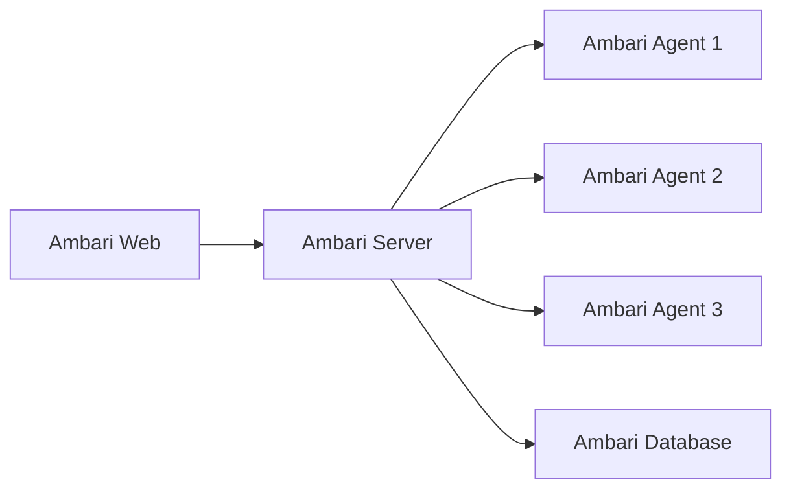

# Ambari原理与代码实例讲解

作者：禅与计算机程序设计艺术

## 1. 背景介绍
### 1.1 大数据平台管理的挑战
随着大数据技术的不断发展,企业需要管理和监控越来越复杂的大数据平台。手动部署、配置和管理这些分布式系统变得越来越困难。这就需要一个统一的管理平台来简化大数据平台的运维工作。

### 1.2 Ambari的诞生
Apache Ambari项目应运而生,它是一个基于Web的工具,用于供应、管理和监控Apache Hadoop集群。Ambari提供了直观易用的Hadoop管理Web UI,将Hadoop生态系统中的多个组件有机整合在一起,大大简化了Hadoop集群的管理和监控。

### 1.3 Ambari的发展历程
Ambari最初由Hortonworks公司开发,后来贡献给Apache软件基金会成为顶级项目。目前Ambari已经成为大数据平台管理领域的标准工具,被众多一线互联网公司广泛应用于生产环境。

## 2. 核心概念与架构
### 2.1 Ambari的核心概念
- Cluster:代表一个Hadoop集群,包含多个主机。
- Service:Hadoop生态系统中的组件,如HDFS、YARN、Hive等。
- Component:组成Service的细粒度进程,如NameNode、DataNode等。
- Host:集群中的物理机或虚拟机。
- Configuration:Service和Component的配置信息。

### 2.2 Ambari的系统架构
Ambari采用了经典的CS架构设计,主要包括以下几个核心组件:
- Ambari Server:负责管理整个集群,与Ambari Agent通信并向用户提供Web UI。
- Ambari Agents:运行在每个节点上,负责接收Server的命令并管理对应的组件。
- Ambari Web:提供直观的Web管理界面,用户可通过UI查看集群状态并进行相关操作。
- Ambari Database:存储集群的状态信息、配置等元数据。

下图展示了Ambari的整体架构:


### 2.3 Ambari与Hadoop生态系统的关系
Ambari是专门为管理Hadoop生态系统而设计的,它与Hadoop各组件紧密集成,支持对HDFS、YARN、Hive、HBase、Spark等几乎所有Hadoop组件的集中管理。通过Ambari,用户可以一站式部署、配置、管理和监控整个Hadoop集群,极大地提升了运维效率。

## 3. 核心工作原理与流程
### 3.1 集群部署流程
1. 准备集群主机,在每个主机上安装Ambari Agent。
2. 启动Ambari Server,通过Web UI创建一个集群。
3. 为集群选择需要安装的服务(如HDFS、YARN等),并配置服务参数。
4. Ambari Server根据配置生成部署任务,下发给对应的Agent执行。
5. Agent在每个主机上下载并安装相关软件包,启动服务进程。
6. Ambari Server持续监控服务状态,并在Web UI展示集群概览。

### 3.2 服务管理流程
1. 通过Ambari Web UI选择一个服务,如HDFS。
2. 修改服务配置,如NameNode堆内存大小等参数。
3. Ambari Server生成配置变更任务,下发给相关主机的Agent。
4. Agent重启受影响的组件,使配置生效。
5. Ambari Server监控服务运行状态,并在Web UI展示服务健康度。

### 3.3 集群监控流程
1. 每个主机上的Agent定期采集所在节点的指标数据,上报给Ambari Server。
2. Ambari Server聚合所有Agent采集的监控数据。
3. 用户通过Ambari Web查看集群的各项监控指标,如CPU使用率、磁盘容量等。
4. 当某项指标超过预定阈值时,Ambari会发出告警通知,提醒用户处理。

## 4. 数学建模与量化分析
### 4.1 集群容量规划模型
在使用Ambari部署Hadoop集群时,需要对集群的存储容量和计算能力进行规划。这里我们可以建立简单的数学模型来估算所需的节点数量。

设$S$为集群总存储容量,$C$为集群总计算能力,$n$为集群节点数量,$s_i$为第$i$个节点的存储容量,$c_i$为第$i$个节点的计算能力,则有:

$$
S=\sum_{i=1}^{n} s_i
$$

$$
C=\sum_{i=1}^{n} c_i
$$

如果我们假设集群由均质节点构成,即所有节点的存储容量和计算能力都相同,分别为$\overline{s}$和$\overline{c}$,则集群节点数量$n$可按下式估算:

$$
n = max(\lceil \frac{S}{\overline{s}} \rceil, \lceil \frac{C}{\overline{c}} \rceil)
$$

其中$\lceil x \rceil$表示$x$的向上取整。

### 4.2 服务可用性量化分析
Ambari通过监控每个服务的关键组件来度量服务的可用性。我们定义服务的可用性指标$A$为关键组件可用性的加权平均值:

$$
A = \frac{\sum_{i=1}^{m} w_i a_i}{\sum_{i=1}^{m} w_i}
$$

其中$m$为关键组件个数,$w_i$为第$i$个组件的权重,$a_i$为第$i$个组件的可用性。组件可用性可基于Ambari的监控指标(如进程存活、RPC请求成功率等)来计算。

通过合理设置组件权重,这个模型可以较好地量化服务的整体可用性水平,为用户提供服务健康度参考。

## 5. 代码实例详解
下面我们通过一个简单的Python代码例子,演示如何使用Ambari REST API来管理Hadoop集群。

```python
import json
import requests

AMBARI_SERVER_URL = "http://ambari.server.hostname:8080/api/v1"
CLUSTER_NAME = "mycluster"
HDFS_SERVICE_NAME = "HDFS"

# 获取集群基本信息
def get_cluster_info():
    response = requests.get(f"{AMBARI_SERVER_URL}/clusters/{CLUSTER_NAME}")
    if response.status_code == 200:
        return response.json()
    else:
        raise Exception(f"Failed to get cluster info. status code: {response.status_code}, message: {response.text}")

# 获取HDFS服务配置信息
def get_hdfs_config():
    response = requests.get(f"{AMBARI_SERVER_URL}/clusters/{CLUSTER_NAME}/services/{HDFS_SERVICE_NAME}/configurations")
    if response.status_code == 200:
        return response.json()
    else:
        raise Exception(f"Failed to get HDFS config. status code: {response.status_code}, message: {response.text}")

# 修改HDFS服务配置
def update_hdfs_config(config_type, properties):
    payload = {
        "Clusters": {
            "desired_configs": {
                "type": config_type,
                "tag": "version1",
                "properties": properties
            }
        }
    }
    response = requests.put(f"{AMBARI_SERVER_URL}/clusters/{CLUSTER_NAME}", data=json.dumps(payload))
    if response.status_code == 200:
        print(f"Updated HDFS config type '{config_type}' successfully.")
    else:
        raise Exception(f"Failed to update HDFS config. status code: {response.status_code}, message: {response.text}")

# 主程序
if __name__ == "__main__":
    # 获取集群信息
    cluster_info = get_cluster_info()
    print(f"Cluster name: {cluster_info['Clusters']['cluster_name']}")
    print(f"Cluster version: {cluster_info['Clusters']['version']}")

    # 获取HDFS配置
    hdfs_config = get_hdfs_config()
    print("Current HDFS configurations:")
    print(json.dumps(hdfs_config["items"][0]["properties"], indent=2))

    # 修改HDFS配置
    update_hdfs_config("hdfs-site", {"dfs.replication": "3"})
```

这个例子展示了如何通过Ambari REST API获取集群信息、查看HDFS配置以及修改HDFS副本数配置。可以看到,借助Ambari提供的API,我们可以很方便地管理Hadoop集群,无需手动修改配置文件。

## 6. 实际应用场景
Ambari在实际的大数据平台管理中有广泛的应用,下面列举几个典型场景:

### 6.1 一站式Hadoop集群部署
对于新的大数据项目,使用Ambari可以快速搭建一套标准的Hadoop集群环境。Ambari提供了图形化的安装向导,用户只需选择所需的Hadoop组件和主机,输入一些基本配置,即可自动完成集群的部署和初始化,大大降低了运维人员的工作量。

### 6.2 集群扩容与升级
当现有集群不能满足业务增长时,需要为集群扩容。通过Ambari,我们只需为集群添加新的主机,选择要部署的组件,扩容过程就可自动化完成。此外,Ambari还提供了滚动升级功能,可以一键将集群升级到新的版本,并且在升级过程中最小化服务中断时间。

### 6.3 问题诊断与性能调优
Hadoop集群运行过程中难免会遇到各种问题,如磁盘故障、内存不足等。Ambari的监控功能可以帮助用户快速定位问题。管理员可以通过Ambari Web界面查看各个主机和服务的运行状态,对异常情况进行报警。此外,Ambari还提供了各项性能指标的可视化展示,用户可以据此对集群性能进行分析和调优。

## 7. 工具与资源推荐
除了Ambari,还有一些其他优秀的Hadoop管理工具值得关注和学习:
- Apache Cloudera Manager:与Ambari类似,提供了Hadoop生态系统的部署、管理与监控功能。
- Apache Zeppelin:基于Web的交互式数据分析工具,支持多种语言后端,可以与Hadoop集成使用。
- Grafana:开源的数据可视化平台,可以接入Ambari等监控数据源,生成美观的仪表盘。

对于Ambari的学习和使用,以下资源供参考:
- [Ambari官方文档](https://ambari.apache.org/1.2.1/installing-hadoop-using-ambari/content/index.html)
- [Hortonworks官方教程](https://zh.hortonworks.com/tutorial/manage-files-on-hdfs-via-cli-ambari-files-view/)
- [Ambari源码](https://github.com/apache/ambari)

## 8. 总结与展望
### 8.1 Ambari的优势
Ambari作为一个成熟的Hadoop管理工具,具有以下优势:
- 简化集群部署流程,提供图形化安装向导
- 统一管理配置,支持一键式配置变更
- 丰富的监控指标,易于发现和定位问题
- 与Hadoop生态系统的紧密集成,支持主流的Hadoop组件
- 活跃的社区支持与持续演进

### 8.2 Ambari的局限性
尽管Ambari为Hadoop集群管理带来了极大的便利,但它也有一些局限性:
- 只支持特定版本的Hadoop发行版,如HDP
- 集群规模受限,超大规模集群的管理难度较大
- 二次开发难度较高,需要熟悉其内部实现

### 8.3 未来的发展方向
未来,Hadoop管理工具将向以下方向发展:
- 更智能的管理和运维,引入机器学习等技术实现自动化运维
- 支持多云与混合云环境,实现跨云Hadoop集群管理
- 与新兴的大数据框架和工具集成,如Flink、Kudu等
- 简化二次开发,提供更灵活的插件机制满足定制需求

总之,Ambari作为一个优秀的Hadoop管理利器,值得每一位大数据工程师学习和掌握。对Ambari的深入理解,将助力我们更高效地管理日益复杂的大数据平台。

## 9. 附录:常见问题解答
### 9.1 Ambari支持哪些Hadoop发行版?
目前Ambari主要支持HDP(Hortonworks Data Platform)发行版。对于其他Hadoop发行版,如CDH,可以使用Ambari的社区版本或者自行适配。

### 9.2 如何对接Ambari的监控数据?
Ambari提供了Metrics API,可以通过REST接口查询监控指标数据。此外,Ambari还支持将数据发送到Grafana、OpenTSDB等第