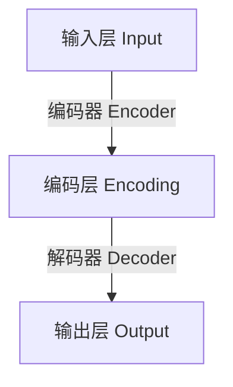
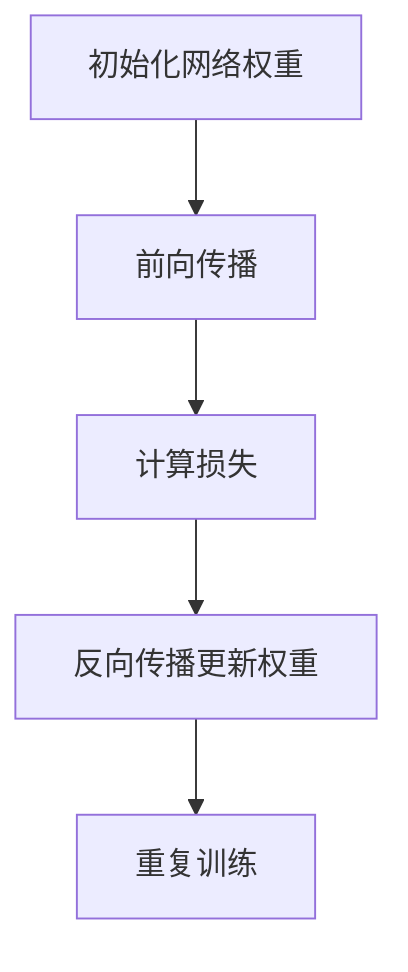

# Autoencoders 原理与代码实战案例讲解

## 1.背景介绍

### 1.1 什么是Autoencoder?

Autoencoder(自编码器)是一种无监督学习的人工神经网络,其目标是将高维输入数据编码为低维的编码表示,然后再将该编码解码为与原始输入数据相似的输出。简单来说,自编码器试图学习一种压缩表示形式来捕获输入数据的最重要特征。

自编码器由两个主要部分组成:编码器(Encoder)和解码器(Decoder)。编码器将高维输入数据压缩为低维编码,而解码器则尝试从该低维编码重构出与原始输入数据尽可能相似的高维输出。

### 1.2 Autoencoder的应用

自编码器最初被设计用于降维和特征学习,但随后也被广泛应用于许多其他领域,包括:

- **数据去噪**:通过将噪声数据输入自编码器,训练网络学习重构无噪声的输入。
- **异常检测**:通过测量输入与重构输出之间的差异,可检测异常数据样本。
- **生成模型**:变分自编码器(VAE)可用于生成新的类似于训练数据的样本。
- **数据压缩**:自编码器可以学习高效的数据压缩表示形式。
- **特征可视化**:通过可视化编码层的激活,可以洞察自编码器所学习的特征。

## 2.核心概念与联系

### 2.1 自编码器的结构

一个典型的自编码器由三个主要部分组成:

1. **输入层(Input Layer)**: 接收原始高维输入数据。
2. **隐藏层(Hidden Layer)**: 也称编码层(Encoding Layer),负责将高维输入数据编码为低维表示。
3. **输出层(Output Layer)**: 也称解码层(Decoding Layer),负责从低维编码重构出与原始输入数据相似的高维输出。

编码器将输入数据 $x$ 映射到隐藏层的编码表示 $h=f(x)$,其中 $f$ 是编码函数。解码器则将编码 $h$ 映射回输出 $r=g(h)$,其中 $g$ 是解码函数。自编码器的目标是使输出 $r$ 尽可能接近原始输入 $x$。



### 2.2 自编码器的损失函数

为了使自编码器能够学习有用的编码表示,需要定义一个合适的损失函数来衡量输入 $x$ 与重构输出 $r$ 之间的差异。常用的损失函数包括:

- **均方误差(Mean Squared Error, MSE)**: $L(x,r)=\|x-r\|^2$
- **交叉熵损失(Cross-Entropy Loss)**: $L(x,r)=-\sum_{k}x_k\log(r_k)$

自编码器通过最小化输入与输出之间的损失函数,学习编码和解码的映射函数 $f$ 和 $g$。

### 2.3 正则化自编码器

为了防止自编码器简单地学习恒等映射,通常会对隐藏层施加约束或正则化,促使网络学习更加紧凑和鲁棒的编码表示。常见的正则化方法包括:

- **稀疏自编码器(Sparse Autoencoder)**: 通过添加稀疏惩罚项,促使隐藏层的激活值呈现稀疏分布。
- **去噪自编码器(Denoising Autoencoder)**: 通过在输入层引入噪声,训练网络从损坏的输入中重构原始数据。
- **缩减自编码器(Contractive Autoencoder)**: 通过惩罚编码表示对输入的敏感度,学习更加鲁棒的特征。

## 3.核心算法原理具体操作步骤

自编码器的训练过程可以概括为以下步骤:

1. **初始化网络权重**: 通常使用小的随机值初始化编码器和解码器的权重。
2. **前向传播**: 将输入数据 $x$ 通过编码器得到编码表示 $h=f(x)$,再通过解码器得到重构输出 $r=g(h)$。
3. **计算损失**: 使用选定的损失函数(如MSE或交叉熵)计算输入 $x$ 与重构输出 $r$ 之间的差异。
4. **反向传播**: 根据损失函数的梯度,使用优化算法(如梯度下降)更新编码器和解码器的权重。
5. **重复训练**: 重复步骤2-4,直到网络收敛或达到最大迭代次数。

在训练过程中,自编码器会逐渐学习将输入数据编码为低维的紧凑表示,同时最小化输入与重构输出之间的差异。经过训练的自编码器可用于各种下游任务,如降维、去噪、异常检测等。



## 4.数学模型和公式详细讲解举例说明

### 4.1 自编码器的数学模型

给定一个输入数据 $x \in \mathbb{R}^{n}$,我们定义编码函数 $f: \mathbb{R}^{n} \rightarrow \mathbb{R}^{m}$ 和解码函数 $g: \mathbb{R}^{m} \rightarrow \mathbb{R}^{n}$,其中 $m < n$。自编码器试图学习这两个函数,使得 $g(f(x)) \approx x$。

在实践中,编码器 $f$ 和解码器 $g$ 通常由多层感知机(MLP)或卷积神经网络(CNN)实现。假设编码器由 $L$ 层组成,每层的权重矩阵和偏置向量分别为 $W^{(l)}$ 和 $b^{(l)}$,则编码过程可表示为:

$$h=f(x)=\sigma^{(L)}(W^{(L)}\sigma^{(L-1)}(\cdots \sigma^{(1)}(W^{(1)}x+b^{(1)})\cdots)+b^{(L)})$$

其中 $\sigma^{(l)}$ 是第 $l$ 层的激活函数,如ReLU或Sigmoid。解码过程类似,但方向相反。

在训练过程中,自编码器通过最小化重构误差 $\mathcal{L}(x,g(f(x)))$ 来学习编码器和解码器的参数,其中 $\mathcal{L}$ 是选定的损失函数。

### 4.2 稀疏自编码器

稀疏自编码器通过添加稀疏惩罚项 $\Omega(h)$ 来促使隐藏层的激活值呈现稀疏分布,从而学习更加紧凑和鲁棒的特征表示。目标函数变为:

$$\min_{\theta} \mathcal{L}(x,g_{\theta}(f_{\theta}(x))) + \lambda \Omega(h)$$

其中 $\theta$ 表示网络的所有参数,而 $\lambda$ 控制稀疏惩罚项的权重。常用的稀疏惩罚项包括 $L_1$ 范数 $\Omega(h)=\|h\|_1$ 和 Kullback-Leibler(KL) 散度 $\Omega(h)=\text{KL}(\rho\|\hat{\rho})$,后者将隐藏层的平均活跃度 $\hat{\rho}$ 与预期的稀疏程度 $\rho$ 进行比较。

### 4.3 去噪自编码器

去噪自编码器(Denoising Autoencoder)通过在输入层引入噪声,训练网络从损坏的输入中重构原始干净的数据。具体来说,给定一个干净的输入 $x$,我们首先通过一个噪声映射 $\tilde{x}=q(x|\tilde{x})$ 得到一个噪声输入 $\tilde{x}$。然后,自编码器试图从 $\tilde{x}$ 重构出原始的干净输入 $x$,即最小化 $\mathcal{L}(x,g(f(\tilde{x})))$。

通过这种方式,去噪自编码器被迫捕获输入数据的更多鲁棒特征,而不是简单地学习恒等映射。常见的噪声映射包括高斯噪声、盐噪声、掩码噪声等。

### 4.4 变分自编码器

变分自编码器(Variational Autoencoder, VAE)是一种概率生成模型,它将传统自编码器的确定性编码过程替换为学习编码的概率分布。具体来说,编码器 $q_{\phi}(z|x)$ 将输入 $x$ 映射到一个潜在变量 $z$ 的概率分布,而解码器 $p_{\theta}(x|z)$ 则从潜在变量 $z$ 生成输出 $x$ 的概率分布。

VAE的目标是最大化边际对数似然 $\log p_{\theta}(x)$,这可以通过最大化其在编码分布 $q_{\phi}(z|x)$ 下的证据下界(Evidence Lower Bound, ELBO)来近似:

$$\mathcal{L}(\theta,\phi;x)=\mathbb{E}_{q_{\phi}(z|x)}[\log p_{\theta}(x|z)]-\text{KL}(q_{\phi}(z|x)\|p(z))$$

其中第一项是重构项,第二项是编码分布与先验分布(通常为标准高斯分布)之间的KL散度,用于正则化潜在空间。通过重参数技巧,VAE可以使用随机梯度下降进行端到端训练。

## 5.项目实践:代码实例和详细解释说明

在这一部分,我们将通过一个实际的代码示例来演示如何构建和训练一个简单的自编码器模型。我们将使用Python和PyTorch深度学习库。

### 5.1 导入必要的库

```python
import torch
import torch.nn as nn
import torch.optim as optim
from torchvision import datasets, transforms
```

### 5.2 定义自编码器模型

我们定义一个简单的自编码器模型,它由一个编码器和一个解码器组成。编码器由两个线性层和一个ReLU激活函数组成,而解码器与编码器的结构相反。

```python
class Autoencoder(nn.Module):
    def __init__(self, input_dim, hidden_dim):
        super(Autoencoder, self).__init__()
        self.encoder = nn.Sequential(
            nn.Linear(input_dim, hidden_dim),
            nn.ReLU(),
            nn.Linear(hidden_dim, hidden_dim//2)
        )
        self.decoder = nn.Sequential(
            nn.Linear(hidden_dim//2, hidden_dim),
            nn.ReLU(),
            nn.Linear(hidden_dim, input_dim)
        )

    def forward(self, x):
        encoded = self.encoder(x)
        decoded = self.decoder(encoded)
        return decoded
```

在这个例子中,我们将MNIST手写数字图像(28x28像素)作为输入,将其展平为784维向量。编码器将784维输入编码为128维的中间表示,然后解码器将其解码回784维的输出。

### 5.3 准备数据集

我们使用PyTorch内置的MNIST数据集,并对其进行标准化处理。

```python
transform = transforms.Compose([
    transforms.ToTensor(),
    transforms.Normalize((0.5,), (0.5,))
])

train_dataset = datasets.MNIST(root='./data', train=True, transform=transform, download=True)
test_dataset = datasets.MNIST(root='./data', train=False, transform=transform)

train_loader = torch.utils.data.DataLoader(train_dataset, batch_size=128, shuffle=True)
test_loader = torch.utils.data.DataLoader(test_dataset, batch_size=128, shuffle=False)
```

### 5.4 训练自编码器

我们定义一个函数来训练自编码器模型。在每个epoch中,我们遍历训练数据集,计算重构损失(这里使用均方误差),并使用Adam优化器更新模型参数。

```python
def train(model, train_loader, num_epochs, lr):
    criterion = nn.MSELoss()
    optimizer = optim.Adam(model.parameters(), lr=lr)
    
    for epoch in range(num_epochs):
        train_loss = 0.0
        for data in train_loader:
            inputs = data[0].view(-1, 784)
            optimizer.zero_grad()
            outputs = model(inputs)
            loss = criterion(outputs, inputs)
            loss.backward()
            optimizer.step()
            train_loss += loss.item() * inputs.size(0)
        
        train_loss /= len(train_loader.dataset)
        print(f'Epoch {epoch+