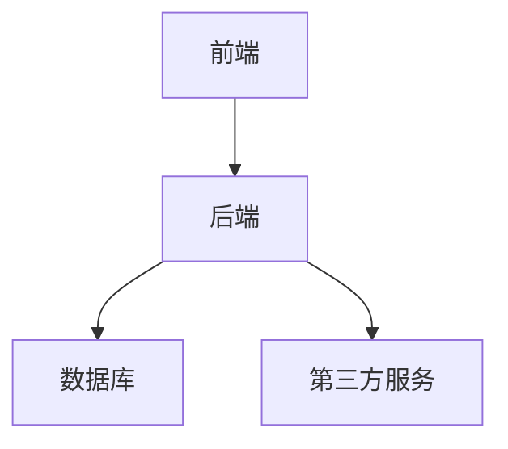

# B2C购物网站设计系统详细设计与具体代码实现

## 1. 背景介绍

### 1.1 B2C电子商务概述

B2C(Business-to-Consumer)电子商务是指企业通过互联网直接向消费者销售产品或服务的商业模式。随着互联网技术的快速发展和消费者购物习惯的转变,B2C电子商务已经成为零售行业的重要组成部分。

### 1.2 B2C购物网站的重要性

对于企业而言,B2C购物网站是直接面向消费者的重要销售渠道,可以显著扩大产品的覆盖范围,提高销售额。对于消费者而言,B2C购物网站提供了便捷的购物体验,可以在线浏览、比较和购买各种商品,无需亲自前往实体店。

### 1.3 B2C购物网站系统设计的挑战

设计和开发一个高效、安全、用户友好的B2C购物网站系统面临诸多挑战,包括系统架构设计、数据库设计、用户体验优化、支付安全、物流集成等。需要综合考虑各种技术和业务因素,确保系统的可扩展性、可维护性和性能。

## 2. 核心概念与联系

### 2.1 系统架构概览

B2C购物网站系统通常采用三层或多层架构,包括表现层(前端)、业务逻辑层(后端)和数据访问层。

### 2.2 核心功能模块

B2C购物网站系统的核心功能模块通常包括:

- **用户模块**: 用户注册、登录、个人信息管理等
- **商品模块**: 商品信息展示、搜索、分类、评价等
- **购物车模块**: 加入购物车、修改购物车、结算等
- **订单模块**: 下单、支付、物流跟踪等
- **营销模块**: 促销活动、优惠券、积分等
- **后台管理模块**: 商品管理、订单管理、用户管理等

### 2.3 关键技术

B2C购物网站系统设计涉及多种关键技术,包括但不限于:

- Web开发技术(HTML/CSS/JavaScript)
- 服务器端语言(Java/Python/PHP/Node.js等)
- 数据库技术(MySQL/PostgreSQL/MongoDB等)
- 缓存技术(Redis/Memcached等)
- 消息队列技术(RabbitMQ/Kafka等)
- 搜索引擎技术(Elasticsearch/Solr等)
- 安全技术(HTTPS/加密/认证等)
- 容器技术(Docker/Kubernetes等)
- 自动化测试技术

## 3. 核心算法原理具体操作步骤  

### 3.1 商品推荐算法

商品推荐算法是B2C购物网站系统的核心算法之一,旨在根据用户的浏览记录、购买历史和偏好,为用户推荐感兴趣的商品,提高转化率和用户体验。常用的推荐算法包括:

1. **协同过滤算法(Collaborative Filtering)**

   - **基于用户的协同过滤**: 找到与目标用户有相似兴趣的其他用户,并推荐这些用户喜欢的商品。
   - **基于物品的协同过滤**: 找到与目标商品相似的其他商品,并推荐给购买过目标商品的用户。

2. **基于内容的推荐算法(Content-based)**

   根据商品的属性(标题、描述、类别等)与用户历史兴趣的相似度,推荐相关商品。

3. **基于规则的推荐算法(Rule-based)**

   根据预定义的规则,如购买模式、销量等,推荐商品。

4. **混合推荐算法(Hybrid)**

   结合上述多种算法,综合考虑多种因素进行推荐。

算法的具体实现步骤因算法而异,但通常包括数据预处理、模型训练、实时推荐等环节。

### 3.2 搜索引擎算法

搜索引擎算法是B2C购物网站系统的另一核心算法,用于快速、准确地检索与用户搜索词相关的商品信息。常用的搜索引擎算法包括:

1. **布尔模型(Boolean Model)**

   根据搜索词与文档的词条是否精确匹配,返回结果。

2. **向量空间模型(Vector Space Model)**

   将文档和查询表示为向量,根据向量相似度排序结果。

3. **概率模型(Probabilistic Model)**

   根据文档中词条出现的概率,计算文档与查询的相关性得分。

4. **语言模型(Language Model)**

   将查询视为语言模型,计算文档生成该查询的概率作为相关性得分。

5. **学习排序模型(Learning to Rank)**

   使用机器学习算法,根据多种特征对结果进行排序。

实现搜索引擎算法通常需要建立倒排索引,并对查询进行预处理、相关性计算和结果排序等步骤。

### 3.3 购物车算法

购物车算法负责管理用户的购物车,包括添加、修改、删除商品,以及计算总价格等功能。常用的购物车算法包括:

1. **基于Session的购物车**

   利用HTTP Session存储购物车数据,适用于未登录用户。

2. **基于数据库的购物车**

   将购物车数据持久化存储在数据库中,适用于登录用户。

3. **基于Redis的购物车**

   利用Redis的数据结构(如Hash)存储购物车数据,提高性能。

4. **基于消息队列的购物车**

   将购物车操作封装为消息,异步处理,提高系统的响应速度和可扩展性。

购物车算法的实现步骤通常包括:初始化购物车、添加商品、修改商品数量、删除商品、计算总价格等。需要考虑并发控制、数据一致性等问题。

### 3.4 订单处理算法

订单处理算法负责管理用户的订单,包括下单、支付、物流跟踪等功能。常用的订单处理算法包括:

1. **基于状态机的订单处理**

   将订单生命周期划分为多个状态,根据状态转移规则处理订单。

2. **基于事件驱动的订单处理**

   将订单操作封装为事件,通过事件驱动的方式处理订单。

3. **基于消息队列的订单处理**

   将订单操作封装为消息,异步处理,提高系统的响应速度和可扩展性。

4. **基于工作流的订单处理**

   将订单处理流程建模为工作流,根据工作流引擎执行相应的操作。

订单处理算法的实现步骤通常包括:创建订单、支付订单、发货、物流跟踪等。需要考虑并发控制、事务一致性、异常处理等问题。

## 4. 数学模型和公式详细讲解举例说明

### 4.1 协同过滤算法

协同过滤算法是推荐系统中常用的一种算法,基于用户之间或物品之间的相似性进行推荐。

#### 4.1.1 基于用户的协同过滤

基于用户的协同过滤算法的核心思想是:给定一个目标用户,找到与该用户有相似兴趣的其他用户,并推荐这些用户喜欢的商品。

相似度计算公式:

$$
sim(u,v)=\frac{\sum\limits_{i\in I_{uv}}(r_{ui}-\overline{r_u})(r_{vi}-\overline{r_v})}{\sqrt{\sum\limits_{i\in I_{uv}}(r_{ui}-\overline{r_u})^2}\sqrt{\sum\limits_{i\in I_{uv}}(r_{vi}-\overline{r_v})^2}}
$$

其中:

- $sim(u,v)$表示用户$u$和用户$v$的相似度
- $I_{uv}$表示用户$u$和用户$v$都评价过的商品集合
- $r_{ui}$表示用户$u$对商品$i$的评分
- $\overline{r_u}$表示用户$u$的平均评分

预测评分公式:

$$
p_{ui}=\overline{r_u}+\frac{\sum\limits_{v\in S(u,k)}sim(u,v)(r_{vi}-\overline{r_v})}{\sum\limits_{v\in S(u,k)}|sim(u,v)|}
$$

其中:

- $p_{ui}$表示预测用户$u$对商品$i$的评分
- $S(u,k)$表示与用户$u$最相似的$k$个用户集合

#### 4.1.2 基于物品的协同过滤

基于物品的协同过滤算法的核心思想是:给定一个目标商品,找到与该商品相似的其他商品,并推荐给购买过目标商品的用户。

相似度计算公式:

$$
sim(i,j)=\frac{\sum\limits_{u\in U_{ij}}(r_{ui}-\overline{r_i})(r_{uj}-\overline{r_j})}{\sqrt{\sum\limits_{u\in U_{ij}}(r_{ui}-\overline{r_i})^2}\sqrt{\sum\limits_{u\in U_{ij}}(r_{uj}-\overline{r_j})^2}}
$$

其中:

- $sim(i,j)$表示商品$i$和商品$j$的相似度
- $U_{ij}$表示评价过商品$i$和商品$j$的用户集合
- $r_{ui}$表示用户$u$对商品$i$的评分
- $\overline{r_i}$表示商品$i$的平均评分

预测评分公式:

$$
p_{ui}=\overline{r_u}+\frac{\sum\limits_{j\in S(i,k)}sim(i,j)(r_{uj}-\overline{r_j})}{\sum\limits_{j\in S(i,k)}|sim(i,j)|}
$$

其中:

- $p_{ui}$表示预测用户$u$对商品$i$的评分
- $S(i,k)$表示与商品$i$最相似的$k$个商品集合

### 4.2 搜索引擎算法

搜索引擎算法用于计算文档与查询的相关性得分,并根据得分对结果进行排序。

#### 4.2.1 向量空间模型

向量空间模型将文档和查询表示为向量,根据向量相似度计算相关性得分。

文档向量:

$$
\vec{d}=(w_{d1},w_{d2},\dots,w_{dt})
$$

其中$w_{dt}$表示词项$t$在文档$d$中的权重,通常使用TF-IDF计算:

$$
w_{dt}=tf_{dt}\times\log\frac{N}{df_t}
$$

- $tf_{dt}$表示词项$t$在文档$d$中出现的频率
- $N$表示文档总数
- $df_t$表示包含词项$t$的文档数量

查询向量:

$$
\vec{q}=(w_{q1},w_{q2},\dots,w_{qt})
$$

其中$w_{qt}$表示词项$t$在查询$q$中的权重,通常使用Boolean模型或TF-IDF模型计算。

相似度计算公式:

$$
sim(\vec{d},\vec{q})=\frac{\vec{d}\cdot\vec{q}}{|\vec{d}||\vec{q}|}
$$

其中$\vec{d}\cdot\vec{q}$表示向量点乘,用于计算相似度得分。

#### 4.2.2 语言模型

语言模型将查询视为一种语言模型,计算文档生成该查询的概率作为相关性得分。

相关性得分公式:

$$
P(q|d)=\prod_{t\in q}P(t|d)^{n(t,q)}
$$

其中:

- $P(q|d)$表示文档$d$生成查询$q$的概率
- $t$表示查询$q$中的词项
- $n(t,q)$表示词项$t$在查询$q$中出现的次数
- $P(t|d)$表示词项$t$在文档$d$中出现的概率,可使用最大似然估计或平滑技术估计

### 4.3 推荐系统评估指标

推荐系统的性能通常使用以下评估指标进行衡量:

1. **准确率(Precision)**

$$
Precision=\frac{TP}{TP+FP}
$$

其中$TP$表示正确推荐的商品数量,$FP$表示错误推荐的商品数量。

2. **召回率(Recall)**

$$
Recall=\frac{TP}{TP+FN}
$$

其中$FN$表示未被推荐但用户感兴趣的商品数量。

3. **F1分数**

$$
F1=\frac{