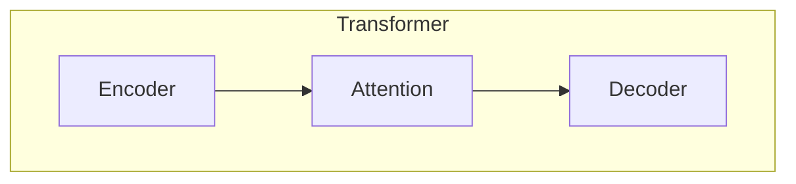
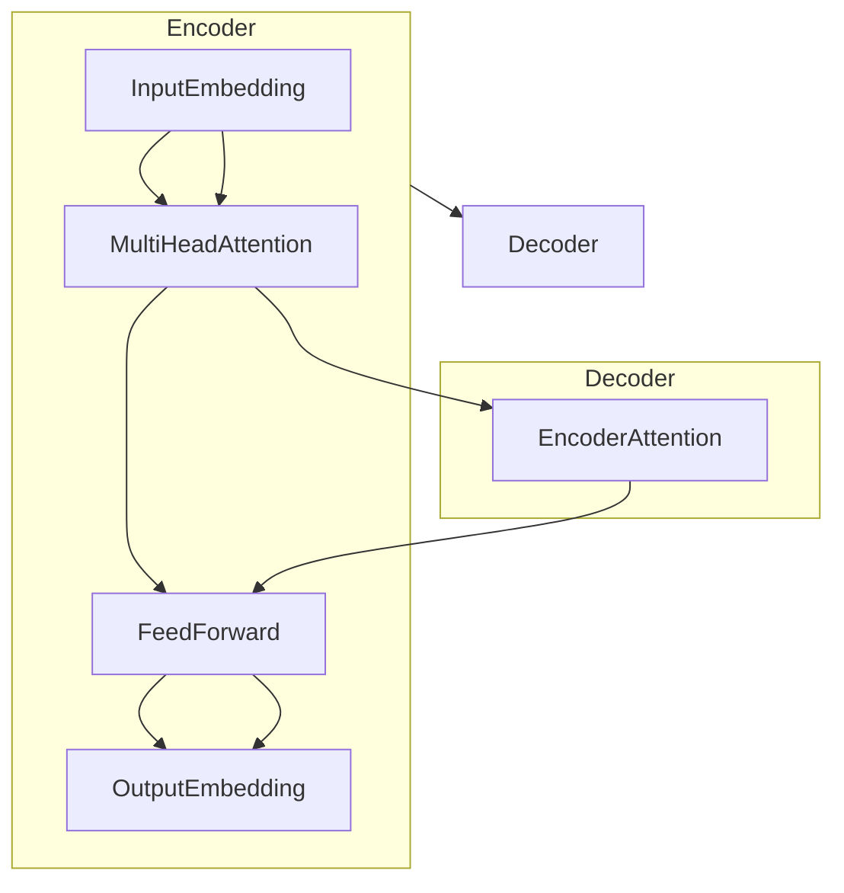

# BLOOM原理与代码实例讲解

## 1. 背景介绍

### 1.1 什么是BLOOM

BLOOM (Bidirectional Encoder Representations from Transformers)是一种基于Transformer架构的大型语言模型,由OpenAI于2022年5月发布。它是一种全新的人工智能模型,旨在通过大规模预训练和微调,在各种自然语言处理任务上实现出色的性能。

BLOOM的名称来源于其双向编码器表示,能够同时捕获输入序列的左右上下文信息。这一创新设计使得BLOOM在下游任务上表现出色,尤其在生成式任务中,能够产生高质量、连贯性强的输出。

### 1.2 BLOOM的重要性

BLOOM的发布标志着人工智能领域又一重大突破。作为一种通用的大型语言模型,BLOOM在自然语言处理的各个领域都展现出了强大的能力,包括但不限于:

- 文本生成(如新闻写作、故事创作等)
- 机器翻译
- 问答系统
- 文本摘要
- 情感分析
- 代码生成等

BLOOM的出现为人工智能的发展带来了新的契机,有望在未来推动各行各业的智能化进程,提高生产效率,优化决策过程,为人类创造更多价值。

### 1.3 本文概述

本文将全面深入地探讨BLOOM的原理、架构和应用。我们将从以下几个方面入手:

- BLOOM的核心概念和创新点
- BLOOM的数学模型和训练过程
- BLOOM在各类任务上的应用实践
- BLOOM的优缺点及未来发展趋势

通过本文的学习,读者能够全面了解BLOOM的工作原理,掌握其核心算法,并学会在实践中灵活运用这一强大的人工智能模型。

## 2. 核心概念与联系  

### 2.1 Transformer架构 

BLOOM的核心架构源于Transformer,这是一种革命性的序列到序列(Seq2Seq)模型,由Google的研究人员在2017年提出。Transformer完全基于注意力(Attention)机制构建,摒弃了传统序列模型中的循环神经网络(RNN)和卷积神经网络(CNN)结构,大大提高了并行计算能力。

Transformer架构主要由编码器(Encoder)和解码器(Decoder)两个子模块组成。编码器将输入序列编码为一系列向量表示,解码器则根据这些向量表示生成输出序列。两个子模块通过注意力机制相互关联,使得解码器在生成每个新token时,都能充分利用输入序列的上下文信息。

Transformer凭借其出色的并行性能和长距离依赖捕捉能力,在机器翻译、文本生成等序列任务上取得了革命性突破,成为后来大型语言模型的基础架构。

### 2.2 自注意力机制

自注意力(Self-Attention)是Transformer的核心创新,它允许模型直接捕捉输入序列中任意两个位置之间的关系,而不再受序列长度的限制。这种全局依赖建模的能力使得Transformer能够更好地理解长序列的语义,从而在生成任务中产生更加连贯流畅的输出。

在自注意力机制中,每个位置的表示是其他所有位置的表示的加权和。这些权重通过注意力分数计算得到,注意力分数描述了当前位置与其他位置之间的关联程度。形式化地,对于一个长度为n的输入序列$\boldsymbol{x} = (x_1, x_2, \ldots, x_n)$,第i个位置的表示$y_i$由以下公式计算:

$$y_i = \sum_{j=1}^{n}\alpha_{ij}(x_j W^V)$$

其中,$\alpha_{ij}$是注意力分数,描述了$x_i$和$x_j$之间的关联强度;$W^V$是一个可学习的值向量。注意力分数$\alpha_{ij}$通过以下公式计算:

$$\alpha_{ij} = \mathrm{softmax}(\frac{(x_iW^Q)(x_jW^K)^T}{\sqrt{d_k}})$$

这里,$W^Q$和$W^K$分别是查询(Query)和键(Key)的可学习线性投影;$d_k$是缩放因子,用于控制点积的大小。

自注意力机制赋予了Transformer强大的长距离依赖建模能力,使其在捕捉长序列的语义上表现出色,这也是BLOOM等大型语言模型取得突破性进展的关键所在。

### 2.3 BLOOM的创新点

作为一种基于Transformer的大型语言模型,BLOOM在传统架构的基础上引入了一些创新设计,进一步提升了模型的性能和泛化能力:

1. **双向编码**:与传统的单向语言模型不同,BLOOM采用了双向Transformer编码器,能够同时捕获输入序列的左右上下文信息。这使得BLOOM在生成任务中能够产生更加连贯、上下文相关的输出。

2. **前馈交叉注意力**:BLOOM引入了一种新的注意力机制——前馈交叉注意力(Feedforward Cross-Attention),它允许解码器在生成每个新token时,不仅关注编码器的输出,还能关注已生成的部分输出序列。这种机制增强了BLOOM在长序列生成任务中的性能。

3. **词元化(Tokenization)策略**:BLOOM采用了一种新颖的词元化策略,将原始文本分解为更细粒度的词元序列,从而提高了模型对低频词和新词的表示能力。

4. **大规模预训练**:BLOOM在海量的互联网文本数据上进行了大规模预训练,使其能够获取丰富的语言知识,为后续的微调和应用奠定基础。

这些创新设计赋予了BLOOM卓越的性能表现,使其在各种自然语言处理任务上都能取得优异的结果。接下来,我们将深入探讨BLOOM的数学模型和训练细节。

## 3. 核心算法原理具体操作步骤

### 3.1 BLOOM的整体架构

BLOOM的整体架构由编码器(Encoder)和解码器(Decoder)两个主要部分组成,两者都采用了Transformer的标准子层结构。

如上图所示,编码器由以下几个关键步骤构成:

1. **输入嵌入(Input Embedding)**: 将原始的输入token序列映射到连续的向量空间,得到初始的嵌入表示。
2. **多头自注意力(Multi-Head Self-Attention)**: 对输入嵌入序列进行自注意力计算,捕获序列内各个位置之间的依赖关系。
3. **前馈网络(Feed-Forward Network)**: 对注意力输出进行非线性变换,提取更高层次的特征表示。
4. **输出嵌入(Output Embedding)**: 将前馈网络的输出映射回模型维度,作为编码器的最终输出。

解码器的结构与编码器类似,但增加了一个额外的注意力子层——编码器注意力(Encoder Attention),用于将解码器的输出与编码器的输出进行关联。在生成每个新token时,解码器不仅关注之前生成的token序列,还会利用编码器注意力机制参考源输入序列,以产生更加连贯、上下文相关的输出。

### 3.2 BLOOM的前馈交叉注意力

前馈交叉注意力(Feedforward Cross-Attention)是BLOOM的一个核心创新点。在传统的Transformer解码器中,解码器只能关注编码器的输出,而无法直接参考自身已生成的部分输出序列。这在一定程度上限制了解码器的表现能力,尤其是在长序列生成任务中。

为了解决这一问题,BLOOM引入了前馈交叉注意力机制。在生成每个新token时,解码器不仅会计算编码器注意力,还会计算一个额外的注意力——前馈交叉注意力,其中的"键(Key)"和"值(Value)"来自解码器自身已生成的部分输出序列。

具体来说,假设解码器当前时间步的输出为$s_t$,已生成的部分输出序列为$\boldsymbol{y} = (y_1, y_2, \ldots, y_{t-1})$,那么前馈交叉注意力的计算过程为:

$$\begin{aligned}
    \boldsymbol{q}_t &= s_tW^Q \\
    \boldsymbol{k}_i &= y_iW^K \\
    \boldsymbol{v}_i &= y_iW^V \\
    \alpha_{t,i} &= \mathrm{softmax}(\frac{\boldsymbol{q}_t\boldsymbol{k}_i^T}{\sqrt{d_k}}) \\
    \mathrm{FeedForwardCrossAttn}(s_t, \boldsymbol{y}) &= \sum_{i=1}^{t-1}\alpha_{t,i}\boldsymbol{v}_i
\end{aligned}$$

其中,$W^Q$、$W^K$、$W^V$分别是查询(Query)、键(Key)和值(Value)的可学习线性投影;$\alpha_{t,i}$是注意力分数,描述了$s_t$与$y_i$之间的关联强度;$d_k$是缩放因子。

通过前馈交叉注意力,解码器能够直接参考已生成的部分输出序列,从而在生成新token时做出更加明智的选择,提高长序列生成的质量和连贯性。

### 3.3 BLOOM的训练过程

BLOOM是通过自监督学习的方式进行预训练的。具体来说,预训练过程包括以下几个关键步骤:

1. **语料构建**: 从互联网上收集大量的文本数据,包括书籍、新闻、维基百科等,构建预训练语料库。
2. **数据预处理**: 对原始文本进行标记化(Tokenization)、词元化(Subword)等预处理,将其转换为模型可以接受的输入格式。
3. **掩码语言模型(Masked Language Modeling)**: 这是BLOOM预训练的主要目标之一。在输入序列中随机掩码部分token,模型需要基于上下文预测被掩码的token。这有助于BLOOM学习理解文本的语义和上下文信息。
4. **下一句预测(Next Sentence Prediction)**: 另一个预训练目标。给定两个句子A和B,模型需要预测B是否为A的下一句。这有助于BLOOM捕捉句子之间的逻辑关系和语义连贯性。
5. **反向语言模型(Reversed Language Modeling)**: 为了充分利用双向编码器的优势,BLOOM还采用了反向语言模型作为辅助目标。模型需要基于上下文预测序列中的前一个token。
6. **梯度更新**: 根据预测结果和真实标签计算损失函数,通过反向传播算法更新模型参数,使模型在预训练目标上的表现不断改进。

经过大规模的预训练后,BLOOM学习到了丰富的语言知识和上下文表示能力,为后续的微调和下游任务应用奠定了基础。在实际应用中,我们只需要根据具体的任务对BLOOM进行微调,即可获得出色的性能表现。

## 4. 数学模型和公式详细讲解举例说明

在上一节中,我们介绍了BLOOM的核心算法原理和操作步骤。现在,让我们深入探讨BLOOM背后的数学模型,并通过具体的例子来加深理解。

### 4.1 Transformer编码器

我们首先回顾一下Transformer编码器的数学表示。对于一个长度为$n$的输入序列$\boldsymbol{x} = (x_1, x_2, \ldots, x_n)$,编码器的计算过程可以表示为:

$$\begin{aligned}
    \boldsymbol{z}^0 &= \boldsymbol{x}E + \boldsymbol{p}_\mathrm{pos} \\
    \boldsymbol{z}^\ell &= \mathrm{TransformerEncoderLayer}(\boldsymbol{z}^{\ell-1}), \quad \ell=1,\ldots,L \\
    \boldsymbol{h} &= \boldsymbol{z}^L
\end{aligned}$$

其中:

- $E$是输入嵌入矩阵,将每个token映射到连续的向量空间;
- $\boldsymbol{p}_\mat