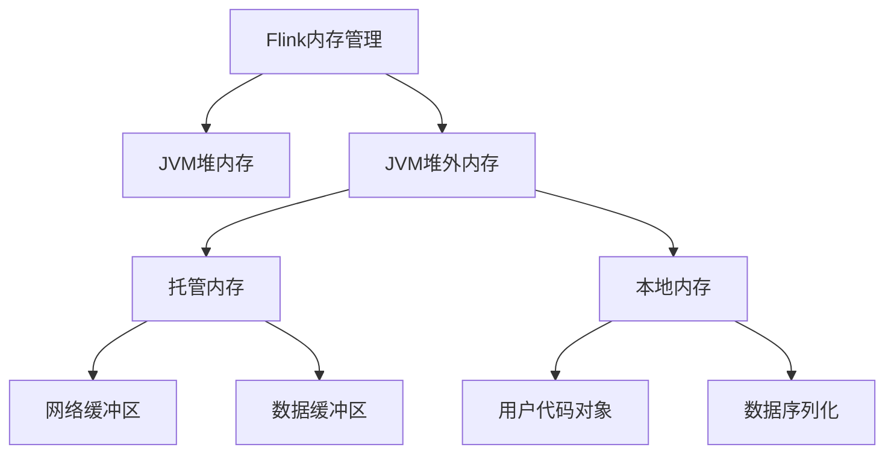

# Flink内存管理与流式机器学习:大规模分布式场景下的挑战

## 1.背景介绍

### 1.1 大数据时代的来临

随着互联网、物联网和移动互联网的快速发展,海量的数据正以前所未有的规模和速度不断产生。传统的批处理系统已经无法满足对实时性和低延迟的要求。因此,流式计算应运而生,成为大数据处理的关键技术之一。

### 1.2 Apache Flink的崛起

Apache Flink是一个开源的分布式流处理框架,被广泛应用于实时分析、机器学习和流处理等场景。它具有低延迟、高吞吐量、容错性强等优点,可以高效地处理持续到来的数据流。

### 1.3 内存管理的重要性

在大规模分布式流处理系统中,内存管理是一个至关重要的问题。合理的内存管理策略可以提高系统的性能、稳定性和资源利用率。然而,在处理大规模数据流时,内存管理也面临着诸多挑战。

## 2.核心概念与联系

### 2.1 Flink内存管理概览

Flink采用了基于JVM堆外内存(Off-Heap Memory)的内存管理策略,可以有效地避免JVM的垃圾回收(GC)开销。它将内存划分为多个内存池,每个内存池都有自己的内存管理策略。



### 2.2 内存池及其作用

1. **JVM堆内存**:用于存储Flink应用程序的对象,如算子、数据集等。
2. **托管内存**:用于存储网络缓冲区和数据缓冲区。
3. **本地内存**:用于存储用户代码对象和数据序列化。

### 2.3 内存管理与流式机器学习的关系

在流式机器学习场景中,内存管理对于模型训练和预测的性能和稳定性至关重要。合理的内存管理策略可以确保模型训练和预测过程中的内存利用率,避免内存不足或内存溢出等问题。

## 3.核心算法原理具体操作步骤

### 3.1 内存管理策略

Flink采用了多种内存管理策略,包括基于堆外内存的内存管理、基于磁盘的内存管理和混合内存管理等。

#### 3.1.1 基于堆外内存的内存管理

基于堆外内存的内存管理策略是Flink的默认内存管理策略。它将内存划分为多个内存池,每个内存池都有自己的内存管理策略。这种策略可以有效地避免JVM的垃圾回收(GC)开销,提高系统的性能和稳定性。

具体操作步骤如下:

1. 配置总内存大小和托管内存大小。
2. 根据配置,将内存划分为多个内存池。
3. 在运行时,根据需求动态分配和回收内存。
4. 定期检查内存使用情况,并进行内存压缩和垃圾回收。

#### 3.1.2 基于磁盘的内存管理

当内存资源不足时,Flink还支持基于磁盘的内存管理策略。这种策略将数据临时存储在磁盘上,从而减轻内存压力。

具体操作步骤如下:

1. 配置磁盘存储路径和大小。
2. 当内存不足时,将数据写入磁盘。
3. 在需要时从磁盘读取数据。
4. 定期清理磁盘上的临时文件。

#### 3.1.3 混合内存管理

混合内存管理策略结合了基于堆外内存和基于磁盘的内存管理策略。它可以根据实际情况动态调整内存和磁盘的使用比例,从而实现更加灵活和高效的内存管理。

具体操作步骤如下:

1. 配置内存和磁盘的大小和比例。
2. 根据配置,将内存划分为多个内存池和磁盘存储区域。
3. 在运行时,根据需求动态分配和回收内存和磁盘空间。
4. 定期检查内存和磁盘使用情况,并进行优化和调整。

### 3.2 内存管理优化

为了提高内存利用率和系统性能,Flink还提供了多种内存管理优化策略。

#### 3.2.1 内存压缩

内存压缩是一种常见的内存优化策略。它通过压缩内存中的数据,从而减少内存占用,提高内存利用率。

具体操作步骤如下:

1. 选择合适的压缩算法,如LZ4、Snappy等。
2. 在内存中对数据进行压缩。
3. 在需要时解压缩数据。
4. 定期检查压缩效果,并进行调整。

#### 3.2.2 内存缓存

内存缓存是另一种常见的内存优化策略。它通过将频繁访问的数据缓存在内存中,从而减少磁盘读写操作,提高系统性能。

具体操作步骤如下:

1. 选择合适的缓存策略,如LRU、LFU等。
2. 将频繁访问的数据缓存在内存中。
3. 定期清理缓存,释放内存空间。
4. 监控缓存命中率,并进行调整。

#### 3.2.3 内存预分配

内存预分配是一种预防性的内存优化策略。它通过预先分配内存,从而避免频繁的内存分配和释放操作,提高系统性能。

具体操作步骤如下:

1. 预估内存需求,并预先分配内存。
2. 在运行时,直接使用预分配的内存。
3. 定期检查内存使用情况,并进行调整。
4. 在不需要时,释放预分配的内存。

## 4.数学模型和公式详细讲解举例说明

在流式机器学习场景中,经常需要处理大规模的数据流,并基于这些数据进行模型训练和预测。因此,合理的内存管理策略对于确保模型训练和预测的性能和稳定性至关重要。

### 4.1 内存估计模型

为了确保内存资源的合理分配,Flink提供了一种内存估计模型,用于估计作业运行所需的内存大小。

设作业需要处理的数据流为 $D = \{d_1, d_2, \ldots, d_n\}$,其中 $d_i$ 表示第 $i$ 个数据记录。

对于每个算子 $op_j$,它需要处理的数据记录子集为 $D_j \subseteq D$,算子的内存需求可以表示为:

$$
M(op_j) = f(|D_j|, c_j)
$$

其中 $|D_j|$ 表示算子需要处理的数据记录数量, $c_j$ 表示算子的配置参数,如并行度、状态大小等, $f$ 是一个估计函数,用于根据数据量和配置参数估计内存需求。

对于整个作业,总的内存需求可以估计为:

$$
M(job) = \sum_{j=1}^{m} M(op_j) + M_0
$$

其中 $m$ 表示作业中算子的数量, $M_0$ 表示作业运行所需的基础内存开销。

基于这种内存估计模型,Flink可以根据作业的实际需求动态调整内存分配策略,从而提高内存利用率和系统性能。

### 4.2 内存压缩模型

在流式机器学习场景中,经常需要处理大量的数据,这些数据通常需要在内存中进行缓存和处理。为了减少内存占用,Flink提供了内存压缩功能。

设原始数据为 $D = \{d_1, d_2, \ldots, d_n\}$,其中 $d_i$ 表示第 $i$ 个数据记录。

使用压缩算法 $C$,可以将原始数据压缩为 $C(D) = \{c_1, c_2, \ldots, c_m\}$,其中 $c_j$ 表示第 $j$ 个压缩块。

压缩率可以定义为:

$$
r_C = \frac{|D|}{|C(D)|}
$$

其中 $|D|$ 表示原始数据的大小, $|C(D)|$ 表示压缩后数据的大小。

在内存中存储压缩数据所需的内存大小为:

$$
M(C(D)) = |C(D)| + M_C
$$

其中 $M_C$ 表示压缩和解压缩所需的额外内存开销。

相比于存储原始数据所需的内存大小 $M(D) = |D|$,压缩后可以节省:

$$
M(D) - M(C(D)) = |D| - |C(D)| - M_C = (1 - \frac{1}{r_C})|D| - M_C
$$

的内存空间。

因此,通过选择合适的压缩算法和参数,可以有效地减少内存占用,提高内存利用率。

## 4.项目实践:代码实例和详细解释说明

在本节中,我们将通过一个实际项目实践,展示如何在Flink中配置和优化内存管理策略。

### 4.1 项目概述

我们将构建一个基于Flink的实时推荐系统,用于为用户推荐感兴趣的商品。该系统需要处理大规模的用户行为数据流,并基于这些数据训练推荐模型。

### 4.2 配置内存管理策略

首先,我们需要在Flink中配置合适的内存管理策略。以下是一个示例配置:

```yaml
taskmanager.memory.process.size: 4096m  # 总内存大小
taskmanager.memory.managed.size: 3072m  # 托管内存大小
taskmanager.memory.managed.fraction: 0.8  # 托管内存占总内存的比例
taskmanager.memory.task.off-heap.size: 1024m  # 算子堆外内存大小
taskmanager.memory.shuffle.size: 1024m  # Shuffle内存大小
taskmanager.memory.managed.preallocate: true  # 预分配托管内存
taskmanager.memory.managed.reserve-fraction: 0.1  # 预留内存比例
```

在这个配置中,我们设置了总内存大小为4GB,托管内存大小为3GB,占总内存的80%。同时,我们还为算子分配了1GB的堆外内存,为Shuffle操作分配了1GB的内存。此外,我们还启用了预分配托管内存和预留内存的功能,以提高内存利用率和系统稳定性。

### 4.3 优化内存使用

接下来,我们将介绍如何在代码中优化内存使用。

#### 4.3.1 内存压缩

在处理大规模数据流时,内存压缩可以有效地减少内存占用。以下是一个使用LZ4压缩算法的示例:

```scala
import org.apache.flink.core.memory.DataInputDeserializer
import org.apache.flink.core.memory.DataOutputSerializer

// 压缩数据
val baos = new ByteArrayOutputStreamWithPosition()
val outputView = new DataOutputSerializer(baos)
outputView.writeInt(data.length)
outputView.write(LZ4.compress(data))

// 解压缩数据
val inputView = new DataInputDeserializer(baos.toByteArray)
val compressedSize = inputView.readInt()
val decompressedData = LZ4.decompress(inputView.readArray(compressedSize))
```

在这个示例中,我们使用LZ4算法对数据进行压缩和解压缩。压缩后的数据将被存储在内存中,从而减少内存占用。

#### 4.3.2 内存缓存

对于频繁访问的数据,我们可以将其缓存在内存中,以提高系统性能。以下是一个使用LRU缓存策略的示例:

```scala
import scala.collection.mutable

// 创建LRU缓存
val cache = new LRUCache[String, Any](maxEntries = 1000)

// 从缓存中获取数据
def getData(key: String): Any = {
  cache.get(key) match {
    case Some(value) => value
    case None =>
      val value = loadDataFromSource(key)
      cache.put(key, value)
      value
  }
}
```

在这个示例中,我们使用LRU缓存策略来缓存数据。当需要访问数据时,我们首先从缓存中查找。如果