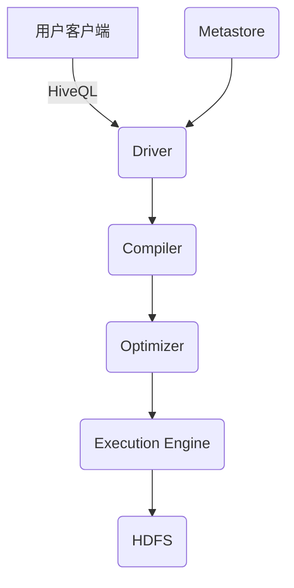
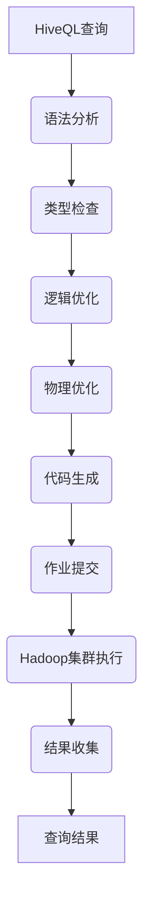
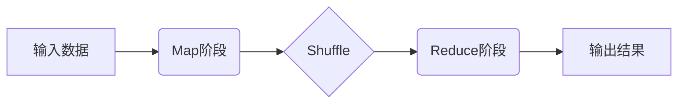

# HiveQL在物联网分析中的应用

## 1. 背景介绍

### 1.1 物联网概述

物联网(Internet of Things, IoT)是一种将各种信息传感设备与互联网相连接的网络,旨在实现物与物、物与人之间的智能化连接和信息交换。物联网技术的发展使得我们能够从各种终端设备(如传感器、摄像头、可穿戴设备等)收集大量的数据,这些数据反映了现实世界的各种状态和事件。

随着物联网的快速发展,海量的物联网数据不断产生,对于如何高效地存储、管理和分析这些数据成为了一个重大挑战。传统的关系型数据库在处理这些大规模、多样化、快速变化的数据时往往表现不佳。因此,大数据技术应运而生,为物联网数据的处理提供了新的解决方案。

### 1.2 大数据技术与Hive

大数据技术主要包括分布式存储系统(如HDFS)、分布式计算框架(如MapReduce、Spark)和数据处理工具(如Hive、Pig等)。其中,Hive是一种建立在Hadoop之上的数据仓库工具,它提供了类SQL的查询语言HiveQL(Hive Query Language),使得用户可以使用熟悉的SQL语法来处理存储在HDFS中的大规模数据集。

Hive的优势在于它能够高效地处理海量的结构化和半结构化数据,并且支持多种数据格式(如文本文件、SequenceFile、RCFile等)。此外,Hive还具有较好的容错性和可扩展性,可以在大规模集群环境中运行。

## 2. 核心概念与联系

### 2.1 Hive架构

Hive的架构主要包括以下几个核心组件:

1. **元数据存储(Metastore)**: 用于存储Hive中的元数据信息,如表、视图、分区等的定义。Metastore默认使用Derby数据库,也可以使用MySQL等关系型数据库。

2. **驱动器(Driver)**: 负责处理用户输入的HiveQL语句,将其转换为一系列的MapReduce任务。

3. **编译器(Compiler)**: 将HiveQL语句转换为执行计划,并生成相应的MapReduce作业。

4. **优化器(Optimizer)**: 对编译器生成的执行计划进行优化,以提高查询效率。

5. **执行引擎(Execution Engine)**: 在Hadoop集群上执行MapReduce作业,并返回查询结果。

下图展示了Hive的基本架构:



### 2.2 Hive数据模型

Hive中的数据模型与传统的关系型数据库类似,主要包括以下几个核心概念:

1. **数据库(Database)**: 用于存放相关的表,类似于关系型数据库中的数据库概念。

2. **表(Table)**: 表是存储数据的核心单元,由行和列组成。Hive支持内部表(Managed Table)和外部表(External Table)两种类型。

3. **视图(View)**: 视图是一种虚拟表,它是基于其他表或视图的查询结果定义的。

4. **分区(Partition)**: 分区是将表中的数据按照某些列的值进行划分,每个分区都是表的一个子集。分区可以提高查询效率。

5. **存储桶(Bucket)**: 存储桶是对表中的数据进行哈希取值,将数据划分到不同的文件中,以提高数据的采样效率。

## 3. 核心算法原理具体操作步骤 

### 3.1 Hive查询执行流程

当用户提交一个HiveQL查询时,Hive会经历以下几个主要步骤来执行该查询:

1. **语法分析**: 驱动器将HiveQL语句传递给编译器,编译器会对语句进行语法分析,检查语法是否正确。

2. **类型检查**: 编译器会对查询中涉及的表、列、函数等进行类型检查,确保类型匹配。

3. **逻辑优化**: 优化器会对查询的逻辑执行计划进行优化,如重写查询、选择合适的连接顺序等。

4. **物理优化**: 优化器会对查询的物理执行计划进行优化,如选择合适的Join算法、减少数据传输等。

5. **代码生成**: 编译器会根据优化后的执行计划生成相应的MapReduce作业。

6. **作业提交**: 执行引擎将生成的MapReduce作业提交到Hadoop集群上运行。

7. **结果收集**: 执行引擎从Hadoop集群收集MapReduce作业的输出结果,并返回给用户。

下图展示了Hive查询的执行流程:



### 3.2 MapReduce执行原理

Hive底层依赖于Hadoop的MapReduce框架来执行查询任务。MapReduce是一种分布式计算模型,它将计算任务拆分为两个阶段:Map阶段和Reduce阶段。

1. **Map阶段**:
   - 输入数据被拆分为多个数据块,每个数据块由一个Map任务处理。
   - Map任务对输入数据进行过滤、投影、转换等操作,生成键值对形式的中间结果。
   - 中间结果根据键值进行分区和排序,然后传递给Reduce阶段。

2. **Reduce阶段**:
   - Reduce任务接收来自Map阶段的中间结果,对具有相同键的值进行聚合或合并操作。
   - Reduce任务的输出结果就是最终的查询结果。

下图展示了MapReduce的执行流程:



Hive会根据查询的复杂度生成一个或多个MapReduce作业,每个作业都会经历上述的Map和Reduce阶段。例如,对于一个简单的Select查询,Hive只需要生成一个MapReduce作业;而对于一个Join查询,Hive可能需要生成多个MapReduce作业,分别执行不同的操作。

## 4. 数学模型和公式详细讲解举例说明

在物联网数据分析中,常常需要对传感器采集的时序数据进行统计和建模。Hive提供了丰富的内置函数和UDF(User-Defined Function),可以帮助我们进行各种数学计算和统计分析。

### 4.1 时序数据建模

对于时序数据,我们常常需要对其进行平滑处理,以减小噪声的影响。常用的平滑方法包括移动平均(Moving Average)和指数平滑(Exponential Smoothing)等。

#### 4.1.1 移动平均

移动平均是一种常用的时序数据平滑方法,它通过计算一个固定窗口内的数据平均值来估计当前时间点的值。移动平均的公式如下:

$$
S_t = \frac{1}{n}\sum_{i=t-n+1}^{t}x_i
$$

其中,$ S_t $表示时间点t的平滑值,$ x_i $表示时间点i的原始值,n表示平滑窗口的大小。

在Hive中,我们可以使用`lag`和`lead`函数来实现移动平均:

```sql
SELECT t, 
       (x + coalesce(lag(x, 1) over (order by t), x) + coalesce(lead(x, 1) over (order by t), x)) / 3 as moving_avg
FROM data
ORDER BY t;
```

上述查询计算了一个3点移动平均,即每个时间点的平滑值是该点及其前后两个点的平均值。

#### 4.1.2 指数平滑

指数平滑是另一种常用的时序数据平滑方法,它赋予最新的观测值更大的权重,而较旧的观测值权重会指数级递减。指数平滑的公式如下:

$$
S_t = \alpha x_t + (1 - \alpha)S_{t-1}
$$

其中,$ S_t $表示时间点t的平滑值,$ x_t $表示时间点t的原始值,$ \alpha $是平滑系数(0 < $ \alpha $ < 1),$ S_{t-1} $是前一时间点的平滑值。

在Hive中,我们可以使用自定义的UDF来实现指数平滑:

```sql
CREATE TEMPORARY FUNCTION exp_smooth AS 'com.example.ExponentialSmoothing'
  USING FILE '/path/to/exp_smooth.jar';

SELECT t, 
       exp_smooth(x, 0.3, lag(exp_smooth, 1) over (order by t)) as exp_smooth_val
FROM data
ORDER BY t;
```

上述查询使用了一个名为`exp_smooth`的自定义UDF,该UDF接受三个参数:当前观测值`x`、平滑系数`alpha`和前一时间点的平滑值。通过`lag`函数,我们可以获取前一时间点的平滑值,从而实现指数平滑。

### 4.2 线性回归

线性回归是一种常用的统计建模方法,它试图找到一条最佳拟合直线,使得数据点到直线的残差平方和最小。线性回归的公式如下:

$$
y = \beta_0 + \beta_1 x + \epsilon
$$

其中,$ y $是因变量,$ x $是自变量,$ \beta_0 $和$ \beta_1 $分别是截距和斜率,$ \epsilon $是随机误差项。

我们可以使用最小二乘法来估计$ \beta_0 $和$ \beta_1 $的值,使得残差平方和最小:

$$
\begin{aligned}
\beta_1 &= \frac{\sum_{i=1}^{n}(x_i - \bar{x})(y_i - \bar{y})}{\sum_{i=1}^{n}(x_i - \bar{x})^2} \\
\beta_0 &= \bar{y} - \beta_1 \bar{x}
\end{aligned}
$$

其中,$ \bar{x} $和$ \bar{y} $分别表示$ x $和$ y $的均值。

在Hive中,我们可以使用内置的`corr`函数计算相关系数,然后根据相关系数和均值计算出$ \beta_0 $和$ \beta_1 $:

```sql
WITH stats AS (
  SELECT corr(x, y) as corr_xy,
         avg(x) as avg_x,
         avg(y) as avg_y
  FROM data
)
SELECT avg_y - corr_xy * avg_x as beta_0,
       corr_xy * stddev_pop(y) / stddev_pop(x) as beta_1
FROM stats
CROSS JOIN (
  SELECT stddev_pop(x) as stddev_x,
         stddev_pop(y) as stddev_y
  FROM data
);
```

上述查询首先计算x和y的相关系数、均值和标准差,然后根据这些统计量计算出线性回归的系数$ \beta_0 $和$ \beta_1 $。

## 5. 项目实践:代码实例和详细解释说明

在本节中,我们将通过一个实际的物联网数据分析项目来演示如何使用Hive进行数据处理和分析。我们将使用一个模拟的温室环境监控数据集,该数据集包含了温室内的温度、湿度、光照强度等传感器数据。

### 5.1 数据准备

首先,我们需要将原始数据文件上传到HDFS中。假设我们有一个名为`greenhouse.csv`的CSV文件,包含以下列:

- `timestamp`: 时间戳
- `temperature`: 温度(摄氏度)
- `humidity`: 湿度(百分比)
- `light`: 光照强度(勒克斯)

我们可以使用以下命令将数据文件上传到HDFS:

```bash
hdfs dfs -put greenhouse.csv /user/hive/warehouse/greenhouse/
```

### 5.2 创建Hive表

接下来,我们需要在Hive中创建一个表来存储上传的数据。我们可以使用以下HiveQL语句创建一个外部表:

```sql
CREATE EXTERNAL TABLE greenhouse (
  timestamp BIGINT,
  temperature DOUBLE,
  humidity DOUBLE,
  light DOUBLE
)
ROW FORMAT DELIMITED FIELDS TERMINATED BY ','
LOCATION '/user/hive/warehouse/greenhouse/';
```

上述语句创建了一个名为`greenhouse`的外部表,表中包含四列:时间