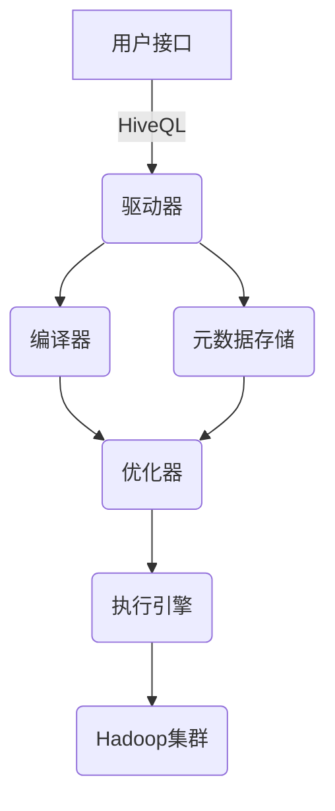
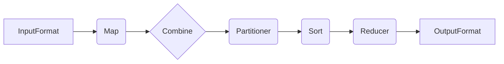

# Hive原理与代码实例讲解

## 1.背景介绍

Apache Hive是一种建立在Hadoop之上的数据仓库基础架构，它提供了一种类似SQL的查询语言Hive QL，使得用户可以用熟悉的SQL语法来查询和分析存储在Hadoop分布式文件系统(HDFS)中的海量数据。Hive的出现极大地降低了处理大数据的门槛，使得数据分析工作不再只能由精通Java的Hadoop开发人员来完成，也让传统的数据分析人员可以快速上手。

Hive的核心思想是将Hive QL语句转换为一系列的MapReduce作业在Hadoop集群上执行。Hive通过将SQL语句转换为MapReduce作业来实现高效的并行处理,可以处理TB级别的大数据。同时,Hive还提供了一个元数据存储服务(Metastore)来存储数据库、表、分区等元数据信息,使得用户可以像使用传统数据库一样来管理Hive中的数据。

Hive的主要优势包括:

- **SQL友好**:Hive提供了类似SQL的查询语言HiveQL,降低了编程门槛,使得数据分析人员可以快速上手。
- **可扩展性**:Hive建立在Hadoop之上,可以利用Hadoop的可扩展性来处理海量数据。
- **容错性**:Hive继承了Hadoop的容错特性,能够自动处理节点故障。
- **成本低廉**:Hive可以运行在商用硬件集群上,成本低廉。

总的来说,Hive为海量数据的存储、查询和分析提供了一个强大而友好的解决方案。

## 2.核心概念与联系

### 2.1 Hive架构

Hive的架构主要包括以下几个核心组件:

1. **用户接口(CLI/Web UI)**:用户可以通过命令行(CLI)或Web UI提交HiveQL语句。
2. **驱动器(Driver)**:Driver负责将HiveQL语句转换为一系列的MapReduce作业。
3. **编译器(Compiler)**:Compiler将HiveQL语句转换为执行计划。
4. **优化器(Optimizer)**:Optimizer对执行计划进行优化,以提高查询效率。
5. **执行引擎(Execution Engine)**:执行引擎负责在Hadoop集群上执行MapReduce作业。
6. **元数据存储(Metastore)**:Metastore存储了Hive中的元数据信息,如数据库、表、分区等。

Hive的架构如下所示:



### 2.2 Hive数据模型

Hive中的数据模型与传统数据库类似,包括数据库(Database)、表(Table)、视图(View)和分区(Partition)等概念。

- **数据库(Database)**:相当于命名空间,用于组织和管理表。
- **表(Table)**:表是存储数据的基本单元,每个表都有一个schema来描述其字段。
- **视图(View)**:视图是一个逻辑表,它是基于SQL语句定义的,不存储实际数据。
- **分区(Partition)**:分区是Hive中一种将表水平切分的机制,可以提高查询效率。

Hive中的数据存储在HDFS上,通常以文本文件的形式存储,支持多种文件格式如TextFile、SequenceFile、RCFile等。

### 2.3 Hive查询执行流程

当用户提交一个HiveQL语句时,Hive的查询执行流程如下:

1. **语法分析**:Driver将HiveQL语句字符串解析成抽象语法树(AST)。
2. **类型检查和语义分析**:编译器对AST进行类型检查和语义分析,构建查询块(Query Block)。
3. **逻辑计划生成**:编译器根据查询块生成逻辑执行计划。
4. **优化**:优化器对逻辑执行计划进行一系列规则优化,生成优化后的逻辑执行计划。
5. **物理计划生成**:编译器根据优化后的逻辑执行计划生成物理执行计划。
6. **执行**:执行引擎根据物理执行计划生成一个或多个MapReduce作业,并提交到Hadoop集群执行。

## 3.核心算法原理具体操作步骤

### 3.1 MapReduce执行流程

Hive将HiveQL语句转换为一个或多个MapReduce作业在Hadoop集群上执行。MapReduce作业的执行流程如下:

1. **Map阶段**
   - **InputFormat**:读取输入数据,将其划分为多个Split,并为每个Split创建一个Map Task。
   - **Map**:每个Map Task并行处理一个Split中的数据,执行用户自定义的Map函数,生成键值对。
   - **Combine(可选)**:对Map输出的键值对进行局部合并,减少传输到Reduce端的数据量。

2. **Shuffle阶段**
   - **Partitioner**:根据分区函数对Map输出的键值对进行分区。
   - **Sort**:对每个Partition中的键值对进行排序。

3. **Reduce阶段**
   - **Reducer**:每个Reduce Task并行处理一个Partition中的数据,执行用户自定义的Reduce函数,生成最终结果。
   - **OutputFormat**:将Reduce输出的结果写入HDFS或其他文件系统。

MapReduce执行流程示意图:



### 3.2 Join算法

Hive支持多种Join算法,常见的有:

1. **Common Join**:常规的Join算法,将两个表的数据全部读入内存进行Join操作。适用于小表Join。

2. **Bucket Map Join**:将两个表按照相同的Bucket进行划分,然后对每个Bucket内的数据进行Join操作。适用于大表Join。

3. **Sort Merge Bucket Map Join**:在Bucket Map Join的基础上,先对每个Bucket内的数据进行排序,然后再进行归并Join操作。适用于大表Join,性能更优。

4. **Shuffle Join**:将一个表的数据读入内存作为构建表(Build Table),另一个表的数据作为探测表(Probe Table),通过Shuffle和Reduce阶段实现Join操作。适用于大表Join。

Hive会根据Join操作的输入表大小、Bucket情况等自动选择合适的Join算法。

### 3.3 Hive优化

Hive提供了多种优化策略来提高查询性能,主要包括:

1. **行列裁剪**:只读取查询所需的行和列数据,减少I/O开销。
2. **分区裁剪**:根据查询条件,只扫描所需的分区数据,减少数据扫描量。
3. **谓词下推**:将查询条件下推到存储层,在读取数据时就进行过滤,减少数据传输量。
4. **Join重排序**:优化Join顺序,先执行小表Join,减少中间数据量。
5. **Map Join**:将小表数据读入内存,在Map端执行Join操作,避免启动Reduce任务。
6. **自动选择Join算法**:根据输入表大小、Bucket情况等自动选择合适的Join算法。
7. **压缩**:对输入和输出数据进行压缩,减少I/O开销和网络传输开销。
8. **向量化查询执行**:使用向量化执行引擎,提高CPU利用率。

## 4.数学模型和公式详细讲解举例说明

在Hive中,常用的数学模型和公式主要包括:

### 4.1 MapReduce成本模型

MapReduce成本模型用于估计MapReduce作业的执行成本,从而优化执行计划。成本模型主要考虑以下几个因素:

- **I/O成本**:读写HDFS的I/O开销。
- **CPU成本**:Map和Reduce任务的CPU开销。
- **网络成本**:Shuffle阶段的网络传输开销。

MapReduce作业的总成本可以表示为:

$$
Cost_{total} = Cost_{io} + Cost_{cpu} + Cost_{network}
$$

其中:

- $Cost_{io}$是I/O成本,与输入数据大小和输出数据大小有关。
- $Cost_{cpu}$是CPU成本,与Map和Reduce任务的计算复杂度有关。
- $Cost_{network}$是网络成本,与Shuffle阶段传输数据量有关。

优化器会根据成本模型估算不同执行计划的成本,选择成本最小的执行计划。

### 4.2 数据采样

Hive使用数据采样来估计查询结果的基数(行数)和数据分布,从而优化执行计划。常用的采样方法包括:

1. **RANDOM采样**:从数据集中随机抽取一部分数据作为样本。

2. **CLUSTER采样**:按照某个列的值对数据进行分组,从每个组中随机抽取一部分数据作为样本。

设总数据量为$N$,采样率为$p$,则采样数据量为$n = N \times p$。采样误差可以用置信区间来表示:

$$
\bar{x} \pm z_{\alpha/2} \times \frac{\sigma}{\sqrt{n}}
$$

其中:

- $\bar{x}$是样本均值
- $\sigma$是样本标准差
- $z_{\alpha/2}$是置信水平对应的正态分布分位数
- $n$是样本大小

通过控制采样率和置信水平,可以在一定误差范围内估计查询结果。

### 4.3 Bloom Filter

Bloom Filter是一种空间高效的概率数据结构,常用于数据去重和过滤。Hive中使用Bloom Filter来优化Join和GroupBy操作。

Bloom Filter由一个长度为$m$的位向量和$k$个哈希函数组成。插入一个元素时,对它计算$k$个哈希值,并将对应的位置置为1。查询一个元素是否存在时,同样计算$k$个哈希值,如果对应的位置都为1,则有很大概率该元素存在(存在一定的假阳性率)。

Bloom Filter的假阳性率可以用下式估计:

$$
f = (1 - e^{-kn/m})^k \approx (1 - e^{-k^2/2})^{k/2}
$$

其中:

- $k$是哈希函数个数
- $n$是插入元素个数
- $m$是位向量长度

通过调节$k$和$m$的值,可以控制Bloom Filter的空间开销和精度。

## 4.项目实践:代码实例和详细解释说明

### 4.1 创建表

```sql
-- 创建数据库
CREATE DATABASE hive_demo;

-- 使用数据库
USE hive_demo;

-- 创建表
CREATE TABLE users (
    id INT,
    name STRING,
    age INT
)
ROW FORMAT DELIMITED
FIELDS TERMINATED BY ','
STORED AS TEXTFILE;

-- 加载数据
LOAD DATA LOCAL INPATH '/path/to/users.txt' OVERWRITE INTO TABLE users;
```

上述代码首先创建了一个名为`hive_demo`的数据库,然后在该数据库中创建了一个名为`users`的表。`users`表有三个字段:`id`(整型)、`name`(字符串)和`age`(整型)。

`ROW FORMAT DELIMITED`子句指定了数据文件的格式,`FIELDS TERMINATED BY ','`表示各字段用逗号分隔。`STORED AS TEXTFILE`指定了数据以纯文本格式存储在HDFS上。

最后,使用`LOAD DATA`语句从本地路径`/path/to/users.txt`加载数据到`users`表中。

### 4.2 查询操作

```sql
-- 查询所有记录
SELECT * FROM users;

-- 查询年龄大于30的记录
SELECT id, name, age 
FROM users
WHERE age > 30;

-- 按年龄分组计数
SELECT age, COUNT(*) AS count
FROM users
GROUP BY age;

-- 内连接查询
SELECT u.id, u.name, o.order_id
FROM users u
JOIN orders o ON u.id = o.user_id;
```

上述代码展示了一些常见的查询操作:

- `SELECT * FROM users`查询`users`表中的所有记录。
- `SELECT id, name, age FROM users WHERE age > 30`查询年龄大于30的记录,只返回`id`、`name`和`age`三个字段。
- `SELECT age, COUNT(*) AS count FROM users GROUP BY age`按年龄分组,计算每个年龄段的记录数。
- `SELECT u.id, u.name, o.order_id FROM users u JOIN orders o ON u.id = o.user_id`执行内连接查询,将`users`表和`orders`表按`id`和`user_