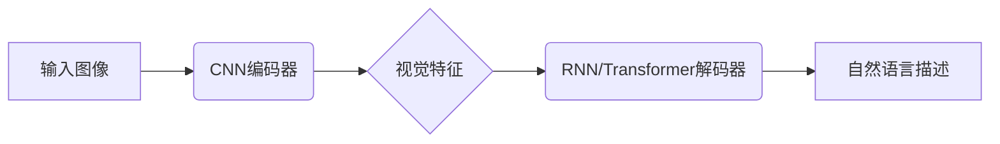

# Image Captioning原理与代码实例讲解

## 1.背景介绍

### 1.1 什么是Image Captioning?

Image Captioning是自然语言处理(NLP)和计算机视觉(CV)领域的一个交叉任务,旨在自动生成描述给定图像内容的自然语言描述。它将图像理解和语言生成结合在一起,是一项具有挑战性的人工智能任务。

Image Captioning的应用场景非常广泛,例如:

- 辅助视障人士理解图像内容
- 自动添加图像标题和描述,改善网页可访问性
- 人机交互系统中的图像理解和问答
- 自动化图像索引和检索
- 视频理解和描述等

### 1.2 Image Captioning的挑战

尽管Image Captioning看似简单,但实现起来面临着诸多挑战:

- 视觉理解:准确识别图像中的对象、场景、属性和关系
- 语言建模:生成通顺、准确、信息丰富的自然语言描述
- 视觉与语言的对应:建立图像视觉特征与文字描述之间的映射关系
- 多模态融合:有效融合视觉和语言信息
- 评估标准:缺乏统一的评估指标来衡量生成描述的质量

## 2.核心概念与联系

### 2.1 编码器-解码器架构

Image Captioning任务通常采用编码器-解码器(Encoder-Decoder)架构,其中:

- 编码器(Encoder)负责从输入图像中提取视觉特征
- 解码器(Decoder)将视觉特征转换为自然语言描述

编码器常用的是预训练的卷积神经网络(CNN),如VGG、ResNet等,用于提取图像的视觉特征。解码器则通常采用循环神经网络(RNN)或Transformer等序列生成模型,将视觉特征转化为单词序列。



### 2.2 注意力机制

注意力机制(Attention Mechanism)是Image Captioning模型的关键组成部分,它允许模型在生成每个单词时,选择性地关注图像的不同区域,从而产生更准确、信息更丰富的描述。

注意力机制的作用包括:

- 突出显示与当前生成单词相关的图像区域
- 建立单词与图像区域之间的对应关系
- 增强模型对局部细节的理解能力

通过注意力机制,模型可以更好地捕捉图像与文本描述之间的细粒度对应关系,提高生成描述的质量。

### 2.3 多模态融合

由于Image Captioning涉及视觉和语言两个模态,因此需要有效地融合两种模态的信息。常见的多模态融合方法包括:

- 特征拼接(Feature Concatenation):将视觉特征和文本特征拼接在一起,作为下游任务的输入。
- 双通道编码(Dual Channel Encoding):分别对视觉和文本信息进行编码,然后将编码后的特征进行交互和融合。
- 交互注意力融合(Interactive Attention Fusion):使用注意力机制在视觉和文本特征之间建立交互,实现特征级别的融合。

有效的多模态融合有助于模型更好地捕捉视觉和语言之间的语义关联,从而生成更准确、更富有描述性的文本描述。

## 3.核心算法原理具体操作步骤

Image Captioning任务的核心算法通常包括以下几个主要步骤:

### 3.1 图像编码

1. 使用预训练的CNN模型(如VGG、ResNet等)对输入图像进行编码,提取图像的视觉特征。
2. 常见的做法是使用CNN的中间层输出作为图像特征,或对最后一层的特征图进行空间注意力pooling得到全局图像特征向量。

### 3.2 序列解码

1. 将图像特征作为初始输入,送入RNN或Transformer解码器。
2. 解码器在每个时间步根据当前隐藏状态和注意力权重,预测下一个单词。
3. 使用注意力机制,解码器可以选择性地关注图像的不同区域,捕捉与当前生成单词相关的视觉信息。
4. 将预测的单词附加到输出序列中,重复上述步骤直到生成完整的描述句子。

### 3.3 训练目标

Image Captioning模型通常以最大化生成描述与ground truth描述之间的相似性为目标进行训练。常用的损失函数包括:

- 交叉熵损失(Cross Entropy Loss):最小化生成序列与ground truth序列之间的交叉熵。
- reinforcement learning:将生成描述的质量作为奖赏,使用策略梯度方法优化模型参数。
- 对抗训练(Adversarial Training):使用判别器评估生成描述的质量,对抗训练生成器和判别器。

### 3.4 评估指标

常用的Image Captioning评估指标包括:

- BLEU(Bilingual Evaluation Understudy):计算生成描述与参考描述之间的n-gram重叠程度。
- METEOR(Metric for Evaluation of Translation with Explicit ORdering):除了考虑n-gram重叠外,还评估单词的匹配准确度和匹配顺序。
- CIDEr(Consensus-based Image Description Evaluation):使用人工评分的描述作为参考,评估生成描述与人工描述的相似性。
- SPICE(Semantic Propositional Image Caption Evaluation):基于场景图的语义相似性衡量生成描述的质量。

## 4.数学模型和公式详细讲解举例说明

### 4.1 编码器:CNN特征提取

给定输入图像$I$,我们使用预训练的CNN模型$f_{cnn}$提取图像的视觉特征向量$v$:

$$v = f_{cnn}(I)$$

其中$f_{cnn}$可以是VGG、ResNet等常用的CNN模型。视觉特征向量$v$通常是CNN最后一层的特征图经过pooling或展平后得到的向量。

### 4.2 解码器:RNN/Transformer生成描述

解码器的目标是根据输入的视觉特征$v$生成描述文本序列$Y=\{y_1, y_2, ..., y_T\}$,其中$y_t$是序列中的第$t$个单词。

#### 4.2.1 RNN解码器

对于基于RNN的解码器,在每个时间步$t$,RNN的隐藏状态$h_t$由上一时间步的隐藏状态$h_{t-1}$和当前输入单词$y_{t-1}$计算得到:

$$h_t = f_{rnn}(h_{t-1}, y_{t-1})$$

其中$f_{rnn}$是RNN的递归计算函数,如LSTM或GRU。

生成的单词$y_t$由隐藏状态$h_t$、视觉特征$v$和注意力权重$\alpha_t$共同决定:

$$p(y_t|y_{<t}, v) = f_{out}(h_t, v, \alpha_t)$$

其中$f_{out}$是输出层函数,通常是一个线性层加softmax计算单词概率分布。

注意力权重$\alpha_t$通过注意力机制计算得到,用于选择性关注与当前生成单词相关的图像区域。

#### 4.2.2 Transformer解码器

Transformer解码器采用自注意力(Self-Attention)和编码器-解码器注意力(Encoder-Decoder Attention)机制。在每个解码器层中,自注意力用于捕捉输出序列内部的依赖关系,而编码器-解码器注意力则融合了视觉特征$v$。

对于第$l$层的解码器子层,输入为$X^l$,自注意力计算如下:

$$X^l_{sa} = \textrm{SelfAttention}(X^l, X^l, X^l)$$

编码器-解码器注意力计算如下:

$$X^l_{ea} = \textrm{EncoderAttention}(X^l_{sa}, v, v)$$

最终的输出$X^{l+1}$由$X^l_{sa}$和$X^l_{ea}$通过前馈网络(Feed Forward Network)融合得到。

生成的单词分布$p(y_t|y_{<t}, v)$由最终的解码器输出$X^L$计算得到。

### 4.3 注意力机制

注意力机制是Image Captioning模型的关键部分,它建立了图像区域与生成单词之间的对应关系。常见的注意力机制包括:

#### 4.3.1 加性注意力(Additive Attention)

加性注意力通过一个单层前馈网络计算注意力权重:

$$
\begin{aligned}
e_{t,k} &= v_a^\top \tanh(W_a h_t + U_a a_k) \\
\alpha_{t,k} &= \textrm{softmax}(e_{t,k})
\end{aligned}
$$

其中$h_t$是解码器的隐藏状态,$a_k$是图像的第$k$个注意力区域的特征向量,$v_a$、$W_a$和$U_a$是可学习的权重参数。注意力权重$\alpha_{t,k}$表示第$t$个单词对第$k$个注意力区域的关注程度。

#### 4.3.2 点积注意力(Dot Product Attention)

点积注意力直接计算查询向量$q$与键向量$k$的点积作为相关性分数:

$$\textrm{Attention}(Q, K, V) = \textrm{softmax}(\frac{QK^\top}{\sqrt{d_k}})V$$

其中$Q$、$K$和$V$分别是查询、键和值的矩阵表示,$d_k$是缩放因子。

在Image Captioning任务中,查询向量$q$可以是解码器的隐藏状态$h_t$,键$K$和值$V$则由图像特征向量$v$线性映射得到。

### 4.4 多模态融合

多模态融合是将视觉和语言信息有效融合的关键。常见的融合方法包括:

#### 4.4.1 特征拼接(Feature Concatenation)

将视觉特征$v$和文本特征(如词嵌入或RNN隐藏状态)$h_t$拼接在一起,作为下游任务(如分类或生成)的输入:

$$x_t = [v; h_t]$$

#### 4.4.2 双通道编码(Dual Channel Encoding)

分别对视觉和文本信息进行编码,然后将编码后的特征进行交互和融合。例如,可以使用两个独立的RNN分别编码视觉和文本序列,然后将两个RNN的隐藏状态进行融合。

#### 4.4.3 交互注意力融合(Interactive Attention Fusion)

使用注意力机制在视觉和文本特征之间建立交互,实现特征级别的融合。例如,可以使用文本特征作为查询,视觉特征作为键和值,通过注意力机制选择性关注与文本相关的视觉特征。

## 5.项目实践:代码实例和详细解释说明

在这一部分,我们将介绍一个基于Transformer的Image Captioning模型的PyTorch实现,并详细解释代码的各个部分。

### 5.1 数据预处理

首先,我们需要对图像和文本数据进行预处理,包括:

1. 加载图像数据集,如COCO或Flickr30k等。
2. 对图像进行预处理,如调整大小、归一化等。
3. tokenize文本描述,构建词表(vocabulary)。
4. 将文本描述转换为词索引序列。

```python
import torchvision.transforms as transforms

# 图像预处理
transform = transforms.Compose([
    transforms.Resize((224, 224)),
    transforms.ToTensor(),
    transforms.Normalize(mean=[0.485, 0.456, 0.406], std=[0.229, 0.224, 0.225])
])

# 加载数据集
dataset = CaptionDataset(img_dir, caption_file, vocab, transform)

# 构建数据加载器
dataloader = DataLoader(dataset, batch_size=32, shuffle=True)
```

### 5.2 模型架构

我们的模型采用编码器-解码器架构,其中编码器使用预训练的ResNet提取图像特征,解码器使用Transformer生成描述。

```python
import torch.nn as nn
from torchvision.models import resnet101

class EncoderCNN(nn.Module):
    def __init__(self):
        super(EncoderCNN, self).__init__()
        self.resnet = resnet101(pretrained=True)
        self.resnet = nn.Sequential(*list(self.resnet.children())[:-2])
        
    def forward(self, images):
        features = self.resnet(images)
        features = features.permute(0