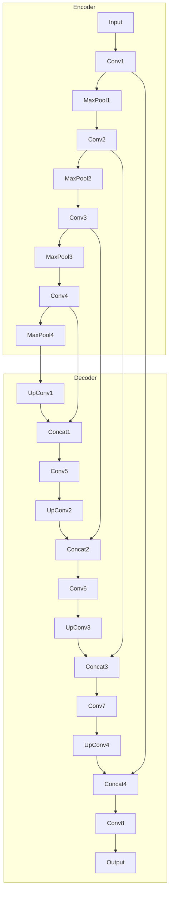

# Image Segmentation 原理与代码实战案例讲解

## 1. 背景介绍

图像分割是计算机视觉和图像处理领域的一个关键任务,旨在将数字图像划分为多个独立的区域或对象。这种分割过程对于图像理解、目标检测、目标识别和目标跟踪等任务至关重要。图像分割广泛应用于医疗成像、自动驾驶、无人机航拍、机器人视觉等领域。

### 1.1 图像分割的重要性

图像分割是计算机视觉的基础,它能够将图像中的对象与背景分离开来,为后续的高级视觉任务提供基础。准确的图像分割对于提高目标检测、识别和跟踪的性能至关重要。此外,在医疗成像领域,图像分割可用于诊断疾病、规划手术和监测治疗进展。

### 1.2 图像分割的挑战

尽管图像分割在许多领域具有广泛的应用,但它仍然面临着一些挑战:

1. **复杂场景**: 真实世界中的图像通常包含复杂的背景、遮挡、光照变化和噪声,这使得准确分割对象变得更加困难。

2. **可变形对象**: 许多对象具有不规则的形状和边界,难以使用简单的几何形状来表示。

3. **相似性**: 图像中的对象可能具有相似的颜色、纹理或其他特征,使得区分它们变得困难。

4. **计算复杂性**: 一些图像分割算法的计算成本很高,需要大量的计算资源和时间。

### 1.3 常用图像分割方法概述

常见的图像分割方法包括:

1. **阈值分割**: 根据像素的灰度值或颜色值将图像划分为不同的区域。

2. **边缘检测分割**: 通过检测图像中的边缘来分割对象。

3. **区域生长分割**: 从种子点开始,将具有相似特征的相邻像素合并成区域。

4. **聚类分割**: 根据像素的特征将图像划分为多个聚类。

5. **图割分割**: 将图像表示为加权无向图,通过最小化能量函数来分割对象。

6. **神经网络分割**: 使用深度学习模型(如U-Net、Mask R-CNN等)进行端到端的图像分割。

在本文中,我们将重点介绍基于深度学习的图像分割方法,特别是U-Net模型及其变体。

## 2. 核心概念与联系

### 2.1 图像分割的形式化定义

给定一个输入图像 $I$,图像分割的目标是将其划分为 $K$ 个不相交的区域 $\{R_1, R_2, \dots, R_K\}$,使得:

$$
\bigcup_{i=1}^{K} R_i = I \quad \text{且} \quad R_i \cap R_j = \emptyset, \quad \forall i \neq j
$$

每个区域 $R_i$ 应该具有某种相似性或连续性,例如相似的颜色、纹理或形状。图像分割的目标是找到一个合适的分割,使得每个区域内部的像素具有高度相似性,而不同区域之间的像素具有明显差异。

### 2.2 监督学习与非监督学习

根据是否使用带标签的训练数据,图像分割方法可分为监督学习和非监督学习两大类:

1. **监督学习分割**: 利用带有像素级别标签的训练数据集,通过监督学习的方式训练神经网络模型进行分割。这种方法通常能够获得更高的分割精度,但需要大量的人工标注工作。

2. **非监督学习分割**: 不需要带标签的训练数据,通过聚类、图割等方法自动发现图像中的对象和区域。这种方法标注成本较低,但分割精度通常低于监督学习方法。

在本文中,我们将重点介绍基于监督学习的深度神经网络分割模型,特别是U-Net及其变体。

### 2.3 全卷积神经网络

全卷积神经网络(Fully Convolutional Network, FCN)是一种用于像素级别预测任务(如图像分割)的神经网络架构。与传统的卷积神经网络不同,FCN不包含全连接层,而是使用全卷积层来保留空间信息。这使得FCN能够接受任意大小的输入图像,并输出与输入图像相同大小的特征映射。

FCN的基本思想是将传统的分类网络(如VGG或ResNet)的全连接层替换为卷积层,并在网络的最后添加上采样层(如反卷积层或转置卷积层)来恢复输出特征映射的空间分辨率。这种结构使FCN能够对输入图像进行像素级别的预测,从而实现图像分割等任务。

### 2.4 U-Net架构

U-Net是一种广泛使用的全卷积神经网络架构,专门设计用于图像分割任务。它由一个编码器(contracting path)和一个解码器(expansive path)组成,形成一个U形的结构。

编码器部分类似于传统的卷积神经网络,通过卷积和池化操作逐步捕获图像的高级语义特征。解码器部分则通过上采样和跳跃连接(skip connections)来恢复空间分辨率,同时融合来自编码器的低级特征,从而获得高质量的分割结果。

U-Net的主要优点是能够利用图像的全局和局部信息,同时保留了足够的空间信息,从而在医疗图像等具有复杂结构的图像上表现出色。它已成为许多图像分割任务的基线模型。



上图展示了U-Net的基本架构,其中编码器部分逐步捕获图像的高级语义特征,解码器部分则通过上采样和跳跃连接来恢复空间分辨率并融合低级特征。

## 3. 核心算法原理具体操作步骤 

在这一部分,我们将详细介绍U-Net及其变体的核心算法原理和具体操作步骤。

### 3.1 U-Net编码器

U-Net的编码器部分由多个卷积块组成,每个卷积块包含两个 $3\times3$ 的卷积层,后面接一个 $2\times2$ 的最大池化层。卷积层使用有效的零填充(effective zero-padding)来保持特征图的空间分辨率不变。

编码器的作用是逐步捕获输入图像的高级语义特征。随着网络深度的增加,特征图的空间分辨率逐渐降低,但特征图的通道数(即特征维度)逐渐增加,以编码更加抽象和复杂的特征。

在U-Net中,编码器的每一层都会保留其特征图,以便在解码器部分通过跳跃连接融合低级特征。这种设计有助于保留图像的空间信息,从而获得更精确的分割结果。

### 3.2 U-Net解码器

U-Net的解码器部分由多个上采样块组成,每个上采样块包含一个 $2\times2$ 的上采样层(如转置卷积层)、一个拼接层(concatenation layer)和两个 $3\times3$ 的卷积层。

上采样层的作用是将特征图的空间分辨率逐步恢复到与输入图像相同的大小。拼接层则将当前特征图与编码器对应层的特征图进行拼接,以融合低级特征。这种跳跃连接(skip connection)的设计能够有效地整合不同层次的特征,从而提高分割的精度和细节保真度。

解码器的最后一层是一个 $1\times1$ 的卷积层,用于将特征图映射到所需的类别数量(对于二值分割任务,输出通道数为2)。

### 3.3 损失函数和优化

U-Net通常采用交叉熵损失函数进行训练。对于二值分割任务,交叉熵损失函数可以表示为:

$$
\mathcal{L}(y, \hat{y}) = -\frac{1}{N} \sum_{i=1}^{N} \left[ y_i \log(\hat{y}_i) + (1 - y_i) \log(1 - \hat{y}_i) \right]
$$

其中 $y$ 是ground truth标签, $\hat{y}$ 是模型的预测输出, $N$ 是像素数量。

在多类别分割任务中,可以使用加权交叉熵损失函数或Dice损失函数等变体。

为了优化模型参数,通常采用随机梯度下降(Stochastic Gradient Descent, SGD)或Adam等优化算法。此外,还可以引入数据增广、正则化等技术来提高模型的泛化能力。

### 3.4 U-Net变体

虽然原始的U-Net已经在许多任务上取得了出色的表现,但研究人员也提出了多种变体,以进一步提高性能或适应特定的应用场景。一些常见的U-Net变体包括:

1. **Attention U-Net**: 在U-Net的基础上引入注意力机制,以更好地关注图像中的关键区域。

2. **3D U-Net**: 将U-Net扩展到三维,用于处理医学影像等三维数据。

3. **Nested U-Net**: 在U-Net的解码器部分嵌套了另一个U-Net,以捕获更精细的细节。

4. **R2U-Net**: 通过引入残差连接和U-Net的级联,提高了模型的表现。

5. **UNet++**: 采用嵌套和密集跳跃连接,进一步改善了特征融合。

这些变体通过不同的设计和优化,在特定任务或数据集上展现出更好的性能。根据具体需求,可以选择合适的U-Net变体进行使用和改进。

## 4. 数学模型和公式详细讲解举例说明

在这一部分,我们将详细介绍U-Net中涉及的一些数学模型和公式,并通过具体示例来加深理解。

### 4.1 卷积运算

卷积运算是神经网络中的基本运算,它通过在输入特征图上滑动一个小窗口(卷积核)来提取局部特征。对于二维图像,卷积运算可以表示为:

$$
(I * K)(i, j) = \sum_{m} \sum_{n} I(i+m, j+n) K(m, n)
$$

其中 $I$ 是输入特征图, $K$ 是卷积核, $i$ 和 $j$ 是输出特征图的坐标。

例如,给定一个 $3\times3$ 的输入特征图和一个 $2\times2$ 的卷积核,卷积运算的过程如下:

```
输入特征图:
1 2 3
4 5 6
7 8 9

卷积核:
1 2
3 4

输出特征图:
1*1 + 2*3 + 4*2 + 5*4 = 35   2*1 + 3*3 + 5*2 + 6*4 = 44
4*1 + 5*3 + 7*2 + 8*4 = 74   5*1 + 6*3 + 8*2 + 9*4 = 83
```

卷积运算能够提取输入特征图的局部模式,并生成新的特征图。通过堆叠多个卷积层,神经网络可以逐步捕获更高级的语义特征。

### 4.2 池化运算

池化运算是一种下采样操作,它通过在输入特征图上滑动一个小窗口,并对窗口内的值进行统计(如取最大值或平均值),从而生成一个空间分辨率降低的新特征图。

最大池化运算可以表示为:

$$
(I \circledast K)(i, j) = \max_{(m, n) \in R} I(i+m, j+n)
$$

其中 $I$ 是输入特征图, $K$ 是池化窗口, $R$ 是窗口的范围, $i$ 和 $j$ 是输出特征图的坐标。

例如