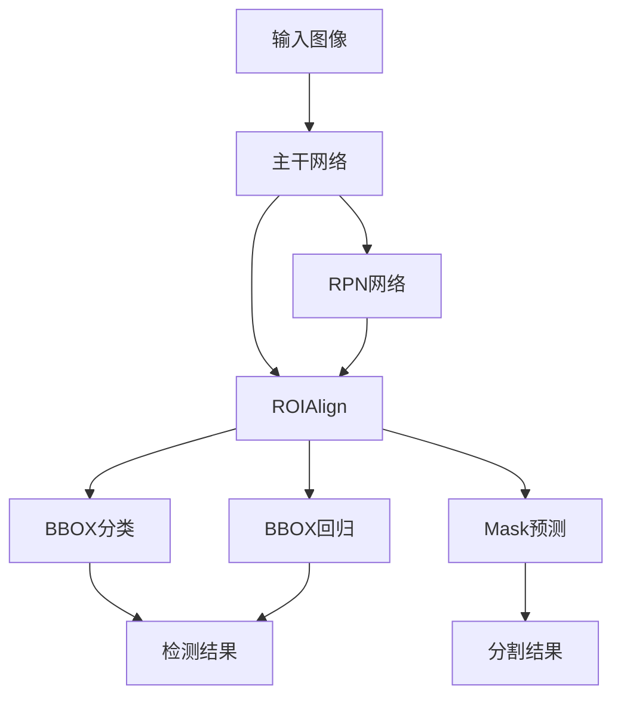

# Instance Segmentation原理与代码实例讲解

## 1.背景介绍

### 1.1 什么是Instance Segmentation?

Instance Segmentation是计算机视觉领域的一个重要任务,旨在对图像中的每个物体实例进行精确的像素级别的分割和识别。与语义分割(Semantic Segmentation)只关注识别物体类别不同,Instance Segmentation不仅需要识别出物体的类别,还需要将属于同一个物体实例的像素进行分组,并为每个实例分配一个唯一的ID。

例如,在一张图像中包含多只狗和多只猫时,语义分割只能将所有狗像素分为一类,所有猫像素分为另一类;而Instance Segmentation则需要能够将每只狗和每只猫分开,分别赋予不同的实例ID。这种精细化的分割对于许多计算机视觉应用场景至关重要,如自动驾驶、机器人导航、增强现实等。

### 1.2 Instance Segmentation的应用场景

Instance Segmentation技术在以下领域有着广泛的应用:

- **自动驾驶**: 精准识别和分割道路上的车辆、行人、障碍物等,为自动驾驶决策提供关键信息。
- **增强现实(AR)**: 将虚拟物体精准叠加到真实场景中的每个物体实例上。
- **机器人导航**: 帮助机器人精准识别和分割周围环境中的物体,实现精确导航。
- **视频监控**: 对视频画面中的每个运动目标进行实时分割和跟踪。
- **医疗影像分析**: 从CT、MRI等医学影像中分割出病灶、器官等感兴趣区域。

## 2.核心概念与联系  

### 2.1 Instance Segmentation与其他视觉任务的关系

为了更好地理解Instance Segmentation,我们需要将其与其他几种常见的计算机视觉任务进行对比和区分:

1. **图像分类(Image Classification)**: 对整个输入图像进行单标签分类,如判断一张图像中是否包含狗。

2. **目标检测(Object Detection)**: 在图像中定位出物体的边界框(bounding box),并对每个检测到的物体进行类别预测。但无法获得物体的精确轮廓。

3. **语义分割(Semantic Segmentation)**: 对图像中的每个像素进行分类,属于同一类别的像素被分配相同的标签。但无法区分同类物体的不同实例。

4. **实例分割(Instance Segmentation)**: 在语义分割的基础上,进一步将属于同一物体实例的像素分到一个独立的掩码(mask)中,为每个实例分配一个唯一的ID。

5. **全景分割(Panoptic Segmentation)**: 是Instance Segmentation和语义分割的总和,需要对图像中的每个像素进行分类,既分割出不同的物体实例,也分割出背景中的不可分割类别(如天空、道路等)。

从上面的对比可以看出,Instance Segmentation是一项极具挑战的综合型视觉任务,不仅需要精确分类,还需要实例分割,是目标检测和语义分割的高级扩展。

### 2.2 Instance Segmentation的核心挑战

实现高质量的Instance Segmentation面临以下几个主要挑战:

1. **对象分割精度**: 需要能够精准分割出物体实例的完整轮廓,对于形状复杂、部分遮挡的物体也能正确分割。

2. **实例区分能力**: 必须能够正确地将属于同一语义类别的不同物体实例区分开来,特别是在物体实例重叠的情况下。

3. **实时性能要求**: 在诸如自动驾驶、增强现实等应用场景中,往往需要实时的Instance Segmentation能力,对模型的计算效率有很高的要求。

4. **小物体实例分割**: 对于图像中的小物体实例(如远处的行人),由于分辨率较低,分割难度会大大增加。

5. **大规模数据集**: 由于Instance Segmentation是一个极具挑战的综合型任务,训练一个高质量的模型需要大量精细标注的数据集,而手工标注的成本极高。

## 3.核心算法原理具体操作步骤

### 3.1 Instance Segmentation的主要算法框架

目前,Instance Segmentation的主流算法框架可以分为两大类:

1. **两阶段算法**:先使用Region Proposal Network(RPN)生成候选区域,然后对这些候选区域执行分类、边界框回归和掩码预测三个子任务。代表算法有Mask R-CNN、PANet等。

2. **一阶段算法**:不使用RPN网络,而是直接对密集的先验边界框或关键点进行分类和掩码预测。代表算法有YOLACT、CondInst等。

我们以两阶段算法的经典之作Mask R-CNN为例,介绍其核心原理和操作步骤。

### 3.2 Mask R-CNN算法原理

Mask R-CNN是Facebook AI Research于2017年提出的一种基于区域的Instance Segmentation算法,它在Faster R-CNN的基础上增加了一个并行的掩码预测分支。Mask R-CNN的整体网络结构如下所示:

Mask R-CNN算法的核心步骤如下:

1. **主干网络(Backbone Network)**: 使用卷积神经网络(如ResNet、ResNeXt等)作为主干网络从输入图像中提取特征图。

2. **区域候选框生成(Region Proposal Network)**: RPN网络从主干网络的特征图中滑动窗口生成一系列区域候选框(Region Proposals),每个候选框对应一个可能的物体实例。

3. **ROIAlign**: 对于每个候选框区域,使用ROIAlign算法从主干网络的特征图中精确提取出对应的特征图块,作为后续BBOX分类、BBOX回归和Mask预测三个分支的输入。

4. **BBOX分类和回归**: 对每个候选框区域执行二分类(前景/背景)和边界框回归,过滤掉背景区域并优化前景区域的边界框坐标。

5. **Mask预测**: 对于每个前景区域,在相应的特征图块上执行像素级别的二值分类,生成该物体实例的掩码(mask)。

6. **后处理**: 使用非极大值抑制(NMS)等技术去除重复检测结果,最终输出每个物体实例的类别、边界框和掩码。

Mask R-CNN的创新之处在于引入了掩码预测分支,使得在精确定位物体实例的同时,还能够生成每个实例的精细掩码,从而实现了Instance Segmentation。

### 3.3 ROIAlign算法详解

ROIAlign是Mask R-CNN中一个关键的技术创新,用于从主干网络的特征图中精确提取感兴趣区域(ROI)的特征图块。相比之前的ROIPooling算法,ROIAlign通过双线性插值避免了对特征图的粗糙量化,从而获得了更加精确的特征表示,对Instance Segmentation的精度提升至关重要。

ROIAlign的具体操作步骤如下:

1. 将输入的ROI区域(边界框)在特征图上进行平移和缩放,得到对应的感兴趣区域。

2. 将感兴趣区域划分为 $k \times k$ 个子区域,其中 $k$ 是输出特征图块的空间分辨率。

3. 对于每个子区域,使用双线性插值从特征图上精确计算出对应的特征值,而不是简单的最大池化或平均池化。

4. 将所有子区域的特征值拼接成一个 $k \times k \times C$ 的特征图块,其中 $C$ 是特征图的通道数。

通过ROIAlign,我们可以避免由于量化操作带来的特征表示的位移不变性,从而获得更加精确的特征图块输入,为后续的BBOX分类、回归和Mask预测提供更有效的特征表示。

### 3.4 Mask预测分支

Mask预测分支是Mask R-CNN相比Faster R-CNN的关键创新之处,它在ROIAlign后的特征图块上执行像素级别的二值分类,生成目标物体实例的精细掩码。

具体来说,Mask预测分支由一个小的全卷积网络(FCN)组成,它将ROIAlign输出的 $k \times k \times C$ 特征图块作为输入,经过几个卷积层和上采样层后,生成一个 $m \times m$ 的二值掩码(mask),其中 $m$ 通常设置为28或32。每个像素的值在 $[0,1]$ 之间,代表该像素属于目标实例的概率。

在训练阶段,通过与地面真值掩码的像素级别交叉熵损失进行监督学习,使得Mask预测分支能够学习到生成精确掩码的能力。在推理阶段,可以设置一个阈值(如0.5),将预测掩码二值化,得到最终的实例分割结果。

Mask预测分支的设计思路是:在已经检测到物体实例的ROI区域内,进一步对该实例执行像素级别的分割。这种先验约束大大降低了分割的难度和计算复杂度,使得Mask R-CNN能够高效地生成高质量的实例分割结果。

## 4.数学模型和公式详细讲解举例说明

### 4.1 ROIAlign双线性插值公式

ROIAlign算法的核心是使用双线性插值从特征图上精确计算出ROI区域内每个子区域的特征值。设特征图的大小为 $H \times W \times C$,其中 $H,W$ 分别为高度和宽度, $C$ 为通道数。

对于ROI区域内的一个子区域 $(x, y)$,其在原始特征图上的实际坐标为 $(x^{s}, y^{s})$,其中 $x^{s}, y^{s}$ 为实数。我们需要通过双线性插值计算出该子区域在特征图上的特征值 $V(x^{s}, y^{s})$。

双线性插值的公式如下:

$$
\begin{aligned}
V(x^{s}, y^{s}) &= \sum_{i=0}^{1}\sum_{j=0}^{1}V(q_{x_i}, q_{y_j})(1-\lambda_x)^i(\lambda_x)^{1-i}(1-\lambda_y)^j(\lambda_y)^{1-j}\\
\lambda_x &= x^{s} - \lfloor x^{s} \rfloor\\
\lambda_y &= y^{s} - \lfloor y^{s} \rfloor\\
q_{x_i} &= \lfloor x^{s} \rfloor + i\\
q_{y_j} &= \lfloor y^{s} \rfloor + j
\end{aligned}
$$

其中 $\lfloor \cdot \rfloor$ 表示向下取整操作, $(q_{x_i}, q_{y_j})$ 为子区域 $(x^{s}, y^{s})$ 周围的四个特征图像素点坐标, $V(q_{x_i}, q_{y_j})$ 为这四个像素点在特征图上对应的特征值。

通过上述公式,我们可以精确计算出子区域 $(x^{s}, y^{s})$ 在特征图上的特征值,而不会受到量化操作的影响。对ROI区域内的所有子区域进行类似的双线性插值操作,就可以获得精确的特征图块输入,为后续的BBOX分类、回归和Mask预测提供高质量的特征表示。

### 4.2 Mask预测分支的像素级别交叉熵损失

Mask预测分支的目标是对ROI区域内的每个像素进行二值分类,生成目标实例的精细掩码。在训练阶段,我们需要定义一个合适的损失函数,使得预测的掩码能够尽可能接近地面真值掩码。

常用的损失函数是像素级别的二值交叉熵损失(Binary Cross Entropy Loss),公式如下:

$$
\mathcal{L}_{\text{mask}}(p, y) = -\frac{1}{m^2}\sum_{i=1}^{m^2}[y_i\log p_i + (1-y_i)\log(1-p_i)]
$$

其中 $p$ 为预测的掩码,大小为 $m \times m$, $p_i \in [0, 1]$ 表示第 $i$ 个像素属于目标实例的概率。 $y$ 为地面真值