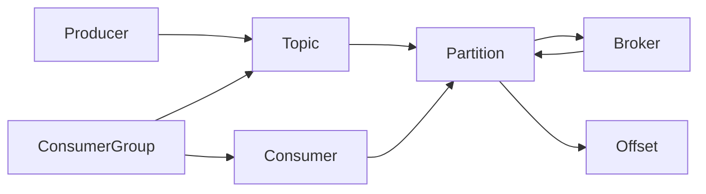

# Kafka原理与代码实例讲解

## 1.背景介绍

### 1.1 什么是Kafka

Apache Kafka是一个开源的分布式事件流平台,最初由Linkedin公司开发,用于解决海量数据管道及处理问题。它被设计为一个可靠、可伸缩、高吞吐量的分布式系统。Kafka以高性能的方式持久化和处理数据流,并支持多订阅者模式,使得数据可以安全地在系统或应用程序之间传递。

### 1.2 Kafka的应用场景

Kafka广泛应用于许多场景,包括但不限于:

- **消息系统**: Kafka可作为分布式发布-订阅消息队列,实现异步通信解耦。
- **活动跟踪**: 跟踪网站活动、服务器日志等,进行数据处理和监控。
- **数据管道**: 在系统或应用程序之间可靠地获取数据。
- **流处理**: 对实时数据流进行低延迟处理和分析。
- **事件源**: 作为不可变事件数据存储,支持事件溯源模式。

### 1.3 Kafka的优势

相比其他消息队列,Kafka具有以下优势:

- **高吞吐量**: 能够每秒处理数百万条消息。
- **可扩展性**: 通过分区和集群可实现水平扩展。
- **持久性**: 消息被持久化到磁盘,并可保留配置的时间。
- **容错性**: 允许节点失败,通过副本机制实现自动故障转移。
- **高并发性**: 支持数千个客户端同时读写。

## 2.核心概念与联系

### 2.1 核心概念

理解Kafka的几个核心概念对于掌握其原理至关重要:

1. **Topic(主题)**: Kafka中的消息以Topic进行分类,每条消息都属于一个Topic。生产者将消息发布到特定的Topic,消费者从Topic中订阅并消费消息。

2. **Partition(分区)**: Topic被分为一个或多个Partition,每个Partition在物理上对应一个文件。消息在Partition内按照顺序存储,以确保消息的有序性。

3. **Broker**: Kafka集群由一个或多个服务实例组成,这些实例被称为Broker。每个Broker可以存储一个或多个Partition。

4. **Producer(生产者)**: 向Kafka Broker发送消息的客户端称为Producer。

5. **Consumer(消费者)**: 从Kafka Broker消费消息的客户端称为Consumer。

6. **Consumer Group(消费者组)**: 消费者组是逻辑概念,多个消费者可以组成一个消费者组,组内消费者订阅Topic的方式是一个Partition只能被组内一个消费者消费。

7. **Offset(偏移量)**: 消费者消费消息的位置,用于记录消费进度。Kafka通过Offset来实现消息的顺序性和不丢失。

### 2.2 核心概念关系

上述核心概念之间的关系如下:

- 一个Topic可以有多个Partition
- 每个Partition只属于一个Broker
- 一个Broker可以存储多个Partition
- 生产者向Topic发送消息,消息会被存储在Topic对应的Partition中
- 消费者从属于消费者组,消费者组订阅Topic
- 消费者组内的消费者各自消费Topic的一个或多个Partition
- 消费者通过维护Offset来记录消费进度

这些概念及其关系构成了Kafka的核心架构,下图使用Mermaid流程图展示了它们之间的联系:



## 3.核心算法原理具体操作步骤

### 3.1 生产者发送消息

生产者发送消息到Kafka的过程如下:

1. 生产者获取Partition信息
2. 生产者将消息发送给Partition Leader
3. Partition Leader将消息写入本地日志
4. Follower从Leader拉取消息并写入本地日志
5. Leader向生产者返回ACK确认

这里涉及到两个关键算法:分区算法和Leader选举算法。

**分区算法**

Kafka提供了多种分区算法,常见的有:

- 轮询(Round-Robin)算法
- Key哈希(Key Hashing)算法
- 自定义分区算法

其中Key哈希算法是默认算法,它根据消息Key的哈希值决定将消息发送到哪个Partition。

**Leader选举算法**

Kafka使用Zookeeper来管理集群中的Broker,并通过Zookeeper的监控功能实现Leader选举:

1. 一个新的Broker启动时,它会在Zookeeper上注册一个临时节点
2. Broker节点开始争夺Partition的Leader权利
3. 当前Leader失效时,剩余的Follower重新选举新的Leader

### 3.2 消费者消费消息

消费者消费消息的过程如下:

1. 消费者加入消费者组,订阅Topic并获取Partition分配方案
2. 消费者向Leader Broker拉取消息
3. Leader Broker返回消息给消费者
4. 消费者处理消息,并提交Offset

这里涉及到Partition分配和消费位移提交两个关键算法。

**Partition分配算法**

Kafka提供了多种Partition分配策略,常见的有:

- Range分配策略
- RoundRobin分配策略
- Sticky分配策略

分配策略决定了每个消费者消费哪些Partition。

**消费位移提交算法**

Kafka支持两种提交Offset的方式:

- 自动提交Offset
- 手动提交Offset

自动提交较为简单,但可能导致重复消费或漏消费。手动提交需要应用程序自行控制提交时机,更加可靠。

## 4.数学模型和公式详细讲解举例说明

### 4.1 分区分配算题

Partition分配是Kafka中一个关键问题,它决定了消费者如何高效地消费Topic中的消息。假设有N个Partition和C个消费者,我们需要合理地将Partition分配给消费者。

我们可以将这个问题建模为一个约束优化问题:

$$
\begin{aligned}
&\underset{x}{\text{minimize}}&& \sum_{i=1}^N \sum_{j=1}^C |x_{ij} - \overline{x_i}| \\
&\text{subject to}&&\sum_{j=1}^C x_{ij} = 1, \quad \forall i \in \{1, \ldots, N\} \\
&&&x_{ij} \in \{0, 1\}, \quad \forall i \in \{1, \ldots, N\}, j \in \{1, \ldots, C\}
\end{aligned}
$$

其中:
- $x_{ij}$是一个二值变量,表示第i个Partition是否分配给第j个消费者
- $\overline{x_i}$是第i个Partition分配给所有消费者的平均值,即$\overline{x_i} = 1/C$
- 目标函数是最小化每个Partition分配给消费者的偏差之和
- 约束条件保证每个Partition只分配给一个消费者

这是一个整数规划问题,可以使用启发式算法或精确算法求解。Kafka目前采用的是一种贪心启发式算法,尽量平衡每个消费者分配到的Partition数量。

### 4.2 消费位移管理

Kafka通过Offset来记录消费者的消费位置,并提供了多种Offset管理策略。假设有M个消息,C个消费者,我们需要合理地管理Offset以避免消息重复消费或漏消费。

我们可以将这个问题建模为一个时序模型:

$$
O_i(t) = \begin{cases}
O_i(t-1) + 1, & \text{if message $i$ is consumed at time $t$} \\
O_i(t-1), & \text{otherwise}
\end{cases}
$$

其中:
- $O_i(t)$表示第i个消费者在时间t的Offset
- 当消费者消费了一条消息时,Offset加1
- 否则,Offset保持不变

为了避免消息重复消费或漏消费,我们需要满足以下约束条件:

$$
\begin{aligned}
&\sum_{i=1}^C O_i(t) = M, \quad \forall t \\
&O_i(t) \leq O_j(t), \quad \forall i < j, t
\end{aligned}
$$

第一个约束条件保证所有消费者的Offset之和等于总消息数,即每条消息都被消费一次。第二个约束条件保证Offset的有序性,避免消息被重复消费。

通过合理管理Offset,Kafka可以实现精确一次语义,确保消息被准确、完整地消费。

## 5.项目实践:代码实例和详细解释说明

### 5.1 生产者示例

下面是一个使用Java编写的Kafka生产者示例:

```java
Properties props = new Properties();
props.put("bootstrap.servers", "localhost:9092");
props.put("key.serializer", "org.apache.kafka.common.serialization.StringSerializer");
props.put("value.serializer", "org.apache.kafka.common.serialization.StringSerializer");

Producer<String, String> producer = new KafkaProducer<>(props);

String topic = "test-topic";
String key = "key";
String value = "value";

ProducerRecord<String, String> record = new ProducerRecord<>(topic, key, value);
producer.send(record);

producer.flush();
producer.close();
```

这段代码首先创建一个`Properties`对象,用于配置Kafka生产者。然后创建一个`KafkaProducer`实例,并指定Broker地址和序列化器。

接下来,创建一个`ProducerRecord`对象,指定Topic、Key和Value。调用`producer.send()`方法将消息发送到Kafka集群。

最后,调用`producer.flush()`确保所有消息被发送,并调用`producer.close()`关闭生产者。

### 5.2 消费者示例

下面是一个使用Java编写的Kafka消费者示例:

```java
Properties props = new Properties();
props.put("bootstrap.servers", "localhost:9092");
props.put("group.id", "test-group");
props.put("key.deserializer", "org.apache.kafka.common.serialization.StringDeserializer");
props.put("value.deserializer", "org.apache.kafka.common.serialization.StringDeserializer");

KafkaConsumer<String, String> consumer = new KafkaConsumer<>(props);
consumer.subscribe(Collections.singletonList("test-topic"));

while (true) {
    ConsumerRecords<String, String> records = consumer.poll(Duration.ofMillis(100));
    for (ConsumerRecord<String, String> record : records) {
        System.out.printf("offset = %d, key = %s, value = %s%n", record.offset(), record.key(), record.value());
    }
    consumer.commitSync();
}
```

这段代码首先创建一个`Properties`对象,用于配置Kafka消费者。然后创建一个`KafkaConsumer`实例,并指定Broker地址、消费者组ID和反序列化器。

接下来,调用`consumer.subscribe()`方法订阅Topic。

在无限循环中,调用`consumer.poll()`方法从Kafka集群拉取消息。对于每条消息,打印其Offset、Key和Value。

最后,调用`consumer.commitSync()`提交Offset,确保消费位移被持久化。

## 6.实际应用场景

Kafka在实际应用中扮演着重要角色,下面列举一些典型场景:

### 6.1 实时数据管道

Kafka可以作为实时数据管道,将数据从各种来源(如日志、传感器、Web应用等)收集并传输到不同的系统(如Hadoop、Spark、数据仓库等)进行进一步处理和分析。例如,Netflix使用Kafka作为实时数据管道,将视频观看数据从各种客户端收集并传输到数据处理系统。

### 6.2 微服务通信

在微服务架构中,Kafka可以作为异步通信层,实现服务间的解耦。服务之间通过发布/订阅消息进行通信,而不需要直接调用。这种方式提高了系统的可扩展性和容错性。例如,Uber使用Kafka在微服务之间传递事件和消息。

### 6.3 事件源

Kafka可以作为事件源,存储系统中发生的所有事件。这些事件是不可变的,可以被多个消费者订阅和处理。通过事件溯源,我们可以重建系统的状态,实现审计和回放功能。例如,Confluent公司的事件源产品就是基于Kafka构建的。

### 6.4 流处理

Kafka可以与流处理框架(如Apache Spark、Apache Flink等)集成,实现对实时数据流的低延迟处理和分析。例如,Uber使用Kafka和Spark进行实时地理空间分析,优化乘车体验。

## 7.工具和资源推荐

### 7.1 Kafka工具

- **Kafka Manager**: 一个基于