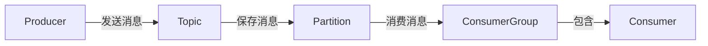

# Kafka在消息推送平台中的实践

## 1.背景介绍

### 1.1 什么是消息队列

在分布式系统中，不同的服务和组件之间需要进行通信和数据交换。传统的同步通信方式存在一些问题,如耦合度高、可用性差、扩展性差等。消息队列(Message Queue)作为一种异步通信机制,能够很好地解决这些问题。

消息队列是一种跟踪传递消息的软件工程组件,主要用于构建异步通信系统。它允许发送方发送消息到队列,而不需要等待响应。相应地,接收方可以从队列中获取消息并进行处理。这种异步通信模式可以提高系统的可用性、解耦和扩展性。

### 1.2 消息队列的优势

使用消息队列的主要优势包括:

- **解耦**:发送方和接收方完全解耦,互不影响,提高了系统的灵活性和可维护性。
- **异步通信**:发送方无需等待接收方处理完成即可发送下一条消息,提高了系统吞吐量。
- **峰值处理能力**:消息队列能够缓冲突发的流量高峰,防止任何一个消费者因负载过高而耗尽资源。
- **可恢复性**:系统的一部分组件失效时,不会影响整个系统。且消息队列中的消息可以在系统恢复后重新处理。
- **顺序保证**:消息队列能够按照特定的顺序来处理消息,如先入先出(FIFO)。
- **扩展性**:消费者的数量可以动态调整,以适应不断变化的需求。

### 1.3 Kafka 简介

Apache Kafka 是一个分布式的流式处理开源消息队列系统。它最初由 LinkedIn 公司开发,之后则被顶级公司和组织广泛使用,如 Netflix、Pinterest、Goldman Sachs、Uber、Paypal 等。

Kafka 具有高吞吐量、低延迟、高可靠性等优秀特性,非常适合用于大数据、流式处理、事件驱动架构等场景。它的设计理念是通过一个无限的持久化日志(log)来处理数据流,而不是传统的队列模型。

## 2.核心概念与联系

### 2.1 Kafka 核心概念

- **Broker**: Kafka 集群中的每个服务器节点都称为 Broker。
- **Topic**: Topic 是消息的逻辑分类,用于对消息进行分类管理。
- **Partition**: 每个 Topic 包含一个或多个 Partition,每个 Partition 都是一个有序且不可变的消息序列。
- **Offset**: 消息在 Partition 中的位置,用于标识消息在 Partition 中的位置。
- **Producer**: 负责发布消息到 Kafka Broker 的客户端。
- **Consumer**: 从 Kafka Broker 中消费消息的客户端。
- **Consumer Group**: 每个 Consumer 属于一个特定的 Consumer Group,同一个 Consumer Group 中的 Consumer 实例可以平均分摊所有 Partition 的消费任务。

### 2.2 Kafka 核心组件关系

Kafka 的核心组件及其关系如下图所示:



- **Producer** 向指定的 **Topic** 发送消息。
- **Topic** 将消息持久化存储到其所包含的多个 **Partition** 中。
- **Consumer Group** 中的 **Consumer** 实例从 **Partition** 中消费消息。
- 同一个 **Consumer Group** 中的多个 **Consumer** 实例可以平均分摊所有 **Partition** 的消费任务。

## 3.核心算法原理具体操作步骤  

### 3.1 生产者发送消息流程

1. **选择 Partition**
   - 如果在发送消息时指定了 Partition,则直接将消息发送到指定的 Partition
   - 如果没有指定 Partition,则使用 Key 的 hash 值与 Topic 的 Partition 数量取模来选择 Partition
   - 如果既没有指定 Partition,又没有 Key,则使用系统默认的 Partition 选择策略,通常是轮询分配

2. **获取 Partition 元数据**
   生产者向任意一个 Broker 发送获取 Partition 元数据的请求,包括 Partition 的 Leader 信息。

3. **构建消息集**
   生产者将消息缓存到发送缓冲区,并按照 Partition 进行分区。

4. **发送消息集**
   生产者将缓冲区中的消息集发送给相应 Partition 的 Leader Broker。

5. **Broker 处理**
   Leader Broker 接收到消息集后,先将消息写入本地日志,并向 Follower 副本进行复制。当所有同步副本都完成复制后,Producer 会收到一个 ack 确认。

### 3.2 消费者消费消息流程

1. **加入 Consumer Group**
   Consumer 向 Zookeeper 或 Kafka Broker 发送加入某个 Consumer Group 的请求。

2. **获取 Partition 分配**
   Consumer 向 Broker 发送获取 Partition 分配的请求,Broker 根据 Consumer Group 和当前成员分配 Partition。

3. **发送拉取请求**
   Consumer 向分配的 Partition 对应的 Leader Broker 发送拉取消息的请求。

4. **处理消息**
   Consumer 从 Broker 接收到消息后进行处理,并更新本地的 offset 信息。

5. **提交 offset**
   Consumer 定期向 Broker 发送心跳请求,并提交自己的 offset 信息。

6. **离开 Consumer Group**
   Consumer 主动离开或失效后,其订阅的 Partition 会被重新分配给其他 Consumer。

### 3.3 消息存储和复制

Kafka 将消息持久化存储在磁盘上,每个 Partition 对应一个日志文件。消息在 Partition 中是有序且不可变的,只能追加写入,不能修改。

为了提高可靠性,Kafka 采用了复制机制。每个 Partition 都有多个副本,其中一个作为 Leader,其余作为 Follower。所有的写入操作都由 Leader 处理,Follower 只负责从 Leader 复制消息。

当 Leader 出现故障时,其中一个 Follower 会被选举为新的 Leader。这种复制机制保证了消息不会因为单点故障而丢失。

## 4.数学模型和公式详细讲解举例说明

### 4.1 Kafka 分区策略

Kafka 在选择 Partition 时,可以根据指定的 Key 进行哈希分区。对于给定的 Key,Kafka 使用 `murmur2` 哈希算法计算哈希值,然后对 Topic 的 Partition 数量取模,从而确定该消息应该存储在哪个 Partition 中。

$$
Partition = murmur2(Key) \% numPartitions
$$

其中:
- `murmur2` 是一种高效的非加密哈希算法
- `Key` 是消息的键值,可以是任意字节数组
- `numPartitions` 是 Topic 的 Partition 数量

如果没有指定 Key,Kafka 会使用默认的循环分区策略,将消息依次分配到不同的 Partition 中。

### 4.2 Kafka 消费位移(Offset)管理

Kafka 使用 Offset 来记录 Consumer 在每个 Partition 中的消费位置。Offset 是一个递增的数值,表示消息在 Partition 日志文件中的位置。

每个 Consumer Group 都会为每个 Partition 维护一个 Offset 值。当 Consumer 从 Broker 拉取消息时,会根据该 Offset 值确定从哪里开始消费。消费完毕后,Consumer 会将最新的 Offset 值提交到 Kafka 的内部主题 `__consumer_offsets`。

Kafka 提供了三种 Offset 管理策略:

1. **自动提交 Offset**
   Consumer 每隔一段时间自动将 Offset 提交到 Broker。这种方式简单,但可能会导致重复消费或消息丢失。

2. **手动提交 Offset**
   应用程序手动控制 Offset 的提交时机。这种方式可以确保消息被精确一次处理,但需要更多的代码。

3. **自动提交 Offset 并定期重置**
   Consumer 自动提交 Offset,但应用程序定期重置 Offset 到较旧的值,以重新消费消息。这种方式适用于需要重播消息的场景。

## 4.项目实践:代码实例和详细解释说明

### 4.1 生产者示例

以下是一个使用 Java 编写的 Kafka Producer 示例:

```java
Properties props = new Properties();
props.put("bootstrap.servers", "broker1:9092,broker2:9092");
props.put("key.serializer", "org.apache.kafka.common.serialization.StringSerializer");
props.put("value.serializer", "org.apache.kafka.common.serialization.StringSerializer");

Producer<String, String> producer = new KafkaProducer<>(props);

String topic = "my-topic";
String key = "message-key";
String value = "Hello, Kafka!";

ProducerRecord<String, String> record = new ProducerRecord<>(topic, key, value);
producer.send(record);

producer.flush();
producer.close();
```

1. 首先创建 `Properties` 对象,设置 Broker 地址和序列化器。
2. 使用配置创建 `KafkaProducer` 实例。
3. 构建 `ProducerRecord` 对象,指定 Topic、Key 和 Value。
4. 调用 `send` 方法发送消息。
5. 调用 `flush` 方法确保所有消息被发送。
6. 最后关闭 Producer。

### 4.2 消费者示例

以下是一个使用 Java 编写的 Kafka Consumer 示例:

```java
Properties props = new Properties();
props.put("bootstrap.servers", "broker1:9092,broker2:9092");
props.put("group.id", "my-group");
props.put("key.deserializer", "org.apache.kafka.common.serialization.StringDeserializer");
props.put("value.deserializer", "org.apache.kafka.common.serialization.StringDeserializer");

KafkaConsumer<String, String> consumer = new KafkaConsumer<>(props);
consumer.subscribe(Collections.singletonList("my-topic"));

while (true) {
    ConsumerRecords<String, String> records = consumer.poll(Duration.ofMillis(100));
    for (ConsumerRecord<String, String> record : records) {
        System.out.printf("offset = %d, key = %s, value = %s%n", record.offset(), record.key(), record.value());
    }
    consumer.commitSync();
}
```

1. 首先创建 `Properties` 对象,设置 Broker 地址、Consumer Group 和反序列化器。
2. 使用配置创建 `KafkaConsumer` 实例。
3. 调用 `subscribe` 方法订阅 Topic。
4. 使用循环调用 `poll` 方法从 Broker 拉取消息。
5. 遍历消息记录,打印 Offset、Key 和 Value。
6. 调用 `commitSync` 方法提交 Offset。

## 5.实际应用场景

Kafka 作为一个高性能、高吞吐量的分布式消息队列系统,在许多场景中都有广泛的应用:

### 5.1 异步通信

Kafka 可以作为异步通信的中间件,解耦系统的不同组件。例如,在电商系统中,订单服务可以将订单信息发送到 Kafka,而库存服务和支付服务则从 Kafka 中消费订单信息进行相应的处理。这种异步通信模式提高了系统的灵活性和可扩展性。

### 5.2 日志收集

Kafka 天生就是一个分布式的日志收集系统。各种服务和应用可以将日志数据发送到 Kafka,而日志处理系统则从 Kafka 中消费日志数据进行存储、分析和监控等操作。这种架构可以实现日志收集的高吞吐量和容错性。

### 5.3 流式处理

Kafka 可以与流式处理框架(如 Apache Spark、Apache Flink 等)集成,用于构建实时数据流处理管道。数据源将数据流发送到 Kafka,而流式处理框架则从 Kafka 中消费数据流进行实时计算和分析。这种架构可以实现低延迟的实时数据处理。

### 5.4 事件驱动架构

在事件驱动架构中,Kafka 可以作为事件总线,将各种事件数据发布到 Kafka,而不同的服务和应用则订阅感兴趣的事件主题进行处理。这种架构可以提高系统的灵活性和可扩展性,并实现事件的解耦和异步处理。

### 5.5 数据管道

Kafka 可以作为数据管道,将数据从各种来源(如