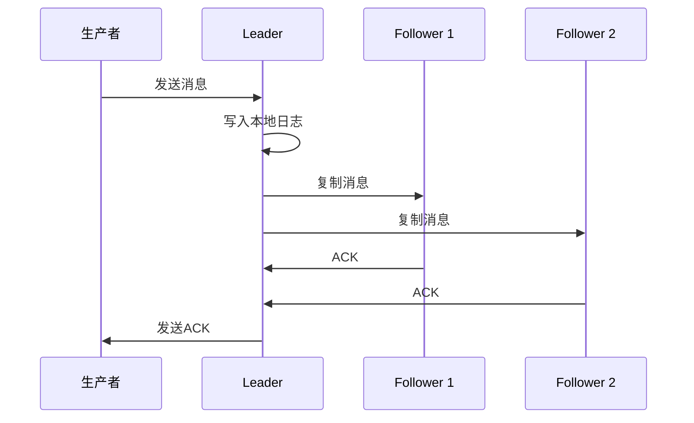

# Kafka数据可靠性：深入理解复制机制-复制机制详解

## 1.背景介绍

### 1.1 什么是Kafka

Apache Kafka是一个分布式流处理平台,它是一个可扩展的、高吞吐量的分布式发布-订阅消息系统。Kafka最初是由LinkedIn公司开发,后来被开源并被Apache软件基金会收养。它被广泛应用于构建实时数据管道和流处理应用程序。

Kafka的主要特点包括:

- 高吞吐量、低延迟
- 可扩展性
- 持久性和容错性
- 分布式
- 实时处理

### 1.2 Kafka的数据可靠性

数据可靠性是Kafka的核心特性之一。为了确保数据不会丢失,Kafka采用了复制(Replication)机制。复制机制通过在多个Broker节点上保存数据副本,从而提高了数据的冗余性和容错性。即使某些Broker节点发生故障,数据仍然可以从其他副本节点恢复。

### 1.3 复制机制的重要性

复制机制对于Kafka的数据可靠性至关重要,它保证了以下几个方面:

- 数据持久性:即使个别Broker宕机,数据也不会丢失
- 容错性:当Broker出现故障时,其他副本可以接管工作负载
- 数据一致性:所有副本之间的数据保持一致
- 负载均衡:读写操作可以在多个副本之间进行负载均衡

## 2.核心概念与联系

### 2.1 Topic和Partition

在Kafka中,消息以Topic进行分类,一个Topic可以被分为多个Partition。每个Partition中的消息是有序的,并且以追加的方式写入。

```
                Topic
          ____________________
         |        |        |        |
         | P0     | P1     | P2     | ...
         |________|________|________|
```

### 2.2 Leader和Follower

对于每个Partition,Kafka会从副本集合(ISR)中选举一个Leader,其余的副本称为Follower。所有的生产者请求都会被发送到Leader,Leader再将消息复制到所有的Follower副本。

```
            Topic Partition
         _________________________
        |         |         |         |
  Leader|         |         |         |
        |_________|_________|_________|
                    |         |
                 Follower  Follower
```

### 2.3 复制流程概览

1. 生产者向Leader发送消息
2. Leader将消息写入本地日志
3. Leader将消息复制到所有同步Follower
4. Follower写入本地日志并向Leader发送ACK
5. Leader收到所有Follower的ACK后,增加HW(High Watermark)并向生产者发送ACK



## 3.核心算法原理具体操作步骤

Kafka复制机制的核心算法原理可以分为以下几个步骤:

### 3.1 Leader选举

当一个新的Partition被创建时,或者当前Leader出现故障时,Kafka会从同步副本集合(ISR)中选举一个新的Leader。选举算法如下:

1. 从ISR中找出副本最新的那个(LEO最大)
2. 如果有多个副本的LEO相同,则选择第一个加入ISR的副本作为Leader

Leader选举完成后,Leader会负责处理所有的生产者请求和消费者请求。

### 3.2 添加新Follower

当一个新的Broker加入集群时,它会成为所有Partition的Follower副本。对于每个Partition,新Follower会执行以下步骤:

1. 向Leader发送FetchRequest请求
2. Leader找到最新的LEO,并从该位置开始复制数据给Follower
3. 当Follower的LEO追上Leader后,它会加入ISR成为同步副本

### 3.3 数据复制

当生产者向Leader发送消息时,Leader会执行以下步骤进行数据复制:

1. Leader将消息写入本地日志
2. Leader将消息复制给所有ISR中的Follower
3. 等待所有Follower写入成功并返回ACK
4. 收到所有ACK后,Leader增加HW并向生产者发送ACK

如果有Follower未能及时返回ACK,Leader会从ISR中移除该Follower,并继续等待其他Follower的ACK。

### 3.4 Leader故障转移

如果Leader出现故障,Kafka会从ISR中选举一个新的Leader。新Leader上位后,会执行以下步骤:

1. 从日志中找到HW的位置
2. truncate掉HW之后的消息(保证数据一致性)
3. 开始处理生产者和消费者请求

## 4.数学模型和公式详细讲解举例说明

在Kafka复制机制中,有几个关键的数学模型和公式需要理解。

### 4.1 复制因子(Replication Factor)

复制因子决定了每个Partition有多少个副本。它是一个配置参数,可以在创建Topic时指定。复制因子的数学公式如下:

$$
N = R + 1
$$

其中:
- $N$是总的副本数量
- $R$是允许的最大副本数量

例如,如果复制因子设置为3,那么每个Partition将有4个副本(1个Leader和3个Follower)。

### 4.2 最小同步副本数(Min.Insync.Replicas)

最小同步副本数是一个配置参数,它决定了Leader在增加HW之前需要等待多少个Follower的ACK。该参数的数学公式如下:

$$
M = \min(R+1, N)
$$

其中:
- $M$是最小同步副本数
- $R$是允许的最大副本数量
- $N$是总的副本数量

例如,如果复制因子设置为3,那么最小同步副本数为2。这意味着Leader只需要等待至少2个Follower的ACK即可增加HW。

### 4.3 不可用副本数(Unavailable Replicas)

不可用副本数指的是当前无法与Leader进行通信的Follower数量。该数值会影响Leader是否可以增加HW。Leader只有在满足以下条件时才能增加HW:

$$
U \leq R
$$

其中:
- $U$是不可用副本数
- $R$是允许的最大副本数量

如果不可用副本数超过了允许的最大副本数量,Leader将无法增加HW,从而阻止生产者写入新的消息。这是为了防止数据丢失。

## 4.项目实践:代码实例和详细解释说明

下面我们通过一个简单的Java示例代码来演示Kafka复制机制的工作流程。

### 4.1 创建Topic

首先,我们需要创建一个Topic,并设置复制因子为3:

```java
// 创建Topic配置
NewTopic newTopic = new NewTopic("my-topic", 3, (short) 1);

// 创建Topic
CreateTopicsResult result = adminClient.createTopics(Collections.singleton(newTopic));
result.values().get("my-topic").get();
```

上述代码创建了一个名为"my-topic"的Topic,该Topic有3个Partition,每个Partition有3个副本(1个Leader和2个Follower)。

### 4.2 生产消息

接下来,我们可以使用KafkaProducer向Topic发送消息:

```java
// 创建Producer配置
Properties props = new Properties();
props.put(ProducerConfig.BOOTSTRAP_SERVERS_CONFIG, "localhost:9092");

// 创建Producer实例
KafkaProducer<String, String> producer = new KafkaProducer<>(props);

// 发送消息
ProducerRecord<String, String> record = new ProducerRecord<>("my-topic", "Hello, Kafka!");
producer.send(record);

// 关闭Producer
producer.flush();
producer.close();
```

上述代码向"my-topic"发送了一条消息"Hello, Kafka!"。生产者会将消息发送给Leader副本,Leader副本再将消息复制给Follower副本。

### 4.3 消费消息

最后,我们可以使用KafkaConsumer从Topic中消费消息:

```java
// 创建Consumer配置
Properties props = new Properties();
props.put(ConsumerConfig.BOOTSTRAP_SERVERS_CONFIG, "localhost:9092");
props.put(ConsumerConfig.GROUP_ID_CONFIG, "my-group");
props.put(ConsumerConfig.AUTO_OFFSET_RESET_CONFIG, "earliest");

// 创建Consumer实例
KafkaConsumer<String, String> consumer = new KafkaConsumer<>(props);

// 订阅Topic
consumer.subscribe(Collections.singletonList("my-topic"));

// 消费消息
while (true) {
    ConsumerRecords<String, String> records = consumer.poll(Duration.ofMillis(100));
    for (ConsumerRecord<String, String> record : records) {
        System.out.println("Received message: " + record.value());
    }
}
```

上述代码创建了一个KafkaConsumer实例,订阅了"my-topic"。Consumer会从Leader副本或Follower副本中消费消息。

通过这个简单的示例,我们可以看到Kafka复制机制在生产者和消费者之间的工作流程。

## 5.实际应用场景

Kafka的复制机制使其在许多实际应用场景中发挥着重要作用,例如:

### 5.1 实时数据处理

Kafka可以作为实时数据处理管道的消息队列,确保数据在传输过程中不会丢失。例如,在电商网站中,用户的浏览记录、购买行为等数据可以通过Kafka进行实时处理和分析。

### 5.2 日志收集和处理

Kafka可以用于收集和处理分布式系统中的日志数据。通过复制机制,日志数据可以持久化存储,并且即使某些节点出现故障,数据也不会丢失。

### 5.3 流处理应用

Kafka可以作为流处理应用程序的数据源,例如Apache Spark Streaming、Apache Flink等。这些应用程序可以从Kafka中消费数据,并对数据进行实时处理和分析。

### 5.4 事件驱动架构

在事件驱动架构中,Kafka可以作为事件总线,将各个微服务之间的事件进行解耦和传递。复制机制确保了事件数据的可靠性和持久性。

## 6.工具和资源推荐

为了更好地理解和使用Kafka复制机制,以下是一些推荐的工具和资源:

### 6.1 Kafka工具

- **Kafka Manager**: 一个基于Web的Kafka集群管理工具,可以方便地查看Topic、Partition、Broker等信息。
- **Kafka Tool**: 一个命令行工具,可以用于创建Topic、查看消费者组、重置偏移量等操作。
- **Kafka Streams**: Kafka官方提供的流处理库,可以方便地构建流处理应用程序。

### 6.2 学习资源

- **Kafka官方文档**: Kafka官方文档是学习Kafka复制机制的权威资料,包含了详细的概念解释和配置说明。
- **Kafka内核深度解析**: 一本深入探讨Kafka内部原理的书籍,对于理解复制机制非常有帮助。
- **Kafka University**: Confluent公司提供的Kafka在线培训课程,包括复制机制等多个主题。

## 7.总结:未来发展趋势与挑战

### 7.1 发展趋势

Kafka复制机制在未来可能会有以下发展趋势:

- **增强的数据一致性保证**: 引入更强的数据一致性模型,例如线性一致性或causally一致性,以满足更严格的应用场景需求。
- **自动化副本管理**: 自动化副本的创建、迁移和删除过程,提高集群管理的效率。
- **异构复制**: 支持将数据复制到异构存储系统中,实现数据的多副本存储。

### 7.2 挑战

Kafka复制机制也面临一些挑战:

- **大规模集群管理**: 随着集群规模的扩大,管理和监控大量的副本变得更加复杂。
- **网络延迟和带宽限制**: 在广域网环境下,网络延迟和带宽限制可能会影响复制性能。
- **数据一致性与可用性权衡**: 在某些极端情况下,需要权衡数据一致性和可用性之间的关系。

## 8.附录:常见问题与解答

### 8.1 为什么需要复制机制?

复制机制是为了确保Kafka的数据可靠性和容错性。通过在多个节点上保存数据副本,即使某些节点出现故障,数据也不会丢失。此外,复制机制还提供了负载均衡和高可用性的功能。

### 8.2 如何选择合适的复制因子