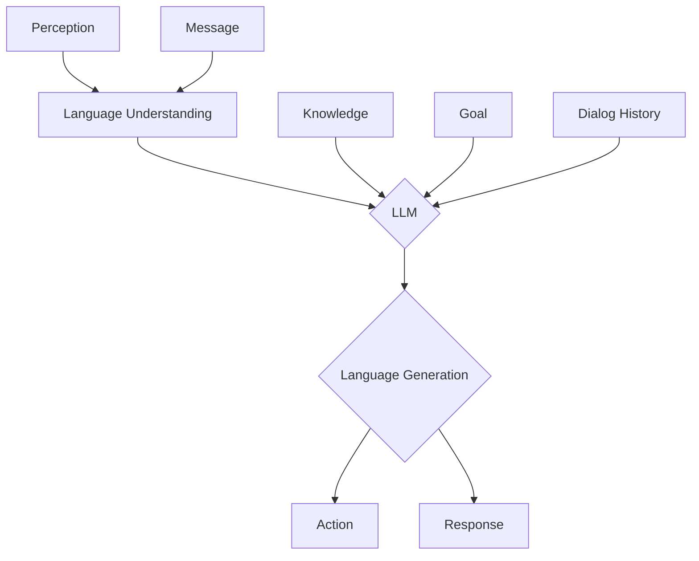

# LLM-based Multi-Agent System

作者：禅与计算机程序设计艺术

## 1. 背景介绍

### 1.1 多智能体系统(Multi-Agent System, MAS)概述
多智能体系统是由多个自主智能体组成的分布式系统,每个智能体可以感知环境,与其他智能体通信协作,并根据自身的知识、目标和能力做出决策和行动。MAS在人工智能、计算机科学、经济学、社会学等领域有广泛应用。

### 1.2 大语言模型(Large Language Model, LLM)的发展
近年来,以Transformer为代表的大语言模型取得了巨大进展。从GPT、BERT到GPT-3、PaLM等,LLM展现出了惊人的自然语言理解和生成能力,在问答、对话、写作等任务上接近甚至超越人类水平。LLM正在深刻影响自然语言处理和人工智能的发展。

### 1.3 LLM与MAS的结合
LLM强大的语言能力为构建更智能的MAS提供了新思路。通过LLM,智能体可以更好地理解自然语言指令,与人类或其他智能体进行自然流畅的对话交流,根据语境进行推理决策。将LLM引入MAS,有望突破传统MAS在语言交互、知识表示、推理决策等方面的瓶颈,实现更加智能、灵活、人性化的多智能体系统。

## 2. 核心概念与联系

### 2.1 智能体(Agent)
智能体是MAS的基本构成单元,具有自主性、社会性、反应性、主动性等特征。每个智能体根据自身知识与感知做出决策,通过与环境及其他智能体的交互来完成任务。

### 2.2 通信与协作
MAS中的智能体需要通过通信来交换信息、协调行动。常见的通信方式有直接通信和间接通信。协作是指多个智能体为了完成共同目标而分工合作,通过任务分解、资源共享、冲突解决等机制来实现。

### 2.3 语言交互
引入LLM后,MAS中的智能体可以通过自然语言进行交互。LLM作为语言理解和生成的中间件,让智能体能够处理复杂的语言指令,进行多轮对话,表达丰富的语义信息。

### 2.4 知识表示与推理
传统MAS常用谓词逻辑、产生式规则等形式化方法来表示智能体的知识,但表达能力有限。而LLM学习了海量语料,可以用自然语言文本作为知识的载体,进行基于语义的知识表示、检索、推理,使智能体具备更强的常识性知识和领域知识。

### 2.5 基于LLM的智能体架构
下图展示了一种基于LLM的智能体架构。输入的感知信息和其他智能体的消息都转化为自然语言文本,输入LLM进行语义理解。LLM结合智能体的知识、目标、对话历史等上下文信息进行推理,输出决策动作或回复消息。



## 3. 核心算法原理与操作步骤

### 3.1 基于Prompt的few-shot学习

LLM通过海量语料的预训练已经学会了丰富的语言知识,具备强大的零样本学习能力。为了让LLM适应特定任务,可以用Prompt(提示)的方式来引导LLM生成所需的结果。

Few-shot学习是指给LLM提供少量样本作为示范,让其快速理解任务要求并泛化到新样本。基本步骤如下:

1. 构造Prompt,包含任务描述和k个示例(样本 + 标签)
2. 将Prompt作为LLM的输入,引导其进行自回归生成
3. LLM根据示例推断任务模式,对新样本生成相应的结果

例如:
```
Prompt:
请判断以下句子的情感倾向(正向/中性/负向):
示例1:
句子:这部电影真是太棒了,我非常喜欢!
情感:正向
示例2: 
句子:这家餐厅的菜品一般,服务态度也不太好。
情感:负向
示例3:
句子:今天天气不错,出门散散步吧。
情感:中性

句子:这次旅行虽然很辛苦,但是风景很美,还是很值得的。
情感:

LLM输出:
正向
```

### 3.2 基于Prompt的上下文学习

在MAS中,智能体做决策时需要结合当前的环境状态、自身知识、过去的对话历史等上下文信息。传统的神经网络难以处理这种长距离的依赖关系,而LLM恰恰擅长上下文学习。

将智能体的感知、知识、目标、对话历史等信息都转化为自然语言描述,与当前输入一起构成Prompt,就可以引导LLM根据上下文生成合适的决策或回复。

例如:
```
Prompt:
背景:你是一个旅游规划助理,正在为用户安排行程。
知识:北京有许多著名景点,如故宫、长城、天坛等。
目标:根据用户需求,推荐合适的景点和游玩时间。
对话历史:
用户:我想去北京旅游,有什么推荐的景点吗?
助理:北京有很多著名景点,如故宫、长城、天坛等。您希望游玩几天?对哪些方面更感兴趣?
用户:我打算玩3天,对中国历史文化感兴趣,希望深度游。

助理:考虑到您的时间和兴趣,我建议:
第1天:故宫(4小时)+天坛公园(2小时) 
第2天:八达岭长城(一天)
第3天:恭王府(2小时)+国家博物馆(3小时)
这样安排既能游览北京最具代表性的古迹景点,又能深入了解中国历史文化,行程也较为轻松不会太赶。您觉得如何?

用户:行程安排不错,就按你说的办吧。我再问一下,去长城建议穿什么鞋子?

助理:

LLM输出:
去长城建议穿运动鞋或旅游鞋。长城多为石阶和土路,爬起来比较费力,穿一双防滑耐磨的运动鞋或专业的徒步鞋会更舒适安全。如果天气炎热,可以选透气性好的鞋子。另外也要注意鞋子要合脚,不要太紧或太松,以免走起来磨脚或崴脚。建议提前几天穿新鞋走走路,磨合一下。
```

### 3.3 知识图谱+LLM的推理

LLM虽然学习了海量知识,但知识是隐式分布在参数中的,缺乏显式的结构化表示,因此推理能力还比较弱。将知识图谱与LLM结合,可以增强LLM的可解释性和逻辑推理能力。

知识图谱以(实体,关系,实体)的三元组形式来表示结构化知识。将知识图谱转化为自然语言描述,与问题一起输入LLM,可以引导LLM根据知识图谱进行逻辑推理。

例如:
```
知识图谱:
(黄山,位于,安徽省) 
(安徽省,简称,皖)
(黄山,别称,黄山甲天下)

问题:黄山在哪个省?那个省的简称是什么?黄山有什么别称?

Prompt:
已知:
黄山位于安徽省。
安徽省的简称是皖。
黄山的别称是黄山甲天下。

问题:黄山在哪个省?那个省的简称是什么?黄山有什么别称?

LLM输出:
黄山位于安徽省。安徽省的简称是皖。黄山的别称是黄山甲天下。
```

可以看到,LLM通过知识图谱中的三元组信息,推理出了问题的答案。这种方法可以让LLM在保留语言理解和生成能力的同时,增强知识的可解释性和推理能力。

## 4. 数学模型与公式

### 4.1 Transformer的注意力机制

Transformer是主流LLM的基础架构,其核心是自注意力机制(Self-Attention)。对于输入序列$\mathbf{X} \in \mathbb{R}^{n \times d}$,自注意力的计算过程为:

$$
\begin{aligned}
\mathbf{Q} &= \mathbf{X} \mathbf{W}^Q \\
\mathbf{K} &= \mathbf{X} \mathbf{W}^K \\ 
\mathbf{V} &= \mathbf{X} \mathbf{W}^V \\
\text{Attention}(\mathbf{Q}, \mathbf{K}, \mathbf{V}) &= \text{softmax}(\frac{\mathbf{Q}\mathbf{K}^T}{\sqrt{d_k}})\mathbf{V}
\end{aligned}
$$

其中$\mathbf{Q},\mathbf{K},\mathbf{V}$分别为查询、键、值矩阵,$\mathbf{W}^Q, \mathbf{W}^K, \mathbf{W}^V$为可学习的参数矩阵。自注意力先计算$\mathbf{Q}$和$\mathbf{K}$的相似度得到注意力分数,再对$\mathbf{V}$进行加权求和。直观地看,自注意力让序列中的每个位置都能关注到其他位置,捕捉长距离依赖。

### 4.2 因果语言模型(Causal Language Model)

GPT等LLM本质上是因果语言模型,对于文本序列$\mathbf{x}=(x_1,\ldots,x_n)$,因果语言模型的目标是最大化如下似然概率:

$$
p(\mathbf{x}) = \prod_{i=1}^n p(x_i|\mathbf{x}_{<i})
$$

其中$\mathbf{x}_{<i}$表示$x_i$之前的所有token。也就是说,因果语言模型是从左到右地预测下一个token。训练时最大化上式,推理时根据前缀token不断采样生成下一个token,直到遇到终止符。

### 4.3 Prompt中的条件概率

在Prompt学习中,给定输入$\mathbf{x}$和Prompt $\mathbf{p}$,LLM输出$\mathbf{y}$的条件概率为:

$$
p(\mathbf{y}|\mathbf{x},\mathbf{p}) = \prod_{i=1}^m p(y_i|\mathbf{x},\mathbf{p},\mathbf{y}_{<i})
$$

其中$\mathbf{y}_{<i}$为$y_i$之前生成的token。这个公式表明,LLM在生成输出时,不仅考虑了输入,还考虑了Prompt以及之前生成的内容。通过精心设计Prompt,就可以引导LLM生成符合特定格式或要求的结果。

## 5. 项目实践

下面我们通过一个简单的对话系统来展示如何用LangChain实现基于LLM的智能体。LangChain是一个基于LLM构建应用的开源框架。

### 5.1 环境准备

首先安装langchain及其依赖:
```
pip install langchain openai faiss-cpu
```

然后准备OpenAI的API Key:
```python
import os
os.environ["OPENAI_API_KEY"] = "your_api_key"
```

### 5.2 加载语言模型

这里我们使用OpenAI的text-davinci-003模型:
```python
from langchain.llms import OpenAI

llm = OpenAI(model_name="text-davinci-003")
```

### 5.3 定义Prompt模板

我们定义一个Prompt模板,包含对话历史、用户输入和AI角色设定:

```python
from langchain.prompts import PromptTemplate

template = """
你是一个乐于助人的AI助手,你的名字叫Sam。
对话历史:
{history}

用户:{input}
Sam:"""

prompt = PromptTemplate(
    input_variables=["history", "input"], 
    template=template
)
```

### 5.4 定义对话链

接下来定义一个对话链(ConversationChain),它封装了对话的逻辑:

```python
from langchain.chains import ConversationChain
from langchain.memory import ConversationBufferMemory

memory = ConversationBufferMemory()
conversation = ConversationChain(
    llm=llm, 