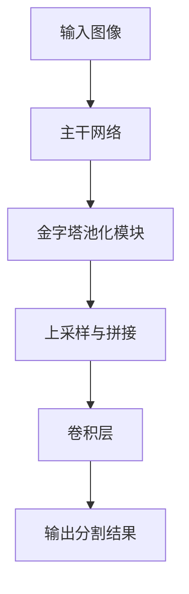

# PSPNet原理与代码实例讲解

## 1. 背景介绍

在计算机视觉领域,语义分割是一项重要而具有挑战性的任务。它旨在为图像中的每个像素分配一个语义标签,从而对图像进行像素级别的理解和解析。传统的基于像素的分类方法由于缺乏全局上下文信息,难以很好地捕获物体的形状和边界。为了解决这个问题,PyramidScene解析网络(PSPNet)被提出,它利用金字塔池化模块有效地集成了不同尺度的上下文信息,显著提高了语义分割的性能。

### 1.1 语义分割的重要性

语义分割广泛应用于多个领域,如无人驾驶、医疗影像分析、机器人视觉等。准确的语义分割可以帮助自动驾驶汽车更好地识别道路、行人和其他障碍物,从而提高行驶安全性。在医疗领域,语义分割可用于自动检测和分割病变区域,为医生诊断和治疗提供宝贵参考。此外,语义分割也是许多计算机视觉任务(如目标检测、实例分割等)的基础。

### 1.2 传统方法的局限性

早期的语义分割方法主要基于像素级别的分类,如随机森林、支持向量机等。这些方法通常会将图像分割成小块,然后对每个小块进行分类。但这种方法存在一些固有的局限性:

1. 缺乏全局上下文信息,难以很好地捕获物体的形状和边界。
2. 无法很好地处理不同尺度的物体。
3. 计算效率较低,难以应用于实时应用场景。

为了克服这些局限性,基于深度学习的方法应运而生,如FCN、SegNet、DeepLab等,它们能够更好地利用全局上下文信息,提高分割精度。但这些方法在融合不同尺度的上下文信息时仍然存在一定的局限性。

## 2. 核心概念与联系

### 2.1 金字塔池化模块

PSPNet的核心创新之处在于提出了金字塔池化模块(PyramidPoolingModule),它能够通过不同尺度的池化操作,有效地融合不同尺度的上下文信息。具体来说,金字塔池化模块包含四个并行的池化层,它们分别对输入特征图进行1×1、2×2、3×3和6×6的池化操作。这样就能够获取全局上下文信息(通过全局池化)、子区域上下文信息(通过局部池化)以及它们之间的平滑过渡。

通过这种方式,金字塔池化模块能够很好地捕获不同尺度的上下文信息,从而更好地分割出不同大小的物体。同时,由于池化操作的存在,金字塔池化模块也能够有效地降低计算复杂度,提高运算效率。

### 2.2 PSPNet网络结构

PSPNet的整体网络结构如下图所示:



1. 主干网络(Backbone Network):PSPNet使用预训练的ResNet或DenseNet作为主干网络,用于提取图像的特征表示。
2. 金字塔池化模块(PyramidPoolingModule):如上所述,该模块用于融合不同尺度的上下文信息。
3. 上采样与拼接(Upsampling and Concatenation):将金字塔池化模块的输出进行上采样,并与主干网络的低级特征图进行拼接,以保留细节信息。
4. 卷积层(Convolutional Layers):对上一步得到的特征图进行卷积操作,生成最终的分割结果。

通过这种设计,PSPNet能够有效地利用全局和局部上下文信息,从而提高语义分割的精度和鲁棒性。

## 3. 核心算法原理具体操作步骤

### 3.1 金字塔池化模块详解

金字塔池化模块是PSPNet的核心创新之处,它的具体操作步骤如下:

1. 对输入特征图进行四个不同尺度的并行池化操作,分别为1×1、2×2、3×3和6×6。
2. 对每个池化层的输出进行上采样,使其与输入特征图的空间维度一致。
3. 将上采样后的四个特征图在通道维度上进行拼接。

通过这种方式,金字塔池化模块能够捕获全局上下文信息(通过全局池化)、子区域上下文信息(通过局部池化)以及它们之间的平滑过渡。这种多尺度特征融合的方式能够有效地提高语义分割的准确性和鲁棒性。

### 3.2 主干网络与金字塔池化模块的连接

在PSPNet中,主干网络(如ResNet或DenseNet)用于提取图像的特征表示。主干网络的输出特征图被送入金字塔池化模块,经过不同尺度的池化操作和特征融合后,得到包含丰富上下文信息的特征表示。

### 3.3 上采样与拼接

为了保留细节信息,PSPNet将金字塔池化模块的输出与主干网络的低级特征图进行拼接。具体步骤如下:

1. 将金字塔池化模块的输出进行上采样,使其空间维度与主干网络的低级特征图相同。
2. 在通道维度上,将上采样后的特征图与主干网络的低级特征图进行拼接。

通过这种方式,PSPNet能够同时利用高级语义信息(来自金字塔池化模块)和低级细节信息(来自主干网络的低级特征图),从而提高分割的精确性。

### 3.4 卷积层与输出

最后,PSPNet使用一系列卷积层对上一步得到的特征图进行处理,生成最终的分割结果。具体来说,卷积层的作用是将特征图映射到所需的类别空间,每个像素位置对应一个类别标签。

通过以上步骤,PSPNet能够有效地融合不同尺度的上下文信息,从而实现精确的语义分割。

## 4. 数学模型和公式详细讲解举例说明

### 4.1 金字塔池化模块的数学表示

设输入特征图为 $F$,其形状为 $(C, H, W)$,其中 $C$ 表示通道数, $H$ 和 $W$ 分别表示高度和宽度。金字塔池化模块包含四个不同尺度的池化层,分别为:

1. 全局池化层:对整个特征图进行全局平均池化,输出形状为 $(C, 1, 1)$。
2. 子区域池化层:对特征图进行 $2\times2$、$3\times3$ 和 $6\times6$ 的平均池化,输出形状分别为 $(C, \frac{H}{2}, \frac{W}{2})$、$(C, \frac{H}{3}, \frac{W}{3})$ 和 $(C, \frac{H}{6}, \frac{W}{6})$。

对于每个池化层的输出 $P_i$,我们将其上采样到与输入特征图 $F$ 相同的空间维度,得到 $\hat{P}_i$。然后,将所有上采样后的特征图在通道维度上进行拼接,得到金字塔池化模块的输出 $O$:

$$O = \text{concat}(\hat{P}_0, \hat{P}_1, \hat{P}_2, \hat{P}_3, F)$$

其中 $\text{concat}$ 表示在通道维度上进行拼接操作。通过这种方式,金字塔池化模块能够有效地融合不同尺度的上下文信息。

### 4.2 上采样操作

在PSPNet中,上采样操作通常使用双线性插值算法实现。对于一个输入特征图 $P$,其形状为 $(C, H, W)$,我们希望将其上采样到目标尺寸 $(C, H', W')$,得到输出特征图 $\hat{P}$。

双线性插值的基本思想是,对于输出特征图中的每个像素位置 $(x, y)$,我们首先在输入特征图中找到其最近的四个像素位置 $(x_1, y_1)$、$(x_2, y_2)$、$(x_3, y_3)$ 和 $(x_4, y_4)$,然后根据这四个像素的值和它们与 $(x, y)$ 的距离,计算 $(x, y)$ 处的插值结果。

具体来说,对于输出特征图中的像素位置 $(x, y)$,其值可以通过以下公式计算:

$$\hat{P}(x, y) = \sum_{i=1}^4 w_i \cdot P(x_i, y_i)$$

其中 $w_i$ 表示距离权重,它与 $(x, y)$ 到 $(x_i, y_i)$ 的距离成反比。通过这种方式,双线性插值能够产生平滑的上采样结果,避免了简单的最近邻插值或者双线性插值带来的锯齿效应。

### 4.3 损失函数

在训练过程中,PSPNet通常采用交叉熵损失函数来优化网络参数。设真实标签为 $y$,预测结果为 $\hat{y}$,交叉熵损失函数可以表示为:

$$\mathcal{L}(y, \hat{y}) = -\sum_i y_i \log(\hat{y}_i)$$

其中 $i$ 表示像素索引,对于每个像素位置,真实标签 $y_i$ 是一个one-hot编码向量,而预测结果 $\hat{y}_i$ 是一个类别概率分布。

为了进一步提高模型的性能,PSPNet通常会采用一些辅助损失函数,如主干网络的辅助损失、类别平衡损失等。这些辅助损失函数的目的是引导网络学习更加discriminative的特征表示,从而提高分割精度。

## 4. 项目实践:代码实例和详细解释说明

在这一部分,我们将通过一个基于PyTorch的代码示例,详细解释PSPNet的实现细节。为了便于理解,我们将代码分为几个部分进行讲解。

### 4.1 导入必要的库

```python
import torch
import torch.nn as nn
import torch.nn.functional as F
```

我们首先导入PyTorch及其相关模块,以便实现PSPNet的各个组件。

### 4.2 实现金字塔池化模块

```python
class PyramidPooling(nn.Module):
    def __init__(self, in_channels, pool_sizes, height, width):
        super(PyramidPooling, self).__init__()

        self.height = height
        self.width = width

        self.paths = nn.ModuleList([self._make_pool(in_channels, pool_size) 
                                    for pool_size in pool_sizes])

    def _make_pool(self, in_channels, pool_size):
        return nn.Sequential(
            nn.AvgPool2d(kernel_size=pool_size, stride=pool_size, padding=0),
            nn.Conv2d(in_channels, in_channels, kernel_size=1, bias=False),
            nn.BatchNorm2d(in_channels),
            nn.ReLU(inplace=True)
        )

    def forward(self, x):
        h, w = x.shape[2:]

        path_outputs = [path(x) for path in self.paths]
        output = torch.cat([x] + [F.interpolate(output, size=(h, w), mode='bilinear', align_corners=True) 
                                  for output in path_outputs], dim=1)

        return output
```

在这段代码中,我们实现了金字塔池化模块的前向传播过程。

1. 首先,我们定义了一个 `PyramidPooling` 类,它继承自 `nn.Module`。在初始化函数中,我们设置了输入通道数 `in_channels`、池化尺度列表 `pool_sizes` 以及输入特征图的高度 `height` 和宽度 `width`。
2. 我们使用 `nn.ModuleList` 存储了多个池化路径,每个路径由一个平均池化层、一个 $1\times1$ 卷积层、一个批归一化层和一个ReLU激活函数组成。
3. 在前向传播函数 `forward` 中,我们首先通过每个池化路径处理输入特征图,得到一系列池化后的特征图。
4. 然后,我们使用双线性插值将每个池化后的特征图上采样到与输入特征图相同的空间维度。
5. 最后,我们在通道维度上将上采样后的特征图与原始输入特征图进行拼接,得到金字