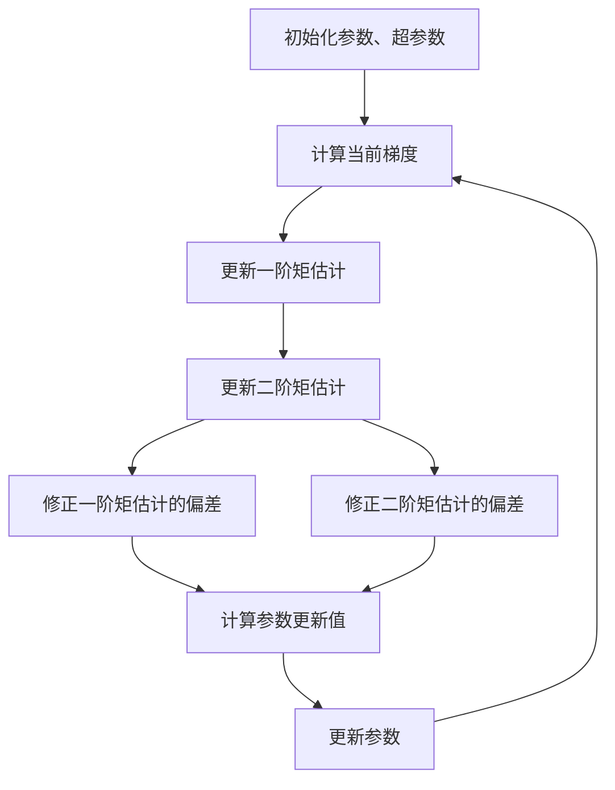

# Python深度学习实践：自适应学习率调整技术

## 1.背景介绍

### 1.1 深度学习与优化算法

深度学习是机器学习的一个新兴热门领域,通过对数据的特征进行高效自动提取和转换,并利用多层神经网络对数据进行建模和分析。在深度学习模型的训练过程中,优化算法扮演着至关重要的角色。优化算法的目标是通过迭代地更新神经网络的参数,最小化损失函数,从而提高模型的性能。

### 1.2 学习率的重要性

学习率是优化算法中最关键的超参数之一。学习率决定了在每次迭代中,参数被更新的幅度。一个过大的学习率可能导致模型无法收敛或发散,而一个过小的学习率则可能使训练过程变得极其缓慢。因此,合理设置学习率对于训练高质量的深度学习模型至关重要。

### 1.3 自适应学习率调整技术的需求

传统的优化算法通常使用固定的学习率或者预先设定的学习率衰减策略。然而,这种方法存在一些缺陷:

1. 固定学习率难以同时满足所有参数的更新需求
2. 预设的衰减策略可能不适合所有数据集和模型
3. 手动调整学习率是一个耗时且需要专业知识的过程

因此,自适应调整学习率的技术应运而生,以根据模型训练的实际情况动态调整每个参数的学习率,从而加速训练过程并提高模型性能。

## 2.核心概念与联系  

### 2.1 自适应学习率调整技术概述

自适应学习率调整技术是一类优化算法,它们能够根据每个参数的更新历史自动调整对应的学习率。这些算法通常基于以下两个核心概念:

1. **梯度统计量**: 利用过去的梯度信息计算每个参数的统计量,如均值、方差等。
2. **学习率更新规则**: 根据梯度统计量,为每个参数设置合适的动态学习率。

不同的自适应学习率算法在具体实现上有所区别,但它们的目标都是使用动态学习率来加速收敛并提高模型性能。

### 2.2 常见自适应学习率算法

以下是一些广为人知的自适应学习率调整算法:

- **Adagrad**: 利用所有过去梯度的平方和来调整学习率,对于高频参数会过度衰减学习率。
- **RMSProp**: 通过指数加权移动平均来计算梯度统计量,部分解决了Adagrad的问题。
- **Adam**: 结合了动量和RMSProp的优点,是当前最流行的自适应学习率算法之一。
- **Nadam**: 在Adam的基础上,引入更有效的动量计算方式。
- **AMSGrad**: 修复了Adam可能导致的非收敛问题。

这些算法在不同场景下表现各有优劣,选择合适的算法对于训练高质量模型至关重要。

## 3.核心算法原理具体操作步骤

在这一部分,我们将重点介绍Adam算法的原理和具体实现步骤。Adam算法结合了动量和RMSProp的优点,是目前应用最广泛的自适应学习率调整算法之一。

### 3.1 Adam算法原理

Adam算法的核心思想是计算每个参数的一阶矩估计(动量)和二阶矩估计(RMSProp),并根据这两个统计量动态调整对应参数的学习率。具体来说,Adam算法包括以下几个步骤:

1. 初始化参数和超参数(学习率、动量衰减率、RMSProp衰减率等)
2. 计算当前梯度
3. 更新一阶矩估计(动量)
4. 更新二阶矩估计(RMSProp)
5. 修正一阶矩估计和二阶矩估计的偏差
6. 根据修正后的一阶矩估计和二阶矩估计计算当前参数的更新值
7. 更新参数

以上过程在每次迭代中重复执行,直至模型收敛或达到最大迭代次数。

### 3.2 Adam算法实现步骤

下面是Adam算法的具体实现步骤,其中 $g_t$ 表示当前梯度, $m_t$ 和 $v_t$ 分别表示一阶矩估计和二阶矩估计, $\beta_1$ 和 $\beta_2$ 是相应的衰减率, $\hat{m}_t$ 和 $\hat{v}_t$ 是修正后的一阶矩估计和二阶矩估计:

1. 初始化参数 $\theta_0$, 初始化一阶矩估计 $m_0 = 0$, 二阶矩估计 $v_0 = 0$
2. 对于每次迭代 $t=1,2,\dots$:
    - 计算当前梯度 $g_t = \nabla_\theta J(\theta_{t-1})$
    - 更新一阶矩估计: $m_t = \beta_1 m_{t-1} + (1 - \beta_1)g_t$
    - 更新二阶矩估计: $v_t = \beta_2 v_{t-1} + (1 - \beta_2)g_t^2$
    - 修正一阶矩估计的偏差: $\hat{m}_t = \frac{m_t}{1 - \beta_1^t}$
    - 修正二阶矩估计的偏差: $\hat{v}_t = \frac{v_t}{1 - \beta_2^t}$
    - 计算更新值: $\Delta\theta_t = -\frac{\alpha}{\sqrt{\hat{v}_t} + \epsilon}\hat{m}_t$
    - 更新参数: $\theta_t = \theta_{t-1} + \Delta\theta_t$

其中 $\alpha$ 是学习率, $\epsilon$ 是一个很小的正数,用于避免除以零的情况。

通过上述步骤,Adam算法能够为每个参数自适应地调整学习率,加速模型收敛并提高性能。

## 4.数学模型和公式详细讲解举例说明

在上一部分,我们介绍了Adam算法的原理和实现步骤。现在,让我们深入探讨一下算法中涉及的数学模型和公式。

### 4.1 一阶矩估计(动量)

Adam算法中的一阶矩估计 $m_t$ 实际上是对梯度的指数加权移动平均,它引入了一个动量项,有助于加速收敛并跳出局部最优。一阶矩估计的更新公式为:

$$m_t = \beta_1 m_{t-1} + (1 - \beta_1)g_t$$

其中 $\beta_1$ 是动量衰减率,通常设置为0.9。这个公式可以看作是对梯度 $g_t$ 进行指数加权平均,权重为 $(1 - \beta_1)$。

然而,在训练的初始阶段,由于 $\beta_1$ 的值接近1,因此 $m_t$ 会被严重低估。为了解决这个问题,Adam算法引入了偏差修正项:

$$\hat{m}_t = \frac{m_t}{1 - \beta_1^t}$$

通过除以 $(1 - \beta_1^t)$,可以将 $m_t$ 缩放到合理的范围,从而获得更准确的一阶矩估计。

### 4.2 二阶矩估计(RMSProp)

Adam算法中的二阶矩估计 $v_t$ 类似于RMSProp算法中的自适应学习率,它利用过去梯度的平方和来调整每个参数的学习率。二阶矩估计的更新公式为:

$$v_t = \beta_2 v_{t-1} + (1 - \beta_2)g_t^2$$

其中 $\beta_2$ 是RMSProp衰减率,通常设置为0.999。与一阶矩估计类似,二阶矩估计在初始阶段也会被低估,因此需要进行偏差修正:

$$\hat{v}_t = \frac{v_t}{1 - \beta_2^t}$$

### 4.3 参数更新公式

在获得修正后的一阶矩估计 $\hat{m}_t$ 和二阶矩估计 $\hat{v}_t$ 之后,Adam算法使用以下公式更新参数:

$$\Delta\theta_t = -\frac{\alpha}{\sqrt{\hat{v}_t} + \epsilon}\hat{m}_t$$
$$\theta_t = \theta_{t-1} + \Delta\theta_t$$

其中 $\alpha$ 是全局学习率, $\epsilon$ 是一个很小的正数(如 $10^{-8}$),用于避免除以零的情况。

这个更新公式将一阶矩估计(动量)和二阶矩估计(自适应学习率)结合起来,实现了动态调整每个参数的学习率。具体来说:

- 如果一个参数的梯度较大,则 $\hat{v}_t$ 也会较大,从而降低该参数的有效学习率 $\frac{\alpha}{\sqrt{\hat{v}_t} + \epsilon}$,避免参数值的剧烈变化。
- 如果一个参数的梯度较小,则 $\hat{v}_t$ 也会较小,从而提高该参数的有效学习率,加速收敛。
- 动量项 $\hat{m}_t$ 可以加速收敛并跳出局部最优。

通过这种自适应的学习率调整机制,Adam算法能够为不同的参数设置合适的更新步长,从而提高模型的收敛速度和性能。

### 4.4 数学模型总结

为了更清晰地理解Adam算法,我们可以用一个流程图来总结其数学模型:



这个流程图清晰地展示了Adam算法在每次迭代中的计算步骤,包括梯度计算、一阶矩估计更新、二阶矩估计更新、偏差修正以及参数更新。通过循环执行这些步骤,Adam算法能够自适应地调整每个参数的学习率,从而加速模型收敛并提高性能。

## 5.项目实践:代码实例和详细解释说明

在理解了Adam算法的原理和数学模型之后,让我们通过一个实际的代码示例来进一步加深理解。在这个示例中,我们将使用PyTorch框架实现Adam算法,并应用于训练一个简单的多层感知机模型。

### 5.1 导入所需库

```python
import torch
import torch.nn as nn
import torch.optim as optim
from torch.utils.data import DataLoader
from torchvision import datasets, transforms
```

我们导入了PyTorch相关的库,包括神经网络模块 `nn`、优化器模块 `optim` 以及数据加载和预处理模块。

### 5.2 定义模型

```python
class MLP(nn.Module):
    def __init__(self):
        super(MLP, self).__init__()
        self.fc1 = nn.Linear(28 * 28, 512)
        self.fc2 = nn.Linear(512, 256)
        self.fc3 = nn.Linear(256, 10)

    def forward(self, x):
        x = x.view(-1, 28 * 28)
        x = torch.relu(self.fc1(x))
        x = torch.relu(self.fc2(x))
        x = self.fc3(x)
        return x
```

这是一个简单的多层感知机模型,包含三个全连接层。输入是 $28 \times 28$ 的图像像素值,经过两个ReLU激活函数层和一个线性输出层,输出为长度为10的向量,对应10个数字类别。

### 5.3 加载数据集

```python
train_dataset = datasets.MNIST(root='./data', train=True, transform=transforms.ToTensor(), download=True)
test_dataset = datasets.MNIST(root='./data', train=False, transform=transforms.ToTensor(), download=True)

train_loader = DataLoader(train_dataset, batch_size=64, shuffle=True)
test_loader = DataLoader(test_dataset, batch_size=64, shuffle=False)
```

我们加载了著名的MNIST手写数字数据集,并将其分为训练集和测试集。数据经过了 `ToTensor` 转换,将图像像素值映射到 $[0, 1]$ 区间。我们使用批量大小为64的数据加载器加载数据。

### 5.4 定义损失函数和优化器