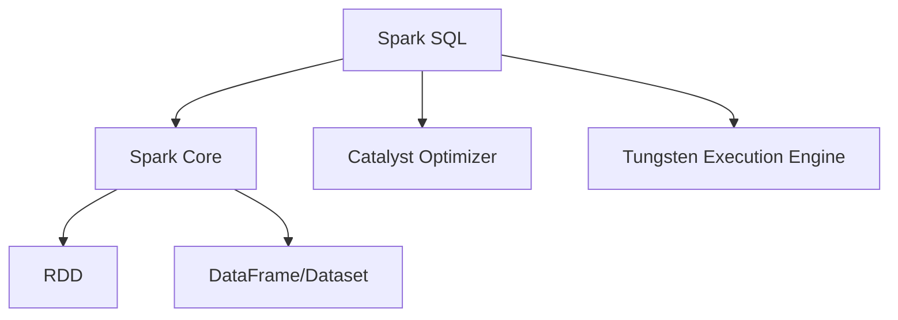

# Spark SQL结构化数据处理原理与代码实例讲解

## 1.背景介绍

### 1.1 大数据时代的到来

随着互联网、物联网和移动互联网的快速发展,数据呈现出爆炸式增长趋势。传统的数据处理系统已经无法满足大数据时代对海量数据的存储和计算需求。大数据时代的到来,对数据处理能力提出了更高的要求,迫切需要一种全新的大数据处理架构和技术。

### 1.2 Spark的诞生

Apache Spark作为一种新型的大数据处理框架应运而生。它起源于加州大学伯克利分校的一个研究项目,旨在构建一个比Hadoop MapReduce更快、更通用的大数据处理引擎。Spark最初于2009年开发,2010年开源,2013年成为Apache顶级项目。凭借其优秀的性能和丰富的组件,Spark迅速成为大数据处理领域的热门技术。

### 1.3 Spark SQL的重要性

Spark SQL是Spark项目中的一个重要模块,它引入了一种结构化的数据处理方式,支持使用SQL或者类似SQL的领域特定语言(DSL)来查询数据。Spark SQL可以统一处理各种数据源,包括Hive表、Parquet文件、JSON数据等。它在内部使用了Spark的查询优化器,能够高效地执行SQL查询。

## 2.核心概念与联系

### 2.1 DataFrame

DataFrame是Spark SQL中的核心概念,它提供了一种分布式内存中的结构化数据抽象。DataFrame可以从各种数据源构建,如结构化文件、Hive表、RDD等。它与传统数据库中的表类似,具有命名列和行,但底层依赖Spark的弹性分布式数据集(RDD)。

```scala
// 从JSON文件创建DataFrame
val df = spark.read.json("examples/src/main/resources/people.json")

// 查看DataFrame的Schema
df.printSchema()

// 显示前几行数据
df.show()
```

### 2.2 Dataset

Dataset是Spark 1.6引入的新概念,它是DataFrame的一种特例,提供了对JVM对象的编程接口。Dataset在DataFrame的基础上增加了对编译时类型安全的支持,可以避免一些运行时错误。

```scala
// 定义案例类Person
case class Person(name: String, age: Long)

// 从RDD创建Dataset
val caseClassDS = people.map(_.split(",")).map(p => Person(p(0), p(1).trim.toInt)).toDS()

// 显示Dataset中的数据
caseClassDS.show()
```

### 2.3 Spark SQL与Spark Core的关系

Spark SQL建立在Spark Core之上,它利用了Spark Core提供的分布式计算能力。Spark SQL将结构化数据表示为RDD或DataFrame/Dataset,然后使用Spark Core的转换和动作操作来处理这些数据。同时,Spark SQL还提供了自己的优化器和执行器,用于高效地执行SQL查询。



## 3.核心算法原理具体操作步骤

### 3.1 Catalyst优化器

Catalyst优化器是Spark SQL的核心组件之一,它负责优化逻辑执行计划。优化器会将SQL查询解析为逻辑计划,然后应用一系列规则对计划进行优化,最终生成高效的物理执行计划。

优化过程包括以下几个阶段:

1. **解析(Parsing)**: 将SQL查询解析为抽象语法树(AST)。
2. **分析(Analysis)**: 对AST进行语义分析,解析引用、类型检查等。
3. **逻辑优化(Logical Optimization)**: 对逻辑计划应用一系列规则进行优化,如谓词下推、投影剪裁等。
4. **物理优化(Physical Optimization)**: 根据代价模型选择最优的物理执行计划。
5. **代码生成(Code Generation)**: 将优化后的物理计划编译为高效的Java字节码。

### 3.2 Tungsten执行引擎

Tungsten是Spark SQL的另一个核心组件,它负责高效地执行物理执行计划。Tungsten引入了多种优化技术,包括:

1. **内存管理优化**: 使用Sun Unsafe直接操作内存,避免JVM对象开销。
2. **Cache-Aware编译**: 生成考虑CPU缓存局部性的高效代码。
3. **向量化**: 利用CPU的SIMD指令集进行向量化计算。
4. **编码字节码**: 直接生成字节码,避免JVM解释器开销。

这些优化使Tungsten能够充分利用现代硬件的计算能力,大幅提升Spark SQL的执行效率。

## 4.数学模型和公式详细讲解举例说明

在Spark SQL的查询优化过程中,会使用一些数学模型和公式来评估执行计划的代价,从而选择最优的执行策略。下面我们介绍一些常见的代价模型。

### 4.1 基本代价模型

基本代价模型考虑了以下几个因素:

- $N$: 输入数据的行数
- $M$: 输入数据的列数
- $V$: 选择性(Selectivity),表示过滤后剩余数据的比例
- $C_p$: CPU代价,表示CPU开销
- $C_i$: I/O代价,表示磁盘I/O开销

对于简单的操作,如投影(Projection)和过滤(Filter),代价可以估算为:

$$
Cost = N \times (C_p + C_i \times V)
$$

对于连接(Join)操作,代价估算为:

$$
Cost = N_1 \times N_2 \times (C_p + C_i)
$$

其中$N_1$和$N_2$分别表示两个输入数据的行数。

### 4.2 基数估计

在代价模型中,准确估计中间结果的基数(行数)是一个关键问题。Spark SQL使用了一种基于采样的基数估计算法。

假设我们要估计过滤操作$\sigma_{pred}(R)$的结果基数,其中$R$是输入关系,pred是谓词条件。我们可以从$R$中抽取一个样本$S$,计算满足谓词的样本比例$f$,然后将$f$乘以$R$的基数,得到结果基数的估计值:

$$
|{\sigma_{pred}(R)}| \approx f \times |R|
$$

对于连接操作,我们可以利用最小选择性原理进行基数估计。

### 4.3 代价模型的局限性

尽管代价模型对于简单查询的优化效果不错,但对于复杂查询,它可能会产生较大误差。这是因为代价模型做了一些简化假设,忽略了一些重要因素,如:

- 数据分布特征(如数据倾斜)
- 操作之间的相关性
- 硬件特征(如CPU、内存、网络等)

因此,Spark SQL还在不断改进代价模型,以提高查询优化的效果。

## 4.项目实践:代码实例和详细解释说明

接下来,我们通过一些实际的代码示例,演示如何使用Spark SQL进行结构化数据处理。

### 4.1 创建DataFrame

我们首先创建一个DataFrame,用于后续的查询操作。这里我们使用内置的人口普查数据集`examples/src/main/resources/people.json`。

```scala
// 从JSON文件创建DataFrame
val df = spark.read.json("examples/src/main/resources/people.json")

// 查看Schema
df.printSchema()
```

输出:

```
root
 |-- age: long (nullable = true)
 |-- name: string (nullable = true)
```

### 4.2 基本查询操作

接下来,我们演示一些基本的查询操作,如选择(Select)、过滤(Filter)和分组聚合(GroupBy)等。

```scala
// 选择age列,并过滤age > 21
df.select("age")
  .where("age > 21")
  .show()

// 按age分组,计算每个组的人数
df.groupBy("age")
  .count()
  .show()
```

输出:

```
+---+
|age|
+---+
| 36|
| 37|
| 19|
|null|
+---+

+----+-----+
|age|count|
+----+-----+
|  19|    1|
|null|    1|
|  36|    1|
|  37|    1|
+----+-----+
```

### 4.3 Join操作

我们还可以执行Join操作,将两个DataFrame按照指定条件连接。这里我们创建另一个DataFrame `fakeFriends`,并与原始DataFrame执行内连接(Inner Join)。

```scala
// 创建另一个DataFrame
val fakeFriends = Seq((0,"Jerry"), (1,"Michael"), (2, "Andy"), (3, "Justin")).toDF("id", "name")

// 执行内连接
df.join(fakeFriends, df("age") === fakeFriends("id"), "inner")
  .select(df("name"), fakeFriends("name"))
  .show()
```

输出:

```
+------+-------+
|  name|   name|
+------+-------+
|Justin|  null|
|   null|Michael|
|   null|   Andy|
|   null| Jerry|
+------+-------+
```

### 4.4 UDF函数

Spark SQL支持用户定义函数(UDF),可以用Scala、Java或Python编写。下面是一个简单的Scala UDF示例,用于计算字符串长度。

```scala
// 定义UDF
val lengthUDF = udf((str: String) => str.length)

// 应用UDF
df.select(lengthUDF($"name").alias("nameLengths")).show()
```

输出:

```
+------------+
|nameLengths|
+------------+
|           4|
|          11|
|           7|
|           6|
+------------+
```

## 5.实际应用场景

Spark SQL可以应用于各种场景,包括但不限于:

1. **交互式数据分析**: 使用Spark SQL或Spark DataFrame API进行交互式数据探索和分析。
2. **ETL工作负载**: 利用Spark SQL进行高效的数据提取、转换和加载(ETL)。
3. **流式处理**: 使用Spark Structured Streaming进行近乎实时的流式数据处理。
4. **机器学习管道**: 将Spark SQL与Spark MLlib结合,构建端到端的机器学习管道。
5. **数据湖**: 使用Spark SQL查询和处理数据湖中的各种数据源。

以电子商务网站为例,Spark SQL可以用于:

- 分析用户行为日志,发现用户偏好和购买模式
- 处理订单数据,生成销售报告和营收分析
- 构建实时推荐系统,为用户提供个性化推荐
- 整合多源数据,为数据分析和机器学习提供支持

## 6.工具和资源推荐

在使用Spark SQL进行开发时,有一些工具和资源值得推荐:

1. **Spark Web UI**: Spark自带的Web UI,可以监控作业进度、查看执行计划等。
2. **Spark UI扩展**: 如Spark PAM、Spark Monitoring Tool等,提供更丰富的监控和诊断功能。
3. **Zeppelin Notebook**: 一种基于Web的交互式notebook,支持Spark SQL、Scala、Python等。
4. **DataBricks云平台**: 提供基于云的Spark集群和协作环境,适合快速原型开发。
5. **Spark官方文档**: Spark SQL的官方文档,包含了详细的概念介绍和API参考。
6. **Spark官方培训**: DataBricks提供的Spark在线培训课程,可以系统学习Spark相关知识。
7. **Spark源代码**: 阅读Spark源代码,深入了解Spark SQL的实现细节。

## 7.总结:未来发展趋势与挑战

### 7.1 Spark SQL的未来发展趋势

Spark SQL作为Apache Spark项目的核心组件之一,其未来发展趋势包括:

1. **性能持续优化**: 继续优化查询执行引擎、内存管理等,提升Spark SQL的性能。
2. **功能增强**: 支持更多数据源、更丰富的SQL语法和函数库。
3. **可扩展性提升**: 改进分区策略和执行计划调度,提高集群扩展能力。
4. **安全性和隔离性**: 增强安全性和多租户隔离能力,适应更多企业级场景。
5. **与AI/ML的深度融合**: 与Spark MLlib/ML更紧密集成,支持AI/ML工作负载。

### 7.2 Spark SQL面临的挑战

尽管Spark SQL取得了长足进步,但仍面临一些挑战:

1. **性能瓶颈**: 随着数据量和查询复杂度的增加,性能优化变得更加困难。
2. **成本控制**: 在公有云环境下,如何控制资源使用成本是一大挑战。