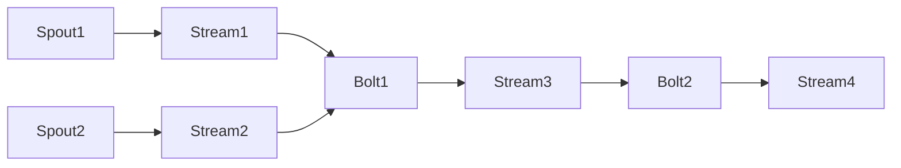

# Storm Topology原理与代码实例讲解

## 1.背景介绍

### 1.1 什么是Storm

Apache Storm是一个分布式实时计算系统,用于快速可靠地处理大量的数据流。它是一个开源的分布式实时计算系统,可以用于实时分析大量的高速数据流。Storm以流式方式处理数据,使用Topology概念来定义数据流经过的路径和处理逻辑。

### 1.2 Storm的应用场景

Storm适用于需要低延迟、高吞吐量和可靠处理的场景,例如:

- 实时分析: 从社交媒体、传感器数据、交易数据等实时数据流中获取洞察力
- 在线机器学习: 基于实时数据流构建机器学习模型
-连续计算: 对数据流进行持续查询和计算
- 分布式RPC: 并行化分布式计算任务
- ETL实时管道: 从各种来源提取、转换和加载数据到数据存储

### 1.3 Storm的优势

- 高性能: 每个节点每秒可处理数百万个消息
- 容错性: 具有自动故障恢复机制,保证数据不丢失
- 可扩展性: 可以轻松地向集群添加更多节点来扩展计算能力
- 编程灵活: 使用简单的Topology概念定义数据流和处理逻辑
- 可靠性: 通过至少一次语义保证数据处理的可靠性
- 易操作: 支持动态调整Topology并在线查看集群状态

## 2.核心概念与联系

### 2.1 Topology

Topology是Storm中定义实时应用程序的关键数据结构。它定义了数据流经过的路径以及应用于每个数据流的处理逻辑。Topology由Spouts和Bolts组成,并通过Stream Groups将它们连接起来。



### 2.2 Spout

Spout是Topology中的数据源,它从外部源(如消息队列、文件、数据库等)读取数据,并将其注入Topology中的数据流。Spout必须实现一个可重新运行的方法,以便在故障恢复时重新发出相同的数据流。

### 2.3 Bolt  

Bolt是Topology中的处理单元,它从一个或多个Stream中消费数据,并执行所需的处理逻辑。处理后的数据可以发送到新的Stream中,供下游Bolt进一步处理。Bolt可以执行过滤、函数操作、持久化等各种操作。

### 2.4 Stream

Stream是无边界的、连续的数据流,由Spout或Bolt生成。每个Stream由一个或多个分区组成,这些分区可以分布在集群中的多个任务实例上进行并行处理。

### 2.5 Stream Grouping

Stream Grouping定义了如何将一个Stream的输出分区路由到下游Bolt的任务实例。Storm提供了多种Stream Grouping策略,如Shuffle Grouping、Fields Grouping、Global Grouping等,用于满足不同的需求。

## 3.核心算法原理具体操作步骤 

Storm的核心算法原理是基于流式处理和有向无环图(DAG)的概念。下面是Storm的工作原理和具体操作步骤:

### 3.1 Topology提交和调度

1. 用户通过编程方式定义Topology,包括Spouts、Bolts、Stream Groupings等。
2. 将Topology提交给Nimbus(Storm集群的主控节点)。
3. Nimbus将Topology分解为多个执行任务,并将这些任务分发给各个工作节点(Supervisor)上的Worker进程。

### 3.2 数据流处理

1. Spout从外部数据源读取数据,并将其注入Topology的数据流中。
2. 数据流经过一系列Bolt进行处理,每个Bolt执行特定的处理逻辑。
3. 处理后的数据可以发送到新的Stream中,供下游Bolt进行进一步处理。
4. 最终处理结果可以存储到外部系统(如数据库、文件系统等)或触发其他操作。

### 3.3 数据分区和并行处理

1. Storm将每个Stream划分为多个分区,这些分区可以分布在集群中的多个任务实例上进行并行处理。
2. Stream Grouping策略决定了如何将一个Stream的输出分区路由到下游Bolt的任务实例。
3. 每个Bolt任务实例独立处理分配给它的分区数据,从而实现并行处理。

### 3.4 故障恢复和重播

1. Storm使用至少一次语义来保证数据处理的可靠性。
2. 如果任务实例发生故障,Nimbus会在另一个工作节点上重新启动该任务实例。
3. 重新启动的任务实例从最后一次成功处理的位置开始,重新处理未完成的数据。
4. Spout需要实现可重新运行的方法,以便在故障恢复时重新发出相同的数据流。

### 3.5 动态调整和监控

1. Storm支持在线动态调整Topology,如增加或减少任务实例的并行度。
2. Storm UI和监控工具可以实时监控Topology的运行状态、数据流量等指标。
3. 用户可以根据监控数据动态调整Topology,以优化性能和资源利用率。

## 4.数学模型和公式详细讲解举例说明

在Storm中,数据流的处理速率和延迟受到多个因素的影响,包括数据输入速率、Bolt处理能力、任务并行度等。我们可以使用一些数学模型来分析和优化Storm Topology的性能。

### 4.1 小顶堆模型

假设我们有一个由$n$个Bolt组成的Topology,每个Bolt的处理能力为$r_i$(元组/秒),输入数据流的速率为$\lambda$(元组/秒)。我们可以将Topology建模为一个$M/G/1$队列系统,其中服务时间服从一般分布。

令$\mu = \sum_{i=1}^{n} r_i$为系统的总体服务率,则系统的利用率为:

$$\rho = \frac{\lambda}{\mu}$$

根据小顶堆模型,当$\rho < 1$时,系统处于稳定状态,平均响应时间$T$为:

$$T = \frac{1}{\mu - \lambda}$$

当$\rho \geq 1$时,系统处于饱和状态,队列长度将无限增长。

通过这个模型,我们可以估计Topology在给定输入速率下的平均响应时间,并根据需要调整Bolt的并行度或处理能力。

### 4.2 流量控制模型

在Storm中,我们可以通过配置每个Bolt的最大输入/输出流量来控制数据流量,避免任务实例被淹没。假设一个Bolt的最大输入流量为$r_{in}$(元组/秒),最大输出流量为$r_{out}$(元组/秒),输入数据流的速率为$\lambda$(元组/秒)。

令$p$为Bolt处理一个元组所需的平均时间,则Bolt的实际处理速率为$\mu = 1/p$(元组/秒)。我们可以将Bolt建模为一个$M/M/1$队列系统,其中到达过程和服务过程均服从泊松分布。

根据$M/M/1$模型,当$\rho = \lambda/\mu < 1$时,Bolt处于稳定状态,平均队列长度$L_q$为:

$$L_q = \frac{\rho^2}{1 - \rho}$$

为了避免队列长度过长导致任务实例被淹没,我们需要保证:

$$\lambda \leq \min(r_{in}, r_{out}, \mu)$$

通过这个模型,我们可以合理配置Bolt的最大输入/输出流量,以确保Topology的稳定性和低延迟。

## 4.项目实践:代码实例和详细解释说明

下面我们通过一个简单的单词计数示例,展示如何使用Java编写一个基本的Storm Topology。

### 4.1 定义Spout

我们首先定义一个`SentenceSpout`来生成句子流。这个Spout会无限循环地发出一些预定义的句子。

```java
import java.util.Map;
import org.apache.storm.spout.SpoutOutputCollector;
import org.apache.storm.task.TopologyContext;
import org.apache.storm.topology.OutputFieldsDeclarer;
import org.apache.storm.topology.base.BaseRichSpout;
import org.apache.storm.tuple.Fields;
import org.apache.storm.tuple.Values;

public class SentenceSpout extends BaseRichSpout {
    private SpoutOutputCollector collector;
    private String[] sentences = {
        "the quick brown fox jumps over the lazy dog",
        "hello world this is a test sentence",
        "storm is a distributed real-time computation system"
    };
    private int index = 0;

    @Override
    public void open(Map conf, TopologyContext context, SpoutOutputCollector collector) {
        this.collector = collector;
    }

    @Override
    public void nextTuple() {
        this.collector.emit(new Values(sentences[index]));
        index = (index + 1) % sentences.length;
        Thread.sleep(1000); // 每秒发出一个句子
    }

    @Override
    public void declareOutputFields(OutputFieldsDeclarer declarer) {
        declarer.declare(new Fields("sentence"));
    }
}
```

在`open`方法中,我们获取了`SpoutOutputCollector`对象,用于发出数据流。`nextTuple`方法会周期性地从预定义的句子数组中发出一个句子。`declareOutputFields`方法声明了输出流的字段名称。

### 4.2 定义Bolt

接下来,我们定义一个`WordCountBolt`来统计每个单词出现的次数。

```java
import java.util.HashMap;
import java.util.Map;
import org.apache.storm.task.OutputCollector;
import org.apache.storm.task.TopologyContext;
import org.apache.storm.topology.OutputFieldsDeclarer;
import org.apache.storm.topology.base.BaseRichBolt;
import org.apache.storm.tuple.Fields;
import org.apache.storm.tuple.Tuple;
import org.apache.storm.tuple.Values;

public class WordCountBolt extends BaseRichBolt {
    private OutputCollector collector;
    private Map<String, Integer> wordCounts;

    @Override
    public void prepare(Map conf, TopologyContext context, OutputCollector collector) {
        this.collector = collector;
        this.wordCounts = new HashMap<>();
    }

    @Override
    public void execute(Tuple tuple) {
        String sentence = tuple.getStringByField("sentence");
        String[] words = sentence.split(" ");
        for (String word : words) {
            Integer count = wordCounts.get(word);
            if (count == null) {
                count = 0;
            }
            count++;
            wordCounts.put(word, count);
        }
        collector.emit(new Values(wordCounts));
    }

    @Override
    public void declareOutputFields(OutputFieldsDeclarer declarer) {
        declarer.declare(new Fields("wordCounts"));
    }
}
```

在`prepare`方法中,我们初始化了`wordCounts`映射表,用于存储每个单词的计数。`execute`方法会对每个输入的句子进行单词拆分,并更新`wordCounts`映射表。最后,Bolt会发出包含当前单词计数的数据流。

### 4.3 定义Topology

现在,我们可以定义一个简单的Topology,将`SentenceSpout`和`WordCountBolt`连接起来。

```java
import org.apache.storm.Config;
import org.apache.storm.LocalCluster;
import org.apache.storm.topology.TopologyBuilder;
import org.apache.storm.tuple.Fields;

public class WordCountTopology {
    public static void main(String[] args) {
        TopologyBuilder builder = new TopologyBuilder();

        builder.setSpout("sentence-spout", new SentenceSpout(), 1);
        builder.setBolt("word-count-bolt", new WordCountBolt(), 2)
                .shuffleGrouping("sentence-spout");

        Config conf = new Config();
        conf.setDebug(true);

        LocalCluster cluster = new LocalCluster();
        cluster.submitTopology("word-count-topology", conf, builder.createTopology());
    }
}
```

在这个示例中,我们使用`TopologyBuilder`创建了一个包含`SentenceSpout`和`WordCountBolt`的Topology。`SentenceSpout`有一个执行线程,而`WordCountBolt`有两个并行执行线程。我们使用`shuffleGrouping`将`SentenceSpout`的输出随机分发给`WordCountBolt`的两个线程。

最后,我们创建了一个`LocalCluster`对象,并将Topology提交到本地Storm集群上运行。

### 4.4 运行Topology

编译并运行`WordCountTopology`的`main`方法,您将在控制台看到类似如下的输出:

```
...
1> word-count-bolt [{"storm":1, "this":1, "is":1, "a":1, "distributed":1, "real-time":1, "computation":1, "system":1}]
2> word-count-bolt [{"the":2, "quick":1, "brown":1, "fox":1, "jumps":1