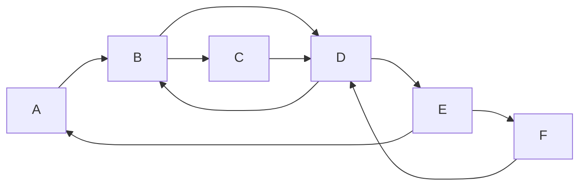

## 1.背景介绍

在图论中，强连通分量(Strongly Connected Components, SCC)是一个重要的概念。一个有向图的强连通分量是其中最大的节点子集,使得对于任意两个节点u和v,都存在从u到v和从v到u的路径。换句话说,强连通分量是有向图中的一个子图,其中任意两个节点都是相互可达的。

强连通分量在许多领域都有着广泛的应用,例如:

- 编译器构造: 在编译器中,强连通分量可用于检测程序中的循环依赖,从而优化代码。
- 网络分析: 在社交网络、网页链接等网络分析中,强连通分量可以揭示网络中的社区结构。
- 系统设计: 在分布式系统中,强连通分量可用于检测死锁和确保一致性。

由于强连通分量的重要性,因此设计高效的算法来计算强连通分量成为一个关键问题。在本文中,我们将深入探讨一种经典且高效的算法 —— Tarjan算法,并通过代码示例来说明其实现细节。

### 1.1 有向图和强连通分量的定义

在正式介绍Tarjan算法之前,我们先来回顾一下有向图和强连通分量的定义。

**有向图(Directed Graph)**: 一个有向图G由一组顶点(Vertices)V和一组有向边(Directed Edges)E组成,记作G=(V,E)。每条边e∈E都连接两个顶点,我们用有序对(u,v)来表示从顶点u到顶点v的有向边。

**强连通分量(Strongly Connected Components)**: 在一个有向图G=(V,E)中,如果对于任意两个顶点u和v,都存在一条从u到v和从v到u的路径,那么我们说这些顶点属于同一个强连通分量。形式上,如果存在路径u→v和v→u,则u和v在同一个强连通分量中。一个有向图可能包含多个强连通分量。

### 1.2 强连通分量的重要性

强连通分量在许多领域都有着重要的应用,例如:

**编译器构造**: 在编译器中,强连通分量可用于检测程序中的循环依赖,从而优化代码。如果程序中存在循环依赖,那么就可能导致无限循环或死锁。通过计算强连通分量,编译器可以识别出这些循环依赖,并采取相应的措施来避免它们。

**网络分析**: 在社交网络、网页链接等网络分析中,强连通分量可以揭示网络中的社区结构。一个强连通分量可以被视为一个紧密相连的社区,其中的节点之间存在着强烈的相互影响和依赖关系。通过计算强连通分量,我们可以更好地理解网络的结构和特性。

**系统设计**: 在分布式系统中,强连通分量可用于检测死锁和确保一致性。如果一个分布式系统中存在循环等待,那么就可能导致死锁。通过计算强连通分量,我们可以识别出这些循环等待,从而采取适当的措施来避免死锁的发生。

由于强连通分量在许多领域都有着重要的应用,因此设计高效的算法来计算强连通分量成为一个关键问题。在接下来的章节中,我们将深入探讨Tarjan算法,这是一种经典且高效的算法,用于计算有向图的强连通分量。

## 2.核心概念与联系

在介绍Tarjan算法之前,我们需要先了解一些核心概念和它们之间的联系。这些概念对于理解算法的原理和实现细节至关重要。

### 2.1 深度优先搜索(Depth-First Search, DFS)

Tarjan算法的核心思想是基于深度优先搜索(DFS)。DFS是一种遍历图的经典算法,它从一个起始节点开始,沿着一条路径尽可能深入,直到无法继续前进为止。然后回溯到上一个节点,尝试另一条路径,直到遍历完整个图为止。

在DFS过程中,我们可以记录每个节点的发现时间(discovery time)和完成时间(finish time)。发现时间是指第一次访问该节点的时间戳,而完成时间是指完成该节点及其所有后代节点的访问时间戳。

### 2.2 低值(Low Value)

在Tarjan算法中,我们为每个节点维护一个低值(low value)。低值的定义如下:

对于一个节点u,它的低值low[u]是u或u的后代节点能够通过反向边(back edge)到达的最早发现时间的节点的发现时间。

换句话说,low[u]表示从u或其后代节点出发,通过树边或反向边能够到达的最早被发现的节点的发现时间。

低值的概念对于识别强连通分量至关重要,因为如果一个节点u的低值low[u]等于自身的发现时间disc[u],那么u就是一个强连通分量的根节点。

### 2.3 树边(Tree Edge)和反向边(Back Edge)

在DFS过程中,我们会遍历两种类型的边:

- **树边(Tree Edge)**: 在DFS树中连接父节点和子节点的边。
- **反向边(Back Edge)**: 从当前节点或其后代节点指向已经被访问过的祖先节点的边。

反向边的存在意味着存在一条从当前节点回到祖先节点的路径,这就形成了一个环路。通过检测反向边,我们可以识别出强连通分量。

### 2.4 Tarjan算法的核心思想

Tarjan算法的核心思想是:在DFS过程中,通过维护每个节点的低值(low value),来识别强连通分量的根节点。

具体来说,如果一个节点u的低值low[u]等于自身的发现时间disc[u],那么u就是一个强连通分量的根节点。从u出发,通过树边和反向边能够到达的所有节点都属于同一个强连通分量。

通过这种方式,Tarjan算法可以在线性时间内计算出有向图的所有强连通分量。

## 3.核心算法原理具体操作步骤

现在,让我们深入探讨Tarjan算法的具体原理和操作步骤。

### 3.1 算法步骤概述

Tarjan算法的基本步骤如下:

1. 初始化发现时间计数器time=0,以及每个节点的发现时间disc[u]、低值low[u]和是否已访问的标记visited[u]。
2. 对于每个未访问的节点u,调用DFS(u)进行深度优先搜索。
3. 在DFS(u)过程中:
   - 标记u为已访问,并设置disc[u]=low[u]=++time。
   - 对于u的每个邻居v:
     - 如果v未被访问,则递归调用DFS(v)。在回溯时,更新low[u]=min(low[u], low[v])。
     - 如果v已被访问,且存在一条反向边u->v,则更新low[u]=min(low[u], disc[v])。
   - 如果low[u]==disc[u],则u是一个强连通分量的根节点。输出从u可达的所有节点作为一个强连通分量。
4. 重复步骤3,直到所有节点都被访问过。

### 3.2 算法细节

接下来,我们将详细解释算法的每个步骤。

#### 3.2.1 初始化

在开始算法之前,我们需要初始化一些变量:

- time: 一个全局计数器,用于记录每个节点的发现时间和完成时间。
- disc[u]: 记录节点u的发现时间。
- low[u]: 记录节点u的低值。
- visited[u]: 标记节点u是否已被访问过。

我们将所有节点的disc[u]、low[u]和visited[u]初始化为0或false。

#### 3.2.2 深度优先搜索DFS(u)

对于每个未访问的节点u,我们调用DFS(u)进行深度优先搜索。在DFS(u)过程中,我们执行以下操作:

1. 标记u为已访问,并设置disc[u]=low[u]=++time。
2. 对于u的每个邻居v:
   - 如果v未被访问,则递归调用DFS(v)。在回溯时,更新low[u]=min(low[u], low[v])。
   - 如果v已被访问,且存在一条反向边u->v,则更新low[u]=min(low[u], disc[v])。
3. 如果low[u]==disc[u],则u是一个强连通分量的根节点。输出从u可达的所有节点作为一个强连通分量。

让我们详细解释一下这些步骤:

1. 我们首先标记u为已访问,并设置disc[u]=low[u]=++time。这意味着u是当前DFS树中第一个被访问的节点,因此它的发现时间和低值都等于当前的时间戳。

2. 对于u的每个邻居v,我们分两种情况处理:
   - 如果v未被访问,则递归调用DFS(v)。在回溯时,我们更新low[u]=min(low[u], low[v])。这是因为如果v或其后代节点能够通过反向边到达更早被发现的节点,那么u也能够到达那些节点。因此,我们需要将low[u]更新为low[u]和low[v]中的较小值。
   - 如果v已被访问,且存在一条反向边u->v,则更新low[u]=min(low[u], disc[v])。这是因为存在一条从u到v的反向边,因此u能够到达v及其祖先节点。我们将low[u]更新为disc[v],因为disc[v]是v及其祖先节点中最早被发现的节点的发现时间。

3. 如果low[u]==disc[u],则u是一个强连通分量的根节点。这是因为low[u]==disc[u]意味着从u出发,通过树边和反向边无法到达比u更早被发现的节点。因此,从u可达的所有节点都属于同一个强连通分量。我们输出从u可达的所有节点作为一个强连通分量。

通过这种方式,Tarjan算法可以在线性时间内计算出有向图的所有强连通分量。

#### 3.2.3 示例

为了更好地理解算法的工作原理,让我们通过一个示例来演示整个过程。

考虑下图所示的有向图:

我们将按照以下步骤执行Tarjan算法:

1. 初始化时间戳time=0,以及每个节点的disc[u]、low[u]和visited[u]。
2. 从节点A开始DFS。
   - 标记A为已访问,disc[A]=low[A]=1。
   - 访问A的邻居B。
     - B未被访问,递归调用DFS(B)。
       - 标记B为已访问,disc[B]=low[B]=2。
       - 访问B的邻居C。
         - C未被访问,递归调用DFS(C)。
           - 标记C为已访问,disc[C]=low[C]=3。
           - C没有未访问的邻居,low[C]=3。
           - 回溯到B,low[B]=min(low[B], low[C])=3。
       - 访问B的邻居D。
         - D未被访问,递归调用DFS(D)。
           - 标记D为已访问,disc[D]=low[D]=4。
           - 访问D的邻居B,B已被访问且存在反向边D->B,更新low[D]=min(low[D], disc[B])=2。
           - 访问D的邻居E。
             - E未被访问,递归调用DFS(E)。
               - 标记E为已访问,disc[E]=low[E]=5。
               - 访问E的邻居A,A已被访问且存在反向边E->A,更新low[E]=min(low[E], disc[A])=1。
               - 访问E的邻居F。
                 - F未被访问,递归调用DFS(F)。
                   - 标记F为已访问,disc[F]=low[F]=6。
                   - 访问F的邻居D,D已被访问且存在反向边F->D,更新low[F]=min(low[F], disc[D])=4。
                   - 回溯到E,low[E]=min(low[E], low[F])=1。
               - 回溯到D,low[D]=min(low[D], low[E])=1。
           - 回溯到B,low[B]=min(low[B], low[D])=1。
       - 访问B的邻居D,D已被访问,无需更新low[B]。
       - 由于low[