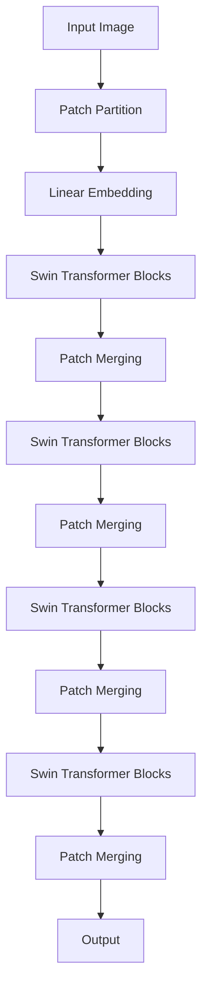
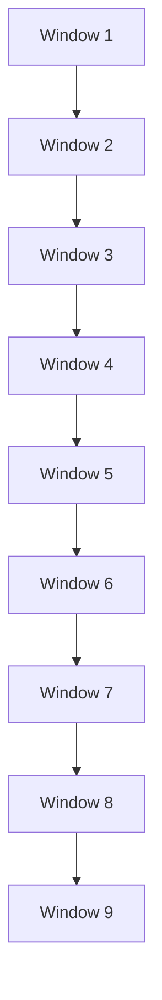
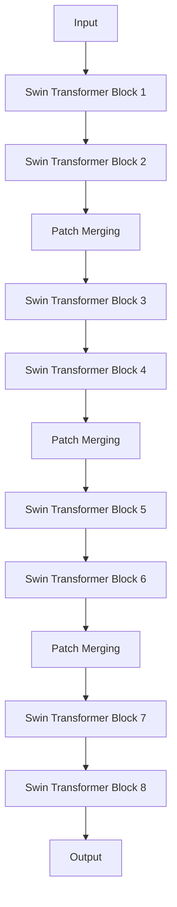

# Swin Transformer原理与代码实例讲解

## 1.背景介绍

### 1.1 视觉任务中Transformer的应用

随着深度学习的不断发展,Transformer模型在自然语言处理(NLP)领域取得了巨大的成功。最近几年,研究人员开始尝试将Transformer应用于计算机视觉任务,如图像分类、目标检测和语义分割等。与传统的卷积神经网络(CNN)相比,Transformer具有更强的长期依赖性捕捉能力,可以有效地建模图像中的全局信息。

### 1.2 视觉Transformer面临的挑战

尽管Transformer在NLP领域取得了巨大的成功,但将其直接应用于视觉任务仍然面临着一些挑战:

1. **高计算复杂度**: Transformer的自注意力机制需要计算每个像素与所有其他像素之间的关系,这使得计算复杂度呈现 $O(n^2)$ 的增长,对于高分辨率图像来说,计算量会变得极其庞大。

2. **缺乏位置信息**: 与序列数据不同,图像像素的位置信息对于视觉任务至关重要。Transformer原始设计中缺乏有效编码位置信息的机制。

3. **固定输入大小**: 标准Transformer要求输入序列长度固定,这与图像的任意大小输入相矛盾。

为了解决这些挑战,研究人员提出了各种改进的视觉Transformer模型,其中Swin Transformer是最新的一种高效且有前景的视觉Transformer。

## 2.核心概念与联系

### 2.1 Swin Transformer概述

Swin Transformer是由微软亚洲研究院在2021年提出的一种新型视觉Transformer,旨在解决标准Transformer在视觉任务中的计算效率和输入大小灵活性问题。它的核心思想是将图像分割为若干个非重叠的窗口,在每个窗口内计算自注意力,然后跨窗口进行信息交换。这种分层窗口分割策略大大降低了计算复杂度,同时保留了Transformer捕捉长期依赖关系的能力。

Swin Transformer的名称来源于"Shifted Window"的缩写,指的是它采用了移位窗口机制来增强窗口之间的连接。除了移位窗口外,Swin Transformer还引入了相对位置编码和层级结构等创新设计,使其在视觉任务上取得了卓越的性能表现。

### 2.2 Swin Transformer核心组件

Swin Transformer主要由以下几个核心组件组成:

1. **层级Swin Transformer Block**: 这是Swin Transformer的基本构建单元,由一个标准的Transformer Block和一个Shifted Window Partitioning组成。

2. **移位窗口分割(Shifted Window Partitioning)**: 将图像分割为多个窗口,在每个窗口内计算自注意力,然后通过移位窗口机制在窗口之间交换信息。

3. **相对位置编码(Relative Position Bias)**: 一种编码像素相对位置信息的机制,以补偿Transformer缺乏位置信息的不足。

4. **层级设计(Hierarchical Design)**: Swin Transformer采用了类似于CNN的层级设计,通过下采样和特征融合来逐步捕捉更高层次的语义信息。

这些创新设计使Swin Transformer在保持Transformer强大建模能力的同时,大幅提高了计算效率和输入灵活性,使其成为视觉任务中一种极具潜力的新型Transformer模型。

## 3.核心算法原理具体操作步骤 

### 3.1 整体架构

Swin Transformer的整体架构如下图所示:

可以看到,Swin Transformer的架构由以下几个主要步骤组成:

1. **Patch Partition**: 将输入图像划分为若干个非重叠的图像块(Patch)。
2. **Linear Embedding**: 对每个图像块进行线性embedding,将其投影到一个高维空间。
3. **Swin Transformer Blocks**: 由多个层级的Swin Transformer Block组成,每个块都包含一个标准的Transformer Block和一个Shifted Window Partitioning模块。
4. **Patch Merging**: 在每个Swin Transformer Block之后,对特征图进行下采样和通道合并,以捕捉更高层次的语义信息。

在下面的章节中,我们将详细介绍Swin Transformer的核心算法原理和具体操作步骤。

### 3.2 移位窗口分割(Shifted Window Partitioning)

移位窗口分割是Swin Transformer的核心创新之一,它解决了标准Transformer在视觉任务中计算复杂度过高的问题。具体来说,它将输入特征图分割为多个非重叠的窗口,在每个窗口内计算自注意力,然后通过移位窗口机制在窗口之间交换信息。

#### 3.2.1 窗口分割

假设输入特征图的大小为 $H \times W \times C$,我们将其划分为 $M \times N$ 个大小为 $h \times w \times C$ 的窗口,其中 $H=M \times h$ 且 $W=N \times w$。在每个窗口内,我们计算自注意力,从而将计算复杂度从 $O(HW(HW))$ 降低到 $O(M \times N \times (hw)(hw))$。

#### 3.2.2 移位窗口

为了增强窗口之间的连接,Swin Transformer采用了移位窗口机制。具体来说,在每个Swin Transformer Block中,我们将窗口在水平和垂直方向上移位,如下图所示:

这种移位窗口机制可以让每个窗口在不同的Swin Transformer Block中与不同的邻居窗口交换信息,从而增强了窗口之间的连接,提高了模型的表现能力。

### 3.3 相对位置编码(Relative Position Bias)

由于Transformer缺乏有效编码位置信息的机制,Swin Transformer引入了相对位置编码(Relative Position Bias)来补偿这一缺陷。相对位置编码的思想是,在计算自注意力时,不仅考虑像素值之间的相似性,还要考虑它们之间的相对位置关系。

具体来说,对于输入特征图中的每对像素 $(x, y)$,我们计算它们之间的相对位置偏移 $(\Delta x, \Delta y)$,然后使用一个可学习的相对位置编码向量 $R_{\Delta x, \Delta y}$ 来编码这种相对位置关系。在计算自注意力时,我们将相对位置编码向量 $R_{\Delta x, \Delta y}$ 加到像素 $x$ 对像素 $y$ 的注意力分数上,从而引入了位置信息。

相对位置编码的计算公式如下:

$$
\text{Attention}(x, y) = \text{Similarity}(x, y) + R_{\Delta x, \Delta y}
$$

其中 $\text{Similarity}(x, y)$ 表示像素 $x$ 和 $y$ 之间的相似性分数,通常是由它们的特征向量计算得到。

相对位置编码向量 $R_{\Delta x, \Delta y}$ 是可学习的参数,在训练过程中会不断优化,以捕捉不同相对位置偏移对应的位置先验知识。通过引入相对位置编码,Swin Transformer能够有效地编码位置信息,提高了模型在视觉任务上的表现。

### 3.4 层级设计(Hierarchical Design)

与标准Transformer不同,Swin Transformer采用了类似于CNN的层级设计,通过下采样和特征融合来逐步捕捉更高层次的语义信息。具体来说,Swin Transformer由多个层级的Swin Transformer Block组成,每个层级都包含多个Swin Transformer Block。

在每个层级的末尾,Swin Transformer会对特征图进行下采样和通道合并(Patch Merging),将相邻的 $2 \times 2$ 个特征块合并为一个新的特征块,同时将通道数加倍。这种下采样和特征融合操作可以让模型在较高层级上捕捉更大范围的上下文信息,从而提高了模型的表现能力。

下面是Swin Transformer层级设计的示意图:

通过这种层级设计,Swin Transformer能够在不同的尺度上捕捉图像信息,从而提高了模型的表现能力。同时,由于每个层级的计算都是在较小的特征图上进行,因此计算复杂度也得到了有效控制。

## 4.数学模型和公式详细讲解举例说明

在上一节中,我们介绍了Swin Transformer的核心算法原理和操作步骤。在这一节,我们将详细讲解Swin Transformer中涉及的数学模型和公式,并给出具体的例子说明。

### 4.1 自注意力机制(Self-Attention)

自注意力机制是Transformer的核心组件,它能够有效地捕捉输入序列中的长期依赖关系。在Swin Transformer中,自注意力机制被应用于每个窗口内的特征计算。

给定一个窗口内的特征序列 $X = [x_1, x_2, \dots, x_n]$,其中 $x_i \in \mathbb{R}^{d}$ 表示第 $i$ 个特征向量,自注意力机制的计算过程如下:

1. **Query、Key和Value投影**

   首先,我们将输入特征序列 $X$ 分别投影到Query、Key和Value空间,得到 $Q$、$K$ 和 $V$:

   $$
   Q = XW^Q, \quad K = XW^K, \quad V = XW^V
   $$

   其中 $W^Q \in \mathbb{R}^{d \times d_q}$、$W^K \in \mathbb{R}^{d \times d_k}$ 和 $W^V \in \mathbb{R}^{d \times d_v}$ 分别是可学习的投影矩阵。

2. **计算注意力分数**

   接下来,我们计算Query和Key之间的点积,得到注意力分数矩阵 $A$:

   $$
   A = \text{softmax}\left(\frac{QK^T}{\sqrt{d_k}}\right)
   $$

   其中 $\sqrt{d_k}$ 是一个缩放因子,用于避免注意力分数过大或过小。

3. **计算加权和**

   最后,我们将注意力分数矩阵 $A$ 与Value矩阵 $V$ 相乘,得到自注意力的输出:

   $$
   \text{Attention}(X) = AV
   $$

通过自注意力机制,Swin Transformer能够有效地捕捉输入特征序列中的长期依赖关系,并生成更加丰富的特征表示。

### 4.2 相对位置编码

如前所述,Swin Transformer引入了相对位置编码来补偿Transformer缺乏位置信息的不足。相对位置编码的思想是,在计算自注意力时,不仅考虑像素值之间的相似性,还要考虑它们之间的相对位置关系。

具体来说,对于输入特征图中的每对像素 $(x, y)$,我们计算它们之间的相对位置偏移 $(\Delta x, \Delta y)$,然后使用一个可学习的相对位置编码向量 $R_{\Delta x, \Delta y}$ 来编码这种相对位置关系。在计算自注意力时,我们将相对位置编码向量 $R_{\