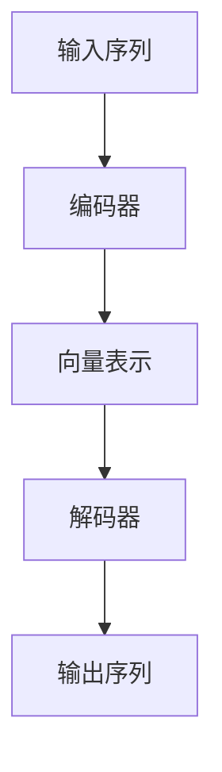
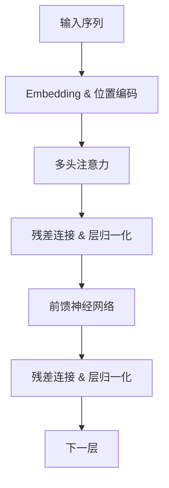
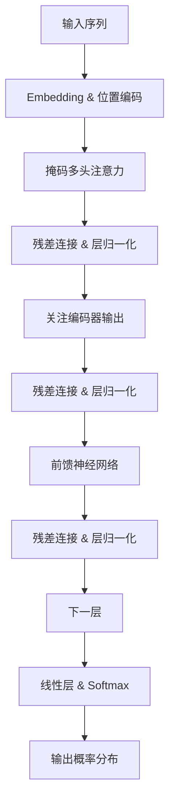
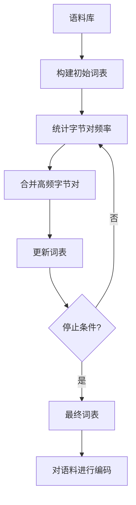
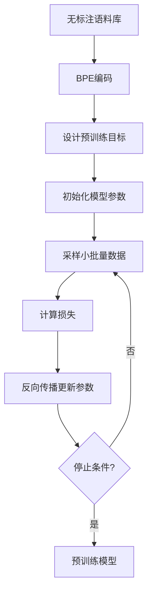

# Transformer大模型实战 字节级字节对编码

## 1.背景介绍

### 1.1 自然语言处理的发展历程

自然语言处理(Natural Language Processing, NLP)是人工智能领域的一个重要分支,旨在使计算机能够理解和生成人类语言。在过去几十年中,NLP取得了长足的进步,从早期基于规则的系统,到统计机器学习模型,再到当前的深度学习模型。

### 1.2 Transformer模型的重要性

2017年,Transformer模型在论文"Attention Is All You Need"中被提出,它完全依赖注意力机制来捕捉输入和输出之间的全局依赖关系,而不使用循环和卷积。Transformer模型在机器翻译、文本生成等任务中表现出色,成为NLP领域的里程碑式模型。

### 1.3 大模型的兴起

随着计算能力和数据量的不断增长,训练大规模的深度学习模型成为可能。大模型通过在海量数据上预训练,可以学习到丰富的语义和世界知识,为下游任务提供强大的迁移能力。以GPT、BERT等为代表的大模型在NLP领域取得了卓越的成绩。

### 1.4 字节级字节对编码的重要性

传统的NLP模型通常以词或子词为单位进行编码,但这种方式存在一些缺陷,如无法很好地处理未见词、拼写错误等情况。字节级字节对编码(Byte-Level Byte-Pair Encoding, BPE)则是一种更细粒度的编码方式,可以更好地捕捉语言的细微特征,提高模型的泛化能力。

## 2.核心概念与联系

### 2.1 Transformer模型架构

Transformer模型主要由编码器(Encoder)和解码器(Decoder)两部分组成。编码器将输入序列编码为向量表示,解码器则根据编码器的输出和前一步的预测生成输出序列。两者都采用了多头注意力机制和前馈神经网络。

### 2.2 注意力机制

注意力机制是Transformer模型的核心,它允许模型在编码和解码时关注输入序列的不同部分,捕捉长距离依赖关系。多头注意力机制则通过并行计算多个注意力头,从不同的表示子空间捕捉信息,提高模型的表达能力。

### 2.3 字节对编码(BPE)

BPE是一种基于统计的子词分词算法,它通过迭代地合并出现频率最高的连续字节对,来构建一个合理大小的词表。与传统的基于词或字符的编码相比,BPE可以更好地处理未见词和拼写错误,提高模型的泛化能力。

### 2.4 大模型预训练

大模型通常采用自监督或半监督的方式进行预训练,在海量无标注数据上学习通用的语言表示。预训练后的模型可以迁移到下游任务,通过少量的微调即可获得良好的性能。常见的预训练目标包括掩码语言模型、下一句预测等。

## 3.核心算法原理具体操作步骤

### 3.1 Transformer编码器

Transformer编码器的主要步骤如下:

1. 将输入序列进行embedding和位置编码,得到初始向量表示。
2. 通过多头注意力机制,计算每个位置关注其他位置的权重。
3. 对注意力权重和值进行加权求和,得到该位置的注意力向量表示。
4. 将注意力向量表示与输入进行残差连接,并通过层归一化。
5. 将上一步的输出通过前馈神经网络,进行非线性变换。
6. 重复步骤2-5的操作N次(N为编码器层数)。

### 3.2 Transformer解码器

Transformer解码器的主要步骤如下:

1. 将输入序列进行embedding和位置编码,得到初始向量表示。
2. 通过掩码多头注意力机制,计算当前位置关注其他位置的权重,忽略未来位置的信息。
3. 对注意力权重和值进行加权求和,得到该位置的注意力向量表示。
4. 将注意力向量表示与输入进行残差连接,并通过层归一化。
5. 将上一步的输出通过多头注意力机制,关注编码器的输出。
6. 将注意力向量表示与编码器输出进行残差连接,并通过层归一化。
7. 将上一步的输出通过前馈神经网络,进行非线性变换。
8. 重复步骤2-7的操作N次(N为解码器层数)。
9. 将最终输出通过线性层和softmax,预测下一个token的概率分布。

### 3.3 字节对编码算法

BPE算法的主要步骤如下:

1. 将语料库中的每个词拆分为字符序列,构建初始词表。
2. 统计语料库中所有连续字节对的出现频率。
3. 将出现频率最高的字节对合并为一个新的字节,加入词表。
4. 重复步骤2-3,直到词表达到预设大小或满足其他停止条件。
5. 使用最终的词表对语料库中的词进行编码。

### 3.4 大模型预训练

大模型预训练的主要步骤如下:

1. 准备大规模无标注语料库,如网页、书籍等。
2. 使用BPE或其他分词算法对语料进行编码。
3. 设计预训练目标,如掩码语言模型、下一句预测等。
4. 初始化Transformer模型的参数。
5. 对语料库进行采样,构建小批量数据。
6. 使用小批量数据和预训练目标计算损失,反向传播更新模型参数。
7. 重复步骤5-6,直到模型收敛或达到预设训练步数。

## 4.数学模型和公式详细讲解举例说明

### 4.1 注意力机制

注意力机制的核心思想是为每个位置的输出向量分配不同的权重,以捕捉输入序列中不同位置的信息。具体来说,对于输入序列 $X = (x_1, x_2, \dots, x_n)$,我们计算查询向量 $q$、键向量 $K = (k_1, k_2, \dots, k_n)$ 和值向量 $V = (v_1, v_2, \dots, v_n)$,然后通过以下公式计算注意力权重和输出:

$$\begin{aligned}
\text{Attention}(Q, K, V) &= \text{softmax}\left(\frac{QK^T}{\sqrt{d_k}}\right)V \\
&= \sum_{i=1}^n \alpha_i v_i
\end{aligned}$$

其中, $\alpha_i = \frac{\exp(q \cdot k_i)}{\sum_{j=1}^n \exp(q \cdot k_j)}$ 表示查询向量 $q$ 对输入位置 $i$ 的注意力权重, $d_k$ 是缩放因子,用于防止内积过大导致梯度消失。

注意力机制可以自动学习到输入序列中不同位置的重要性,并selectively捕捉相关信息,从而更好地建模长距离依赖关系。

### 4.2 多头注意力

多头注意力机制是通过并行计算多个注意力头,从不同的表示子空间捕捉信息,然后将它们的结果拼接起来,从而提高模型的表达能力。具体来说,对于查询 $Q$、键 $K$ 和值 $V$,我们首先将它们分别线性投影到 $h$ 个子空间:

$$\begin{aligned}
Q_i &= QW_i^Q &\quad K_i &= KW_i^K &\quad V_i &= VW_i^V\\
\text{head}_i &= \text{Attention}(Q_i, K_i, V_i)
\end{aligned}$$

其中, $W_i^Q \in \mathbb{R}^{d \times d_q}$, $W_i^K \in \mathbb{R}^{d \times d_k}$, $W_i^V \in \mathbb{R}^{d \times d_v}$ 分别是查询、键和值的线性投影矩阵。然后,我们将 $h$ 个注意力头的结果拼接起来:

$$\text{MultiHead}(Q, K, V) = \text{Concat}(\text{head}_1, \dots, \text{head}_h)W^O$$

其中, $W^O \in \mathbb{R}^{hd_v \times d}$ 是一个可学习的线性投影矩阵,用于将拼接后的向量映射回模型的隐状态空间。

多头注意力机制不仅提高了模型的表达能力,还允许模型同时关注不同的位置和表示子空间,从而更好地捕捉输入序列的不同特征。

### 4.3 掩码语言模型

掩码语言模型(Masked Language Model, MLM)是一种常用的大模型预训练目标,其思想是随机掩码输入序列中的一些token,然后训练模型根据上下文预测被掩码的token。具体来说,对于输入序列 $X = (x_1, x_2, \dots, x_n)$,我们随机选择一些位置进行掩码,得到掩码后的序列 $\tilde{X} = (\tilde{x}_1, \tilde{x}_2, \dots, \tilde{x}_n)$,其中 $\tilde{x}_i$ 可能是原始token、一个特殊的掩码token或随机替换的token。然后,我们使用Transformer模型对 $\tilde{X}$ 进行编码,得到每个位置的隐状态向量 $H = (h_1, h_2, \dots, h_n)$。对于被掩码的位置 $i$,我们通过以下公式计算预测该位置原始token的概率分布:

$$P(x_i | \tilde{X}) = \text{softmax}(W_eh_i + b_e)$$

其中, $W_e \in \mathbb{R}^{|V| \times d}$ 和 $b_e \in \mathbb{R}^{|V|}$ 分别是可学习的embedding矩阵和偏置项, $|V|$ 是词表大小。模型的目标是最大化被掩码位置的原始token概率,即最小化如下损失函数:

$$\mathcal{L}_\text{MLM} = -\sum_{i \in \text{masked}} \log P(x_i | \tilde{X})$$

通过掩码语言模型的预训练,Transformer模型可以学习到丰富的语义和上下文信息,为下游任务提供强大的迁移能力。

## 4.项目实践:代码实例和详细解释说明

在这一部分,我们将通过一个实际的代码示例,演示如何使用PyTorch实现Transformer模型进行机器翻译任务。为了简洁起见,我们将只展示核心代码,完整的项目代码可以在GitHub上找到。

### 4.1 数据预处理

首先,