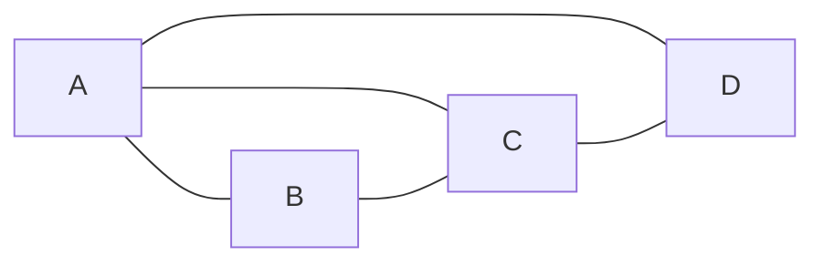

# Triangle Counting三角形计数原理与代码实例讲解

作者：禅与计算机程序设计艺术

## 1. 背景介绍

在现实世界的复杂网络中，三角形结构是一种非常重要且普遍存在的模式。例如在社交网络中，如果两个人有共同的朋友，那么他们三个人就形成了一个三角形关系。三角形计数就是统计一个图中三角形的数量，它在网络分析、社区发现、链路预测等领域有着广泛的应用。

### 1.1 三角形计数的定义

形式化地说，给定一个无向图$G=(V,E)$，其中$V$表示节点集合，$E$表示边集合。一个三角形是指图中三个节点之间两两相连形成的一个环。三角形计数的目标是找出图$G$中所有的三角形数量，记为$\Delta(G)$。

### 1.2 三角形计数的挑战

三角形计数看似简单，但在大规模网络中高效准确地计算却面临不少挑战：

- 图的规模巨大，节点数和边数动辄上亿，需要设计时间和空间复杂度都较低的算法
- 现实网络往往是动态演化的，如何快速更新三角形计数结果也是一个难题 
- 大规模图数据通常以分布式的形式存储，需要设计可扩展的分布式算法

### 1.3 三角形计数的应用

三角形计数作为图的一个重要特征，在许多领域都有重要应用：

- 社交网络分析：三角形结构能够反映用户之间的紧密程度，在社区发现、影响力分析等任务中有重要作用
- 链路预测：两个未直接相连的节点，如果它们之间有很多共同的邻居（即形成了很多三角形），那么它们之间存在链接的可能性就越大 
- 网络结构的特征描述：三角形的数量、分布等统计特征可以用来刻画不同网络的拓扑结构差异
- 异常检测：正常网络中往往三角形比较多，而异常的网络结构三角形会明显偏少

## 2. 核心概念与关联

要深入理解三角形计数，需要先掌握一些相关的图论概念：

### 2.1 相邻节点和度

- 相邻节点：如果两个节点之间有边相连，则称这两个节点是相邻的
- 节点的度：与该节点相邻的节点数量。度数越大意味着节点在图中越重要

### 2.2 邻接矩阵

邻接矩阵是图的一种常见存储形式。对于一个有$n$个节点的图，它的邻接矩阵$A$是一个$n \times n$ 的方阵：
$$
A_{i,j} = 
\begin{cases}
1 & (v_i, v_j) \in E \\
0 & (v_i, v_j) \notin E
\end{cases}
$$

### 2.3 聚集系数

聚集系数反映了图中节点倾向于聚集成簇的程度。节点$i$的聚集系数$C_i$定义为：

$$C_i = \frac{2t_i}{d_i(d_i-1)}$$

其中$t_i$表示节点$i$的相邻节点之间实际存在的边数，$d_i$为节点$i$的度。可以看出，$C_i$实际上就是节点$i$参与的三角形数量占所有可能三角形的比例。

### 2.4 全局聚集系数

将所有节点的聚集系数取平均，就得到了图$G$的全局聚集系数：

$$C = \frac{1}{n}\sum_{i=1}^n C_i$$

全局聚集系数从整体上反映了图的三角形结构特征。

## 3. 核心算法原理与具体步骤

三角形计数的核心是找出图中所有的三角形。一个朴素的算法是三重循环遍历所有节点的三元组，判断它们是否形成三角形，时间复杂度为$O(n^3)$。这在大规模网络中显然是不可接受的。下面介绍几种更高效的算法。

### 3.1 节点迭代算法

该算法的基本思想是，枚举每个节点，计算以它为顶点的三角形数量，最后将所有节点的结果加起来即可。对于节点$v$，以它为顶点的三角形数量就等于$v$的相邻节点之间边的数量。

具体步骤如下：
1. 初始化三角形计数结果$\Delta=0$
2. 遍历每个节点$v_i$:
   1. 获取$v_i$的所有相邻节点$N(v_i)$
   2. 计算$N(v_i)$中节点之间边的数量$t_i$
   3. $\Delta = \Delta + t_i$ 
3. 最终结果$\Delta$就是图中三角形的数量

可以证明，该算法的时间复杂度为$O(m\sqrt{m})$，其中$m$为图的边数。

### 3.2 矩阵乘法算法

我们知道，邻接矩阵$A$中$(i,j)$元素为1表示节点$i$和$j$之间有边相连。那么矩阵$A^2$中$(i,j)$元素的值，就等于由节点$i$出发经过一个中间节点到达节点$j$的路径数量。进一步地，矩阵$A^3$的对角元素之和，就等于图中三角形的数量。

证明如下：$(A^3)_{ii} = \sum_{j=1}^n\sum_{k=1}^n a_{ij}a_{jk}a_{ki}$，当且仅当节点$i,j,k$两两相连时，$a_{ij}a_{jk}a_{ki}=1$，否则为0。所以$(A^3)_{ii}$就等于以$i$为顶点的三角形数量。

因此利用矩阵乘法，三角形的数量可以表示为：

$$\Delta(G) = \frac{1}{6} tr(A^3) = \frac{1}{6} \sum_{i=1}^n (A^3)_{ii}$$

其中$tr(A^3)$表示矩阵$A^3$的迹，即主对角线元素之和。除以6是因为每个三角形在$A^3$的对角元中被计算了6次。

该算法的时间复杂度取决于矩阵乘法的实现，一般为$O(n^\omega)$，其中$\omega$为矩阵乘法的指数，当前最快的算法可以达到$\omega < 2.373$。

## 4. 数学模型和公式详细讲解举例说明

前面已经给出了三角形计数问题的数学表示，这里再通过一个具体的例子来说明。

考虑下面这个无向图：



该图的邻接矩阵为：

$$
A = \begin{bmatrix} 
0 & 1 & 1 & 1\\ 
1 & 0 & 1 & 0\\
1 & 1 & 0 & 1\\
1 & 0 & 1 & 0
\end{bmatrix}
$$

矩阵$A^3$计算结果为：

$$
A^3 = \begin{bmatrix}
6 & 3 & 5 & 3\\
3 & 2 & 3 & 1\\
5 & 3 & 6 & 3\\
3 & 1 & 3 & 2
\end{bmatrix}
$$

对角元素之和$tr(A^3) = 6 + 2 + 6 + 2 = 16$。除以6得到三角形数量为$\Delta(G) = 16/6 = 2$。

我们也可以通过节点迭代算法来验证：
- 节点A：相邻节点为B,C,D，其中有1条边(B,C)，故$t_A=1$
- 节点B：相邻节点为A,C，其中有1条边(A,C)，故$t_B=1$
- 节点C：相邻节点为A,B,D，其中有1条边(A,D)，故$t_C=1$
- 节点D：相邻节点为A,C，其中有1条边(A,C)，故$t_D=1$

因此$\Delta(G) = t_A+t_B+t_C+t_D = 1+1+1+1=4$。注意节点迭代算法得到的是三角形数量的2倍，因为每个三角形被计算了两次。

## 5. 项目实践：代码实例与详细解释

下面用Python代码实现前面介绍的两种三角形计数算法。

### 5.1 节点迭代算法

```python
def count_triangles(G):
    triangle_count = 0
    for v in G:
        neighbors = list(G[v])
        degree = len(neighbors)
        if degree < 2:
            continue
        
        # 计算相邻节点之间边的数量
        edge_count = 0
        for u in neighbors:
            edge_count += len(set(G[u]) & set(neighbors))
        
        triangle_count += edge_count // 2
        
    return triangle_count
```

其中`G`表示图的邻接表表示，`G[v]`表示节点`v`的相邻节点集合。主要步骤为：
1. 遍历每个节点`v`，跳过度数小于2的节点
2. 获取`v`的所有相邻节点，计算它们之间边的数量。这里用到了Python的集合交集操作`&`来快速计算两个相邻节点集合的重叠数量
3. 将`edge_count`除以2，因为每条边都被计算了2次
4. 将`v`参与的三角形数量加到总数`triangle_count`中

### 5.2 矩阵乘法算法

```python
import numpy as np

def count_triangles_matrix(A):
    A3 = np.linalg.matrix_power(A, 3)
    return A3.trace() // 6
```

这里利用了Numpy库提供的矩阵运算函数。`A`为图的邻接矩阵，`matrix_power`计算矩阵的幂，`trace`计算矩阵的迹。最后将结果除以6得到三角形的数量。

可以看出使用矩阵乘法时代码非常简洁，但需要将图转换成邻接矩阵形式，对于大规模稀疏图会有较大的空间开销。而节点迭代算法直接基于邻接表实现，更加节省内存。

## 6. 实际应用场景

三角形计数在许多实际场景中有重要应用，下面举几个具体的例子。

### 6.1 社交网络分析

在社交网络中，三角形结构通常表示着"朋友的朋友也是朋友"。三角形数量可以用来度量社交网络的紧密程度，揭示用户的社区结构。例如Facebook利用三角形计数发现紧密联系的用户群体，提供好友推荐等个性化服务。

### 6.2 蛋白质相互作用网络

在生物学中，蛋白质之间的相互作用可以用网络表示，其中节点为蛋白质，边表示两个蛋白质之间存在相互作用。而网络中的三角形结构往往对应着蛋白质复合物。通过对蛋白质相互作用网络进行三角形计数，可以发现潜在的复合物，加深对蛋白质功能和细胞机制的理解。

### 6.3 金融风险分析

在金融交易网络中，节点可以表示银行、机构等交易主体，边表示它们之间的资金流动。大量的三角形结构意味着交易主体之间关系错综复杂，资金流动路径隐蔽，存在潜在的风险隐患。通过三角形计数，金融监管部门可以及时发现风险聚集区域，预防系统性风险的发生。

## 7. 工具和资源推荐

除了自己实现三角形计数算法，我们也可以利用现有的图分析工具和库来完成这一任务：

- NetworkX: Python的网络分析包，提供了图的各种基本操作，以及三角形计数的函数`triangles(G)`
- iGraph: 另一个功能强大的Python图分析库，同样支持三角形计数
- SNAP: 斯坦福大学开发的网络分析平台，实现了多种大规模图挖掘算法，包括分布式的三角形计数
- Spark GraphX: 基于Apache Spark的图计算框架，可以实现分布式的三角形计数，适合处理超大规模网络

此外，图神经网络(GNN)是近年来图分析领域的一个研究热点。一些新的基于GNN的三角形计数算法也被提出，利用图的节点特征和边特征来加速三角形的搜索匹配，取得了不