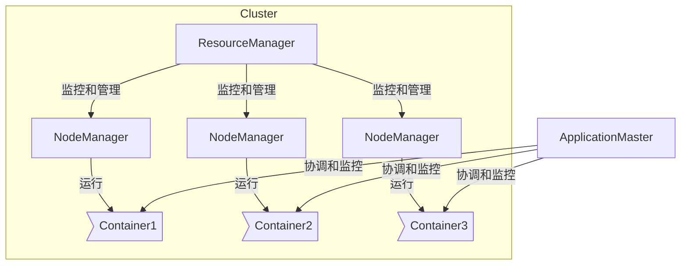

# Yarn原理与代码实例讲解

## 1.背景介绍

### 1.1 什么是Yarn

Yarn是一个新的分布式资源管理系统,由Apache软件基金会的Hadoop开源社区所开发,旨在解决Hadoop MapReduce存在的一些缺陷和局限性。它是Hadoop的一个关键组件,负责集群资源管理和任务调度。Yarn将资源管理和任务调度/监控分离,使得Hadoop不仅可以运行MapReduce作业,还可以支持其他类型的分布式应用程序。

### 1.2 Yarn的产生背景

早期的Hadoop MapReduce框架存在一些固有缺陷:

1. **资源利用率低** - Slot严格限制了资源使用,导致资源利用率低下
2. **缺乏多租户支持** - 无法根据不同用户的需求动态调整资源分配
3. **仅支持批处理作业** - 无法支持交互式查询、实时流式处理等新兴应用场景
4. **组件高度耦合** - JobTracker同时负责资源管理和任务调度/监控,职责过重

Yarn应运而生,旨在解决上述问题,提高资源利用率,支持更多计算框架,促进Hadoop生态系统繁荣发展。

### 1.3 Yarn的设计目标

- **资源统一管理和调度**
- **高可用和高伸缩性**
- **多租户支持**
- **安全性**
- **支持更多计算框架**

## 2.核心概念与联系 

### 2.1 Yarn核心组件

Yarn主要由ResourceManager(RM)、NodeManager(NM)、ApplicationMaster(AM)和Container等组件构成:



- **ResourceManager(RM)**: 全局资源管理器,负责整个集群资源的管理和分配
- **NodeManager(NM)**: 节点资源管理器,负责单个节点上资源的管理和使用 
- **ApplicationMaster(AM)**: 应用管理器,负责协调应用运行并监控容器执行
- **Container**: 资源抽象,封装了CPU、内存等多维度资源,是任务运行的基本单位

### 2.2 Yarn工作流程

1. 客户端向RM提交应用程序,RM分配第一个Container运行AM
2. AM向RM申请运行任务所需的资源(Container)
3. RM分配Container给AM,AM在获取的Container中运行任务
4. AM定期向RM发送心跳和状态更新,RM监控任务进度并根据需要分配资源
5. 应用程序运行完成后,AM向RM注销并释放所有Container资源

## 3.核心算法原理具体操作步骤

### 3.1 资源管理器(RM)原理

RM负责启动和监控AM,并根据集群资源状态进行资源分配和调度。主要由Scheduler、ApplicationsManager和ResourceTracker三部分组成。

#### 3.1.1 Scheduler调度器

Scheduler是RM的核心部分,负责根据特定的调度策略对集群资源进行分配和调度。常见的调度器算法有:

1. **FIFO Scheduler** - 先来先服务,按照应用程序的提交顺序分配资源
2. **Capacity Scheduler** - 多队列容量调度器,为不同队列预留一定资源容量
3. **Fair Scheduler** - 公平调度器,根据应用程序运行状况动态分配资源

Scheduler维护一个应用程序队列,应用程序向Scheduler申请资源。Scheduler根据集群资源使用情况和调度策略,为应用程序分配资源。

#### 3.1.2 ApplicationsManager

ApplicationsManager负责接收作业提交、启动AM、restartAM等,维护应用程序的整个生命周期。它会将新提交的应用程序信息保存在内存状态存储中。

#### 3.1.3 ResourceTracker

ResourceTracker用于记录集群中可用节点的资源使用情况,并定期向Scheduler发送心跳汇报资源状态变化。当有新节点加入或节点资源发生变化时,会更新集群总体资源状况。

### 3.2 节点管理器(NM)原理

NM主要负责单个节点上的资源管理和使用,维护了一个容器列表,并定期向RM发送心跳和容器使用报告。

1. **启动Container** - 接收来自RM的启动Container指令,为Container分配资源并启动
2. **监控Container** - 周期性监控容器资源使用情况,维护Container的生命周期
3. **处理来自AM的指令** - 接收来自AM的指令,如启动/停止特定任务
4. **上报操作状态** - 定期向RM汇报节点资源使用情况和Container运行状态

### 3.3 应用管理器(AM)原理

AM负责协调应用程序的运行,包括向RM申请资源、与NM通信等。每个应用程序只有一个AM实例。

1. **资源申请** - 根据应用程序需求向RM申请运行所需的资源(Container)
2. **任务分发** - 将任务分发到获取的Container中运行
3. **进度监控** - 监控任务运行进度,处理失败任务
4. **资源释放** - 应用程序完成后,向RM注销并释放占用的资源

AM的具体实现因框架而异,如MapReduce的AM实现为MapReduceApplicationMaster。

## 4.数学模型和公式详细讲解举例说明

在Yarn的资源管理和调度过程中,涉及多种数学模型和公式,用于描述和优化资源分配策略。

### 4.1 资源模型

Yarn中,资源被抽象为一个多维度的量化模型,通常包括CPU、内存、磁盘、网络等维度。每个Container对应一组资源向量:

$$
\vec{r} = (cpu, memory, disk, network, \ldots)
$$

应用程序的资源需求也可以用一个资源向量表示:

$$
\vec{R} = (CPU, MEMORY, DISK, NETWORK, \ldots)
$$

资源分配的目标是满足应用程序的资源需求 $\vec{R}$,通过分配 $n$ 个Container:

$$
\vec{R} \leq \sum_{i=1}^{n}\vec{r_i}
$$

### 4.2 资源公平性模型

Fair Scheduler旨在实现资源分配的公平性。对于 $m$ 个活跃应用程序,定义应用程序 $i$ 的资源使用量为 $u_i$,则资源公平性目标可以表示为:

$$
\min \sum_{i=1}^{m} (u_i - \frac{U}{m})^2
$$

其中 $U$ 为集群总资源量。该目标函数最小化每个应用程序资源使用量与平均值之间的差异。

### 4.3 资源局部性模型

为了提高数据局部性,Yarn会尽量将任务调度到存储数据的节点上运行。对于具有数据局部性需求的应用程序,可以定义一个数据局部性评分函数 $s(n,d)$,表示将任务调度到节点 $n$ 运行时的数据局部性分数,其中 $d$ 为输入数据的位置。调度器会优先选择 $s(n,d)$ 值较高的节点。

### 4.4 资源估计模型

为了更好地利用资源,Yarn可以根据应用程序的历史运行情况,估计其未来的资源需求。常用的估计模型包括:

1. **基于历史平均值的估计**

    $$
    \hat{R} = \frac{1}{n}\sum_{i=1}^{n}R_i
    $$

    其中 $\hat{R}$ 为估计的资源需求, $R_i$ 为第 $i$ 次运行的实际资源使用量, $n$ 为运行次数。

2. **基于时间序列模型的估计**

    可以使用时间序列分析模型(如ARIMA模型)对资源需求进行预测:

    $$
    \hat{R}_{t+1} = f(R_t, R_{t-1}, \ldots, R_{t-n})
    $$

    其中 $\hat{R}_{t+1}$ 为时刻 $t+1$ 的资源需求预测值, $f$ 为时间序列模型。

通过合理的资源需求估计,Yarn可以更加精确地分配资源,提高资源利用效率。

## 5.项目实践:代码实例和详细解释说明

以下是一个使用Yarn的MapReduce作业示例,展示了客户端如何提交作业、AM如何申请资源并运行任务等过程。

### 5.1 客户端提交作业

```java
// 1. 创建YarnConfiguration
YarnConfiguration conf = new YarnConfiguration();

// 2. 创建作业客户端
YarnClient yarnClient = YarnClient.createYarnClient();
yarnClient.init(conf);
yarnClient.start();

// 3. 创建应用程序提交上下文
ApplicationSubmissionContext appContext = yarnClient.createApplicationSubmissionContext();

// 4. 设置应用程序详情
ApplicationId appId = appContext.getApplicationId();
appContext.setApplicationName("MyMapReduce");
appContext.setQueue("default");

// 5. 设置AM/主类
appContext.setApplicationType("MAPREDUCE");
appContext.setKeepContainersAcrossApplicationAttempts(true);
appContext.setMaxAppAttempts(1);

// 6. 设置AM资源需求
Resource capability = Resource.newInstance(1024, 1);
appContext.setResource(capability);

// 7. 设置AM启动命令
appContext.setAMContainerSpec(amContainer);

// 8. 提交应用程序
yarnClient.submitApplication(appContext);
```

客户端首先创建YarnClient实例,并设置应用程序详情(名称、队列、AM类型等)和AM的资源需求。最后通过`submitApplication`方法将应用程序提交给RM。

### 5.2 AM申请资源并运行任务

```java
// AM主类
public class MapReduceAM extends ApplicationMaster {

    public MapReduceAM() {
        super(new MapReduceAMContainerAllocator());
    }

    public static void main(String[] args) {
        MapReduceAM am = new MapReduceAM();
        try {
            am.run(new MapReduceAMContainerAllocator(), args);
        } finally {
            am.stop();
        }
    }
}

// AM容器分配器
class MapReduceAMContainerAllocator implements AMContainerAllocator {

    public void allocateContainers(AMContainerAllocationResponse response) {
        // 1. 处理已分配的Container
        processAllocatedContainers(response.getAllocatedContainers());

        // 2. 根据需求申请新的Container资源
        int numToPendingContainers = getNumContainersToRequest();
        Resource capability = Resource.newInstance(2048, 1);
        for (int i = 0; i < numToPendingContainers; i++) {
            ContainerRequest req = new ContainerRequest(capability, null, null, RM_REQUEST_PRIORITY);
            amRMClient.addContainerRequest(req);
        }
    }

    private void processAllocatedContainers(List<Container> containers) {
        for (Container container : containers) {
            // 3. 在分配的Container中启动任务
            launchTaskOnContainer(container);
        }
    }
}
```

AM的主要工作是向RM申请资源(Container)并在获取的Container中启动任务。AM实现了`AMContainerAllocator`接口,定期调用`allocateContainers`方法向RM申请所需的Container资源。当收到RM分配的Container时,AM会在这些Container中启动具体的任务。

### 5.3 NM启动和监控Container

```java
public class NodeManager {

    public static void main(String[] args) {
        NodeManager nm = new NodeManager();
        nm.start();
    }

    private void start() {
        // 1. 注册NodeManager
        registerWithRM();

        while (true) {
            // 2. 接收来自RM的命令
            ContainerCommand command = getCommandFromRM();
            if (command.getCommandType() == ContainerCommandType.START) {
                // 3. 启动指定的Container
                startContainer(command.getContainerId());
            }

            // 4. 上报节点资源使用情况
            reportNodeResourceUsage();

            // 5. 上报Container运行状态
            reportContainerStatus();
        }
    }

    private void startContainer(ContainerId containerId) {
        // 为Container分配资源并启动
        ...
    }
}
```

NM是一个常驻进程,主要职责是接收来自RM的指令、启动和监控Container、上报资源使用情况。NM会定期向RM发