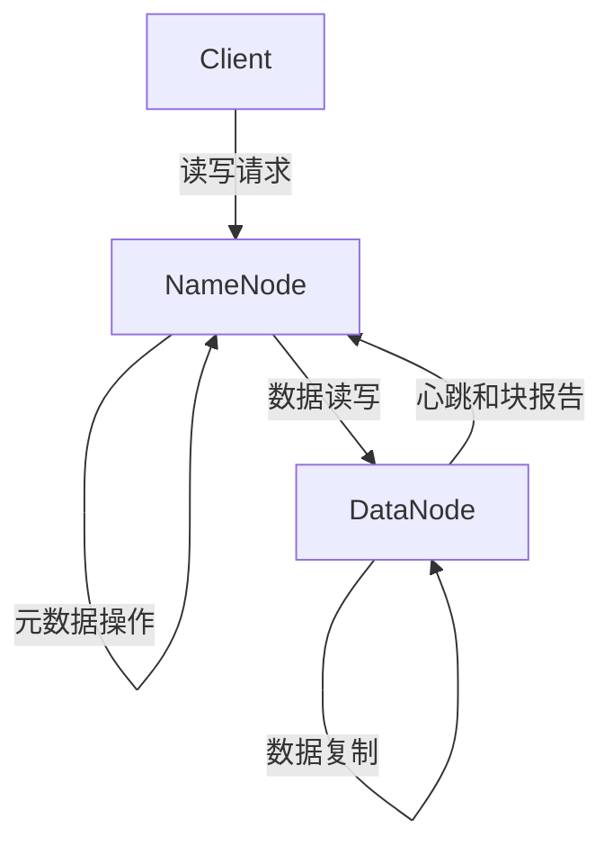
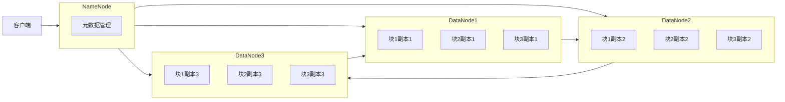
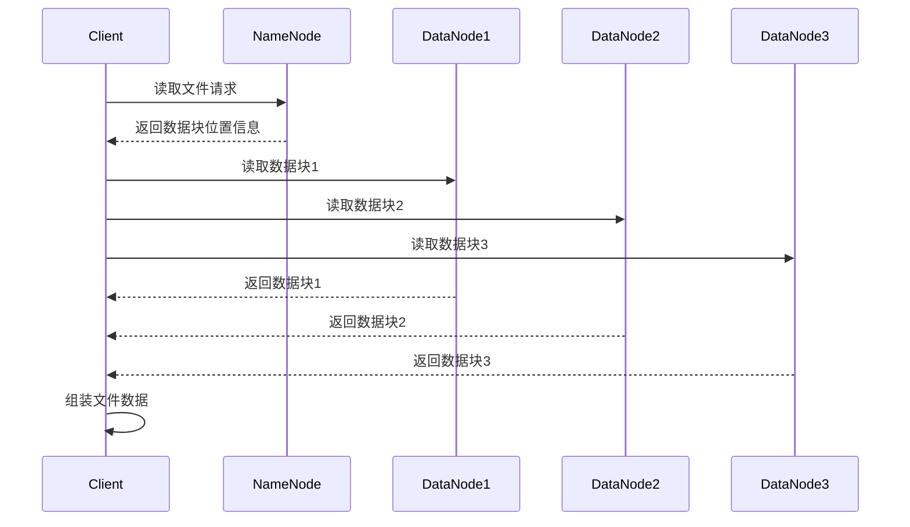
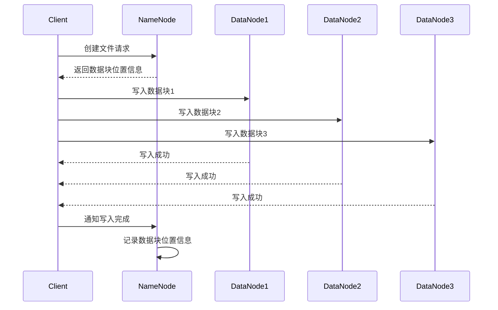

# 【AI大数据计算原理与代码实例讲解】HDFS

## 1. 背景介绍

### 1.1 大数据时代的到来

在当今时代，数据正以前所未有的速度和规模呈爆炸式增长。来自互联网、移动设备、社交媒体、物联网等各种来源的海量数据不断涌现。这些数据不仅体量庞大,而且种类繁多,包括结构化数据(如数据库记录)、半结构化数据(如XML文件)和非结构化数据(如图像、视频、音频等)。传统的数据存储和处理方式已无法满足当前的需求,因此大数据技术应运而生。

### 1.2 大数据技术的重要性

大数据技术为我们提供了存储、管理和分析海量数据的能力,从而能够从这些数据中发现隐藏的模式、趋势和洞见。这些洞见对于企业、政府和科研机构等各个领域都具有重要意义,可以帮助他们做出更明智的决策、优化业务流程、提高运营效率、发现新的商机等。因此,掌握大数据技术已经成为当今时代的必备技能之一。

### 1.3 HDFS在大数据生态中的地位

Apache Hadoop是大数据领域最著名的开源分布式系统之一,其核心组件之一就是HDFS(Hadoop分布式文件系统)。HDFS被设计用于在廉价的商用硬件集群上可靠地存储大规模数据,并为分布式数据密集型应用程序提供高吞吐量的数据访问。它是Hadoop生态系统的基石,为其他大数据组件(如MapReduce、Spark等)提供了可靠的底层存储支持。因此,深入理解HDFS的原理和实现对于掌握大数据技术至关重要。

## 2. 核心概念与联系

### 2.1 HDFS架构概览

HDFS遵循主从架构模式,主要由以下三个组件组成:

1. **NameNode(名称节点)**: 是HDFS集群的主节点,负责管理文件系统的命名空间和客户端对文件的访问。它记录着所有文件的元数据(如文件名、目录、副本位置等),但不存储实际的文件数据。

2. **DataNode(数据节点)**: 是HDFS集群的从节点,负责实际存储文件数据块并执行读写操作。每个DataNode管理着本地文件系统中的一部分数据。

3. **客户端(Client)**: 用于向HDFS集群发送读写请求,并与NameNode和DataNode进行交互。

### 2.2 HDFS的设计目标

HDFS的设计目标是为大数据应用提供高吞吐量的数据访问,并具备以下关键特性:

1. **高容错性**: 通过数据块副本机制,即将每个数据块复制到多个DataNode上,从而实现高容错性和可用性。

2. **高吞吐量**: 针对大文件的批量数据传输进行了优化,能够支持大规模的数据访问。

3. **可扩展性**: 通过简单地增加新节点,HDFS可以轻松扩展到数千个节点,支持PB级别的存储容量。

4. **低成本**: HDFS被设计为运行在廉价的商用硬件上,降低了总体拥有成本(TCO)。

### 2.3 HDFS文件存储原理

在HDFS中,文件被划分为一个或多个数据块(默认128MB),并复制到多个DataNode上。NameNode负责维护文件到块的映射关系,以及每个块的位置信息。当客户端需要读取文件时,NameNode会提供相应的块位置,客户端直接从DataNode读取数据。写入文件时,客户端先与NameNode通信以确定数据块的存储位置,然后直接与DataNode进行数据传输。

## 3. 核心算法原理具体操作步骤

### 3.1 数据块放置策略

HDFS采用了一种智能的数据块放置策略,以实现高可靠性和高数据局部性。具体来说,当客户端向HDFS写入一个新文件时,HDFS会遵循以下步骤:

1. 客户端向NameNode发送创建文件请求。

2. NameNode为该文件分配一个新的数据块,并确定该块的副本应该存储在哪些DataNode上。

3. NameNode采用以下策略选择DataNode:

   - 如果可能,将第一个副本放置在客户端所在的同一节点。这样可以利用程序数据局部性,提高写入性能。

   - 将第二个副本放置在与第一个副本不同的机架上,以防止单个机架故障导致数据丢失。

   - 将第三个副本放置在不同的机架上,进一步提高容错能力。

   - 如果集群中的机架数量不足以满足上述条件,HDFS会在同一机架上存储多个副本,但会尽量将它们分散到不同的节点上。

4. NameNode将这些DataNode的存储位置信息返回给客户端。

5. 客户端按照NameNode返回的顺序,依次将数据块写入各个DataNode。

6. 当数据块被成功写入指定数量的DataNode后,客户端将通知NameNode写入操作完成。

7. NameNode记录该数据块的位置信息,以便后续读取操作。

这种数据块放置策略可以实现以下目标:

- 利用程序数据局部性提高写入性能。

- 通过跨机架存储副本,提高容错能力。

- 充分利用集群资源,实现负载均衡。

### 3.2 读写数据流程

#### 3.2.1 读数据流程

1. 客户端向NameNode发送读取文件请求。

2. NameNode查找该文件对应的数据块位置信息,并将这些位置信息返回给客户端。

3. 客户端根据NameNode提供的位置信息,直接从最近的DataNode读取数据块。

4. 如果某个DataNode发生故障,客户端会自动从另一个DataNode读取该数据块的副本。

5. 客户端将读取到的数据块组装成完整的文件数据。

#### 3.2.2 写数据流程

1. 客户端向NameNode发送创建文件请求。

2. NameNode为该文件分配一个新的数据块,并确定该块的副本应该存储在哪些DataNode上(根据数据块放置策略)。

3. NameNode将这些DataNode的存储位置信息返回给客户端。

4. 客户端按照NameNode返回的顺序,依次将数据块写入各个DataNode。

5. 当数据块被成功写入指定数量的DataNode后,客户端将通知NameNode写入操作完成。

6. NameNode记录该数据块的位置信息,以便后续读取操作。

7. 如果在写入过程中某个DataNode发生故障,客户端会自动从另一个DataNode读取该数据块的副本,并将数据写入另一个DataNode,以保证副本数量。

### 3.3 数据复制和容错机制

HDFS通过数据块复制和故障转移机制来实现高可靠性和容错能力。具体来说:

1. 当客户端向HDFS写入一个新文件时,HDFS会为该文件创建多个数据块副本,并将这些副本分布存储在不同的DataNode上。

2. 每个DataNode会定期向NameNode发送心跳信号和块报告,报告自身的状态和所存储的数据块信息。

3. 如果NameNode在一段时间内没有收到某个DataNode的心跳信号,它会认为该DataNode已经失效,并将其上的数据块标记为"已丢失"。

4. NameNode会选择一个存储了该"已丢失"数据块副本的DataNode,将该副本复制到另一个DataNode上,以保证数据块的副本数量符合配置要求。

5. 如果某个DataNode发生永久性故障(如硬盘损坏等),NameNode会在其他存活的DataNode上复制该DataNode上的所有数据块副本,以确保数据可靠性。

6. 当客户端读取文件时,如果某个DataNode发生故障,客户端会自动从另一个DataNode读取该数据块的副本,从而实现无缝故障转移。

通过这种机制,HDFS可以在节点故障时自动进行数据恢复,确保数据的高可靠性和可用性。

### 3.4 数据完整性检查

为了确保存储在HDFS上的数据的完整性和一致性,HDFS采用了以下机制:

1. **客户端数据校验**: 在客户端向DataNode写入数据块时,会计算该数据块的校验和(checksum),并将校验和信息存储在同一个DataNode上。当客户端从DataNode读取数据块时,会重新计算校验和并与存储的校验和进行比对,以检测数据是否发生损坏。

2. **DataNode数据完整性扫描**: 每个DataNode会定期对其存储的数据块进行完整性扫描,重新计算每个数据块的校验和,并将结果报告给NameNode。

3. **NameNode数据块验证**: NameNode会定期对所有DataNode上的数据块进行验证,确保每个数据块的副本数量符合配置要求,并检查副本之间的一致性。如果发现不一致,NameNode会根据大多数副本的内容来确定正确的数据,并指示DataNode进行数据块复制或删除,以修复不一致问题。

4. **快照机制**: HDFS支持对命名空间进行快照,记录文件系统元数据的历史版本。这些快照可用于数据恢复和审计目的。

通过以上机制,HDFS可以及时发现和修复数据损坏或不一致的情况,从而确保存储在HDFS上的数据的完整性和可靠性。

## 4. 数学模型和公式详细讲解举例说明

在HDFS的设计和实现中,涉及到一些数学模型和公式,用于优化系统性能、容错能力和存储利用率等方面。下面我们将详细介绍其中几个重要的模型和公式。

### 4.1 数据块大小选择

HDFS将文件划分为多个数据块进行存储,数据块的大小对系统性能和存储利用率有着重要影响。数据块大小的选择需要权衡以下几个因素:

1. **磁盘传输效率**: 较大的数据块可以减少磁盘寻道次数,提高磁盘传输效率。

2. **网络传输效率**: 较大的数据块可以减少网络传输开销,提高网络传输效率。

3. **数据局部性**: 较小的数据块可以提高