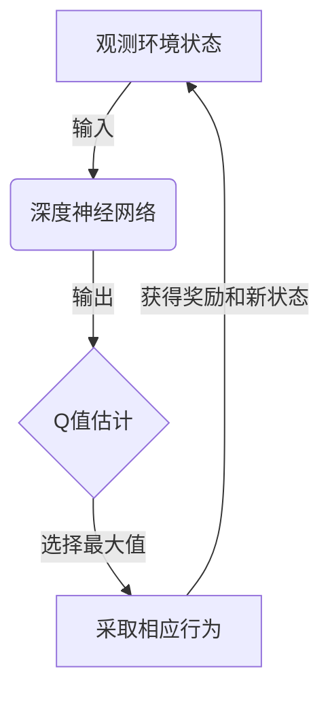
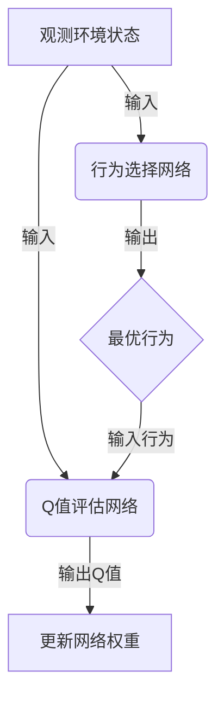
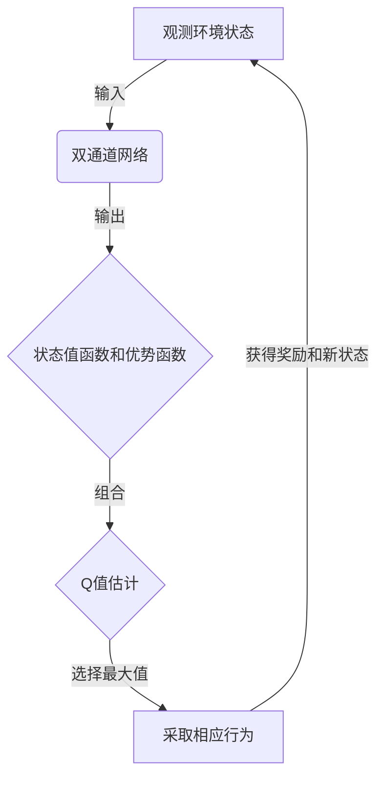

# 一切皆是映射：DQN的改进算法：从Double DQN到Dueling DQN

## 1.背景介绍

### 1.1 强化学习和Q-Learning

强化学习(Reinforcement Learning)是机器学习的一个重要分支,它关注智能体(Agent)如何在一个不确定的环境中通过试错来学习并优化其行为策略,以获得最大的累积奖励。Q-Learning是强化学习中最著名和最成功的算法之一,它旨在学习一个行为价值函数(Action-Value Function),即在给定状态下采取某个行为所能获得的预期长期奖励。

### 1.2 深度Q网络(DQN)

传统的Q-Learning算法在处理高维观测数据(如视觉数据)时存在瓶颈,因为它需要维护一个巨大的Q表来存储每个状态-行为对的Q值。深度Q网络(Deep Q-Network, DQN)通过使用深度神经网络来估计Q值函数,成功地解决了这一问题,使得强化学习可以应用于复杂的决策问题,如Atari游戏等。

### 1.3 DQN存在的问题

尽管DQN取得了巨大的成功,但它仍然存在一些问题和局限性。例如,它可能会过度估计或低估Q值,并且在训练过程中遇到不稳定性。为了解决这些问题,研究人员提出了一些改进算法,如Double DQN和Dueling DQN等。

## 2.核心概念与联系

### 2.1 Q-Learning的核心思想

在Q-Learning算法中,我们试图学习一个Q函数,该函数可以为每个状态-行为对(s, a)分配一个Q值,表示在当前状态s下采取行为a之后所能获得的预期长期奖励。通过不断更新Q值,智能体可以逐步优化其策略,以获得更高的累积奖励。

$$
Q(s, a) \leftarrow Q(s, a) + \alpha \left[ r + \gamma \max_{a'} Q(s', a') - Q(s, a) \right]
$$

其中:
- $Q(s, a)$是当前状态s下采取行为a的Q值估计
- $r$是立即奖励
- $\gamma$是折现因子,用于权衡即时奖励和长期奖励
- $\max_{a'} Q(s', a')$是在下一个状态s'下采取最优行为a'所能获得的最大Q值估计

### 2.2 DQN的工作原理

Deep Q-Network(DQN)是一种结合深度学习和Q-Learning的算法。它使用一个深度神经网络来近似Q函数,输入是当前状态,输出是每个可能行为的Q值估计。在训练过程中,DQN会不断更新神经网络的权重,使得网络输出的Q值估计越来越准确。

### 2.3 Double DQN

Double DQN是对原始DQN算法的一种改进,旨在解决DQN过度估计Q值的问题。在Double DQN中,我们使用两个独立的神经网络:一个用于选择最优行为,另一个用于评估该行为的Q值。这种分离可以减少Q值估计的偏差,从而提高算法的性能。

### 2.4 Dueling DQN

Dueling DQN是另一种改进DQN算法的方法,它将Q值分解为两个部分:状态值函数(Value Function)和优势函数(Advantage Function)。状态值函数估计了在当前状态下采取任何行为所能获得的预期长期奖励,而优势函数则估计了每个行为相对于平均水平的优势。通过这种分解,Dueling DQN可以更好地识别出哪些行为是有利的,从而提高了Q值估计的准确性。

## 3.核心算法原理具体操作步骤

### 3.1 DQN算法步骤

1. 初始化深度神经网络,用于近似Q函数。
2. 初始化经验回放池(Experience Replay Buffer),用于存储过去的状态-行为-奖励-下一状态转换。
3. 对于每个时间步:
    a. 根据当前状态,使用神经网络预测每个可能行为的Q值。
    b. 选择Q值最大的行为作为当前行为(可以加入探索策略,如$\epsilon$-贪婪)。
    c. 执行选择的行为,观测到新状态和即时奖励。
    d. 将(状态,行为,奖励,新状态)转换存储到经验回放池中。
    e. 从经验回放池中随机采样一批转换。
    f. 计算目标Q值,即新状态下所有可能行为的最大Q值估计,加上即时奖励。
    g. 使用目标Q值和当前Q值估计之间的均方差作为损失函数,通过反向传播更新神经网络权重。

4. 重复步骤3,直到算法收敛或达到预设的最大迭代次数。

### 3.2 Double DQN算法步骤

Double DQN算法的步骤与DQN类似,但在计算目标Q值时有所不同:

1. 初始化两个独立的深度神经网络:行为选择网络和Q值评估网络。
2. 对于每个时间步:
    a. 使用行为选择网络预测每个可能行为的Q值,选择Q值最大的行为。
    b. 执行选择的行为,观测到新状态和即时奖励。
    c. 使用Q值评估网络预测新状态下所有可能行为的Q值。
    d. 计算目标Q值,即Q值评估网络预测的新状态下最大Q值,加上即时奖励。
    e. 使用目标Q值和行为选择网络的当前Q值估计之间的均方差作为损失函数,通过反向传播更新行为选择网络权重。
    f. 每隔一定步骤,将Q值评估网络的权重复制到行为选择网络。

3. 重复步骤2,直到算法收敛或达到预设的最大迭代次数。

### 3.3 Dueling DQN算法步骤

Dueling DQN算法的核心在于将Q值分解为状态值函数和优势函数:

1. 初始化一个双通道深度神经网络,包含状态值函数通道和优势函数通道。
2. 对于每个时间步:
    a. 使用双通道网络预测当前状态的状态值函数和每个可能行为的优势函数。
    b. 将状态值函数和优势函数组合,得到每个行为的Q值估计。
    c. 选择Q值最大的行为作为当前行为。
    d. 执行选择的行为,观测到新状态和即时奖励。
    e. 计算目标Q值,即新状态下所有可能行为的最大Q值估计,加上即时奖励。
    f. 使用目标Q值和当前Q值估计之间的均方差作为损失函数,通过反向传播更新双通道网络权重。

3. 重复步骤2,直到算法收敛或达到预设的最大迭代次数。

## 4.数学模型和公式详细讲解举例说明

### 4.1 Q-Learning更新规则

Q-Learning算法的核心是通过不断更新Q值来优化行为策略。Q值的更新规则如下:

$$
Q(s, a) \leftarrow Q(s, a) + \alpha \left[ r + \gamma \max_{a'} Q(s', a') - Q(s, a) \right]
$$

其中:

- $Q(s, a)$是当前状态s下采取行为a的Q值估计
- $\alpha$是学习率,控制新信息对Q值估计的影响程度
- $r$是立即奖励
- $\gamma$是折现因子,用于权衡即时奖励和长期奖励,通常取值在[0, 1]范围内
- $\max_{a'} Q(s', a')$是在下一个状态s'下采取最优行为a'所能获得的最大Q值估计

这个更新规则本质上是一种时间差分(Temporal Difference)学习,它将Q值朝着目标值(即$r + \gamma \max_{a'} Q(s', a')$)的方向调整。通过不断应用这个更新规则,Q值估计会逐渐收敛到真实的Q值。

让我们用一个简单的例子来说明Q-Learning更新过程:

假设我们有一个格子世界环境,智能体的目标是从起点到达终点。每走一步,智能体会获得-1的奖励,到达终点时获得+100的奖励。我们设置$\gamma=0.9$,初始Q值全部为0。

在第一个时间步,智能体从起点出发,采取向右移动的行为,获得-1的奖励,到达新状态。根据Q-Learning更新规则,我们有:

$$
\begin{aligned}
Q(s, \text{右}) &\leftarrow Q(s, \text{右}) + \alpha \left[ -1 + \gamma \max_{a'} Q(s', a') - Q(s, \text{右}) \right] \\
&= 0 + 0.1 \left[ -1 + 0.9 \times 0 - 0 \right] \\
&= -0.1
\end{aligned}
$$

在下一个时间步,智能体继续向右移动,获得-1的奖励,到达新状态。此时,我们有:

$$
\begin{aligned}
Q(s', \text{右}) &\leftarrow Q(s', \text{右}) + \alpha \left[ -1 + \gamma \max_{a'} Q(s'', a') - Q(s', \text{右}) \right] \\
&= 0 + 0.1 \left[ -1 + 0.9 \times \max(-0.1, 0) - 0 \right] \\
&= -0.19
\end{aligned}
$$

这个过程会一直持续,直到智能体到达终点或达到最大步数限制。通过不断更新Q值,智能体会逐渐学习到一条从起点到终点的最优路径。

### 4.2 DQN中的深度神经网络

在DQN算法中,我们使用一个深度神经网络来近似Q函数,即$Q(s, a; \theta) \approx Q^*(s, a)$,其中$\theta$是网络的权重参数。网络的输入是当前状态s,输出是每个可能行为a的Q值估计。

为了训练这个神经网络,我们需要定义一个损失函数,即网络输出的Q值估计与真实Q值之间的差异。一种常见的损失函数是均方误差(Mean Squared Error, MSE):

$$
L(\theta) = \mathbb{E}_{(s, a, r, s')} \left[ \left( r + \gamma \max_{a'} Q(s', a'; \theta^-) - Q(s, a; \theta) \right)^2 \right]
$$

其中:

- $\theta$是当前网络的权重参数
- $\theta^-$是目标网络的权重参数,用于估计$\max_{a'} Q(s', a')$,以稳定训练过程
- $(s, a, r, s')$是从经验回放池中采样的状态-行为-奖励-新状态转换

通过最小化这个损失函数,我们可以使网络输出的Q值估计逐渐接近真实的Q值。

### 4.3 Double DQN中的目标Q值计算

在Double DQN算法中,我们使用两个独立的神经网络:行为选择网络和Q值评估网络。目标Q值的计算方式如下:

$$
y = r + \gamma Q(s', \arg\max_{a'} Q(s', a'; \theta_{\text{select}}); \theta_{\text{eval}})
$$

其中:

- $\theta_{\text{select}}$是行为选择网络的权重参数
- $\theta_{\text{eval}}$是Q值评估网络的权重参数
- $\arg\max_{a'} Q(s', a'; \theta_{\text{select}})$是行为选择网络在新状态s'下预测的最优行为
- $Q(s', \arg\max_{a'} Q(s', a'; \theta_{\text{select}}); \theta_{\text{eval}})$是Q值评估网络对该最优行