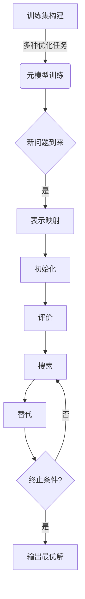

# 一切皆是映射：构建元学习启发式优化算法

## 1.背景介绍

### 1.1 优化问题的挑战

在现实世界中,我们经常遇到各种各样的优化问题,例如路径规划、资源分配、机器学习模型调参等。这些问题通常具有以下几个特点:

- 高维、非线性、非凸
- 目标函数复杂、多模态
- 存在大量局部最优解
- 约束条件多样、苛刻

传统的确定性算法和随机搜索算法往往难以有效解决这些复杂优化问题。因此,我们需要一种新的优化范式来应对这些挑战。

### 1.2 元启发式优化算法的兴起

近年来,元启发式优化算法(Meta-heuristic Optimization Algorithms)作为一种新兴的优化范式逐渐引起研究者的重视。这类算法通常借鉴自然界或人工智能领域的思想,具有以下优点:

- 无需目标函数连续可微,可处理黑盒优化问题
- 能够有效逃脱局部最优,探索全局解空间
- 具有良好的鲁棒性和通用性
- 易于并行化,利用现代硬件加速求解

常见的元启发式算法包括:模拟退火、遗传算法、蚁群优化、粒子群优化等。它们已在诸多领域展现出优异的性能,成为解决复杂优化问题的利器。

### 1.3 元学习与优化算法

尽管元启发式算法展现出了巨大的潜力,但其性能仍然受到算法参数、初始化策略、算子设计等因素的影响。如何自动化调优这些超参数,提高算法的适用性和鲁棒性,是当前研究的热点课题。

元学习(Meta-Learning)作为机器学习领域的一个新兴方向,为解决这一问题提供了新的思路。元学习旨在从大量任务或数据中学习出通用的知识,指导新任务的快速学习。将元学习与优化算法相结合,有望构建出自适应、高效、通用的新一代优化算法。

本文将探讨如何将元学习思想融入优化算法的设计之中,提出一种新颖的元学习启发式优化算法框架。我们将阐述其核心理念、关键技术,并通过实例分析其在实际问题中的应用前景。

## 2.核心概念与联系

在深入讨论元学习启发式优化算法之前,我们先来厘清几个核心概念及其内在联系。

### 2.1 启发式优化算法

启发式优化算法是一类借鉴自然界或人工智能思想,用于解决复杂优化问题的算法。它们通常具有以下几个关键组成部分:

- **解空间表示**:将优化问题映射到算法可操作的数据结构,如二进制串、实数向量等。
- **初始化策略**:生成初始候选解集合的方法。
- **评价函数**:评估候选解的优劣,对应优化问题的目标函数。
- **搜索策略**:基于当前候选解集合,生成新的候选解集合的机制。通常包括多种启发式算子,如变异、交叉、邻域搜索等。
- **替代策略**:确定新生成的候选解如何替代旧的候选解,形成新一代种群。

不同的启发式算法在这些组成部分的具体实现上有所差异,从而展现出不同的优化行为和性能特征。

### 2.2 元学习

元学习(Meta-Learning)是机器学习领域的一个新兴方向,旨在从大量任务或数据中学习出通用的知识,指导新任务的快速学习。

常见的元学习范式包括:

- **基于模型的元学习**:从多个相关任务中学习一个可快速适应新任务的初始模型。
- **基于度量的元学习**:学习一个度量空间,使得相似的任务在该空间中更加临近。
- **基于优化的元学习**:直接学习一个高效的优化策略,用于快速求解新任务。

元学习的核心思想是:通过在多个相关任务上训练,获取一些可迁移的知识,从而加速新任务的学习过程。这与生物个体通过进化获得一些先验知识,指导后代更快适应新环境的过程类似。

### 2.3 元学习与优化算法的映射

我们可以将启发式优化算法视为一种特殊的"学习任务",其目标是从一个初始解集合出发,通过迭代优化,最终收敛到优化问题的(近似)最优解。

不同的优化问题可视为不同的"任务",它们的目标函数形式、约束条件、解空间等有所差异。传统的优化算法通常是针对特定问题而设计的,缺乏通用性和鲁棒性。

将元学习思想引入优化算法的设计之中,我们可以从大量优化任务中学习出一种通用的优化策略,使得算法能够快速适应新的优化问题。具体来说,我们可以:

- 学习一个通用的解空间表示,使得不同问题的解空间能够映射到同一数据结构。
- 学习一个通用的初始化策略,为新问题生成高质量的初始解集合。
- 学习一个通用的评价函数,对不同问题的解质量给出合理评估。
- 学习一个通用的搜索策略,包括各种高效的启发式算子。
- 学习一个通用的替代策略,平衡探索与利用,加速收敛。

通过这种方式,我们可以构建出一种新颖的元学习启发式优化算法框架,赋予优化算法更强的通用性、自适应性和高效性。

## 3.核心算法原理具体操作步骤

接下来,我们将详细阐述元学习启发式优化算法的核心原理和具体操作步骤。

### 3.1 算法框架

元学习启发式优化算法的总体框架如下:

1. **训练集构建**:从先验知识或经验数据中,构建一个包含多种优化任务的训练集。
2. **元模型训练**:在训练集上,使用元学习范式训练一个元模型,学习通用的优化策略。
3. **新问题适应**:对于新的优化问题,使用训练好的元模型快速生成针对性的优化算法实例。
4. **优化求解**:使用生成的算法实例求解新问题,获得(近似)最优解。

其中,步骤2是算法的核心和关键,我们将在下文重点阐述。

### 3.2 元模型结构

我们的元模型由以下几个模块组成:

1. **表示模块**:学习一个通用的解空间表示映射 $\phi: \mathcal{X} \rightarrow \mathcal{Z}$,将不同问题的解空间 $\mathcal{X}$ 映射到同一数据结构 $\mathcal{Z}$ (如实数向量)。

2. **初始化模块**:学习一个通用的初始化策略 $\pi_\theta: \mathcal{T} \rightarrow \mathcal{Z}^N$,为任意新问题 $\mathcal{T}$ 生成高质量的初始解集 $\{z_1, z_2, \ldots, z_N\}$。

3. **评价模块**:学习一个通用的评价函数 $f_\phi: \mathcal{Z} \times \mathcal{T} \rightarrow \mathbb{R}$,对给定问题 $\mathcal{T}$ 下的候选解 $z \in \mathcal{Z}$ 进行打分评估。

4. **搜索模块**:学习一个通用的搜索策略 $\pi_\omega: \mathcal{Z}^N \times \mathcal{T} \rightarrow \mathcal{Z}^M$,包含多种启发式算子,将当前解集 $\{z_1, z_2, \ldots, z_N\}$ 转化为新的解集 $\{z'_1, z'_2, \ldots, z'_M\}$。

5. **替代模块**:学习一个通用的替代策略 $\rho_\psi: \mathcal{Z}^N \times \mathcal{Z}^M \rightarrow \mathcal{Z}^N$,将新解集与旧解集合并,形成新一代解集。

其中 $\theta$、$\phi$、$\omega$、$\psi$ 等为需要学习的模型参数。这些模块的具体实现形式可以是神经网络、决策树、贝叶斯模型等。

### 3.3 元模型训练

我们的目标是在训练集 $\mathcal{D} = \{\mathcal{T}_1, \mathcal{T}_2, \ldots, \mathcal{T}_K\}$ 上训练元模型,使其学习到一种通用的优化策略。

具体来说,我们最小化以下损失函数:

$$J(\theta, \phi, \omega, \psi) = \mathbb{E}_{\mathcal{T} \sim \mathcal{D}} \Big[ C\big(A_{\theta,\phi,\omega,\psi}(\mathcal{T}), \mathcal{T}^*\big) \Big]$$

其中:

- $\mathcal{T}^*$ 为问题 $\mathcal{T}$ 的(近似)最优解
- $A_{\theta,\phi,\omega,\psi}(\mathcal{T})$ 为元模型在问题 $\mathcal{T}$ 上的优化过程,包括初始化、迭代搜索、替代等步骤
- $C(\cdot, \cdot)$ 为某种代价函数,衡量优化结果与最优解的差距

我们可以使用基于模拟的策略梯度算法(如REINFORCE)、进化策略等方法,在训练集上对元模型进行端到端的训练,使其学习到一种高效的通用优化策略。

### 3.4 新问题适应

对于新的优化问题 $\mathcal{T}_{\text{new}}$,我们使用训练好的元模型,快速为其生成一个针对性的优化算法实例 $A_{\theta^*,\phi^*,\omega^*,\psi^*}$:

1. 使用表示模块将问题的解空间映射到通用数据结构: $\phi^*: \mathcal{X}_{\text{new}} \rightarrow \mathcal{Z}$

2. 使用初始化模块生成高质量的初始解集: $\{z_1, z_2, \ldots, z_N\} = \pi_{\theta^*}(\mathcal{T}_{\text{new}})$

3. 使用评价模块对候选解进行评估: $f_{\phi^*}(z, \mathcal{T}_{\text{new}})$

4. 使用搜索模块产生新的候选解集: $\{z'_1, z'_2, \ldots, z'_M\} = \pi_{\omega^*}(\{z_1, \ldots, z_N\}, \mathcal{T}_{\text{new}})$

5. 使用替代模块形成新一代解集: $\{z_1, z_2, \ldots, z_N\} = \rho_{\psi^*}(\{z_1, \ldots, z_N\}, \{z'_1, \ldots, z'_M\})$

6. 重复步骤4、5,直至满足终止条件,输出最终解集中的最优解。

通过这种方式,我们实现了在新问题上快速生成针对性优化算法实例的目标。由于算法实例继承了元模型学习到的通用优化策略,因此具有良好的适用性和鲁棒性。

### 3.5 算法流程图

为了更加形象地展示元学习启发式优化算法的工作流程,我们使用 Mermaid 绘制了一个流程图:

该流程图清晰地展示了算法的训练和应用两个主要阶段:

1. **训练阶段**:从多种优化任务构建训练集,并在训练集上训练元模型,学习通用的优化策略。

2. **应用阶段**:对于新的优化问题,使用训练好的元模型快速生成针对性的优化算法实例,并通过迭代优化获得最终解。

通过将元学习思想与启发式优化算法相结合,我们提出了一种全新的优化范式,赋予了算法更强的通用性、自适应性和高效