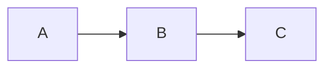

# 一文读懂图半监督学习的最新进展

## 1.背景介绍

### 1.1 什么是半监督学习?

半监督学习(Semi-Supervised Learning)是机器学习中一种重要的学习范式,它介于监督学习和非监督学习之间。在半监督学习中,我们拥有少量标记数据和大量未标记数据。与监督学习仅利用标记数据不同,半监督学习同时利用标记和未标记数据进行训练,从而能够更好地捕获数据的全局分布特征。

### 1.2 为什么需要半监督学习?

在现实世界中,获取标记数据通常代价昂贵且困难,而未标记数据则相对容易获取。因此,如何有效利用未标记数据提高模型性能成为一个重要课题。半监督学习正是为解决这一问题而提出的,它能够充分利用未标记数据,在一定程度上弥补标记数据的缺乏。

### 1.3 半监督学习的应用场景

半监督学习在诸多领域得到了广泛应用,例如:

- 自然语言处理: 利用大量未标记文本数据提高文本分类、机器翻译等任务性能
- 计算机视觉: 利用大量未标记图像数据提高图像分类、目标检测等任务性能
- 生物信息学: 利用未标记基因数据进行基因表达分析
- 推荐系统: 利用未标记用户行为数据提高个性化推荐准确性

## 2.核心概念与联系  

### 2.1 半监督学习的基本思想

半监督学习的核心思想是利用未标记数据对模型进行正则化(Regularization),从而提高模型在标记数据上的泛化能力。具体来说,半监督学习假设标记数据和未标记数据服从相同的基础分布,因此可以利用未标记数据估计数据的全局分布,并将其作为先验知识引入模型训练过程。

### 2.2 半监督学习的主要方法

半监督学习主要包括以下几种方法:

#### 2.2.1 生成模型方法

生成模型方法假设数据服从某种概率分布,利用标记和未标记数据对联合分布进行建模。常见的生成模型方法包括高斯混合模型、朴素贝叶斯等。

#### 2.2.2 半监督支持向量机

半监督支持向量机(Semi-Supervised SVM)在传统SVM的基础上引入未标记数据,通过最大化标记数据和未标记数据之间的边界距离,实现对未标记数据的利用。

#### 2.2.3 图半监督学习

图半监督学习(Graph-based Semi-Supervised Learning)将数据表示为图结构,利用图上的标记和未标记节点之间的关系对模型进行训练。常见的图半监督学习方法包括基于高斯核的方法、基于图割的方法等。

#### 2.2.4 半监督深度学习

近年来,深度学习在半监督学习领域取得了突破性进展。半监督深度学习模型通过设计特殊的网络结构或损失函数,实现对未标记数据的利用。

### 2.3 半监督学习的挑战

尽管半监督学习取得了一定进展,但仍然面临诸多挑战:

- 标记数据和未标记数据分布不一致(Distribution Mismatch)
- 未标记数据中存在噪声和异常值
- 缺乏对半监督假设的理论支持
- 高维数据下的可扩展性问题

## 3.核心算法原理具体操作步骤

在本节,我们将重点介绍图半监督学习的核心算法原理及其具体操作步骤。

### 3.1 图构建

图半监督学习的第一步是将数据构建为图结构。常见的图构建方法包括:

#### 3.1.1 k近邻图

对于每个数据点,找到它的k个最近邻点,并在它们之间连接无向边,形成k近邻图。边的权重可以设置为两点之间的欧氏距离或高斯核函数值。

#### 3.1.2 ε邻域图

对于每个数据点,找到距离它不超过ε的所有点,并在它们之间连接无向边,形成ε邻域图。边的权重通常设置为常数或高斯核函数值。

#### 3.1.3 完全图

将所有数据点两两连接,形成完全图。边的权重可以设置为两点之间的相似度或核函数值。

### 3.2 标签传播

在图结构上,我们可以利用标记节点的标签信息,通过某种规则在图上传播标签到未标记节点。常见的标签传播算法包括:

#### 3.2.1 高斯核方法

高斯核方法假设相似的数据点应该具有相似的标签,利用高斯核函数对图上节点之间的相似度进行建模。具体操作步骤如下:

1. 计算数据点之间的相似度矩阵 $W$,其中 $W_{ij}$ 表示数据点 $x_i$ 和 $x_j$ 之间的相似度。
2. 构建拉普拉斯矩阵 $L = D - W$,其中 $D$ 为度矩阵,对角线元素为 $D_{ii} = \sum_j W_{ij}$。
3. 令 $F$ 为所有数据点的标签向量,其中标记数据点的标签已知,未标记数据点的标签未知。
4. 求解优化问题:

$$\min_F \frac{1}{2} \sum_{i,j} W_{ij} \Vert F_i - F_j \Vert^2 = \frac{1}{2} F^T L F$$

   该优化问题的解为 $F^* = (I - \alpha S)^{-1} Y$,其中 $\alpha$ 为正则化系数, $S = D^{-1/2} W D^{-1/2}$ 为归一化拉普拉斯矩阵, $Y$ 为已知标记数据点的标签向量。
5. 将 $F^*$ 中对应未标记数据点的元素作为其预测标签。

#### 3.2.2 基于图割的方法

基于图割的方法将数据划分为几个子集,使得子集内部的数据点相似度较高,子集之间的相似度较低。常见的算法包括归一化切割(Normalized Cut)和算法。

具体操作步骤如下:

1. 构建相似度矩阵 $W$ 和度矩阵 $D$。
2. 计算归一化拉普拉斯矩阵 $L = I - D^{-1/2} W D^{-1/2}$。
3. 计算 $L$ 的前 $k$ 个最小特征值对应的特征向量 $u_1, u_2, \ldots, u_k$。
4. 将每个数据点 $x_i$ 映射到由 $u_1(i), u_2(i), \ldots, u_k(i)$ 构成的 $k$ 维向量。
5. 在 $k$ 维空间中使用 $k$-means 等聚类算法对数据点进行聚类。
6. 将每个簇内的未标记数据点赋予簇内主要标签。

### 3.3 基于半监督深度学习的标签传播

近年来,基于深度学习的半监督方法取得了突破性进展,其核心思想是设计特殊的网络结构或损失函数,使模型能够同时利用标记和未标记数据进行训练。

以图卷积网络(Graph Convolutional Network, GCN)为例,其利用图结构对节点进行信息传播,实现对未标记数据的利用。具体操作步骤如下:

1. 构建图邻接矩阵 $A$。
2. 对邻接矩阵进行归一化处理,得到 $\tilde{A} = D^{-1/2} A D^{-1/2}$。
3. 定义图卷积操作:

$$Z = \tilde{A} X \Theta$$

   其中 $X$ 为节点特征矩阵, $\Theta$ 为待学习的卷积核参数。
4. 在图卷积层之后接入其他神经网络层,并定义半监督损失函数:

$$\mathcal{L} = \mathcal{L}_{sup} + \lambda \mathcal{L}_{unsup}$$

   其中 $\mathcal{L}_{sup}$ 为监督损失(如交叉熵损失), $\mathcal{L}_{unsup}$ 为半监督正则项(如基于图结构的一致性正则项),  $\lambda$ 为权重系数。
5. 使用标记和未标记数据对模型进行端到端训练。

除了GCN,其他半监督深度学习模型还包括基于对比学习的方法、基于图神经网络的方法等,在这里就不一一赘述了。

## 4.数学模型和公式详细讲解举例说明

在上一节中,我们介绍了图半监督学习的核心算法原理。现在,我们将对其中涉及到的一些重要数学模型和公式进行更详细的讲解和举例说明。

### 4.1 高斯核函数

高斯核函数是半监督学习中常用的一种核函数,用于度量数据点之间的相似度。其定义为:

$$K(x_i, x_j) = \exp\left(-\frac{\Vert x_i - x_j \Vert^2}{2\sigma^2}\right)$$

其中 $\sigma$ 为带宽超参数,控制核函数的平滑程度。

例如,对于二维数据点 $x_1 = (1, 2)$, $x_2 = (2, 3)$, 当 $\sigma = 1$ 时,它们之间的高斯核函数值为:

$$K(x_1, x_2) = \exp\left(-\frac{\sqrt{1^2 + 1^2}}{2}\right) \approx 0.6065$$

### 4.2 拉普拉斯矩阵

拉普拉斯矩阵是图半监督学习中一个重要的数学工具,用于描述图结构。对于无向加权图 $G = (V, E)$,其拉普拉斯矩阵 $L$ 定义为:

$$L = D - W$$

其中 $D$ 为度矩阵,对角线元素 $D_{ii} = \sum_j W_{ij}$;$W$ 为邻接矩阵,元素 $W_{ij}$ 表示节点 $i$ 和 $j$ 之间边的权重。

拉普拉斯矩阵具有以下重要性质:

- 半正定
- 所有特征值非负
- 第一特征值为0,对应的特征向量为常数向量

例如,对于一个简单的3节点无权图:



其邻接矩阵为:

$$W = \begin{bmatrix}
0 & 1 & 0\\
1 & 0 & 1\\
0 & 1 & 0
\end{bmatrix}$$

度矩阵为:

$$D = \begin{bmatrix}
1 & 0 & 0\\
0 & 2 & 0\\
0 & 0 & 1
\end{bmatrix}$$

则拉普拉斯矩阵为:

$$L = D - W = \begin{bmatrix}
1 & -1 & 0\\
-1 & 2 & -1\\
0 & -1 & 1
\end{bmatrix}$$

可以验证,该拉普拉斯矩阵的特征值为 $\{0, 1, 3\}$,最小特征值对应的特征向量为 $\begin{bmatrix}\frac{1}{\sqrt{3}} & \frac{1}{\sqrt{3}} & \frac{1}{\sqrt{3}}\end{bmatrix}^T$。

### 4.3 图割和归一化图割

图割(Graph Cut)是一种将图 $G$ 划分为两个子集 $A$ 和 $B$ 的度量,定义为:

$$\text{cut}(A, B) = \sum_{i \in A, j \in B} W_{ij}$$

即两个子集之间边的权重之和。图割越小,说明两个子集之间的相似度越低。

然而,简单的图割存在偏向较小子集的问题。为了解决这一问题,提出了归一化图割(Normalized Cut)的概念:

$$\text{Ncut}(A, B) = \frac{\text{cut}(A, B)}{\text{vol}(A)} + \frac{\text{cut}(A, B)}{\text{vol}(B)}$$

其中 $\text{vol}(A) = \sum_{i \in A} D_{ii}$ 为子集 $A$ 中所有节点的度之和。归一化图割能够更加公平地评估划分的质量。

例如,对于下面的加权图:

```mermaid
graph LR
    A((A)) ---2--- B((B))