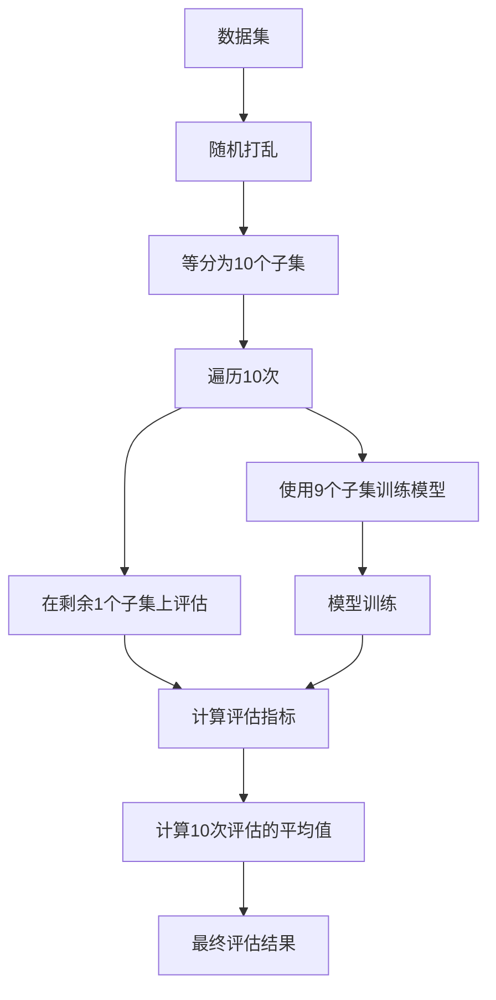

# 交叉验证 (Cross-Validation)

## 1. 背景介绍

### 1.1 机器学习模型评估的重要性

在机器学习领域中,模型的评估是一个至关重要的步骤。它能够帮助我们了解模型在未知数据上的泛化能力,从而指导模型的选择和调优。然而,如果我们仅仅依赖训练数据集上的评估指标,很容易导致过拟合(overfitting)的问题,即模型在训练数据上表现良好,但在新的未知数据上表现不佳。

### 1.2 留出法的局限性

传统的模型评估方法是将数据集划分为训练集和测试集。模型在训练集上进行训练,并在测试集上评估性能。这种方法被称为"留出法"(hold-out)。然而,留出法存在一些固有的缺陷:

1. **数据利用率低**:将部分数据留作测试集,意味着这部分数据无法用于模型训练,从而降低了数据的利用效率。
2. **评估结果的稳定性差**:测试集的选择会对评估结果产生很大影响。不同的测试集划分可能导致评估结果的差异较大,缺乏稳定性。
3. **数据代表性不足**:如果测试集无法很好地代表整个数据分布,评估结果就可能失真。

为了解决这些问题,交叉验证(Cross-Validation)作为一种更加可靠和高效的模型评估技术应运而生。

## 2. 核心概念与联系

### 2.1 交叉验证的基本思想

交叉验证的核心思想是将数据集划分为多个子集,每次使用其中一个子集作为测试集,其余子集作为训练集,重复这个过程多次,最终取多次评估的平均值作为模型的评估指标。这种方法能够最大限度地利用数据,并且评估结果更加稳定可靠。

### 2.2 常见的交叉验证方法

交叉验证有多种具体的实现方式,最常见的包括:

1. **K 折交叉验证(K-fold Cross-Validation)**
2. **留一交叉验证(Leave-One-Out Cross-Validation, LOOCV)** 
3. **留 P 交叉验证(Leave-P-Out Cross-Validation, LPOCV)**
4. **重复随机子抽样交叉验证(Repeated Random Sub-Sampling Validation)**

其中,K折交叉验证是最常用和最典型的一种方法。

### 2.3 K折交叉验证原理

K折交叉验证的工作流程如下:

1. 将数据集随机划分为 K 个大小相等的互斥子集(折数)
2. 每次使用其中一个子集作为测试集,其余 K-1 个子集作为训练集,进行 K 次训练和评估
3. 对 K 次评估结果取平均值,作为模型的最终评估指标

这种方法能够最大限度地利用数据,每个样本都会被使用在训练集和测试集中。当 K=N(N为样本总数)时,就成为了留一交叉验证(LOOCV)的特殊情况。

## 3. 核心算法原理具体操作步骤  

### 3.1 K折交叉验证算法步骤

以K折交叉验证为例,具体的算法步骤如下:

1. **随机打乱**数据集,以消除数据的排列顺序所带来的偏差。
2. **将数据集等分为K个子集(fold)**,通常K取一个小于样本数量N的整数,常用的值为5或10。 
3. **遍历K次**,每次使用其中一个子集作为测试集,其余K-1个子集合并作为训练集。
   
   对于第i次遍历:
   - 使用除第i个子集以外的所有数据作为训练集训练模型
   - 在第i个子集(测试集)上评估模型性能,得到一个评估指标值
   
4. **计算K次评估指标的平均值**,作为模型在该数据集上的最终评估结果。

以10折交叉验证为例,算法流程如下所示:



### 3.2 留一交叉验证(LOOCV)

留一交叉验证是K折交叉验证的一个特殊情况,即将K设置为样本总数N。具体步骤为:

1. 使用数据集中的N-1个样本作为训练集训练模型
2. 在剩余的1个样本上评估模型性能,得到一个评估指标值
3. 重复上述过程N次,每次使用不同的1个样本作为测试集
4. 计算N次评估指标的平均值,作为模型的最终评估结果

LOOCV的优点是能最大限度地利用数据,每个样本都会被使用作为测试集。但缺点是计算开销很大,尤其是在样本数量N很大时,会导致训练时间成本剧增。

### 3.3 留P交叉验证(LPOCV)

留P交叉验证是K折交叉验证的一种推广,它每次使用P个样本作为测试集,其余N-P个样本作为训练集。具体步骤为:

1. 从数据集中选取P个样本作为测试集
2. 使用剩余的N-P个样本作为训练集训练模型
3. 在测试集上评估模型性能,得到一个评估指标值
4. 重复上述过程,遍历所有可能的P个样本的组合作为测试集
5. 计算所有评估指标的平均值,作为模型的最终评估结果

LPOCV的优点是可以控制测试集的大小,在训练时间和评估稳定性之间寻求平衡。当P=1时,它就等价于LOOCV;当P=N/K时,它就等价于K折交叉验证。

### 3.4 重复随机子抽样交叉验证

重复随机子抽样交叉验证是另一种常用的交叉验证方法。它的步骤如下:

1. 从数据集中随机抽取一部分样本作为测试集,剩余样本作为训练集
2. 在训练集上训练模型,在测试集上评估模型性能,得到一个评估指标值
3. 重复上述过程多次(通常100~1000次),每次随机抽取不同的测试集
4. 计算所有评估指标的平均值和标准差,作为模型的最终评估结果

这种方法的优点是可以控制训练集和测试集的比例,并且通过多次重复可以获得更加稳定的评估结果。缺点是需要指定抽样次数的超参数,并且计算开销较大。

## 4. 数学模型和公式详细讲解举例说明

### 4.1 K折交叉验证的数学模型

设数据集 $\mathcal{D}=\{(x_1,y_1),(x_2,y_2),\ldots,(x_N,y_N)\}$ 包含 $N$ 个样本,其中 $x_i$ 表示第 $i$ 个样本的特征向量, $y_i$ 表示对应的标签。我们将数据集等分为 $K$ 个互斥子集(折数):

$$\mathcal{D} = \mathcal{D}_1 \cup \mathcal{D}_2 \cup \ldots \cup \mathcal{D}_K$$

其中, $|\mathcal{D}_i| \approx N/K, \forall i=1,2,\ldots,K$。

对于第 $j$ 次交叉验证迭代,我们使用 $\mathcal{D} \setminus \mathcal{D}_j$ 作为训练集训练模型 $f$,在剩余的 $\mathcal{D}_j$ 上评估模型性能,得到评估指标值 $\text{score}_j$。重复该过程 $K$ 次,则最终的评估结果为:

$$\text{score}_{\text{CV}} = \frac{1}{K}\sum_{j=1}^{K}\text{score}_j$$

其中, $\text{score}_{\text{CV}}$ 表示交叉验证的最终评估指标。

通常,我们使用 $K=5$ 或 $K=10$ 进行交叉验证。当 $K=N$ 时,就成为了留一交叉验证(LOOCV)的特殊情况。

### 4.2 交叉验证的方差估计

交叉验证不仅可以给出模型性能的无偏估计,还可以估计该估计值的方差。设 $\text{score}_j$ 为第 $j$ 次迭代的评估指标值,则交叉验证的评估结果 $\text{score}_{\text{CV}}$ 的方差可以估计为:

$$\text{Var}(\text{score}_{\text{CV}}) = \frac{1}{K(K-1)}\sum_{j=1}^{K}(\text{score}_j - \text{score}_{\text{CV}})^2$$

较小的方差意味着评估结果更加稳定可靠。一般来说,K 值越大,方差就越小。但同时,计算开销也会随之增加。

### 4.3 留一交叉验证(LOOCV)的公式

LOOCV 是 K 折交叉验证在 $K=N$ 时的特殊情况。对于数据集 $\mathcal{D}=\{(x_1,y_1),(x_2,y_2),\ldots,(x_N,y_N)\}$,LOOCV 的评估结果可以表示为:

$$\text{score}_{\text{LOOCV}} = \frac{1}{N}\sum_{i=1}^{N}L(y_i,f_{-i}(x_i))$$

其中, $f_{-i}$ 表示在除第 $i$ 个样本之外的所有样本上训练得到的模型, $L(\cdot,\cdot)$ 是损失函数。

LOOCV 能够最大限度地利用数据,但计算开销较大,尤其是在样本数量 $N$ 很大时。

### 4.4 留P交叉验证(LPOCV)的公式

留P交叉验证是K折交叉验证的一种推广形式。设数据集 $\mathcal{D}$ 包含 $N$ 个样本,我们每次从中抽取 $P$ 个样本作为测试集,剩余 $N-P$ 个样本作为训练集。令 $\mathcal{T}_i$ 表示第 $i$ 次迭代的测试集,则 LPOCV 的评估结果可以表示为:

$$\text{score}_{\text{LPOCV}} = \frac{1}{\binom{N}{P}}\sum_{i=1}^{\binom{N}{P}}\frac{1}{|\mathcal{T}_i|}\sum_{(x,y)\in\mathcal{T}_i}L(y,f_{\mathcal{D}\setminus\mathcal{T}_i}(x))$$

其中, $\binom{N}{P}$ 表示从 $N$ 个样本中选取 $P$ 个的组合数, $f_{\mathcal{D}\setminus\mathcal{T}_i}$ 表示在除 $\mathcal{T}_i$ 之外的样本上训练得到的模型, $L(\cdot,\cdot)$ 是损失函数。

当 $P=1$ 时,LPOCV 就等价于 LOOCV;当 $P=N/K$ 时,LPOCV 就等价于 $K$ 折交叉验证。LPOCV 的优点是可以控制测试集的大小,在训练时间和评估稳定性之间寻求平衡。

## 5. 项目实践:代码实例和详细解释说明

以下是使用 Python 中的 scikit-learn 库实现 K 折交叉验证的代码示例,并对关键步骤进行了详细说明:

```python
from sklearn.model_selection import KFold, cross_val_score
from sklearn.datasets import load_iris
from sklearn.linear_model import LogisticRegression

# 加载鸢尾花数据集
X, y = load_iris(return_X_y=True)

# 创建 K 折交叉验证迭代器
kf = KFold(n_splits=5, shuffle=True, random_state=42)

# 创建 Logistic 回归模型
model = LogisticRegression()

# 使用 K 折交叉验证评估模型性能
scores = cross_val_score(model, X, y, cv=kf, scoring='accuracy')

# 打印交叉验证结果
print(f"交叉验证评分: {scores}")
print(f"平均评分: {scores.mean():.3f}")
```

代码解释:

1. 首先,我