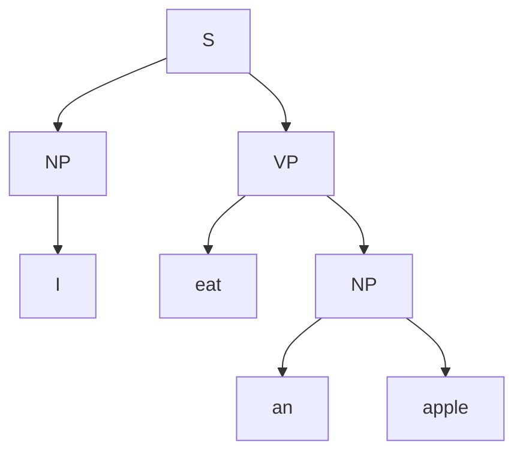
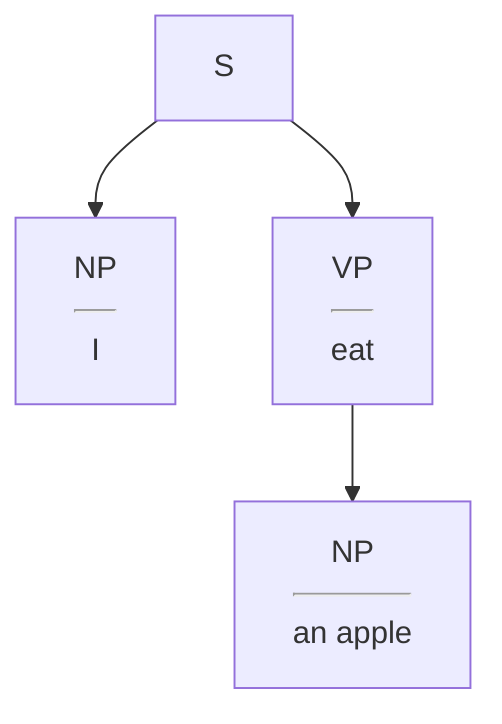

# 从规则到深度学习:机器翻译的演进之路

## 1.背景介绍

### 1.1 机器翻译的重要性

在这个全球化的时代,有效的跨语言沟通对于促进不同文化之间的理解和合作至关重要。机器翻译(Machine Translation, MT)作为一种自动将一种自然语言转换为另一种自然语言的技术,在商业、政治、教育和科研等诸多领域发挥着重要作用。

### 1.2 机器翻译的发展历程

机器翻译的概念可以追溯到17世纪,当时有学者提出利用"词典"和语法规则实现语言之间的转换。20世纪40年代,随着计算机的出现,机器翻译研究得到了极大的推动。最早的机器翻译系统基于规则(Rule-Based Machine Translation, RBMT),依赖于语言学家手工编写的大量规则。

随着统计机器翻译(Statistical Machine Translation, SMT)方法的兴起,机器翻译进入了一个新的阶段。该方法利用大量的平行语料库,通过统计建模的方式自动学习翻译模型,无需人工编写规则。

近年来,随着深度学习技术的迅猛发展,神经网络机器翻译(Neural Machine Translation, NMT)系统取得了突破性的进展,在翻译质量和效率方面都超越了传统的统计方法,成为机器翻译领域的新的主流范式。

### 1.3 本文主旨

本文将系统地回顾机器翻译技术的发展历程,从规则到统计,再到当前的深度学习方法,剖析每一种范式下的核心思想、关键算法和数学模型,并对其优缺点进行分析。同时,我们将探讨机器翻译在实际应用中的挑战,以及未来的发展趋势和前景。

## 2.核心概念与联系 

### 2.1 规则基础机器翻译(RBMT)

规则基础机器翻译系统主要由三个核心模块组成:

1. **分析模块**:将源语言句子分析成抽象的语法结构表示。
2. **转移模块**:将源语言的语法结构转换为等价的目标语言语法结构。
3. **生成模块**:根据转换后的语法结构生成目标语言的表面字符串。

这三个模块均依赖于大量的人工编写的语言规则,包括词法规则、句法规则、语义规则和转换规则等。

RBMT系统的优点是可解释性强,容易控制输出质量。但缺点也很明显:

1. 规则的覆盖面有限,难以应对语言的多样性。
2. 规则的编写和维护工作量巨大,成本高昂。
3. 缺乏语言间的映射关系学习能力。

因此,RBMT系统的翻译质量在一定程度上受到了限制。

### 2.2 统计机器翻译(SMT)

为了克服RBMT的缺陷,统计机器翻译(SMT)应运而生。SMT系统将机器翻译任务看作是一个统计模型估计问题:

$$P(t|s) = \arg\max_{t} P(t|s)$$

其中$s$表示源语言句子,$t$表示目标语言句子。机器翻译的目标是找到给定源句子$s$时,使条件概率$P(t|s)$最大化的目标句子$t$。

SMT系统通过利用大规模的平行语料库,基于统计方法自动学习翻译模型和语言模型的参数,无需人工编写规则。常用的SMT模型包括:

1. **基于词的翻译模型**:利用词对齐技术建模词与词之间的翻译概率。
2. **基于短语的翻译模型**:将句子视为短语序列,建模短语与短语之间的翻译概率。
3. **语言模型**:评估目标语言句子的流畅性和语法是否正确。
4. **解码器**:根据上述模型,利用搜索算法寻找最优目标句子。

相比RBMT,SMT的优势在于可以充分利用数据,无需人工编写规则。但缺点是难以利用结构化的语法和语义知识,且模型复杂、解码困难。

### 2.3 神经网络机器翻译(NMT)

深度学习技术的兴起,为机器翻译带来了新的范式——神经网络机器翻译(NMT)。NMT系统将整个翻译过程端到端地建模为一个单一的大型神经网络,通过在大规模平行语料上训练,自动学习源语言到目标语言的映射关系。

典型的NMT框架由编码器(Encoder)和解码器(Decoder)两部分组成:

1. **编码器**:读取源语言句子,将其编码为语义向量表示。
2. **解码器**:根据语义向量,自回归地生成目标语言句子。

编码器和解码器内部通常使用循环神经网络(RNN)或transformer等神经网络架构。NMT的优势在于:

1. 端到端的建模方式,无需分多个阶段处理。
2. 有效利用了大数据和深度学习技术的优势。
3. 可以自动学习语义和结构化知识。

但NMT也存在一些缺陷,如训练数据饥渴、解码效率低下、缺乏可解释性等。

### 2.4 三种范式的联系

规则、统计和神经网络三种范式,体现了机器翻译技术发展的不同阶段。它们有着内在的联系:

1. 从规则驱动到数据驱动,再到模型自主学习。
2. 从浅层表示到深层表示,对语言的理解能力不断加强。
3. 从规则约束到概率约束,再到端到端的神经网络建模。

每一种新范式的出现,都是为了弥补上一代技术的缺陷,提高机器翻译的性能和适用范围。未来或将有新的突破,但三种范式的基础思想和技术积淀将继续被沿袭和发展。

## 3.核心算法原理具体操作步骤

在上一节中,我们介绍了机器翻译技术发展的三个主要范式及其核心思想。本节将详细阐述每一种范式下的关键算法原理和具体操作步骤。

### 3.1 规则基础机器翻译算法

RBMT系统的核心在于编写转换规则,实现源语言到目标语言的语法结构映射。典型的转换算法包括:

1. **传递属性树(Transfer)算法**:
   - 分析阶段:将源句子解析为抽象语法树(AST)表示。
   - 转换阶段:遍历AST,应用转换规则将源语言结构转换为目标语言结构。
   - 生成阶段:根据转换后的AST生成目标语言字符串。

2. **规则交织(Interlingua)算法**:
   - 分析阶段:将源句子解析为语言无关的逻辑表示。
   - 生成阶段:根据逻辑表示,结合目标语言规则生成目标句子。

上述算法的关键步骤是编写规则集,覆盖语法、语义和转换等多个层面。规则的质量直接决定了翻译的准确性。

### 3.2 统计机器翻译算法

SMT系统通常包含三个核心组件:翻译模型、语言模型和解码器。我们将分别介绍它们的算法原理。

1. **翻译模型**:
   - 基于词的翻译模型:利用EM算法从平行语料中自动学习词对齐和词对词翻译概率。
   - 基于短语的翻译模型:将句子视为短语序列,利用GIZA++等工具从平行语料中提取短语对及其翻译概率。

2. **语言模型**:
   - N-gram语言模型:利用N元统计从单语语料中学习目标语言中词序列出现的概率分布。
   - 神经网络语言模型:使用RNN或Transformer等神经网络从语料中学习词的上下文语义表示。

3. **解码器**:
   - 基于栈的解码:利用栈式数据结构,通过深度优先或广度优先搜索找到最优翻译。
   - 基于图的解码:将翻译问题建模为加权有向图的最短路径问题,通过动态规划等算法求解。

SMT算法的关键在于充分利用数据,学习翻译和语言模型的参数,并设计高效的解码算法搜索最优翻译。

### 3.3 神经网络机器翻译算法

NMT系统中,编码器和解码器都使用深度神经网络进行建模,算法流程如下:

1. **编码器**:
   - 使用双向RNN或Transformer的Encoder读取源句子,计算每个位置的上下文语义向量表示。
   - 对所有位置的向量进行池化,得到源句子的向量表示$c$。

2. **解码器**:
   - 初始时将$c$作为输入,结合上一步生成的词,使用RNN或Transformer的Decoder自回归地生成目标句子。
   - 在每一步,Decoder会输出所有词的概率分布,从中采样选择概率最大的词作为当前输出。

3. **注意力机制**:
   - 在解码时,Decoder会通过注意力机制动态地关注编码器不同位置的语义向量,获取对应的上下文信息。
   - 常用的注意力模型包括Bahdanau注意力、Multi-Head注意力等。

4. **训练**:
   - 使用最大似然估计,最小化模型在训练集上的交叉熵损失。
   - 采用反向传播算法,对编码器和解码器的参数进行端到端的联合训练。

NMT算法的优势在于端到端建模、自动提取特征、利用注意力机制捕获长程依赖等。但由于模型复杂,训练和解码的计算代价都很高。

### 3.4 小结

本节我们分别介绍了规则、统计和神经网络三种范式下的核心算法原理和具体操作步骤。每一种范式都有其独特的思路和技术手段,但也存在一定的局限性。实际应用中往往需要结合不同范式的优势,设计混合或集成的翻译系统,以获得最佳的翻译质量和效率。

## 4.数学模型和公式详细讲解举例说明

机器翻译技术的发展,很大程度上得益于数学模型的创新和完善。本节将重点讲解每个范式下的核心数学模型,并用具体例子说明其应用。

### 4.1 规则基础机器翻译模型

RBMT系统主要依赖于语言学家手工设计的规则集,缺乏统一的数学模型。但在分析和生成阶段,仍需要使用一些语言学模型对句子进行结构化表示和生成。

1. **上下文无关文法(Context-Free Grammar)**:
   - 用于对句子进行句法分析,生成语法树或其他句法结构表示。
   - 例如:英语句子"I eat an apple"的语法树为:



2. **无约束文法(Unrestrained Grammar)**:
   - 考虑语义和实词信息,生成更加丰富和自然的句子表示。
   - 例如:对"I eat an apple"的无约束语法树为:



上述模型为RBMT系统提供了句法和语义的形式化表示,为编写转换规则奠定了基础。但由于缺乏统计知识,难以应对语言的多样性。

### 4.2 统计机器翻译模型

与RBMT不同,SMT系统通过利用大规模平行语料,自动学习翻译和语言模型的统计参数。主要的数学模型包括:

1. **词对齐模型**:
   - 基于IBM模型,使用EM算法从平行语料中学习词对齐概率。
   - 例如:对于英法句子对"I eat an apple"和"Je mange une pomme",词对齐结果为:

```mermaid
graph LR
    I--Je
    eat--mange
    an--une
    apple--pomme
```

2. **基于词的翻译模型**:
   - 利用词对齐结果,估计词对词的