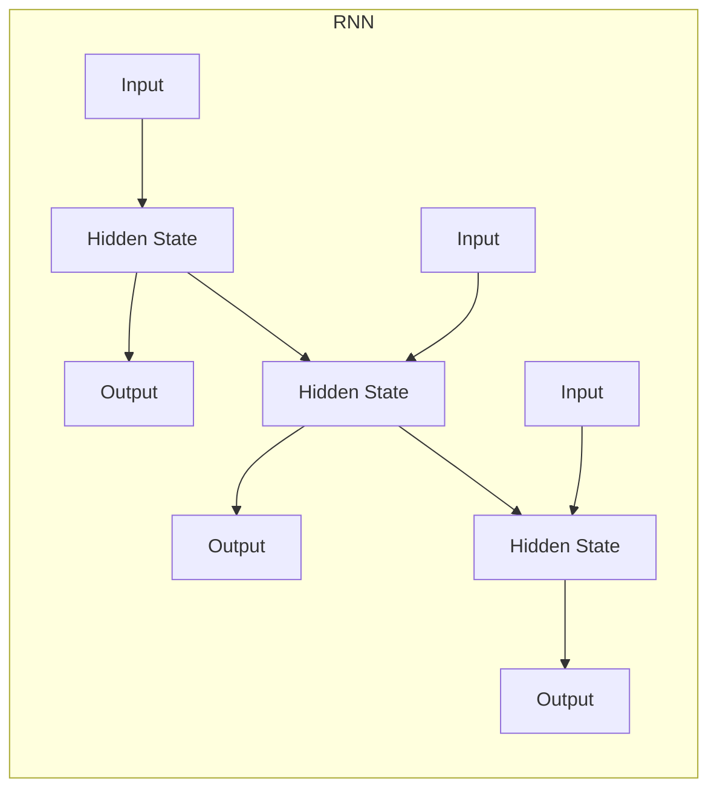
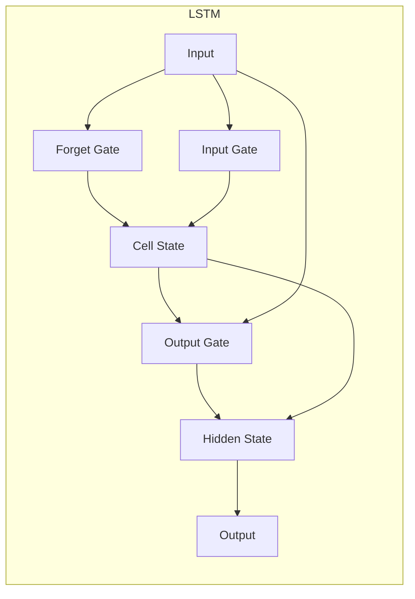
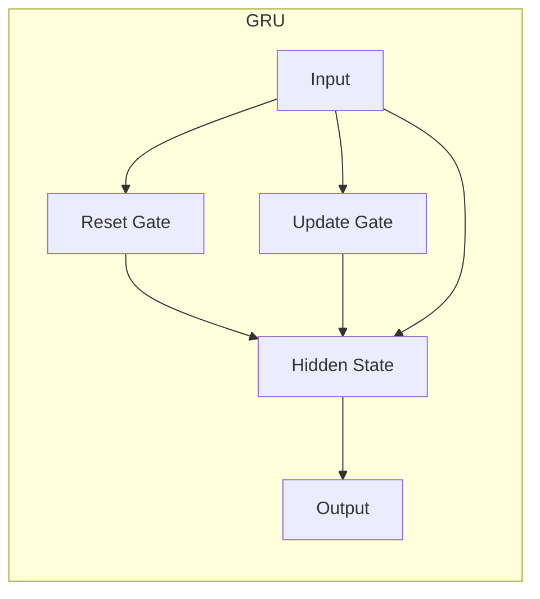
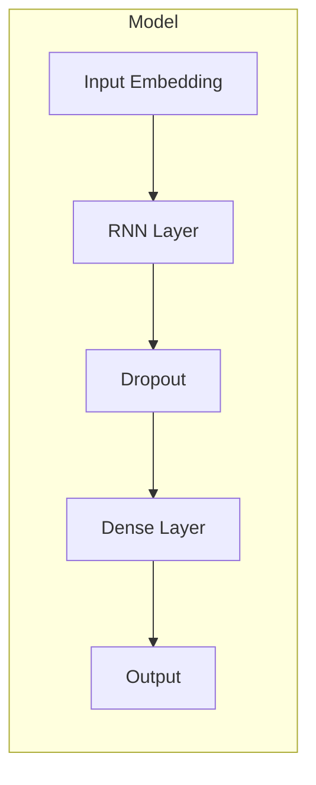

# 从零开始大模型开发与微调：实战：循环神经网络与情感分类

## 1. 背景介绍

### 1.1 自然语言处理的重要性

在当今的数字时代，自然语言处理(Natural Language Processing, NLP)已经成为一个不可或缺的技术领域。它使计算机能够理解、解释和生成人类语言,为各种应用程序提供了强大的语言处理能力。从智能助手到情感分析,从机器翻译到文本摘要,NLP已经广泛应用于各个领域。

### 1.2 情感分析的应用场景

情感分析是NLP的一个重要分支,旨在自动检测、识别和提取文本中表达的情感。它在许多领域都有着广泛的应用,例如:

- **社交媒体监控**: 分析用户在社交媒体上发布的内容,了解公众对某个产品、服务或事件的情绪和反应。
- **客户服务**: 自动分类和优先处理负面评论,提高客户满意度。
- **品牌声誉管理**: 监控网络上关于品牌的评论,及时发现并应对潜在的危机。
- **政治舆论分析**: 分析公众对政策的情绪,为决策提供参考。

### 1.3 循环神经网络在NLP中的应用

传统的自然语言处理方法通常依赖于手工设计的特征工程,效果有限。而随着深度学习的兴起,循环神经网络(Recurrent Neural Networks, RNNs)展现出了强大的语序列建模能力,在NLP任务中取得了卓越的成绩。

RNNs能够很好地捕捉序列数据中的长期依赖关系,因此非常适合处理文本等序列型数据。它们已经被广泛应用于机器翻译、语音识别、文本生成等各种NLP任务中。

## 2. 核心概念与联系

### 2.1 循环神经网络

#### 2.1.1 RNN的基本结构

循环神经网络是一种特殊的人工神经网络,它的核心思想是在隐藏层之间建立循环连接,使得网络能够处理序列数据。RNN的基本结构如下图所示:

在上图中,每个时间步长$t$,RNN会根据当前输入$x_t$和上一时间步的隐藏状态$h_{t-1}$,计算出当前时间步的隐藏状态$h_t$和输出$y_t$。这种循环结构使得RNN能够捕捉序列数据中的长期依赖关系。

然而,传统的RNN在实践中存在梯度消失或梯度爆炸的问题,难以有效捕捉长期依赖关系。为了解决这个问题,研究人员提出了改进版本,例如长短期记忆网络(Long Short-Term Memory, LSTM)和门控循环单元(Gated Recurrent Unit, GRU)。

#### 2.1.2 LSTM

LSTM是RNN的一种变体,它通过引入门控机制和记忆细胞的概念,有效地解决了梯度消失和梯度爆炸的问题。LSTM的核心思想是使用门控单元来控制信息的流动,从而决定什么信息需要被记住或遗忘。

LSTM的结构如下图所示:

在上图中,LSTM包含三个门控单元:遗忘门(Forget Gate)、输入门(Input Gate)和输出门(Output Gate),以及一个记忆细胞(Cell State)。这些门控单元和记忆细胞共同决定了LSTM如何处理序列数据。

通过这种设计,LSTM能够有效地捕捉长期依赖关系,并且在许多NLP任务中表现出色。

#### 2.1.3 GRU

GRU是另一种改进版的RNN,它相比LSTM结构更加简单,计算量也更小。GRU的核心思想是使用更新门(Update Gate)和重置门(Reset Gate)来控制信息的流动。

GRU的结构如下图所示:

在上图中,GRU包含两个门控单元:重置门(Reset Gate)和更新门(Update Gate)。重置门决定了忘记多少过去的信息,而更新门决定了保留多少过去的信息。

虽然GRU相比LSTM结构更加简单,但在许多NLP任务上,它们的性能相当。因此,GRU也被广泛应用于各种NLP任务中。

### 2.2 Word Embedding

在将文本数据输入到神经网络之前,需要将文本转换为数值向量的形式。Word Embedding就是一种将单词映射到连续的向量空间的技术,它能够捕捉单词之间的语义和语法关系。

常见的Word Embedding技术包括:

- **One-Hot Encoding**: 最简单的编码方式,将每个单词表示为一个高维稀疏向量。缺点是无法捕捉单词之间的关系。
- **Word2Vec**: 由Google提出的流行的Word Embedding技术,包括CBOW(Continuous Bag-of-Words)和Skip-Gram两种模型。
- **GloVe(Global Vectors for Word Representation)**: 由斯坦福大学提出的基于词共现矩阵的Word Embedding技术。
- **FastText**: Facebook提出的基于子词(Subword)的Word Embedding技术,能够有效处理未登录词。

通过Word Embedding,我们可以将文本映射到一个连续的向量空间中,使得语义相似的单词在向量空间中也相近。这为后续的神经网络模型提供了有意义的输入表示。

### 2.3 情感分类

情感分类是情感分析的一个核心任务,旨在自动判断给定文本所表达的情感极性,例如正面、负面或中性。它可以被视为一个文本分类问题,常见的分类方法包括:

- **基于规则的方法**: 根据一些预定义的情感词典和规则,判断文本的情感极性。
- **基于机器学习的方法**: 将情感分类视为一个监督学习问题,利用训练数据训练分类模型,如支持向量机(SVM)、朴素贝叶斯(Naive Bayes)等。
- **基于深度学习的方法**: 使用神经网络模型,如RNN、LSTM、GRU等,自动从数据中学习特征表示,并进行情感分类。

基于深度学习的方法由于其强大的特征学习能力,在情感分类任务上表现出色,已经成为主流方法。本文将重点介绍如何使用RNN及其变体(LSTM和GRU)来构建情感分类模型。

## 3. 核心算法原理具体操作步骤

在这一部分,我们将详细介绍如何使用RNN及其变体(LSTM和GRU)来构建情感分类模型。我们将逐步讲解模型的结构、输入表示、训练过程和评估指标等。

### 3.1 模型结构

我们将构建一个基于RNN的情感分类模型,其结构如下图所示:

在上图中,模型的主要组成部分包括:

1. **Input Embedding层**: 将输入文本转换为Word Embedding向量序列。
2. **RNN层**: 可以是普通的RNN,也可以是LSTM或GRU。该层用于捕捉文本序列中的上下文信息。
3. **Dropout层**: 用于防止过拟合。
4. **Dense层**: 全连接层,用于将RNN的输出映射到最终的分类标签上。

根据具体的任务需求,我们可以选择使用不同的RNN变体(RNN、LSTM或GRU)。通常情况下,LSTM和GRU由于其能够有效捕捉长期依赖关系的能力,在大多数NLP任务上表现更好。

### 3.2 输入表示

在将文本输入到模型之前,我们需要将其转换为数值向量的形式。常见的做法是使用Word Embedding技术,将每个单词映射到一个连续的向量空间中。

具体的步骤如下:

1. **构建词表(Vocabulary)**: 统计训练数据中出现的所有单词,构建一个词表。
2. **Word Embedding矩阵初始化**: 可以使用预训练的Word Embedding向量(如Word2Vec或GloVe)进行初始化,也可以从随机值初始化,并在训练过程中进行学习。
3. **文本编码**: 将每个文本序列转换为对应的Word Embedding向量序列,作为模型的输入。

通过Word Embedding,我们可以将文本映射到一个连续的向量空间中,使得语义相似的单词在向量空间中也相近。这为神经网络模型提供了有意义的输入表示,有助于提高模型的性能。

### 3.3 模型训练

#### 3.3.1 损失函数

对于情感分类任务,我们通常使用交叉熵损失函数(Cross-Entropy Loss)来衡量模型的预测与真实标签之间的差异。

对于二分类问题(正面/负面),交叉熵损失函数的公式如下:

$$
\mathcal{L}(\hat{y}, y) = -\left[y \log \hat{y} + (1 - y) \log (1 - \hat{y})\right]
$$

其中,$\hat{y}$是模型预测的概率,$y$是真实标签(0或1)。

对于多分类问题(正面/负面/中性等),交叉熵损失函数的公式如下:

$$
\mathcal{L}(\hat{\mathbf{y}}, \mathbf{y}) = -\sum_{c=1}^M y_{\mathcal{o}c} \log \hat{y}_c
$$

其中,$\hat{\mathbf{y}}$是模型预测的概率向量,$\mathbf{y}$是one-hot编码的真实标签向量,M是类别数量。

在训练过程中,我们的目标是最小化这个损失函数,使得模型的预测能够尽可能地接近真实标签。

#### 3.3.2 优化算法

为了最小化损失函数,我们需要使用优化算法来更新模型的参数。常见的优化算法包括:

- **Stochastic Gradient Descent(SGD)**: 随机梯度下降,是最基本的优化算法。
- **RMSProp**: 一种自适应学习率的优化算法,能够加速收敛。
- **Adam**: 另一种自适应学习率的优化算法,结合了动量和RMSProp的优点。

在实践中,Adam通常被认为是一个不错的默认选择,因为它能够快速收敛,并且对于大多数情况都表现良好。

#### 3.3.3 训练过程

模型的训练过程可以概括为以下步骤:

1. **准备训练数据**: 将训练数据分为输入(文本序列)和标签(情感极性)两部分。
2. **数据预处理**: 对文本进行分词、构建词表、Word Embedding等预处理操作。
3. **模型初始化**: 初始化RNN模型的参数,包括Word Embedding矩阵、RNN权重等。
4. **模型训练**:
   - 从训练数据中采样一个批次(Batch)的输入和标签。
   - 将输入传递给模型,获得预测结果。
   - 计算预测结果与真实标签之间的损失。
   - 使用优化算法(如Adam)计算梯度,并更新模型