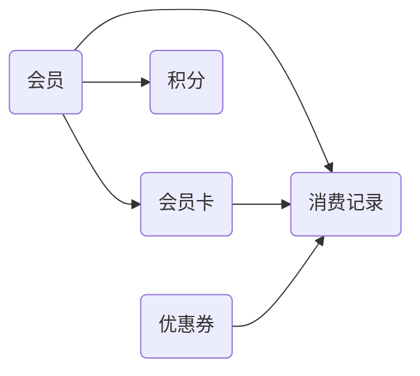
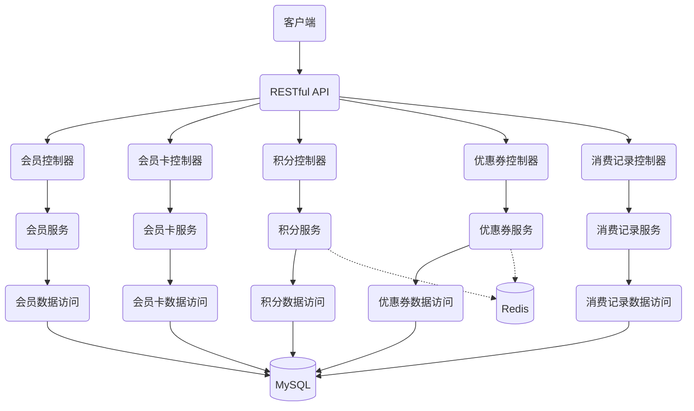
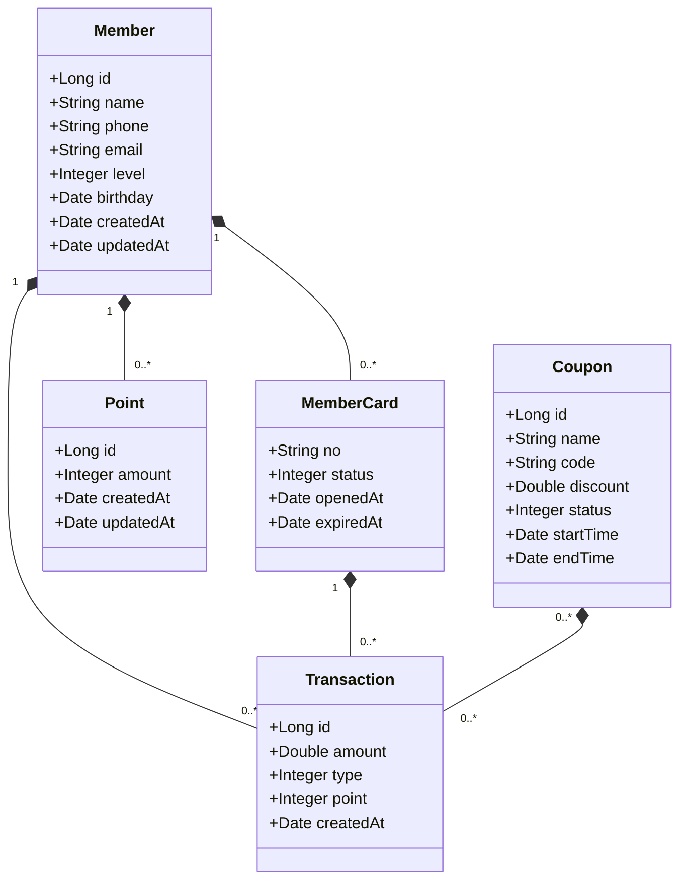

# 会员卡管理系统详细设计与具体代码实现

作者：禅与计算机程序设计艺术

## 1. 背景介绍
### 1.1 会员卡管理系统的重要性
在现代商业环境中,会员卡管理系统扮演着至关重要的角色。一个高效、可靠的会员卡管理系统不仅可以提高企业的运营效率,还能增强客户忠诚度,为企业创造更多价值。

### 1.2 会员卡管理系统的主要功能
一个完善的会员卡管理系统通常包括以下主要功能:
- 会员信息管理:包括会员注册、信息修改、会员等级管理等
- 积分管理:会员消费积分的累积与兑换
- 优惠券管理:发放和使用优惠券
- 消费记录管理:记录和查询会员的消费历史
- 数据统计与分析:对会员数据进行统计分析,为经营决策提供依据

### 1.3 系统设计的目标
本文旨在详细阐述会员卡管理系统的设计思路与实现方法,力求达到以下目标:
1. 系统架构清晰合理,易于维护和扩展
2. 功能完善,满足会员管理的各项需求
3. 性能优异,确保系统高效稳定运行
4. 代码规范,提高开发效率和代码质量

## 2. 核心概念与关联
### 2.1 会员 Member
会员是系统的核心实体,包含会员的基本信息如姓名、联系方式、会员等级等。每个会员拥有唯一的会员卡号。

### 2.2 会员卡 MemberCard
会员卡是会员身份的载体,包含卡号、卡状态(正常/挂失/注销)、开卡时间、截止日期等信息。一个会员可能拥有多张会员卡。

### 2.3 积分 Point
积分是会员消费的奖励,与会员账户关联。积分可以通过消费累积,也可以兑换礼品或优惠。

### 2.4 优惠券 Coupon
优惠券是一种营销手段,包含优惠金额/折扣、使用条件、有效期等属性。优惠券可以发放给特定或全部会员。

### 2.5 消费记录 Transaction
消费记录包含每一笔会员消费的时间、金额、获得积分、使用优惠等信息,与会员账户关联。

### 2.6 实体关系图
下面是会员卡管理系统的核心实体及其关系的示意图:



## 3. 系统架构设计
### 3.1 架构选型
本系统采用经典的三层架构:表现层、业务逻辑层、数据访问层。
- 表现层:负责接收客户端请求,调用业务逻辑层的服务,返回处理结果。本系统使用 RESTful API 提供服务。
- 业务逻辑层:负责实现系统的核心业务逻辑,如会员注册、积分累积、优惠券发放等。
- 数据访问层:负责与数据库交互,执行数据的增删改查操作。本系统使用 ORM 框架简化数据库操作。

### 3.2 技术选型
- 编程语言:Java
- Web框架:Spring Boot
- 数据访问:Spring Data JPA
- 数据库:MySQL
- 缓存:Redis
- 安全框架:Spring Security
- API文档:Swagger

### 3.3 系统架构图



## 4. 数据库设计
### 4.1 概念模型
根据系统的核心概念,设计概念模型如下:



### 4.2 物理模型
根据概念模型,设计物理数据表如下:

```sql
CREATE TABLE `member` (
  `id` bigint(20) NOT NULL AUTO_INCREMENT,
  `name` varchar(50) NOT NULL,
  `phone` varchar(20) DEFAULT NULL,
  `email` varchar(100) DEFAULT NULL,
  `level` int(11) NOT NULL DEFAULT '1',
  `birthday` date DEFAULT NULL,
  `created_at` datetime NOT NULL,
  `updated_at` datetime NOT NULL,
  PRIMARY KEY (`id`),
  UNIQUE KEY `uk_phone` (`phone`)
) ENGINE=InnoDB DEFAULT CHARSET=utf8;

CREATE TABLE `member_card` (
  `no` varchar(20) NOT NULL,
  `member_id` bigint(20) NOT NULL,
  `status` int(11) NOT NULL DEFAULT '1',
  `opened_at` datetime NOT NULL,
  `expired_at` datetime DEFAULT NULL,
  PRIMARY KEY (`no`),
  KEY `idx_member_id` (`member_id`)
) ENGINE=InnoDB DEFAULT CHARSET=utf8;

CREATE TABLE `point` (
  `id` bigint(20) NOT NULL AUTO_INCREMENT,
  `member_id` bigint(20) NOT NULL,
  `amount` int(11) NOT NULL,
  `created_at` datetime NOT NULL,
  `updated_at` datetime NOT NULL,
  PRIMARY KEY (`id`),
  KEY `idx_member_id` (`member_id`)
) ENGINE=InnoDB DEFAULT CHARSET=utf8;

CREATE TABLE `coupon` (
  `id` bigint(20) NOT NULL AUTO_INCREMENT,
  `name` varchar(50) NOT NULL,
  `code` varchar(20) NOT NULL,
  `discount` double(5,2) NOT NULL,
  `status` int(11) NOT NULL DEFAULT '1',
  `start_time` datetime NOT NULL,
  `end_time` datetime NOT NULL,
  PRIMARY KEY (`id`),
  UNIQUE KEY `uk_code` (`code`)
) ENGINE=InnoDB DEFAULT CHARSET=utf8;

CREATE TABLE `transaction` (
  `id` bigint(20) NOT NULL AUTO_INCREMENT,
  `member_id` bigint(20) NOT NULL,
  `card_no` varchar(20) NOT NULL,
  `coupon_id` bigint(20) DEFAULT NULL,
  `amount` double(10,2) NOT NULL,
  `type` int(11) NOT NULL,
  `point` int(11) NOT NULL DEFAULT '0',
  `created_at` datetime NOT NULL,
  PRIMARY KEY (`id`),
  KEY `idx_member_id` (`member_id`),
  KEY `idx_card_no` (`card_no`),
  KEY `idx_coupon_id` (`coupon_id`)
) ENGINE=InnoDB DEFAULT CHARSET=utf8;
```

## 5. 核心业务实现
### 5.1 会员管理
#### 5.1.1 会员注册
- 接口定义
```java
@PostMapping("/members")
public Member addMember(@RequestBody Member member) {
    return memberService.addMember(member);
}
```
- 业务逻辑
```java
@Service
public class MemberService {
    
    @Autowired
    private MemberDao memberDao;
    
    @Transactional
    public Member addMember(Member member) {
        // 检查手机号是否已注册
        if (memberDao.findByPhone(member.getPhone()) != null) {
            throw new RuntimeException("手机号已注册");
        }
        
        // 设置默认会员等级
        member.setLevel(1);
        
        // 设置注册时间
        member.setCreatedAt(new Date());
        member.setUpdatedAt(new Date());
        
        // 保存会员信息
        return memberDao.save(member);
    }
}
```

#### 5.1.2 会员信息修改
- 接口定义
```java
@PutMapping("/members/{id}")
public Member updateMember(@PathVariable Long id, @RequestBody Member member) {
    return memberService.updateMember(id, member);
}
```
- 业务逻辑
```java
@Service
public class MemberService {
    
    @Autowired
    private MemberDao memberDao;
    
    @Transactional
    public Member updateMember(Long id, Member member) {
        // 检查会员是否存在
        Member existingMember = memberDao.findById(id).orElse(null);
        if (existingMember == null) {
            throw new RuntimeException("会员不存在");
        }
        
        // 更新会员信息
        BeanUtils.copyProperties(member, existingMember, "id", "createdAt");
        existingMember.setUpdatedAt(new Date());
        
        // 保存修改
        return memberDao.save(existingMember);
    }
}
```

### 5.2 积分管理
#### 5.2.1 积分累积
- 接口定义
```java
@PostMapping("/points")
public void addPoint(@RequestBody PointVO pointVO) {
    pointService.addPoint(pointVO);
}
```
- 业务逻辑
```java
@Service
public class PointService {
    
    @Autowired
    private PointDao pointDao;
    
    @Autowired
    private RedisTemplate redisTemplate;
    
    private static final String POINT_KEY = "point:memberId:";
    
    @Transactional
    public void addPoint(PointVO pointVO) {
        // 保存积分记录
        Point point = new Point();
        point.setMemberId(pointVO.getMemberId());
        point.setAmount(pointVO.getAmount());
        point.setCreatedAt(new Date());
        point.setUpdatedAt(new Date());
        pointDao.save(point);
        
        // 更新缓存中的积分总额
        String key = POINT_KEY + pointVO.getMemberId();
        redisTemplate.opsForValue().increment(key, pointVO.getAmount());
    }
}
```

#### 5.2.2 积分查询
- 接口定义
```java
@GetMapping("/members/{id}/points")
public Integer getPoint(@PathVariable Long id) {
    return pointService.getPoint(id);
}
```
- 业务逻辑
```java
@Service
public class PointService {
    
    @Autowired
    private RedisTemplate redisTemplate;
    
    private static final String POINT_KEY = "point:memberId:";
    
    public Integer getPoint(Long memberId) {
        // 从缓存中获取积分总额
        String key = POINT_KEY + memberId;
        Integer point = (Integer)redisTemplate.opsForValue().get(key);
        
        // 缓存未命中则查询数据库
        if (point == null) {
            point = pointDao.sumPointByMemberId(memberId);
            redisTemplate.opsForValue().set(key, point);
        }
        
        return point;
    }
}
```

### 5.3 优惠券管理 
#### 5.3.1 发放优惠券
- 接口定义
```java
@PostMapping("/coupons/{code}/assign")
public void assignCoupon(@PathVariable String code, @RequestBody CouponAssignVO assignVO) {
    couponService.assignCoupon(code, assignVO);
}
```
- 业务逻辑
```java
@Service
public class CouponService {
    
    @Autowired
    private CouponDao couponDao;
    
    @Autowired
    private RedisTemplate redisTemplate;
    
    private static final String COUPON_MEMBER_KEY = "coupon:code:memberId:";
    
    @Transactional
    public void assignCoupon(String code, CouponAssignVO assignVO) {
        // 检查优惠券是否存在
        Coupon coupon = couponDao.findByCode(code);
        if (coupon == null) {
            throw new RuntimeException("优惠券不存在");
        }
        
        // 检查优惠券是否在有效期内
        Date now = new Date();
        if (now.before(coupon.getStartTime()) || now.after(coupon.getEndTime())) {
            throw new RuntimeException("优惠券不在