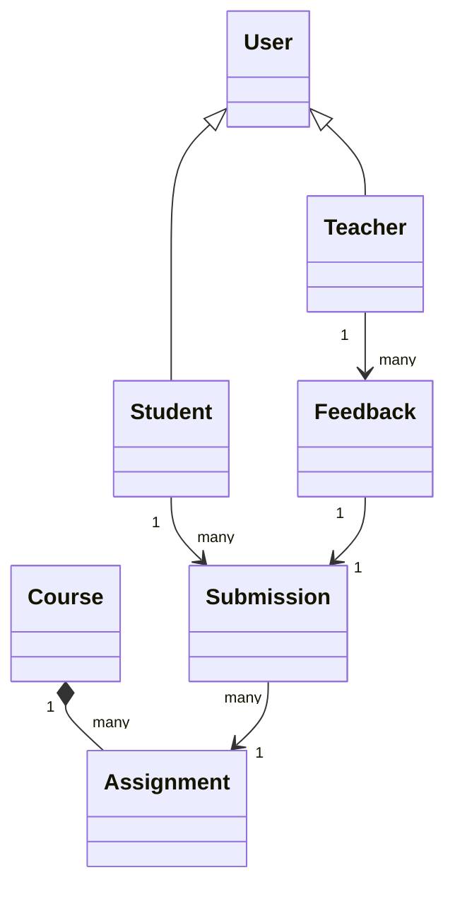

# 作业提交与批改系统详细设计与具体代码实现

作者：禅与计算机程序设计艺术

## 1. 背景介绍

### 1.1 作业提交与批改的重要性

在教育领域,尤其是高等教育中,作业是教学过程中不可或缺的一部分。通过布置和完成作业,教师可以检验学生对知识的掌握程度,学生也可以巩固所学知识,提高实践能力。然而,传统的作业提交和批改方式存在诸多不足,如效率低下、易出错、反馈不及时等。因此,开发一个高效、准确、便捷的作业提交与批改系统显得尤为重要。

### 1.2 系统开发的目标

本文旨在设计并实现一个基于Web的作业提交与批改系统。该系统应具备以下功能:

- 学生可以在线提交作业,支持多种格式的文件上传。
- 教师可以在线批改作业,并给出评语和成绩。
- 系统自动记录提交和批改的时间,便于管理和追踪。 
- 学生可以查看自己的作业批改结果和成绩。
- 教师可以统计和分析全班的作业完成情况。

除了功能性需求,该系统还应满足性能、安全、可用性、可维护性等非功能性需求。

## 2. 核心概念与联系

### 2.1 领域模型

在作业提交与批改系统中,涉及到以下几个核心概念:

- User:系统用户,可以是Student或Teacher。
- Student:学生,可以提交作业。
- Teacher:教师,可以布置和批改作业。
- Course:课程,与作业关联。
- Assignment:作业,包括作业要求、截止时间等信息。
- Submission:学生提交的作业,包括提交时间、作业文件等。
- Feedback:教师对作业的评语和成绩。

这些概念之间的关系如下图所示:



### 2.2 业务流程

作业提交与批改的业务流程可以概括为以下步骤:

1. 教师在系统中创建课程,并布置作业,设定截止时间。
2. 学生在截止时间前完成作业,并通过系统提交。
3. 教师在系统中查看学生提交的作业,进行在线批改,给出评语和成绩。
4. 学生登录系统查看自己的作业批改结果。
5. 教师可以查看和导出全班作业的统计数据。

## 3. 核心算法原理与具体操作步骤

### 3.1 文件上传与存储

学生提交作业时,需要上传作业文件。系统采用如下步骤处理文件上传:

1. 学生选择要上传的文件,点击提交按钮。
2. 前端使用FormData对象封装文件数据,通过POST请求发送到服务端。
3. 服务端接收到请求后,从请求体中提取文件数据。
4. 生成唯一的文件名,避免重名冲突。
5. 将文件保存到指定的上传目录。
6. 将文件信息(如文件名、大小、类型等)保存到数据库,与提交记录关联。

文件存储可以使用服务器本地文件系统,也可以使用云存储服务如Amazon S3、阿里云OSS等。

### 3.2 作业批改与成绩计算

教师在线批改作业时,可以参考以下步骤:

1. 教师打开学生提交的作业文件。
2. 在线查看作业内容,给出评语。可以使用富文本编辑器,支持常见的格式和样式。
3. 输入作业成绩。成绩可以是数字或等级。
4. 提交评语和成绩。系统自动记录批改时间。
5. 系统根据预设的成绩计算规则,自动计算学生的总成绩。常见的计算规则有:
   - 加权平均:每项作业的成绩乘以权重,再求和。
   - 去掉最高最低:去掉一个最高分和一个最低分,对剩余成绩求平均。
   - 阶梯计分:根据分数段设置不同的等级。

成绩计算的具体算法取决于教师的设置。系统应提供灵活的配置选项。

## 4. 数学模型和公式详解

在作业批改过程中,可能涉及到一些数学模型和公式。例如,加权平均成绩的计算公式为:

$$
\bar{x} = \frac{\sum_{i=1}^n w_i x_i}{\sum_{i=1}^n w_i}
$$

其中,$\bar{x}$表示加权平均成绩,$x_i$表示第$i$项作业的成绩,$w_i$表示第$i$项作业的权重,$n$表示作业总数。

再如,可以使用z-score标准化成绩,使不同作业的成绩具有可比性。z-score的计算公式为:

$$
z_i = \frac{x_i - \mu}{\sigma}
$$

其中,$z_i$表示第$i$项作业的标准化成绩,$x_i$表示原始成绩,$\mu$表示成绩的平均值,$\sigma$表示成绩的标准差。

## 5. 项目实践:代码实例与详解

下面通过几个代码实例,演示如何实现作业提交与批改系统的核心功能。

### 5.1 文件上传

前端使用FormData对象封装文件数据:

```javascript
// 获取文件输入框
const fileInput = document.getElementById('fileInput');
// 监听文件选择事件
fileInput.addEventListener('change', function() {
  // 获取选中的文件
  const file = this.files[0];
  // 创建FormData对象
  const formData = new FormData();
  // 添加文件到FormData
  formData.append('assignment', file);
  // 发送POST请求上传文件
  fetch('/upload', {
    method: 'POST',
    body: formData
  })
  .then(res => res.json())
  .then(data => {
    console.log('上传成功:', data);
  })
  .catch(err => {
    console.error('上传失败:', err);
  });
});
```

服务端接收上传的文件并保存:

```javascript
const express = require('express');
const multer  = require('multer');
const path = require('path');

const app = express();

// 配置multer中间件
const storage = multer.diskStorage({
  destination: function (req, file, cb) {
    cb(null, 'uploads/'); // 上传目录
  },
  filename: function (req, file, cb) {
    // 生成唯一文件名
    cb(null, Date.now() + path.extname(file.originalname)); 
  }
});
const upload = multer({ storage: storage });

// 处理文件上传请求
app.post('/upload', upload.single('assignment'), (req, res) => {
  console.log('收到上传文件:', req.file);
  // TODO: 保存文件信息到数据库
  res.json({ message: '上传成功' });
});
```

### 5.2 在线批改

教师批改作业时,可以使用富文本编辑器输入评语。以下是一个基于Quill编辑器的示例:

```html
<!-- 富文本编辑器容器 -->
<div id="editor"></div>
<!-- 提交按钮 -->
<button id="submitBtn">提交评语</button>

<script src="https://cdn.quilljs.com/1.3.6/quill.js"></script>
<script>
  // 初始化编辑器
  const editor = new Quill('#editor', {
    theme: 'snow'
  });

  // 监听提交事件
  document.getElementById('submitBtn').addEventListener('click', function() {
    // 获取编辑器内容
    const feedback = editor.root.innerHTML;
    // TODO: 将评语与成绩发送到服务端保存
    console.log('评语:', feedback);
  });
</script>
```

服务端接收评语与成绩,并更新数据库:

```javascript
app.post('/feedback', (req, res) => {
  const { submissionId, feedback, score } = req.body;
  // TODO: 更新数据库中的提交记录
  db.submissions.update(
    { _id: submissionId }, 
    { $set: { feedback, score, gradedAt: new Date() } }
  )
  .then(() => {
    res.json({ message: '批改成功' });
  })
  .catch(err => {
    console.error('批改失败:', err);
    res.status(500).json({ message: '批改失败' });
  });
});
```

### 5.3 成绩统计

教师可以查看全班作业的统计数据,如提交率、平均分等。以下是一个使用ECharts生成统计图表的示例:

```html
<!-- 图表容器 -->
<div id="chart" style="width: 600px;height:400px;"></div>

<script src="https://cdn.jsdelivr.net/npm/echarts@5.1.2/dist/echarts.min.js"></script>
<script>
  // 初始化图表
  const chart = echarts.init(document.getElementById('chart'));

  // TODO: 从服务端获取统计数据
  const data = [
    { name: '作业1', submitted: 40, total: 50, averageScore: 85 },
    { name: '作业2', submitted: 35, total: 50, averageScore: 78 },
    { name: '作业3', submitted: 42, total: 50, averageScore: 90 },
  ];

  // 配置图表选项
  const option = {
    title: {
      text: '作业统计'
    },
    tooltip: {},
    xAxis: {
      data: data.map(item => item.name)
    },
    yAxis: {},
    series: [
      {
        name: '提交人数',
        type: 'bar',
        data: data.map(item => item.submitted)
      },
      {
        name: '应交人数',
        type: 'bar',
        data: data.map(item => item.total)
      },
      {
        name: '平均分',
        type: 'line',
        yAxisIndex: 1,
        data: data.map(item => item.averageScore)
      }
    ]
  };

  // 渲染图表
  chart.setOption(option);
</script>
```

服务端查询数据库,返回统计结果:

```javascript
app.get('/stats', (req, res) => {
  // TODO: 查询数据库,统计作业数据
  db.submissions.aggregate([
    { $group: { 
      _id: '$assignmentId', 
      submitted: { $sum: 1 },
      averageScore: { $avg: '$score' }
    }}
  ])
  .then(results => {
    // TODO: 补充应交人数
    const data = results.map(item => ({
      name: item._id,
      submitted: item.submitted,
      total: 50, // 假设每项作业应交人数为50
      averageScore: item.averageScore
    }));
    res.json(data);
  })
  .catch(err => {
    console.error('查询失败:', err);
    res.status(500).json({ message: '查询失败' });
  });
});
```

## 6. 实际应用场景

作业提交与批改系统可应用于各级各类教育机构,如中小学、大学、在线教育平台等。任课教师可以通过系统布置作业,学生在线提交,教师在线批改并给出反馈,显著提高了作业管理的效率。同时,系统自动记录作业数据,便于教师掌握教学效果,调整教学策略。

一些在线教育平台如Coursera、Udacity等,都内置了类似的作业提交与批改功能,为教师和学生提供了便利。

除了教育领域,该系统的设计思路也可以延伸到其他需要提交和审核的场景,如:

- 企业内部的任务管理系统。员工提交任务成果,上级审核并评分。
- 征文、比赛等活动的投稿系统。参赛者提交作品,评委在线评审打分。
- 学术期刊、会议的论文投稿系统。作者提交论文,审稿人在线审稿。

总之,只要涉及到"提交-审核-反馈"的业务流程,都可以参考本文的系统设计方案。

## 7. 工具与资源推荐

在开发作业提交与批改系统时,可以使用以下工具和资源:

- 前端框架:Vue.js、React、Angular等,提供了组件化开发、数据绑定等便利。
- UI组件库:Element UI、Ant Design等,提供了丰富的UI组件,可快速搭建页面。
- Web服务器:Nginx、Apache等,提供静态资源托管、请求转发等功能。
- 应用服务器:Node.js、Spring Boot等,提供接口服务、业务逻辑处理等功能。
- 数据库:MongoDB、MySQL等,存储系统数据,提供数据持久化。
- 对象存储:Amazon S3、阿里云OSS等,存储用户上传的文件。
- 第三方