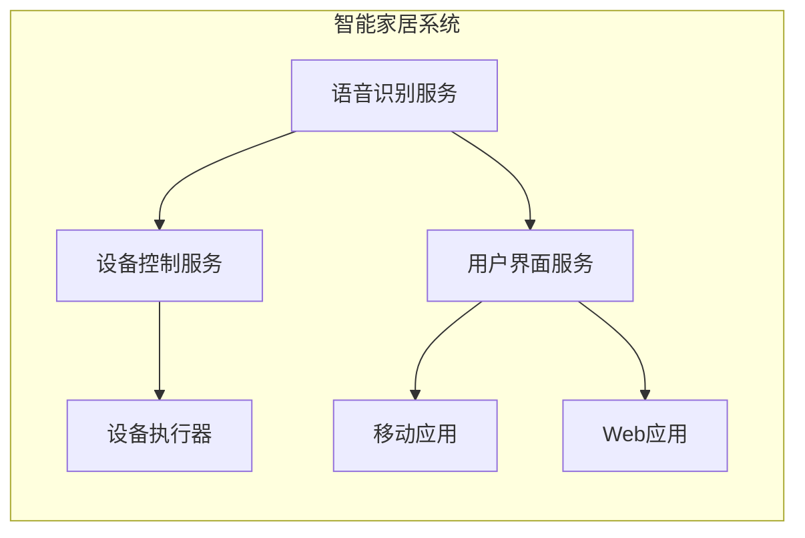

# 创新思维:推动IT团队持续进步和创新

## 1.背景介绍

### 1.1 为什么需要创新思维?

在当今瞬息万变的数字时代,创新思维对于IT团队的发展至关重要。技术的快速迭代和用户需求的不断变化,要求IT团队必须具备持续创新的能力,以保持竞争力并满足不断变化的需求。

创新思维不仅可以帮助IT团队开发出创新的产品和服务,还能促进团队内部的协作、沟通和问题解决能力的提高。具有创新思维的团队更加灵活、高效,能够快速适应变化,并抓住新的机遇。

### 1.2 传统思维模式的局限性

许多IT团队仍然停留在传统的思维模式中,这种模式往往过于僵化,难以应对日新月异的技术变革。传统思维模式存在以下局限性:

- 过度关注现有解决方案,忽视新兴技术
- 缺乏创新激励机制,员工创新意愿不高
- 决策过程缓慢,无法快速响应市场变化
- 组织层级森严,沟通效率低下

这些局限性阻碍了IT团队的创新发展,因此有必要培养创新思维,打破传统思维的束缚。

## 2.核心概念与联系

### 2.1 什么是创新思维?

创新思维是一种以开放、好奇和批判性思维为核心的思维模式。它鼓励我们挑战现有的做事方式,寻求新的解决方案和机遇。创新思维包括以下几个关键要素:

- 开放思维:保持开放和包容的心态,乐于接受新想法
- 好奇心:对未知事物怀有强烈的好奇心,勇于探索
- 批判性思维:能够客观地评估想法,辨别优劣
- 创造力:将已有的想法以新的方式重新组合
- 实践精神:将想法付诸实践,并不断改进

### 2.2 创新思维与IT团队的关系

创新思维对于IT团队的发展至关重要,因为IT行业本身就处于不断变化的状态。拥有创新思维的IT团队能够:

- 洞察技术趋势,抓住新机遇
- 开发出创新的产品和服务,满足用户需求
- 提高工作效率,优化流程
- 培养学习氛围,促进团队成长

创新思维贯穿于IT团队的方方面面,从需求分析到架构设计,从编码实现到测试部署,无处不需要创新的思路。

### 2.3 创新思维的驱动力

培养创新思维需要来自多方面的驱动力,包括:

- 领导层的支持:领导层应当重视创新文化的建设,为员工创造有利环境
- 激励机制:建立合理的激励机制,鼓励员工大胆创新
- 学习氛围:营造良好的学习氛围,鼓励员工持续学习新知识
- 多元融合:吸纳不同背景的人才,促进思维碰撞

只有综合运用多种驱动力,才能真正培养出创新思维,推动IT团队的持续进步。

## 3.核心算法原理具体操作步骤

虽然创新思维看似抽象,但它也有一些具体的操作步骤和技巧,可以帮助IT团队更好地培养和践行创新思维。

### 3.1 发散性思维训练

发散性思维是创新思维的重要组成部分,它鼓励我们从多个角度思考问题,产生丰富多样的想法。以下是一些发散性思维训练的技巧:

1. **头脑风暴**:团队成员集思广益,自由地提出各种想法,不加评论或批判。
2. **逆向思维**:反过来思考问题,寻找新的解决方案。
3. **类比思维**:将问题与其他领域进行类比,借鉴不同领域的解决方案。
4. **随机入门**:从一个随机的起点出发,发散思维,探索新的可能性。

### 3.2 设计思维方法

设计思维是一种以用户为中心的创新方法,它强调通过同理心、协作和快速迭代来解决问题。以下是设计思维的核心步骤:

1. **同理心**:深入了解用户的需求和痛点。
2. **定义问题**:根据用户需求,准确定义需要解决的问题。
3. **头脑风暴**:团队成员集思广益,提出各种解决方案。
4. **原型制作**:快速制作低成本原型,验证想法的可行性。
5. **测试与迭代**:让用户测试原型,收集反馈,并不断改进。

设计思维方法可以帮助IT团队更好地理解用户需求,并快速验证和优化创新想法。

### 3.3 反思与改进

创新是一个不断反思和改进的过程。IT团队应当养成反思的习惯,定期回顾项目经验,总结教训,并持续改进流程和方法。以下是一些反思和改进的技巧:

1. **回顾会议**:团队成员集中讨论项目经验,分享心得体会。
2. **反思日志**:鼓励团队成员记录个人反思,形成反思日志。
3. **改进计划**:根据反思结果,制定具体的改进计划。
4. **持续改进**:将改进计划付诸实践,并不断优化。

通过反思和改进,IT团队可以不断提高创新能力,避免重蹈覆辙。

## 4.数学模型和公式详细讲解举例说明

虽然创新思维看似与数学公式无关,但事实上,一些数学模型和公式可以帮助我们更好地理解和培养创新思维。

### 4.1 创新扩散模型

创新扩散模型(Innovation Diffusion Model)描述了创新在社会系统中传播和被采纳的过程。该模型由埃弗里特·罗杰斯(Everett Rogers)于1962年提出,广泛应用于市场营销、科技传播等领域。

该模型将采纳者分为五类:创新者(Innovators)、早期采纳者(Early Adopters)、早期大多数(Early Majority)、晚期大多数(Late Majority)和落伍者(Laggards)。每一类采纳者的比例可以用正态分布曲线来近似描述,如下所示:

$$
f(x) = \frac{1}{\sigma \sqrt{2\pi}} e^{-(x-\mu)^2/2\sigma^2}
$$

其中,$\mu$表示平均值,$\sigma$表示标准差。

这个模型对于IT团队来说有两个重要启示:

1. 创新者和早期采纳者是推动创新发展的关键力量,IT团队应当重视这两类人员的作用。
2. 晚期大多数和落伍者往往抵制变革,IT团队需要采取有效措施来说服和引导他们。

### 4.2 创新扩散速率模型

创新扩散速率模型(Innovation Diffusion Rate Model)描述了创新在社会系统中被采纳的速率。该模型由法国社会学家加布里埃尔·塔尔德(Gabriel Tarde)于19世纪末提出,被广泛应用于预测技术发展趋势。

该模型的核心公式如下:

$$
\frac{df(t)}{dt} = \alpha f(t) + \beta(1-f(t))f(t)
$$

其中,$f(t)$表示在时间$t$时被采纳的比例,$\alpha$表示外部影响系数,$\beta$表示内部影响系数。

这个模型对于IT团队来说有两个重要启示:

1. 外部影响(如市场营销)和内部影响(如口碑传播)都会影响创新的采纳速率,IT团队需要重视这两方面的作用。
2. 通过调整$\alpha$和$\beta$的值,可以预测和控制创新的采纳速率,从而制定更好的发展策略。

### 4.3 创新生命周期模型

创新生命周期模型(Innovation Life Cycle Model)描述了创新从出现到被广泛采纳的整个过程。该模型由波士顿咨询公司(Boston Consulting Group)于20世纪70年代提出,被广泛应用于产品策略和技术路线图的制定。

该模型将创新的生命周期分为四个阶段:导入期(Introduction)、成长期(Growth)、成熟期(Maturity)和衰退期(Decline)。每个阶段的特征如下:

1. 导入期:创新刚刚出现,采纳率较低,需要大量投入进行推广。
2. 成长期:创新开始被广泛采纳,采纳率快速上升,市场份额不断扩大。
3. 成熟期:创新已经被大多数人采纳,采纳率趋于稳定,市场竞争加剧。
4. 衰退期:新的创新出现,旧的创新开始被淘汰,采纳率下降。

这个模型对于IT团队来说有两个重要启示:

1. 不同阶段需要采取不同的策略,如导入期应重点推广,成熟期应注重差异化。
2. 要及时预判创新所处的阶段,做好应对准备,避免被新的创新所取代。

通过学习和应用这些数学模型,IT团队可以更好地理解创新的发展规律,制定符合实际情况的创新策略。

## 5.项目实践:代码实例和详细解释说明

为了更好地理解和实践创新思维,我们可以通过一个具体的项目案例来进行说明。这个项目旨在开发一款智能家居系统,可以通过语音控制家中的各种设备。

### 5.1 需求分析

在需求分析阶段,我们采用了设计思维方法,深入了解用户的需求和痛点。通过用户访谈和观察,我们发现许多用户对传统的家居控制系统感到困惑和不便,因为需要记住大量的操作命令和按键组合。

因此,我们决定开发一款基于语音控制的智能家居系统,让用户可以通过简单的语音命令来控制家中的设备,大大提高了使用便利性。

### 5.2 系统架构

在系统架构设计阶段,我们采用了发散性思维训练,从多个角度思考系统的构建方式。最终,我们选择了一种微服务架构,将系统划分为多个独立的服务,如语音识别服务、设备控制服务、用户界面服务等。

这种架构具有很好的灵活性和可扩展性,各个服务可以独立开发和部署,方便进行迭代和升级。同时,微服务架构也有利于团队协作,不同的小组可以专注于不同的服务模块。

下面是系统架构的示意图:



### 5.3 语音识别模块

语音识别模块是整个系统的核心部分,它负责将用户的语音输入转换为可执行的命令。我们采用了基于深度学习的语音识别算法,具体步骤如下:

1. **语音预处理**:对原始语音数据进行预处理,如去噪、端点检测等。
2. **特征提取**:从语音数据中提取特征向量,如MFCC(Mel频率倒谱系数)等。
3. **声学模型**:使用深度神经网络(如RNN、LSTM等)训练声学模型,将特征向量映射为语音单元序列。
4. **语言模型**:使用N-gram或神经网络语言模型,对语音单元序列进行解码,得到最终的文本输出。

下面是一段Python代码示例,展示了如何使用Keras框架构建一个简单的LSTM语音识别模型:

```python
from keras.models import Sequential
from keras.layers import LSTM, Dense

# 定义模型
model = Sequential()
model.add(LSTM(128, input_shape=(max_len, feature_dim)))
model.add(Dense(num_labels, activation='softmax'))

# 编译模型
model.compile(loss='categorical_crossentropy', optimizer='adam', metrics=['accuracy'])

# 训练模型
model.fit(X_train, y_train, batch_size=32, epochs=10, validation_data=(X_val, y_val))
```

在这个示例中,我们使用了一个单层LSTM网络,输入是一个长度为`max_len`的特征向量序列,输出是一个长度为`