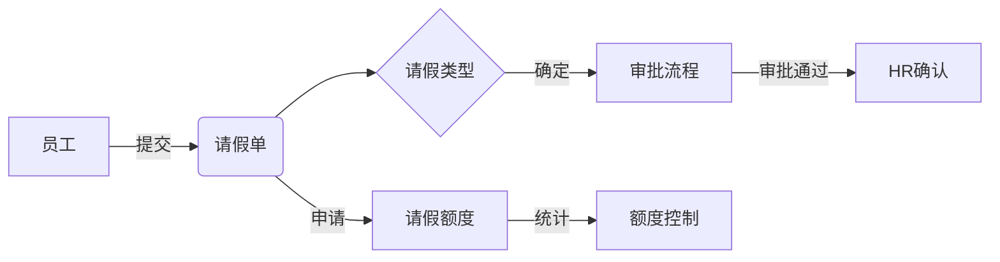

# 员工请假管理系统详细设计与具体代码实现

作者：禅与计算机程序设计艺术

## 1.背景介绍
### 1.1 员工请假管理系统的重要性
在现代企业管理中,员工请假管理是一项非常重要但又容易被忽视的工作。一个高效、规范、自动化的员工请假管理系统可以极大地提高HR部门的工作效率,减少手工处理的错误率,同时也能提升员工的满意度和归属感。
### 1.2 传统员工请假管理方式的弊端
传统的员工请假管理通常采用纸质表单或Excel等方式进行登记和审批,存在以下问题:

1. 效率低下:员工填写请假单,逐级审批签字,HR手工登记,流程冗长。
2. 数据不一致:纸质单据易丢失,不同部门各自登记,数据分散不统一。
3. 无法实时统计:请假数据无法实时汇总统计分析,只能定期手工统计。
4. 公平性难监管:审批标准人为影响大,不同员工待遇不一致。

因此,开发一套功能完善、操作便捷、统计准确的员工请假管理系统非常有必要。

### 1.3 员工请假管理系统的目标
员工请假管理系统需要达成以下目标:

1. 规范流程:统一请假审批流程,杜绝特殊化处理。
2. 提高效率:网上提交申请,系统自动审批,无纸化办公。
3. 数据统一:请假数据集中存储,消除数据孤岛,保证一致性。
4. 实时统计:自动汇总统计请假数据,为管理决策提供依据。
5. 公平透明:请假审批依据制度规则,杜绝人为因素干扰。

## 2.核心概念与关联
员工请假管理系统涉及以下几个核心概念:

- 员工:提交请假申请的主体。包括员工基本信息、所属部门等。
- 请假类型:如事假、病假、婚假、产假、丧假、公休等,每种类型的天数限制、审批人不同。
- 请假单:包含请假类型、开始结束时间、请假事由、审批人、状态等信息。
- 审批流程:请假单的审批流程,如员工提交 -> 直接主管审批 -> 部门总监审批 -> HR确认等。
- 请假额度:员工在一定周期内可请假的天数上限,如年假、事假等,需要额度控制。

这些概念间的关系如下:



## 3.核心算法原理与操作步骤
员工请假管理系统的核心算法可以概括为:

1. 请假额度计算
2. 请假单审批流程控制
3. 请假数据统计分析

下面详细说明每个算法的原理和实现步骤。

### 3.1 请假额度计算
每个员工在一定周期内(如每年)可请假的天数是有限的,需要对不同假期类型设置额度上限,额度用完则不允许再请假。

请假额度计算的步骤如下:

1. 设置每个员工的年度总额度,如年假10天、事假3天、病假5天等。
2. 员工提交请假申请时,判断该请假类型是否需要额度控制。
3. 如需控制,则计算该员工该类型已请假天数,与额度上限比较。
4. 如已请假天数+本次申请天数超过额度,则不允许提交,并提示额度不足。
5. 请假结束后,从额度中扣除实际请假天数,更新剩余额度。

额度计算的伪代码如下:

```python
def check_quota(employee, leave_type, days):
    quota = get_quota(employee, leave_type)
    used_days = get_used_days(employee, leave_type)
    if used_days + days > quota:
        return False
    else:
        return True

def deduct_quota(employee, leave_type, days):
    used_days = get_used_days(employee, leave_type)
    set_used_days(employee, leave_type, used_days + days)
```

### 3.2 请假审批流程控制
请假单从提交到批准结束,需要经过多个审批节点,每个节点可指定一个或多个审批人。整个审批流程可配置。

请假审批流程控制的步骤如下:

1. 根据请假单的假期类型、天数、员工级别等,匹配对应的审批流程。
2. 请假单的状态设置为"待审批",推送给流程中的第一个审批节点。
3. 审批人对请假单进行审批,可选择"同意"、"拒绝"或"转审"。
4. 如选择"同意",则推进到下一个审批节点;如选择"拒绝",则流程终止。
5. 当所有审批节点都同意后,请假单状态变更为"已批准",并通知申请人。
6. 如审批节点超时未处理,系统自动提醒,或转交上级审批人。

审批流程控制可以用有限状态机来实现,伪代码如下:

```python
class LeaveForm:
    def __init__(self, employee, leave_type, start_date, end_date):
        self.employee = employee
        self.leave_type = leave_type
        self.start_date = start_date
        self.end_date = end_date
        self.status = 'PENDING'
        self.approvers = get_approvers(employee, leave_type)
        self.current_approver = self.approvers[0]

    def approve(self, approver):
        if approver != self.current_approver:
            return False
        self.current_approver = next_approver(self.approvers)
        if not self.current_approver:
            self.status = 'APPROVED'
        return True

    def reject(self, approver):
        if approver != self.current_approver:
            return False
        self.status = 'REJECTED'
        return True
```

### 3.3 请假数据统计分析
请假数据是非常有价值的人力资源数据,通过统计分析可以发现问题,优化管理。

请假数据统计分析的步骤如下:

1. 设计统计维度和指标,如按员工、部门、假期类型统计请假次数和天数等。
2. 从请假单数据库中,根据统计周期(如月度、季度、年度)提取原始数据。
3. 对原始数据进行清洗和预处理,剔除异常数据。
4. 根据统计口径,采用SQL语句或程序代码,对数据进行聚合计算。
5. 将统计结果以报表、图表等形式进行可视化展示。
6. 定期进行统计分析,形成常规HR管理报告,发现异常请假情况。

常见的请假数据统计指标有:

- 每个员工的请假次数、天数
- 每个部门的请假率、平均请假天数
- 全公司的请假率变化趋势
- 不同假期类型的请假占比
- 请假高发的时间段(如节假日前后)

统计分析的代码示例如下:

```sql
-- 按部门统计年度请假天数
SELECT 
    d.name AS department,
    SUM(DATEDIFF(l.end_date, l.start_date) + 1) AS leave_days
FROM 
    leave_form l
    JOIN employee e ON l.employee_id = e.id
    JOIN department d ON e.department_id = d.id
WHERE 
    l.status = 'APPROVED' 
    AND l.start_date >= '2022-01-01' 
    AND l.end_date < '2023-01-01'
GROUP BY 
    d.name;
```

## 4.数学模型与公式讲解
员工请假管理系统中,有一些地方可以用到数学模型和公式,主要有:

### 4.1 请假额度模型
前面提到,员工的请假额度控制需要设置不同假期类型的额度上限。这里我们可以将额度建模成一个二维矩阵$Q$:

$$
Q = 
\begin{bmatrix} 
q_{11} & q_{12} & \cdots & q_{1n} \\
q_{21} & q_{22} & \cdots & q_{2n} \\
\vdots & \vdots & \ddots & \vdots \\
q_{m1} & q_{m2} & \cdots & q_{mn} 
\end{bmatrix}
$$

其中$q_{ij}$表示员工$i$在假期类型$j$上的额度上限。

当员工$i$提交$d$天的$j$类型假期申请时,需要判断:

$$
\sum_{k=1}^{p} l_{ijk} + d \leq q_{ij}
$$

其中$l_{ijk}$表示员工$i$已经请过的第$k$个$j$类型假期的天数,$p$为$j$类型假期已请次数。

如果不等式成立,则额度充足,允许请假申请;否则额度不足,不允许申请。

### 4.2 请假率模型
请假率是常用的请假统计指标,公式为:

$$
LR = \frac{\sum_{i=1}^{n} L_i}{\sum_{i=1}^{n} W_i} \times 100\%
$$

其中$LR$为请假率,$L_i$为员工$i$在统计期内的请假天数,$W_i$为其应出勤天数,$n$为参与统计的员工总数。

请假率可以按不同维度进行计算,如:

- 个人请假率:$n$为1,只统计单个员工
- 部门请假率:$n$为部门人数,统计整个部门
- 公司请假率:$n$为公司总人数,统计整个公司

### 4.3 异常请假检测模型
如何从请假数据中自动识别异常情况,可以借助统计模型。

假设员工$i$在第$j$天的请假天数为随机变量$X_{ij}$,历史长期的请假天数服从正态分布:

$$
X_{ij} \sim N(\mu_i, \sigma_i^2)
$$

其中$\mu_i$为员工$i$的平均每天请假天数,$\sigma_i$为标准差,可根据历史数据估计:

$$
\begin{aligned}
\mu_i &= \frac{1}{m}\sum_{j=1}^{m} X_{ij} \\
\sigma_i &= \sqrt{\frac{1}{m-1}\sum_{j=1}^{m} (X_{ij} - \mu_i)^2}
\end{aligned}
$$

其中$m$为统计天数。

当员工$i$在第$j$天的请假天数$X_{ij}$超过上限阈值$\mu_i + k\sigma_i$时,则可判定为异常请假,需要引起重视。$k$为控制异常阈值的参数,可根据实际情况设定,如$k=3$表示3倍标准差。

## 5.项目实践:代码实例与解释
下面我们用Python+Django实现一个简单的员工请假管理系统。

### 5.1 数据模型
首先定义员工、部门、请假单等数据模型:

```python
from django.db import models

class Department(models.Model):
    name = models.CharField(max_length=50)

class Employee(models.Model):
    name = models.CharField(max_length=50)
    department = models.ForeignKey(Department, on_delete=models.CASCADE)

    annual_leave_quota = models.IntegerField(default=10)
    sick_leave_quota = models.IntegerField(default=5)
    
class LeaveType(models.Model):
    name = models.CharField(max_length=50)

class LeaveForm(models.Model):
    employee = models.ForeignKey(Employee, on_delete=models.CASCADE)
    leave_type = models.ForeignKey(LeaveType, on_delete=models.CASCADE)
    start_date = models.DateField()
    end_date = models.DateField()
    status = models.CharField(max_length=20, default='PENDING')
```

这里定义了部门、员工、请假类型、请假单四个模型。员工模型中定义了年假和病假的额度上限。请假单模型中有员工、类型、起止日期、状态等字段。

### 5.2 请假申请与审批
员工请假申请的视图函数如下:

```python
from django.shortcuts import render, redirect
from .models import LeaveForm, Employee, LeaveType
from .forms import LeaveFormForm
import datetime

def apply_leave(request):
    if request.method == 'POST':
        form = LeaveFormForm(request.POST)
        if form.is_valid():
            leave_form = form.save(commit=False)
            leave_form.employee = request.user.employee
            leave_form.status = 'PENDING'
            
            # 请假额度检查
            leave_type = leave_form.leave_type
            start_date = leave_form.start_date
            end_date = leave_form.end_date
            days = (end_date - start_date).days + 1
            
            quota_field = f'{leave_