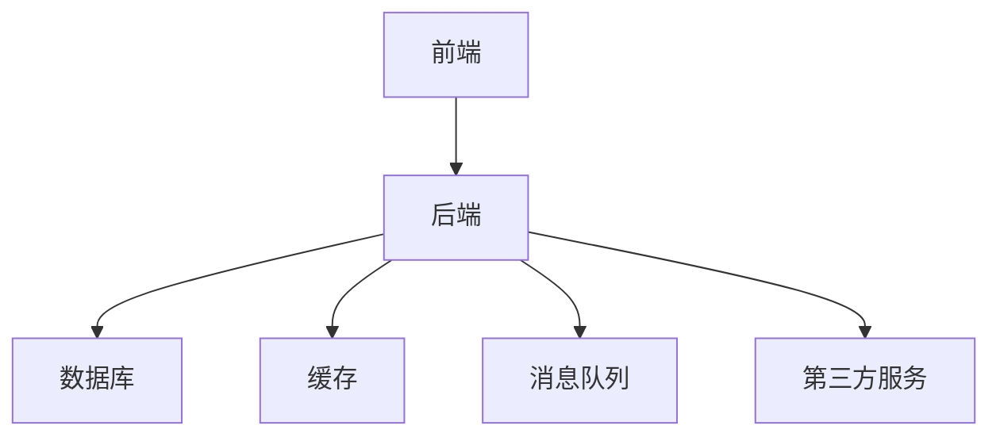

# 在线考试系统的设计与研发

## 1. 背景介绍

### 1.1 在线考试系统的重要性

随着互联网和在线教育的快速发展,在线考试系统已经成为教育领域不可或缺的重要组成部分。它提供了一种高效、便捷的考试方式,打破了时间和地域的限制,使得考试过程更加灵活和可控。在线考试系统不仅可以应用于学校、培训机构等传统教育场景,也被广泛应用于企业内训、资格认证、招聘测评等多种场合。

### 1.2 在线考试系统的优势

与传统纸质考试相比,在线考试系统具有以下显著优势:

1. **高效便捷**: 无需印刷大量试卷,节省了大量人力和物力成本。考生可以在任何时间任何地点参加考试,极大提高了灵活性。

2. **客观公正**: 系统自动阅卷评分,减少了人为干扰,提高了考试的公平性和可信度。

3. **数据安全**: 试题、考生答卷等数据可以集中存储和管理,降低了数据丢失的风险。

4. **环保节能**: 无需消耗大量纸张,有利于环境保护和资源节约。

5. **智能化管理**: 系统可以自动化处理考试流程,提高管理效率,减轻工作人员的工作负担。

6. **数据分析**: 系统可以对考试数据进行全面分析,为教学决策提供依据。

### 1.3 在线考试系统的挑战

尽管在线考试系统有诸多优势,但在设计和实现过程中也面临着一些挑战:

1. **系统性能**: 需要支持大规模并发访问,确保系统的高可用性和响应速度。

2. **安全性**: 必须采取有效措施防止作弊行为,保证考试的公平公正。

3. **试题管理**: 需要提供强大的试题库管理功能,支持多种题型和灵活的组卷策略。

4. **用户体验**: 系统界面需要简洁友好,操作流程需要清晰易懂,确保良好的用户体验。

5. **数据隐私**: 需要对考生的个人信息和考试数据进行严格保护,防止数据泄露。

6. **系统扩展性**: 系统需要具备良好的可扩展性,以适应未来需求的变化和发展。

## 2. 核心概念与联系

### 2.1 系统架构概览

在线考试系统通常采用经典的三层架构或微服务架构,包括表现层(前端)、业务逻辑层(后端)和数据访问层。前端负责提供用户界面,后端处理业务逻辑,数据访问层负责与数据库交互。这种分层架构有利于代码的模块化和可维护性。

### 2.2 核心功能模块

一个完整的在线考试系统通常包括以下核心功能模块:

1. **用户管理模块**: 负责管理考生、教师、管理员等不同类型用户的注册、登录、权限控制等。

2. **试题管理模块**: 提供试题的创建、编辑、组卷、分类、查询等功能,支持多种题型。

3. **考试管理模块**: 负责考试的创建、编排、发布、监控、评分等全流程管理。

4. **成绩管理模块**: 记录和统计考生的考试成绩,生成成绩报告,支持查询和分析。

5. **监控防作弊模块**: 采用人工智能、生物识别等技术,实时监控考试过程,防止作弊行为。

6. **系统管理模块**: 提供系统配置、日志记录、权限管理、数据备份等功能。

### 2.3 关键技术

在线考试系统的实现涉及多种关键技术,包括但不限于:

1. **Web开发技术**: HTML、CSS、JavaScript、React、Vue等前端框架,Spring、Django等后端框架。

2. **数据库技术**: 关系型数据库(MySQL、PostgreSQL)和NoSQL数据库(MongoDB、Redis)。

3. **缓存技术**: 如Redis、Memcached,用于提高系统响应速度。

4. **消息队列技术**: 如RabbitMQ、Kafka,用于异步处理和解耦。

5. **安全技术**: 加密、认证、授权、防火墙等,保证系统和数据安全。

6. **人工智能技术**: 如计算机视觉、生物识别,用于防止作弊行为。

7. **容器和微服务技术**: 如Docker、Kubernetes,支持系统的高可用和弹性伸缩。

8. **大数据和数据分析技术**: 如Hadoop、Spark,用于分析考试数据,提供决策支持。

## 3. 核心算法原理具体操作步骤

### 3.1 试题组卷算法

试题组卷是在线考试系统的核心功能之一,需要根据预设的组卷策略从试题库中选取合适的试题,生成符合要求的试卷。常见的组卷算法包括:

1. **随机组卷算法**: 从试题库中随机选取指定数量的试题,最简单但缺乏针对性。

2. **基于知识点的组卷算法**: 根据知识点的权重和覆盖度,选取能够全面覆盖所有知识点的试题。

3. **基于难度的组卷算法**: 根据预设的难度系数,选取难易程度合理分布的试题。

4. **智能组卷算法**: 利用机器学习技术,根据历史数据和考生信息,生成个性化的试卷。

以基于知识点的组卷算法为例,其基本步骤如下:

1. 构建知识点树,确定每个知识点的权重。

2. 遍历知识点树,计算每个知识点的权重之和作为总分值。

3. 根据预设的总分值,按照知识点权重比例选取对应数量的试题。

4. 对选取的试题进行打乱,生成最终试卷。

### 3.2 智能监控防作弊算法

为了确保考试的公平公正,在线考试系统需要采用智能监控技术防止作弊行为。常见的防作弊算法包括:

1. **人脸识别算法**: 通过摄像头捕捉考生的面部特征,与注册照片进行比对,防止替考行为。

2. **声音识别算法**: 通过麦克风捕捉考场声音,识别是否有交谈、求助等异常声音。

3. **环境检测算法**: 通过摄像头检测考生周围环境,识别是否有其他人员、参考资料等违规行为。

4. **行为分析算法**: 通过计算机视觉和机器学习技术,分析考生的眼球运动、手势等行为,判断是否存在作弊嫌疑。

以人脸识别算法为例,其基本步骤如下:

1. 采集考生的注册照片,提取面部特征向量,存储到数据库中。

2. 考试开始时,通过摄像头实时捕捉考生面部图像。

3. 使用人脸检测算法(如Viola-Jones算法)定位面部区域。

4. 使用人脸识别算法(如FaceNet)提取面部特征向量。

5. 将提取的特征向量与数据库中的注册照片进行比对,计算相似度分数。

6. 如果相似度分数低于预设阈值,则判定为替考行为,发出警报。

### 3.3 自动阅卷评分算法

对于选择题、填空题等客观题,在线考试系统可以自动进行阅卷评分,提高效率和公正性。常见的自动阅卷算法包括:

1. **字符串匹配算法**: 将考生答案与标准答案进行字符串匹配,判断是否相同。

2. **语义匹配算法**: 利用自然语言处理技术,比较考生答案与标准答案的语义相似度。

3. **模式匹配算法**: 针对编程题等特殊题型,将考生代码与预设模式进行匹配,评判正确性。

以字符串匹配算法为例,其基本步骤如下:

1. 预处理标准答案,去除多余空格、大小写等无关因素。

2. 预处理考生答案,与标准答案执行相同的预处理操作。

3. 使用字符串匹配算法(如KMP算法)比较预处理后的答案。

4. 如果完全匹配,则判定为正确答案,否则判定为错误。

5. 根据题目设置的分值,给出最终的评分结果。

## 4. 数学模型和公式详细讲解举例说明

### 4.1 试题信息熵模型

在智能组卷算法中,可以借助信息论中的信息熵概念,量化试题的难易程度和区分度,从而生成难度合理、区分度良好的试卷。

设有 $n$ 个试题 $\{q_1, q_2, \cdots, q_n\}$,每个试题有 $m$ 个选项 $\{a_1, a_2, \cdots, a_m\}$,其中只有一个选项是正确答案。假设 $N$ 名考生的答题情况如下:

$$
\begin{array}{c|cccc}
 & a_1 & a_2 & \cdots & a_m \\
\hline
q_1 & n_{11} & n_{12} & \cdots & n_{1m} \\
q_2 & n_{21} & n_{22} & \cdots & n_{2m} \\
\vdots & \vdots & \vdots & \ddots & \vdots \\
q_n & n_{n1} & n_{n2} & \cdots & n_{nm}
\end{array}
$$

其中 $n_{ij}$ 表示选择第 $i$ 个试题的第 $j$ 个选项的考生人数,且 $\sum_{j=1}^m n_{ij} = N$。

定义试题 $q_i$ 的信息熵为:

$$
H(q_i) = -\sum_{j=1}^m \frac{n_{ij}}{N} \log_2 \frac{n_{ij}}{N}
$$

信息熵 $H(q_i)$ 的取值范围为 $[0, \log_2 m]$,当所有考生都选择同一个选项时,信息熵为 0;当每个选项被选择的概率相等时,信息熵达到最大值 $\log_2 m$。

一般来说,信息熵较大的试题具有较好的区分度,而信息熵较小的试题要么过于简单,要么过于困难。因此,可以根据试题的信息熵值,选取适当难度的试题,组成具有良好区分度的试卷。

### 4.2 改进的 TF-IDF 题型分类模型

在试题管理模块中,需要对试题进行分类,以便于查询和组卷。可以借助改进的 TF-IDF 模型,根据试题的文本内容自动确定其所属题型。

传统的 TF-IDF 模型主要用于文本分类,它将每个文档表示为一个词频向量,其中每个元素对应一个词的 TF-IDF 值。对于试题分类问题,我们可以将每个试题视为一个"文档",将题干和选项的文本内容作为"词条"。

定义试题 $q_i$ 中词条 $t_k$ 的 TF-IDF 值为:

$$
\text{TF-IDF}(t_k, q_i) = \text{TF}(t_k, q_i) \times \text{IDF}(t_k)
$$

其中,

- $\text{TF}(t_k, q_i)$ 表示词条 $t_k$ 在试题 $q_i$ 中出现的频率,可以使用简单的词频或者更复杂的加权方式计算。

- $\text{IDF}(t_k) = \log \frac{N}{n_k}$ 表示词条 $t_k$ 的逆文档频率,其中 $N$ 是总的试题数量,而 $n_k$ 是包含词条 $t_k$ 的试题数量。

将每个试题表示为一个 TF-IDF 向量后,我们可以使用机器学习算法(如支持向量机、决策树等)训练一个分类器,将试题划分到不同的题型类别。

为了提高分类准确率,我们可以对传统 TF-IDF 模型进行改进:

1. **加入词性信息**: 除了考虑词条本身,还可以将词条的词性(名词、动词等)作为特征