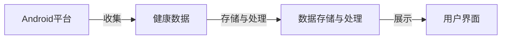

## 1.背景介绍

随着移动互联网的飞速发展，人们对于个人健康的管理越来越重视。而在众多的移动操作系统中，Android凭借其开放性和灵活性，成为了开发个人健康管理系统的首选平台。本文将详细介绍如何设计和实现一个基于Android的个人健康管理系统。

## 2.核心概念与联系

在设计和实现一个基于Android的个人健康管理系统时，我们需要理解以下几个核心概念及其之间的联系：

- **Android平台：** Android是一个基于Linux的开放源代码软件堆栈，为广泛的设备和应用提供全面的解决方案。

- **健康数据：** 健康数据包括但不限于个人的体重、血压、心率、血糖等生理指标，以及饮食、运动、睡眠等生活习惯数据。

- **数据存储与处理：** 健康数据需要被有效地存储和处理，以便进行后续的分析和展示。

- **用户界面：** 用户界面需要直观、易用，能够清晰地展示健康数据，并提供友好的交互方式。

这些核心概念之间的联系可以通过以下Mermaid流程图进行展示：



## 3.核心算法原理具体操作步骤

在设计和实现基于Android的个人健康管理系统时，我们主要需要进行以下操作：

1. **数据收集：** 利用Android平台的各种传感器和API，收集用户的健康数据。

2. **数据存储：** 将收集到的健康数据存储在本地数据库或云端服务器。

3. **数据处理：** 对存储的健康数据进行处理，如计算平均值、最大值、最小值等。

4. **数据展示：** 在用户界面上展示处理后的健康数据，如图表、列表等。

## 4.数学模型和公式详细讲解举例说明

在处理健康数据时，我们可能需要用到一些基本的数学模型和公式。例如，计算用户的体重指数（BMI）可以使用以下公式：

$$
BMI = \frac{weight(kg)}{height(m)^2}
$$

其中，weight是用户的体重，height是用户的身高。

另一个例子是计算用户的最大心率，可以使用以下公式：

$$
MaxHR = 220 - age
$$

其中，age是用户的年龄。

## 5.项目实践：代码实例和详细解释说明

在实际的项目实践中，我们可以使用Android的SQLite数据库来存储健康数据。以下是一个创建数据库和表的示例代码：

```java
public class HealthDBHelper extends SQLiteOpenHelper {
    private static final String DATABASE_NAME = "health.db";
    private static final int DATABASE_VERSION = 1;

    public HealthDBHelper(Context context) {
        super(context, DATABASE_NAME, null, DATABASE_VERSION);
    }

    @Override
    public void onCreate(SQLiteDatabase db) {
        String SQL_CREATE_ENTRIES =
            "CREATE TABLE " + HealthEntry.TABLE_NAME + " (" +
            HealthEntry._ID + " INTEGER PRIMARY KEY," +
            HealthEntry.COLUMN_WEIGHT + " REAL," +
            HealthEntry.COLUMN_HEIGHT + " REAL," +
            HealthEntry.COLUMN_BMI + " REAL," +
            HealthEntry.COLUMN_MAX_HR + " INTEGER," +
            HealthEntry.COLUMN_AGE + " INTEGER)";

        db.execSQL(SQL_CREATE_ENTRIES);
    }

    @Override
    public void onUpgrade(SQLiteDatabase db, int oldVersion, int newVersion) {
        String SQL_DELETE_ENTRIES = "DROP TABLE IF EXISTS " + HealthEntry.TABLE_NAME;
        db.execSQL(SQL_DELETE_ENTRIES);
        onCreate(db);
    }
}
```

在这段代码中，我们首先定义了一个继承自SQLiteOpenHelper的HealthDBHelper类，然后在onCreate方法中创建了一个名为health的数据库和一个包含多个字段的表。

## 6.实际应用场景

基于Android的个人健康管理系统可以广泛应用于各种场景，如：

- **个人健康管理：** 用户可以通过系统监测和记录自己的健康状况，制定和调整健康计划。

- **医疗保健：** 医生和护士可以通过系统监测和管理患者的健康状况，提供个性化的医疗服务。

- **健身教练：** 健身教练可以通过系统监测和管理学员的健康状况，制定和调整训练计划。

## 7.工具和资源推荐

在设计和实现基于Android的个人健康管理系统时，以下工具和资源可能会有所帮助：

- **Android Studio：** Android的官方开发环境，提供了强大的代码编辑、调试、性能优化等功能。

- **Firebase：** Google的移动开发平台，提供了云数据库、用户认证、分析、推送通知等服务。

- **MPAndroidChart：** 一个强大的Android图表库，可以用来展示健康数据。

## 8.总结：未来发展趋势与挑战

随着物联网、人工智能等技术的发展，基于Android的个人健康管理系统有着广阔的发展前景。然而，也存在一些挑战，如数据安全、用户隐私、设备兼容性等。

## 9.附录：常见问题与解答

1. **问：如何保证数据的安全和用户的隐私？**

答：我们可以使用加密、匿名化等技术来保护数据的安全和用户的隐私。此外，我们也需要遵守相关的法律法规，如GDPR。

2. **问：如何处理设备兼容性问题？**

答：我们可以使用Android的兼容性库来确保我们的应用在不同版本的Android系统上都能正常运行。此外，我们也需要对我们的应用进行充分的测试，以确保其在各种设备上的表现。

以上就是关于“基于Android的个人健康管理系统设计与实现”的全部内容，希望对你有所帮助。