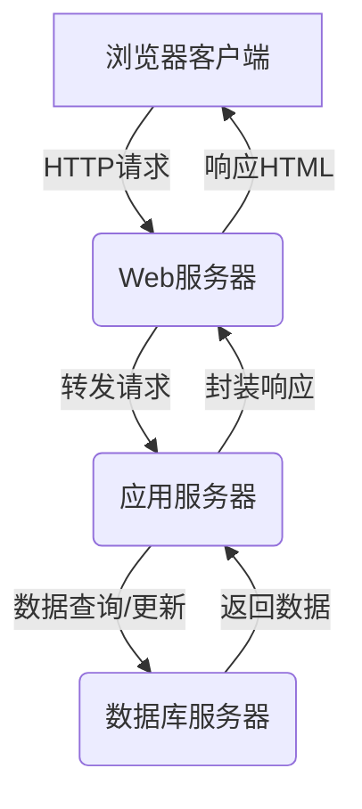

# 基于B/S架构的办公园区后勤服务管理系统设计与实现

## 1.背景介绍

### 1.1 办公园区后勤服务现状

在现代化的办公环境中,园区后勤服务管理工作是确保园区各项设施正常运转、为员工创造舒适办公环境的关键环节。传统的后勤服务管理模式存在诸多痛点:

- 信息孤岛,各部门数据无法共享
- 工单处理效率低下,响应时间长
- 人工作业量大,易出错且低效
- 缺乏统一的管理平台,可视化程度低

这些问题严重影响了园区后勤服务的质量和效率,亟需通过信息化手段加以优化和改进。

### 1.2 B/S架构简介  

B/S(Browser/Server)架构,即浏览器/服务器架构,是一种常见的软件系统架构模式。其核心思想是:

- 客户端只需浏览器,无需安装专门的软件
- 服务器端部署应用系统,为客户端提供服务
- 客户端通过网络访问服务器资源

B/S架构具有跨平台、安全性高、维护升级方便等优点,非常适合构建企业级的管理信息系统。

### 1.3 系统目标

基于以上背景,我们拟设计一套基于B/S架构的办公园区后勤服务管理系统,具备以下目标:

- 实现园区后勤服务工单的在线提交、分派和处理
- 集中化管理园区各类资产,提高资源利用率
- 提供数据可视化分析,为决策提供依据
- 支持移动端使用,随时随地掌控园区运行状况

该系统将显著提升园区后勤服务的质量和效率,为员工创造舒适的办公环境。

## 2.核心概念与联系

### 2.1 系统架构

该系统采用B/S架构,由浏览器客户端、Web服务器、应用服务器和数据库服务器等组件构成:



各组件职责分工:

- 浏览器客户端: 提供界面,发送请求,渲染响应
- Web服务器: 接收请求,转发请求,返回响应
- 应用服务器: 处理业务逻辑,与数据库交互
- 数据库服务器: 存储系统数据

### 2.2 系统模块

系统包含以下核心模块:

- **工单管理模块**: 提交、分派、处理和跟踪各类工单
- **资产管理模块**: 统一管理园区资产,实现高效调度  
- **系统管理模块**: 管理系统用户、角色和权限等
- **数据分析模块**: 对工单、资产等数据进行多维分析
- **移动端模块**: 适配移动端,支持随时查看园区运行状况

各模块相互协作,共同实现园区后勤服务的高效管理。

## 3.核心算法原理具体操作步骤

### 3.1 工单处理流程

工单处理是系统的核心业务流程,包括以下步骤:

1. **工单提交**: 用户在系统中提交工单,填写相关信息
2. **工单分派**: 系统根据工单类型和现有资源,自动分派给相应处理人员
3. **工单处理**: 处理人员接收工单,并及时作出处理
4. **工单反馈**: 处理人员将处理结果反馈至系统
5. **工单评价**: 用户对处理结果进行评价
6. **工单归档**: 系统自动归档并关闭工单

该流程的关键是工单分派环节,需要合理调度现有资源,将工单分派给最合适的处理人员。我们可以采用加权分配算法:

```python
def assign_ticket(ticket, handlers):
    """将工单分派给最合适的处理人员"""
    # 计算每个处理人员的分数
    scores = []
    for handler in handlers:
        score = 0
        # 根据工单类型、技能等计算分数
        score += 100 if ticket.type in handler.skills else 0
        score += 50 if ticket.location == handler.location else 0
        score -= 10 * handler.current_load
        scores.append((handler, score))
    
    # 按分数降序排列
    scores.sort(key=lambda x: x[1], reverse=True)
    
    # 返回分数最高的处理人员
    return scores[0][0]
```

该算法考虑了处理人员的技能、位置和当前工作负载等因素,能够较为合理地分配工单。

### 3.2 资产管理策略

对于园区资产的管理,我们采用了一套严格的策略:

1. **资产录入**: 所有资产入库时,须录入详细信息,包括资产编号、名称、类型、状态、位置等
2. **资产分类**: 按照资产类型、使用部门等维度,对资产进行合理分类
3. **资产调度**: 根据工单需求及资产状态,系统自动调度合适的资产
4. **资产维护**: 对资产定期检查、保养和维修,确保良好状态
5. **资产报废**: 对于陈旧资产及时报废,避免资源浪费

其中资产调度是重点,我们采用了一种基于优先级队列的调度算法:

```python
from queue import PriorityQueue

class Asset:
    def __init__(self, id, type, status, location):
        self.id = id
        self.type = type 
        self.status = status
        self.location = location
        
    def __lt__(self, other):
        """根据状态和位置计算优先级"""
        # 正常状态的资产优先
        if self.status == '正常' and other.status != '正常':
            return True
        elif self.status != '正常' and other.status == '正常':
            return False
        
        # 位置距离近的优先  
        return self.location < other.location
        
def dispatch_asset(ticket):
    """为工单调度合适的资产"""
    assets = get_assets(ticket.type) # 获取指定类型的资产
    pq = PriorityQueue() # 创建优先级队列
    for asset in assets:
        pq.put(asset)
        
    # 从队列中获取优先级最高的资产
    while not pq.empty():
        asset = pq.get()
        if asset.status == '正常':
            return asset
            
    # 没有可用资产
    return None
```

该算法首先获取指定类型的所有资产,并将它们按照状态和位置的优先级放入优先级队列。然后从队列中取出优先级最高的正常资产,如果没有可用资产则返回None。这种算法能够高效地调度合适的资产,提高资源利用率。

## 4.数学模型和公式详细讲解举例说明

在系统的数据分析模块中,我们需要对工单、资产等数据进行多维度分析,为决策提供依据。这里我们将介绍两种常用的数学模型。

### 4.1 线性回归模型

线性回归模型是一种常用的数学模型,用于研究自变量和因变量之间的线性关系。在系统中,我们可以使用线性回归模型分析工单响应时间与影响因素(如工单类型、处理人员数量等)之间的关系。

线性回归模型的数学表达式为:

$$y = \beta_0 + \beta_1 x_1 + \beta_2 x_2 + \cdots + \beta_n x_n + \epsilon$$

其中:

- $y$是因变量(响应时间)
- $x_1, x_2, \cdots, x_n$是自变量(影响因素)
- $\beta_0, \beta_1, \cdots, \beta_n$是回归系数
- $\epsilon$是随机误差项

我们可以使用最小二乘法估计回归系数,从而得到最佳拟合直线。

例如,假设我们有如下数据:

| 工单类型 | 处理人员数量 | 响应时间(小时) |
| --- | --- | --- |
| 1 | 5 | 2 |
| 2 | 3 | 5 |
| 1 | 8 | 1 |
| 3 | 6 | 4 |
| ... | ... | ... |

我们可以构建如下线性回归模型:

$$\text{响应时间} = \beta_0 + \beta_1 \times \text{工单类型} + \beta_2 \times \text{处理人员数量} + \epsilon$$

通过最小二乘法估计回归系数,我们可以得到该模型的具体形式,从而预测未来工单的响应时间,并优化资源配置。

### 4.2 K-Means聚类算法

K-Means是一种常用的无监督学习算法,用于对数据进行聚类。在系统中,我们可以使用K-Means算法对资产进行聚类,从而更好地管理和调度资产。

K-Means算法的核心思想是:

1. 随机选择K个初始质心
2. 将每个数据点归入最近的质心所在的簇
3. 重新计算每个簇的质心
4. 重复步骤2和3,直到质心不再发生变化

算法的数学模型如下:

假设有 $N$ 个数据点 $\{x_1, x_2, \cdots, x_N\}$,需要将它们划分为 $K$ 个簇 $\{C_1, C_2, \cdots, C_K\}$。我们定义每个簇的质心为:

$$\mu_k = \frac{1}{|C_k|} \sum_{x_i \in C_k} x_i$$

目标是最小化所有数据点到其所属簇质心的距离平方和:

$$J = \sum_{k=1}^K \sum_{x_i \in C_k} \|x_i - \mu_k\|^2$$

例如,我们可以将园区资产按照类型、位置等属性进行聚类,得到不同的资产簇。对于每个资产簇,我们可以合理部署和调度资产,提高利用效率。同时,也可以根据资产簇的特征制定不同的维护策略。

## 5.项目实践:代码实例和详细解释说明

为了更好地理解系统的实现,我们将展示一些核心模块的代码示例。

### 5.1 工单管理模块

工单管理模块负责工单的提交、分派、处理和跟踪等功能。以下是工单模型和视图的代码示例:

```python
# models.py
from django.db import models

class Ticket(models.Model):
    title = models.CharField(max_length=100)
    description = models.TextField()
    type = models.ForeignKey('TicketType', on_delete=models.CASCADE)
    location = models.ForeignKey('Location', on_delete=models.CASCADE)
    status = models.ForeignKey('TicketStatus', on_delete=models.CASCADE)
    assignee = models.ForeignKey('User', on_delete=models.CASCADE, null=True, blank=True)
    created_at = models.DateTimeField(auto_now_add=True)
    updated_at = models.DateTimeField(auto_now=True)

# views.py
from django.shortcuts import render, redirect
from .models import Ticket
from .forms import TicketForm

def create_ticket(request):
    if request.method == 'POST':
        form = TicketForm(request.POST)
        if form.is_valid():
            ticket = form.save(commit=False)
            ticket.status = TicketStatus.objects.get(name='新建')
            ticket.save()
            return redirect('ticket_detail', ticket.id)
    else:
        form = TicketForm()
    return render(request, 'tickets/create.html', {'form': form})
```

在模型中,我们定义了`Ticket`类,包含了工单的标题、描述、类型、位置、状态、处理人员等字段。

在视图函数`create_ticket`中,我们处理了工单创建的请求。如果是GET请求,我们渲染工单创建表单;如果是POST请求,我们验证表单数据,创建新的工单对象并保存到数据库中。

### 5.2 资产管理模块

资产管理模块负责园区资产的录入、分类、调度和维护等功能。以下是资产模型和视图的代码示例:

```python
# models.py
from django.db import models

class Asset(models.Model):
    name = models.CharField(max_length=100)
    asset_type = models.ForeignKey('AssetType', on_delete=models.CASCADE)
    status = models.ForeignKey('AssetStatus', on_delete=models.CASCADE)
    location = models.ForeignKey('Location', on_delete=models.CASCADE)
    description = models.TextField(blank=True, null=True)
    created_at = models.DateTimeField(auto_now_add=True)
    updated_at = models.DateTimeField(auto_now=True)

# views.py
from django.shortcuts import render, redirect