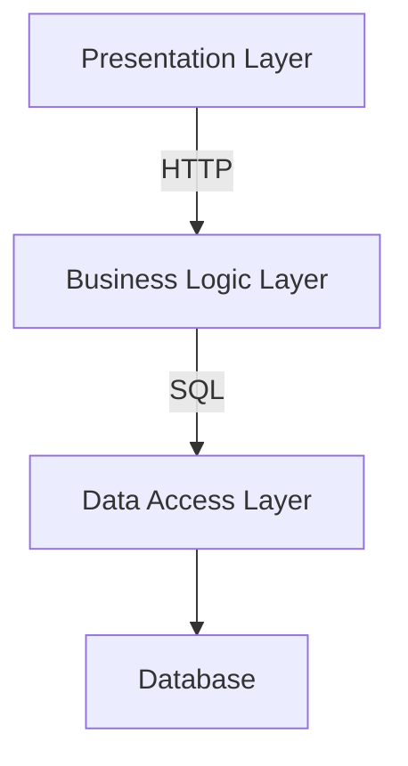

# 基于Web的在线考试系统详细设计与具体代码实现

## 1.背景介绍

### 1.1 在线考试系统的重要性

在当今快节奏的数字化时代,在线考试系统已经成为教育和企业培训中不可或缺的重要工具。传统的纸质考试模式不仅效率低下,而且容易出现管理和评分错误。相比之下,在线考试系统提供了更高效、更准确、更便捷的考试解决方案。

### 1.2 在线考试系统的优势

- **高效便捷**:考生可以在任何地点通过网络参加考试,节省时间和交通成本。
- **自动评分**:系统可以自动评分选择题,大大减轻了教师/管理员的工作量。
- **安全可靠**:采用加密技术保证考试数据的安全性,防止作弊行为。
- **数据分析**:系统可以自动生成考试统计报告,为教学决策提供数据支持。
- **环保节约**:无需印刷大量试卷,减少了资源的浪费。

### 1.3 系统架构概览

一个典型的基于Web的在线考试系统通常包括以下几个核心模块:

- **用户管理模块**:处理考生、教师和管理员的注册、登录和权限管理。
- **试卷管理模块**:提供试卷的创建、编辑、组卷和存储功能。
- **考试管理模块**:安排考试时间、发布通知、分配考场等。
- **答题模块**:为考生提供在线答题界面,支持各种题型。
- **评分模块**:自动评分选择题,并为主观题提供在线阅卷功能。
- **统计分析模块**:生成考试报告,分析成绩数据。

## 2.核心概念与联系

### 2.1 用户角色

在线考试系统中通常包括以下三种主要用户角色:

- **考生(Examinee)**:参加在线考试的人员。
- **教师(Teacher)**:出题人,负责创建试卷和主观题阅卷评分。
- **管理员(Administrator)**:系统的最高权限用户,负责管理考试流程。

### 2.2 试卷组成

一份完整的试卷通常包括以下几个部分:

- **试卷信息**:试卷名称、考试时间、考试科目等基本信息。
- **试卷说明**:对考生的一些特殊要求或注意事项。
- **题目列表**:按照题型分为单选题、多选题、判断题、填空题和简答题等。
- **参考答案**:用于自动评分或为教师阅卷提供参考。

### 2.3 考试流程

一个典型的在线考试流程包括以下几个步骤:

1. **试卷创建**:教师在系统中创建新的试卷。
2. **考试安排**:管理员安排考试时间,发布考试通知。
3. **考生报名**:考生根据通知进行考试报名。
4. **考试答题**:考生在规定时间内通过系统进行在线答题。
5. **自动评分**:系统自动评分选择题和判断题等题型。
6. **教师阅卷**:教师在系统中阅卷并评分主观题。
7. **成绩查询**:考生可查询自己的考试成绩和统计报告。

### 2.4 数据库设计

设计一个高效的数据库是在线考试系统的重要基础。一个典型的数据库设计可能包括以下几个核心表:

- **用户表(User)**:存储用户的基本信息,如姓名、角色、密码等。
- **试卷表(Exam)**:存储试卷的基本信息,如试卷名称、考试时间等。
- **题目表(Question)**:存储题目的内容、题型、分值等信息。
- **答案表(Answer)**:存储参考答案和考生的答题结果。
- **成绩表(Score)**:记录每个考生的考试成绩和统计数据。

## 3.核心算法原理具体操作步骤

### 3.1 自动评分算法

自动评分是在线考试系统的一个核心功能,可以大大减轻教师的工作量。常见的自动评分算法包括:

#### 3.1.1 选择题评分

对于单选题和多选题,系统将考生的答案与预设的参考答案进行比对,给出得分。评分算法如下:

```python
def score_choice_question(user_answer, ref_answer):
    """
    评分选择题算法
    :param user_answer: 用户答案
    :param ref_answer: 参考答案
    :return: 分数
    """
    if user_answer == ref_answer:
        return 1  # 完全正确,得分1分
    else:
        return 0  # 答案不正确,得分0分
```

#### 3.1.2 判断题评分

对于判断题,系统将考生的答案(True/False)与参考答案进行比对,给出得分。

```python
def score_true_false(user_answer, ref_answer):
    """
    评分判断题算法
    :param user_answer: 用户答案
    :param ref_answer: 参考答案
    :return: 分数
    """
    if user_answer == ref_answer:
        return 1
    else:
        return 0
```

#### 3.1.3 填空题评分

对于填空题,系统需要先将用户的答案去除多余的空格,然后再与参考答案进行比对。

```python
def score_fill_blank(user_answer, ref_answer):
    """
    评分填空题算法
    :param user_answer: 用户答案
    :param ref_answer: 参考答案
    :return: 分数
    """
    # 去除用户答案中的多余空格
    user_answer = user_answer.replace(" ", "")
    if user_answer == ref_answer:
        return 1
    else:
        return 0
```

#### 3.1.4 简答题评分

由于简答题的答案比较主观和开放,无法进行自动评分,需要由教师在系统中进行人工阅卷和评分。

### 3.2 考试时间控制

为了防止考生作弊,在线考试系统需要对考试时间进行严格控制。常见的时间控制算法包括:

#### 3.2.1 开始时间控制

考生只能在规定的开始时间之后才能开始答题,算法如下:

```python
import time

def check_start_time(start_time):
    """
    检查是否可以开始考试
    :param start_time: 考试开始时间
    :return: True或False
    """
    current_time = int(time.time())  # 获取当前时间戳
    if current_time >= start_time:
        return True
    else:
        return False
```

#### 3.2.2 结束时间控制

考生必须在规定的结束时间之前完成答题,否则系统将自动交卷。算法如下:

```python
import time

def check_end_time(start_time, duration):
    """
    检查是否超过考试时间
    :param start_time: 考试开始时间
    :param duration: 考试持续时间(秒)
    :return: True或False
    """
    current_time = int(time.time())
    end_time = start_time + duration
    if current_time >= end_time:
        return True
    else:
        return False
```

#### 3.2.3 考试时间同步

为了保证时间控制的准确性,系统需要定期与服务器进行时间同步,确保考生的客户端时间与服务器时间一致。

### 3.3 防作弊策略

为了确保考试的公平性和可靠性,在线考试系统需要采取一些防作弊策略,例如:

- **IP地址限制**:限制同一IP地址只能同时登录一个考生账号。
- **浏览器控制**:禁止考生打开其他窗口或切换程序。
- **屏幕监控**:通过摄像头监控考生的考试过程。
- **人脸识别**:通过人脸识别技术确认考生身份。
- **键盘记录**:记录考生的键盘输入,防止复制粘贴作弊。

## 4.数学模型和公式详细讲解举例说明

在在线考试系统中,一些常见的数学模型和公式包括:

### 4.1 项目反应理论 (Item Response Theory, IRT)

项目反应理论是一种基于统计模型的方法,用于分析和评估考试题目的质量和难度。IRT模型的核心思想是,每个考生在回答某个题目时,都有一定的正确概率,这个概率取决于考生的能力水平和题目的难度。

常见的IRT模型包括:

- **一参数logistic模型(1PL)**:只考虑题目难度的影响。

$$P(U_{is}=1|\theta_i,b_s)=\frac{e^{\theta_i-b_s}}{1+e^{\theta_i-b_s}}$$

其中,$U_{is}$表示考生i对题目s的答案(正确为1,错误为0),$\theta_i$表示考生i的能力水平,$b_s$表示题目s的难度。

- **二参数logistic模型(2PL)**:同时考虑题目难度和区分度的影响。

$$P(U_{is}=1|\theta_i,a_s,b_s)=\frac{e^{a_s(\theta_i-b_s)}}{1+e^{a_s(\theta_i-b_s)}}$$

其中,$a_s$表示题目s的区分度,其他参数含义同上。

- **三参数logistic模型(3PL)**:在2PL模型的基础上,还考虑了猜测因素的影响。

$$P(U_{is}=1|\theta_i,a_s,b_s,c_s)=c_s+(1-c_s)\frac{e^{a_s(\theta_i-b_s)}}{1+e^{a_s(\theta_i-b_s)}}$$

其中,$c_s$表示题目s的猜测因子,其他参数含义同上。

通过IRT模型,我们可以估计出每个考生的能力值$\theta_i$,以及每道题目的难度$b_s$、区分度$a_s$和猜测因子$c_s$,从而对试卷质量进行评估和优化。

### 4.2 信度分析

信度是衡量考试结果可靠性的一个重要指标。常用的信度分析方法包括:

#### 4.2.1 内部一致性信度

内部一致性信度反映了试卷中各个题目在测量同一个潜在特质时的一致性程度。常用的内部一致性信度指标包括:

- **Cronbach's Alpha系数**:

$$\alpha=\frac{k}{k-1}\left(1-\frac{\sum_{i=1}^k\sigma_{Y_i}^2}{\sigma_X^2}\right)$$

其中,$k$表示题目数量,$\sigma_{Y_i}^2$表示第i个题目的方差,$\sigma_X^2$表示总分的方差。$\alpha$的取值范围在0到1之间,值越大表示内部一致性越好。

- **KR20公式**:适用于计分方式为0/1分的选择题型。

$$KR20=\frac{k}{k-1}\left(1-\frac{\sum_{i=1}^kp_iq_i}{\sigma_X^2}\right)$$

其中,$k$表示题目数量,$p_i$表示第i个题目的正确率,$q_i=1-p_i$,$\sigma_X^2$表示总分的方差。

#### 4.2.2 重测信度

重测信度反映了同一批考生在不同时间重复参加相同考试时,成绩的一致性程度。重测信度可以通过皮尔逊相关系数来计算:

$$r=\frac{\sum_{i=1}^n(X_i-\overline{X})(Y_i-\overline{Y})}{\sqrt{\sum_{i=1}^n(X_i-\overline{X})^2\sum_{i=1}^n(Y_i-\overline{Y})^2}}$$

其中,$X_i$和$Y_i$分别表示第i个考生在两次考试中的成绩,$\overline{X}$和$\overline{Y}$分别表示平均成绩。$r$的取值范围在-1到1之间,绝对值越大表示重测信度越高。

通过信度分析,我们可以评估考试结果的可靠性,并对试卷进行必要的修订和优化。

## 4.项目实践:代码实例和详细解释说明

在本节中,我们将通过一个基于Python的在线考试系统示例项目,来演示如何将前面介绍的理论和算法应用到实际的代码实现中。

### 4.1 系统架构

我们的在线考试系统采用了典型的三层架构(Presentation Layer、Business Logic Layer和Data Access Layer),具体如下:



- **Presentation