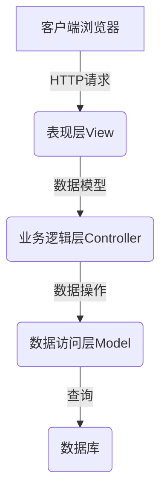

# 基于SSM的企业员工工资管理系统

## 1. 背景介绍

### 1.1 企业工资管理系统的重要性

在现代企业运营中,员工工资管理是一项关键的任务。准确、高效的工资计算和发放对于维护员工士气、吸引优秀人才以及确保企业合规运营至关重要。然而,传统的手工工资管理方式不仅效率低下,而且容易出现人为错误,给企业带来诸多风险和挑战。

### 1.2 工资管理系统发展历程

为解决这一难题,企业开始寻求自动化的工资管理解决方案。早期的工资管理系统大多基于桌面应用程序,功能单一,扩展性差。随着互联网和Web技术的兴起,基于B/S架构的工资管理系统应运而生,实现了跨平台、多用户的访问,但系统复杂度也随之增加。

近年来,随着软件架构的不断演进,基于MVC模式的轻量级Web框架(如SSM)逐渐被企业所采纳,成为构建工资管理系统的首选方案。

### 1.3 SSM框架简介

SSM是指Spring+SpringMVC+MyBatis的技术栈组合。其中:

- Spring提供了面向切面编程(AOP)和控制反转(IOC)功能,简化了对象管理
- SpringMVC是一种基于MVC设计模式的Web框架,用于处理HTTP请求
- MyBatis是一种优秀的对象关系映射(ORM)框架,用于简化数据库操作

SSM框架借助各个组件的优势,实现了低耦合、可扩展的系统架构,适合构建企业级Web应用。

## 2. 核心概念与联系

### 2.1 系统架构

基于SSM的工资管理系统通常采用经典的三层架构,包括表现层(View)、业务逻辑层(Controller)和数据访问层(Model)。



- 表现层(View)负责与用户交互,通常使用JSP、FreeMarker等模板技术渲染UI界面
- 业务逻辑层(Controller)处理具体的业务逻辑,如工资计算、数据校验等
- 数据访问层(Model)封装对数据库的增删改查操作,通过ORM框架MyBatis实现

### 2.2 工作流程

系统的典型工作流程如下:

1. 用户(如人力资源经理)通过浏览器发送HTTP请求(如查询员工工资明细)
2. 表现层接收请求,并调用对应的Controller方法
3. Controller执行业务逻辑,如计算工资、查询数据库等,并将结果传递给View
4. View对数据进行渲染,生成HTML页面返回给浏览器

该流程体现了MVC模式的设计理念,实现了视图、控制逻辑和模型数据的分离,有利于代码的维护和扩展。

### 2.3 Spring核心概念

Spring框架为系统提供了两个核心功能:控制反转(IOC)和面向切面编程(AOP)。

- IOC通过依赖注入的方式,实现了对象与对象之间的解耦,消除了硬编码引用
- AOP允许将一些通用功能(如日志、事务管理等)模块化,方便复用

在工资管理系统中,Spring管理着各个组件的生命周期,并提供声明式事务支持,确保数据操作的完整性。

### 2.4 MyBatis核心概念  

MyBatis作为一种优秀的ORM框架,其核心概念包括:

- Configuration配置: MyBatis的全局配置参数
- SqlSession: 执行SQL命令的接口,类似于JDBC的Connection
- Mapper映射器: 定义了SQL语句和POJO对象的映射关系

在工资系统中,MyBatis通过XML或注解的方式将SQL语句映射到Java方法,极大简化了数据库编程。

## 3. 核心算法原理具体操作步骤

### 3.1 工资计算算法

工资计算是工资管理系统的核心功能之一。一般来说,工资由多个组成部分构成,包括基本工资、绩效工资、补贴、奖金等。

工资计算算法的基本步骤如下:

1. 获取员工的基本信息,如工号、职位、入职时间等
2. 根据员工职位和工作年限计算基本工资
3. 计算当月的绩效考核分数,确定绩效工资
4. 统计补贴金额,如交通补助、通讯补助等
5. 根据考核结果和公司政策计算奖金
6. 计算应纳税额,得到最终的实发工资

```python
def calculate_salary(employee):
    base_salary = get_base_salary(employee.position, employee.years_of_service)
    performance_salary = get_performance_salary(employee.performance_score)
    allowances = calculate_allowances(employee.allowance_items)
    bonus = calculate_bonus(employee.performance_score, company_policy)
    gross_salary = base_salary + performance_salary + allowances + bonus
    tax = calculate_tax(gross_salary)
    net_salary = gross_salary - tax
    return net_salary
```

上述算法考虑了多个因素,可根据企业实际情况进行调整和扩展。

### 3.2 工资数据持久化

工资数据需要持久化存储,以便日后查询和审计。在SSM架构中,通常将工资数据存储在关系型数据库(如MySQL)中。

MyBatis作为ORM框架,可以方便地将工资相关的POJO对象持久化到数据库表中。以员工工资记录为例,对应的表结构可能如下:

```sql
CREATE TABLE salary_record (
    id INT AUTO_INCREMENT PRIMARY KEY,
    employee_id INT NOT NULL,
    salary_month DATE NOT NULL,
    base_salary DECIMAL(10,2) NOT NULL,
    performance_salary DECIMAL(10,2) NOT NULL,
    allowances DECIMAL(10,2) NOT NULL,
    bonus DECIMAL(10,2) NOT NULL,
    tax DECIMAL(10,2) NOT NULL,
    net_salary DECIMAL(10,2) NOT NULL
);
```

在MyBatis的映射文件中,我们可以定义插入新工资记录的SQL语句:

```xml
<insert id="insertSalaryRecord" parameterType="com.mycompany.salary.SalaryRecord">
    INSERT INTO salary_record (employee_id, salary_month, base_salary, performance_salary, allowances, bonus, tax, net_salary)
    VALUES (#{employeeId}, #{salaryMonth}, #{baseSalary}, #{performanceSalary}, #{allowances}, #{bonus}, #{tax}, #{netSalary})
</insert>
```

在业务逻辑层,我们可以调用MyBatis的映射方法将计算出的工资数据持久化:

```java
@Autowired
private SalaryRecordMapper salaryRecordMapper;

public void saveSalaryRecord(SalaryRecord record) {
    salaryRecordMapper.insertSalaryRecord(record);
}
```

通过上述流程,工资数据可以安全地存储在数据库中,为后续的查询和统计分析提供数据支持。

## 4. 数学模型和公式详细讲解举例说明

在工资管理系统中,某些计算过程需要使用数学模型和公式。以下是一些常见的模型和公式:

### 4.1 工资等级模型

许多企业采用工资等级制度,将员工的基本工资与其职位和工作年限挂钩。我们可以使用一个二元函数来表示这种映射关系:

$$
BaseSalary = f(position, years\_of\_service)
$$

其中,`position`表示员工的职位等级,`years_of_service`表示工作年限。该函数可以是一个查找表或者一个显式的数学公式。

例如,对于某些职位,基本工资可以用下面的公式计算:

$$
BaseSalary = base \times (1 + r)^{years\_of\_service}
$$

其中,`base`是该职位的起始工资,`r`是每年的增长率。

### 4.2 绩效工资计算

绩效工资通常与员工的绩效考核分数相关。我们可以使用一个线性函数来建模:

$$
PerformanceSalary = k \times PerformanceScore + b
$$

其中,`PerformanceScore`是员工的绩效分数,`k`和`b`是系数,可以根据企业政策确定。

例如,如果规定绩效分数在60~100分之间,每多1分可以多获得50元的绩效工资,则有:

$$
PerformanceSalary = 50 \times (PerformanceScore - 60)
$$

### 4.3 个人所得税计算

工资所得需要缴纳个人所得税。我国个人所得税采用超额累进税率制,可以用分段线性函数表示:

$$
Tax = \begin{cases}
    0 & \text{if } TaxableIncome \leq 3000\\
    0.03 \times (TaxableIncome - 3000) & \text{if } 3000 < TaxableIncome \leq 12000\\
    0.1 \times (TaxableIncome - 12000) + 2700 & \text{if } 12000 < TaxableIncome \leq 25000\\
    0.2 \times (TaxableIncome - 25000) + 5700 & \text{if } 25000 < TaxableIncome \leq 35000\\
    0.25 \times (TaxableIncome - 35000) + 8450 & \text{if } 35000 < TaxableIncome \leq 55000\\
    0.3 \times (TaxableIncome - 55000) + 13450 & \text{if } 55000 < TaxableIncome \leq 80000\\
    0.35 \times (TaxableIncome - 80000) + 21450 & \text{if } TaxableIncome > 80000
\end{cases}
$$

其中,`TaxableIncome`是应纳税所得额,等于工资总收入减去各种法定扣除项(如基本保险缴费)后的余额。

上述公式可以直接应用于工资管理系统的税款计算模块。

## 5. 项目实践:代码实例和详细解释说明  

### 5.1 系统架构和技术栈

本项目采用典型的SSM架构,主要技术栈包括:

- Spring 5.3.9
- SpringMVC 5.3.9
- MyBatis 3.5.7
- MySQL 8.0.27
- Maven 3.8.2
- JDK 1.8

项目使用Maven进行构建和依赖管理。

### 5.2 核心模块

系统主要包含以下几个核心模块:

1. **员工模块(Employee)**: 维护员工基本信息,如姓名、职位、入职时间等
2. **工资模块(Salary)**: 实现工资计算、工资数据持久化等功能
3. **绩效模块(Performance)**: 管理员工绩效考核信息
4. **补贴模块(Allowance)**: 管理员工各类补贴项目
5. **统计模块(Statistics)**: 提供工资统计分析功能
6. **权限模块(Auth)**: 实现用户认证和授权功能

这些模块通过依赖注入的方式相互协作,形成一个完整的工资管理系统。

### 5.3 数据库设计

系统使用MySQL数据库存储数据,核心表结构如下:

```sql
-- 员工表
CREATE TABLE employee (
    id INT AUTO_INCREMENT PRIMARY KEY,
    name VARCHAR(50) NOT NULL,
    position VARCHAR(50) NOT NULL,
    hire_date DATE NOT NULL,
    ...
);

-- 工资记录表
CREATE TABLE salary_record (
    id INT AUTO_INCREMENT PRIMARY KEY,
    employee_id INT NOT NULL,
    salary_month DATE NOT NULL,
    base_salary DECIMAL(10,2) NOT NULL,
    performance_salary DECIMAL(10,2) NOT NULL,
    allowances DECIMAL(10,2) NOT NULL,
    bonus DECIMAL(10,2) NOT NULL,
    tax DECIMAL(10,2) NOT NULL,
    net_salary DECIMAL(10,2) NOT NULL,
    FOREIGN KEY (employee_id) REFERENCES employee(id)
);

-- 绩效考核表
CREATE TABLE performance_review (
    id INT AUTO_INCREMENT PRIMARY KEY,
    employee_id INT NOT NULL,
    review_month DATE NOT NULL,
    score INT NOT NULL,
    FOREIGN KEY (employee_id) REFERENCES employee(id)
);

-- 补贴项目表
CREATE TABLE allowance_item (
    id INT AUTO_INCREMENT PRIMARY KEY,
    name VARCHAR(50) NOT NULL,
    amount DECIMAL(10,2) NOT NULL
);

-- 员工补贴记录表
CREATE TABLE employee_allowance (
    id INT AUTO_INCREMENT PRIMARY KEY,
    employee_id INT NOT NULL,
    allowance_item_id INT NOT NULL,
    FOREIGN KEY (employee_id) REFERENCES employee(id),
    FOREIGN KEY (allowance_item_id) REFERENCES allowance_item(id)
);
```

上述表结构体现了员工、工资、绩效和补贴之间的关系,为系统的正常运行提供了数据支撑。

### 5.4 工资计算模块代码示例

以工资计算模块为例,我们看一下核心代码:

```