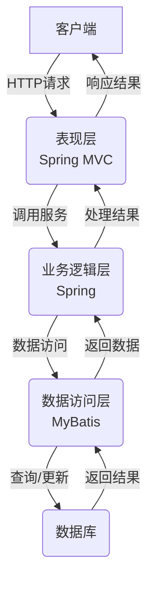

# 基于SSM的创新创业项目管理系统

## 1. 背景介绍

### 1.1 创新创业的重要性

在当今快节奏的商业环境中,创新和创业被视为推动经济发展和社会进步的重要驱动力。创新意味着开发新产品、服务或流程,以满足市场需求并提供独特的解决方案。创业则是将创新想法转化为可持续的商业模式,推动新企业的成立和发展。

创新创业不仅为社会带来新的就业机会和经济增长,还能促进技术进步和生活质量的提高。然而,创新创业过程充满了挑战和不确定性,需要有效的项目管理来确保创意得以顺利实施并取得成功。

### 1.2 项目管理的重要性

项目管理是指对项目进行规划、组织、监控和控制的过程,以确保项目目标在既定的时间、成本和质量约束内得以实现。有效的项目管理对于创新创业项目的成功至关重要,因为它能够:

1. 明确项目目标和范围
2. 优化资源分配和利用
3. 控制风险并应对变化
4. 促进团队协作和沟通
5. 跟踪项目进度并进行必要调整

缺乏有效的项目管理可能导致项目延期、超支或质量下降,从而影响创新创业的成功率。因此,开发一个高效的项目管理系统对于支持创新创业活动至关重要。

### 1.3 基于SSM的项目管理系统

SSM(Spring+SpringMVC+MyBatis)是一种流行的Java企业级Web应用程序开发框架,它结合了Spring的依赖注入、SpringMVC的MVC架构和MyBatis的持久层框架。基于SSM开发的项目管理系统可以提供以下优势:

1. **模块化设计**: SSM框架支持模块化开发,使系统更易于维护和扩展。
2. **高效开发**: SSM框架提供了大量现成的功能组件,加快了开发速度。
3. **可靠性和安全性**: SSM框架具有良好的安全性和可靠性,能够满足企业级应用的需求。
4. **开源和社区支持**: SSM框架是开源的,拥有庞大的社区支持和丰富的资源。

本文将详细介绍基于SSM框架开发的创新创业项目管理系统,包括系统架构、核心功能、关键技术实现等,为读者提供一个全面的参考和指导。

## 2. 核心概念与联系

### 2.1 项目管理的核心概念

在深入探讨创新创业项目管理系统之前,我们需要了解项目管理的一些核心概念:

1. **项目**: 一个临时性的工作,旨在创造独特的产品、服务或结果。项目具有明确的开始和结束时间,并受到预算、资源和质量约束。

2. **项目生命周期**: 项目从开始到结束所经历的一系列阶段,通常包括启动、规划、执行、监控和收尾。

3. **项目三约束**: 指项目管理必须平衡的三个主要约束,即范围(Scope)、时间(Time)和成本(Cost),也被称为"项目管理金三角"。

4. **项目干系人**: 对项目成功或失败有影响或受其影响的个人或组织。

5. **项目管理知识体系(PMBOK)**: 项目管理协会(PMI)制定的项目管理标准和最佳实践指南。

### 2.2 创新创业项目管理的特点

创新创业项目与传统项目相比,具有以下特点:

1. **高度不确定性**: 创新创业项目通常涉及新技术、新产品或新商业模式,存在较高的不确定性和风险。

2. **快速迭代**: 为了快速响应市场需求,创新创业项目需要采用敏捷开发方法,快速迭代和交付。

3. **资源约束**: 初创企业通常面临资金、人力和其他资源的限制。

4. **团队协作**: 创新创业项目需要跨职能团队的紧密协作,以整合不同领域的专业知识。

5. **快速决策**: 在快速变化的环境中,创新创业项目需要快速做出决策并适应变化。

### 2.3 项目管理系统与创新创业的联系

一个高效的项目管理系统可以为创新创业项目带来以下好处:

1. **提高效率**: 通过自动化流程和优化资源分配,提高项目执行效率。

2. **降低风险**: 通过风险管理和变更控制,降低项目风险和不确定性。

3. **促进协作**: 提供统一的协作平台,促进团队沟通和信息共享。

4. **增强可视性**: 提供实时的项目进度跟踪和报告,增强项目可视性。

5. **支持决策**: 提供数据分析和决策支持工具,帮助做出明智的决策。

通过采用基于SSM的项目管理系统,创新创业团队可以更好地管理复杂的项目,提高成功率并加快创新步伐。

## 3. 核心算法原理具体操作步骤

### 3.1 系统架构概述

基于SSM的创新创业项目管理系统采用了典型的三层架构,包括表现层(Spring MVC)、业务逻辑层(Spring)和数据访问层(MyBatis)。系统架构如下图所示:

1. **表现层(Spring MVC)**: 负责接收客户端请求,进行请求分发和视图渲染。Spring MVC提供了强大的MVC框架支持,包括请求映射、视图解析、数据绑定等功能。

2. **业务逻辑层(Spring)**: 负责处理业务逻辑,包括项目管理、任务管理、资源管理等核心功能。Spring框架提供了依赖注入、面向切面编程(AOP)等特性,支持模块化开发和代码复用。

3. **数据访问层(MyBatis)**: 负责与数据库进行交互,包括查询、插入、更新和删除操作。MyBatis是一个优秀的持久层框架,支持动态SQL、结果映射和缓存等功能。

4. **数据库**: 用于存储系统数据,如项目信息、任务信息、用户信息等。常用的数据库包括MySQL、Oracle和SQL Server等。

### 3.2 核心功能模块

创新创业项目管理系统的核心功能模块包括:

1. **项目管理模块**: 用于创建、规划、执行和监控项目,包括项目信息管理、任务管理、里程碑管理、风险管理等功能。

2. **资源管理模块**: 用于管理项目所需的各种资源,如人力资源、物资资源、财务资源等。

3. **团队协作模块**: 支持团队成员之间的沟通协作,包括消息通知、文件共享、在线讨论等功能。

4. **报告和分析模块**: 提供项目进度报告、成本分析、风险分析等报告和分析功能,支持决策制定。

5. **系统管理模块**: 用于管理系统用户、角色和权限,确保系统安全性和可靠性。

这些核心功能模块通过SSM框架的支持,实现了模块化设计和高效开发,为创新创业项目提供了强大的管理支持。

### 3.3 关键技术实现

#### 3.3.1 Spring框架

Spring框架是Java企业级应用开发的核心框架,提供了依赖注入(DI)、面向切面编程(AOP)、事务管理等功能。在项目管理系统中,Spring框架主要用于以下方面:

1. **依赖注入(DI)**: 通过依赖注入,系统各个模块之间的依赖关系可以在运行时动态绑定,提高了代码的可维护性和可测试性。

2. **面向切面编程(AOP)**: 通过AOP,可以将系统的横切关注点(如日志记录、安全控制等)模块化,提高了代码的可重用性和可维护性。

3. **事务管理**: Spring提供了声明式事务管理支持,简化了事务处理的编码工作。

4. **Spring MVC**: Spring MVC是Spring框架的一个模块,提供了Web应用程序的MVC架构支持,用于处理HTTP请求和响应。

#### 3.3.2 MyBatis框架

MyBatis是一个优秀的持久层框架,用于简化Java应用程序与数据库之间的交互。在项目管理系统中,MyBatis主要用于以下方面:

1. **SQL映射**: MyBatis通过XML或注解的方式,将SQL语句与Java对象进行映射,提高了代码的可维护性和可读性。

2. **动态SQL**: MyBatis支持动态SQL,可以根据不同的条件动态构建SQL语句,提高了SQL语句的灵活性和复用性。

3. **结果映射**: MyBatis支持将查询结果自动映射到Java对象,简化了数据访问层的编码工作。

4. **缓存支持**: MyBatis提供了一级和二级缓存机制,提高了数据访问的性能。

#### 3.3.3 Spring MVC

Spring MVC是Spring框架的一个模块,提供了Web应用程序的MVC架构支持。在项目管理系统中,Spring MVC主要用于以下方面:

1. **请求映射**: 通过注解或XML配置,将HTTP请求映射到相应的控制器方法。

2. **数据绑定**: 自动将请求参数绑定到控制器方法的参数上,简化了数据处理的编码工作。

3. **视图解析**: 根据控制器方法的返回值,自动选择合适的视图技术(如JSP、Thymeleaf等)进行渲染。

4. **异常处理**: 提供了统一的异常处理机制,简化了错误处理的编码工作。

5. **国际化支持**: 支持多语言和本地化功能,方便系统在不同地区的使用。

6. **文件上传**: 支持文件上传功能,方便用户上传项目相关文件。

#### 3.3.4 其他关键技术

除了Spring、MyBatis和Spring MVC框架之外,项目管理系统还使用了以下关键技术:

1. **Bootstrap**: 一个流行的前端UI框架,用于构建响应式和现代化的Web界面。

2. **jQuery**: 一个JavaScript库,用于简化DOM操作、事件处理和AJAX请求。

3. **Echarts**: 一个强大的数据可视化库,用于生成项目报告和分析图表。

4. **Quartz**: 一个开源的作业调度框架,用于实现定期任务的自动执行,如自动发送项目提醒等。

5. **Shiro**: 一个强大的安全框架,用于实现系统的认证、授权和会话管理。

6. **WebSocket**: 一种双向通信协议,用于实现实时消息推送和在线协作功能。

这些技术的综合运用,为创新创业项目管理系统提供了强大的功能支持和良好的用户体验。

## 4. 数学模型和公式详细讲解举例说明

在项目管理过程中,我们经常需要使用一些数学模型和公式来进行分析和决策。以下是一些常见的数学模型和公式,以及它们在项目管理系统中的应用。

### 4.1 关键路径法(CPM)

关键路径法(Critical Path Method, CPM)是一种用于计划和控制项目进度的技术。它通过构建项目网络图,识别关键路径,从而确定项目的最短完成时间。

在项目管理系统中,CPM可以用于:

1. 项目规划: 通过CPM计算出项目的最短完成时间,为项目制定合理的时间计划。
2. 进度监控: 实时跟踪任务的进度,识别关键路径上的延迟,及时采取纠正措施。
3. 资源优化: 根据关键路径,优化资源分配,确保关键任务得到优先资源支持。

CPM的核心公式如下:

$$
T_p = \max\left\{\sum_{i=1}^{n}t_i\right\}
$$

其中:
- $T_p$ 表示项目的最短完成时间
- $n$ 表示项目中任务的数量
- $t_i$ 表示第 $i$ 个任务